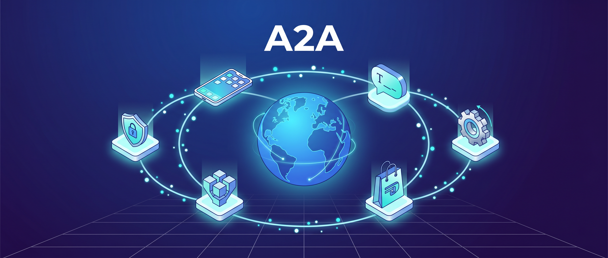
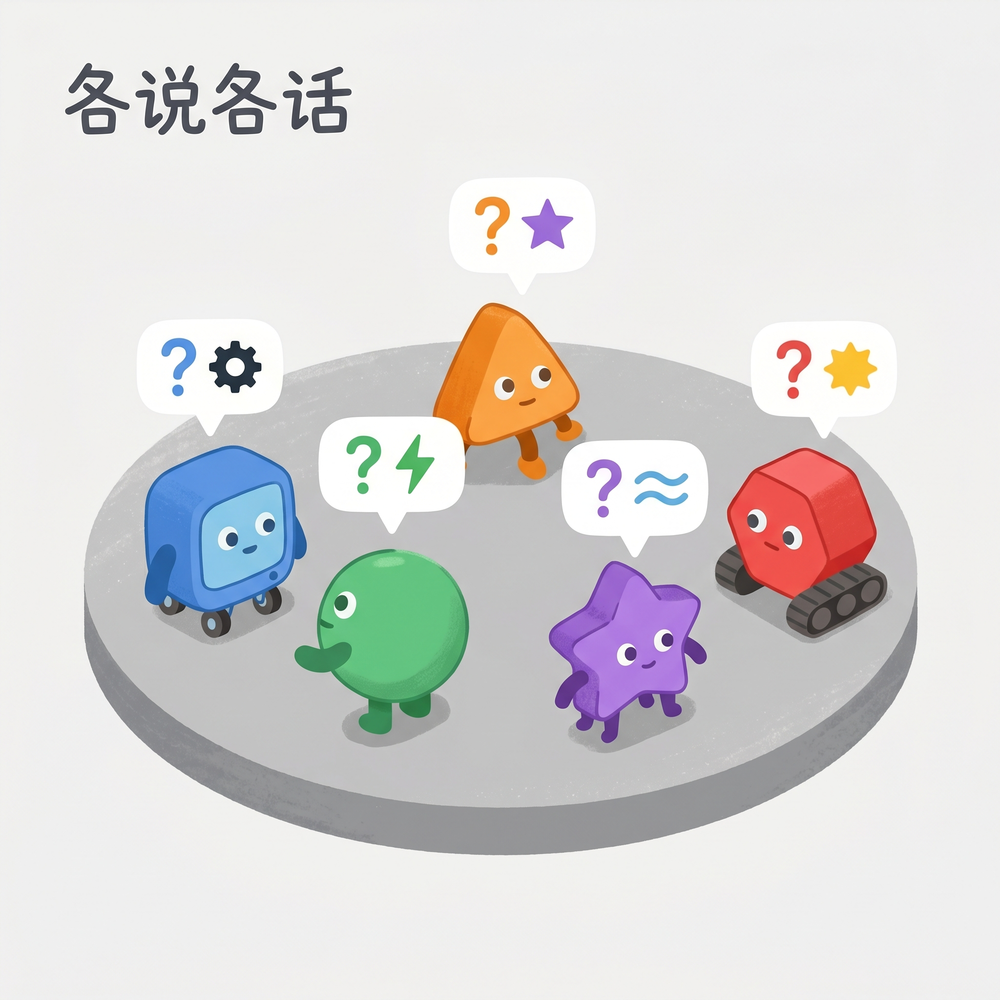
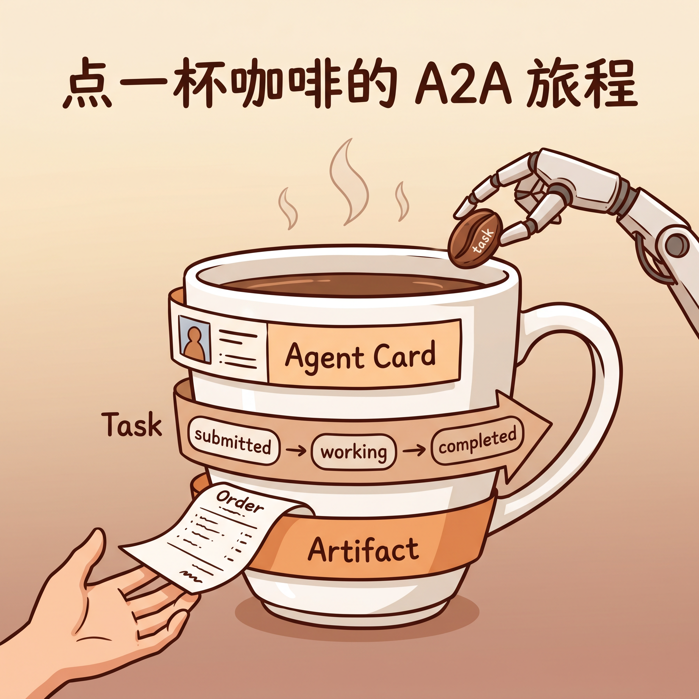
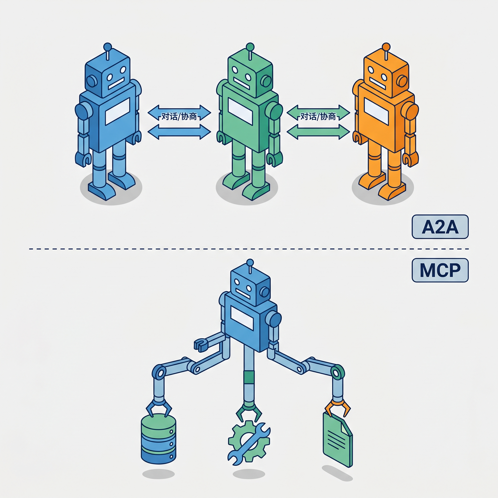
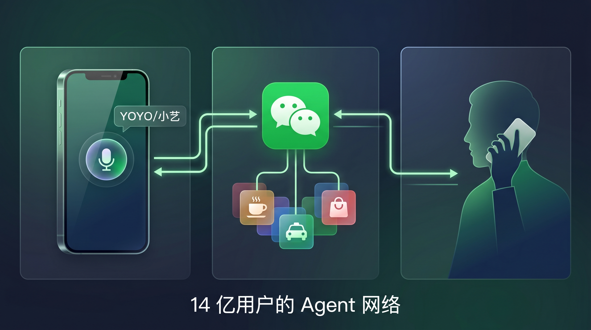

# 微信悄悄接入的 A2A 协议是什么？Agent 世界的 HTTP

> 6 月 3 日和 4 日，两条关于微信的消息接连爆出。一条说微信要内置 AI Agent，另一条说微信正在跟华为、小米等手机厂商合作推出 Agent-to-Agent 能力。这两件事背后的共同线索，是一个你可能还没听过的协议。

---

## 一句话总结

**A2A（Agent-to-Agent）协议是让不同 Agent 之间能对话和协作的开放标准，相当于 Agent 世界的 HTTP 协议。微信接入 A2A，14 亿用户可能很快就会跟 Agent 打交道了。**

---

## 两条新闻，一个方向

6 月 3 日，《金融时报》报道，腾讯正在测试微信内置 AI Agent 原型，计划最快本月启动合规审批。用户右滑微信主界面就能调出 Agent，用自然语言下达指令，比如「帮我点一杯 30 块以内、不太甜、附近能自取的咖啡」，Agent 自动调用小程序完成筛选和下单。

6 月 4 日，《科创板日报》又披露，微信正在与华为、荣耀、小米、OPPO、vivo 等手机厂商合作推出 A2A（Agent-to-Agent）助手能力。用户可以直接通过手机语音助手（比如荣耀的 YOYO）发起微信通话、发送消息，不再需要打开微信 App。

两条新闻，一个是微信自建 Agent，另一个是 Agent 之间怎么通信。这两件事要真正跑通，都绕不开一个问题。

当你的 Agent 去找咖啡店的 Agent 下单，它们之间到底用什么「语言」交流？

答案就是 A2A。

---

## Agent 为什么需要「通用语言」

先想一个问题。你手机上有华为的小艺、小米的 Super AI、苹果的 Siri，还有各种 App 自己做的 Agent。这些 Agent 由不同的公司开发，跑在不同的框架上，有的用 Python，有的用 Java，有的跑在大模型上，有的还是规则引擎。

它们之间怎么协作？

没有标准之前，每两个 Agent 想对话，就得定制一套接口。10 个 Agent 两两对接就是 45 套接口，20 个就是 190 套，根本写不完。

更关键的是，Agent 不像普通软件接口那样「你给我什么我返回什么」。Agent 有自己的推理能力，会反问、会协商、会拒绝。你让一个订餐 Agent 帮忙点单，它可能反过来问你「是要微糖还是半糖」「堂食还是外卖」。这种多轮对话、有状态的交互，用传统的 API 调用是搞不定的。

A2A 协议就是来解决这个问题的。

它的目标很明确，让不同厂商、不同框架、不同技术栈的 Agent 能用一套标准协议互相对话和协作，即使它们彼此不透明、不共享内部状态。

A2A 去年由 Google 牵头推出，后来交给 Linux 基金会运营，v1.0 正式版已经发布。AWS、Microsoft、SAP 这些都是技术委员会成员。

打个比方，A2A 之于 Agent，就像 HTTP 之于 Web。

HTTP 出来之前，互联网上各搞各的协议，信息孤岛遍地。HTTP 一统一标准，Web 就爆了。A2A 做的是一模一样的事，只不过这次要标准化的不是「网页」，而是「Agent」。

---

## 用点咖啡来理解 A2A 的核心设计

A2A 协议看起来复杂，但用微信点咖啡这个场景就能讲明白。

回到开头那个例子。你对微信 Agent 说「帮我点一杯 30 块以内、不太甜、附近能自取的咖啡」。

微信 Agent 作为发起方（A2A Client），需要先找到能处理这个请求的 Agent。怎么找？

**第一步，发现。**

每个 A2A 服务端都会发布一个叫「Agent Card」（智能体名片）的文件，通常挂在 `/.well-known/agent-card.json` 这个标准路径下。这个名片里写着 Agent 的名字、能力描述、支持的输入输出格式、安全认证方式。

微信 Agent 读到星巴克 Agent 的名片，发现它能处理「咖啡点单」这个任务，匹配成功。

**第二步，协商和执行。**

微信 Agent 把「30 块以内、不太甜、附近能自取的咖啡」这条指令发给星巴克 Agent。这时候就创建了一个「Task」（任务），状态是「已提交」。

星巴克 Agent 开始处理，任务状态变成「处理中」。它可能需要反问一句「附近的门店库存显示拿铁和美式都有，您选哪个」，这时候任务状态变成「需要用户输入」。

你回答「拿铁」之后，状态回到「处理中」，最终完成下单，状态变成「完成」，返回一个「Artifact」（工件），也就是你的订单详情。

整个状态流转大致是这样的，

提交 → 处理中 → 可能需要你补充信息 → 继续处理 → 完成

中间任何一步出问题，可能走向失败或被取消。当然这是简化版，A2A v1.0 实际定义了 8 种状态，还包括「被拒绝」和「需要认证」等。但对于理解核心流程，上面这条线就够了。

**第三步，结果返回。**

星巴克 Agent 把订单详情、取餐码等信息封装成 Artifact，通过 A2A 协议返回给微信 Agent，微信 Agent 再展示给你。

你可能注意到了几个细节。微信 Agent 自始至终不知道星巴克 Agent 内部是怎么运作的，用什么模型、什么框架，都不关心。它只看 Agent Card 上声明的能力和返回的结果。这其实是 A2A 的一个核心设计，黑盒执行，保护各方内部逻辑。

另外你可能发现了，整个过程中你并不是一直盯着屏幕等。提交需求之后，你该干嘛干嘛，等状态变了自然会收到推送。A2A 原生支持这种异步长时任务，不用客户端一直等着。返回给你的也不只是文字，星巴克 Agent 可以把带定位的门店地图、取餐码图片都塞进同一条消息里。

---

## A2A 和 MCP，不是竞争是互补

聊 A2A 经常会碰到另一个协议，MCP（Model Context Protocol）。这俩名字乍一看挺像，但干的活完全不一样。

**MCP 解决的是 Agent 的「手」的问题。** Agent 怎么连接数据库、调用 API、读取文件？MCP 标准化了 Agent 和工具之间的接口。就像给 Agent 装了一双能操作各种工具的手。

**A2A 解决的是 Agent 的「嘴」的问题。** Agent 之间怎么对话、怎么协商、怎么分工协作？A2A 标准化了 Agent 和 Agent 之间的通信。就像给 Agent 装了一张能跟其他 Agent 交流的嘴。

用方向来区分更直观。MCP 是垂直方向的，Agent 往下连接工具和数据。A2A 是水平方向的，Agent 横向连接其他 Agent。

A2A 官方文档里用了一个很好的例子。一家汽车修理店里有多个 AI Agent，接待 Agent、技师 Agent、零件供应商 Agent。

客户（或客户的个人助手 Agent）通过 A2A 对话接待 Agent，描述车的问题。接待 Agent 通过 A2A 把任务委派给技师 Agent。技师 Agent 内部用 MCP 连接诊断扫描仪、维修手册数据库、升降台等专业工具。如果发现需要换零件，技师 Agent 再通过 A2A 联系零件供应商 Agent 订货。

在这个场景里，A2A 负责 Agent 之间的高层对话和任务协调，MCP 负责 Agent 内部对具体工具的调用。两者配合，缺一不可。

MCP 由 Anthropic（就是做 Claude 的那家公司）在 2024 年推出，A2A 由 Google 在 2025 年推出。虽然背后是两家竞争对手，但两个协议在设计时就考虑了互补，A2A 的官方文档里明确写了「A2A ❤️ MCP」。

---

## 微信为什么高调入局 A2A

回到微信。为什么腾讯要在这个时间点接入 A2A 协议？

表面上看是防守。手机操作系统层面的 AI Agent 正在成为新的流量入口。荣耀的 YOYO、华为的小艺、苹果的 Siri，这些系统级助手开始接管用户的首要交互界面。用户直接对语音助手说话就能完成操作，不需要打开 App。如果用户通过系统 Agent 直接绕过微信去叫车、点外卖，微信就会从「生活服务入口」变成「后台数据管道」，被管道化。

接入 A2A 协议，微信等于在确立一套规则。系统级 Agent（A2A Client）要调用微信生态内的服务，必须通过标准协议委托给微信 Agent（A2A Server），而不是直接去调小程序。微信仍然掌控着服务的路由权和推荐权。

但更深层是进攻。腾讯在业绩材料里提到，要在微信生态内建设下一代 Agentic Services，把小程序、内容、社交和支付能力连接起来。微信 Agent 不只是被动接受系统 Agent 的调用，还能主动作为客户端去调用其他 Agent。想象一下，你对微信 Agent 说「帮我安排周末出行」，它通过 A2A 去找携程 Agent 查机票、找美团 Agent 订酒店、找滴滴 Agent 叫车，最后把一整套行程发给你确认。

腾讯 2026 年一季度财报显示，微信及 WeChat 合并月活 14.32 亿。这个体量一旦接入 A2A，微信 Agent 就成为全球最大的 A2A 服务端之一。

不过话说回来，这件事没那么容易。最复杂的不是技术，而是生态治理。一次简单的点咖啡，未来可能变成你的 Agent 跟微信 Agent 协商，微信 Agent 再去跟数十个品牌 Agent 竞价的复杂博弈。商家 Agent 怎么提报库存、平台 Agent 怎么分配流量、中途协议不稳定怎么办，每一个都是工程难题。合规审批和算力成本也是绕不开的坎。

微信跟手机厂商合作的第一步倒是走得很稳。以荣耀为例，已经落地了双重授权机制。首次使用时要手动开通「微信互联权限」，发送消息前还有二次确认窗口，确保用户始终在控制环中（Human-in-the-Loop）。通讯录权限也需要手动对齐，微信好友昵称要跟手机通讯录一致。

这套机制本质上是在 A2A 协议的安全层之上，又加了一层面向消费者的信任保障。

---

## 写在最后

回到开头那个问题，当你的 Agent 去找咖啡店的 Agent 下单，它们之间说什么语言？

A2A。

说实话，A2A 最终能不能像 HTTP 那样成为行业标准，现在谁也说不准。但微信的加入至少说明了一件事，大公司们已经开始认真对待 Agent 之间的通信问题了。

下一次你用语音让手机帮你发微信消息的时候，背后可能就是两个 Agent 在用 A2A 协议对话。

欢迎关注我的公众号「Chyris Tech Note」，获取更多 AI 技术解读与实践分享。
