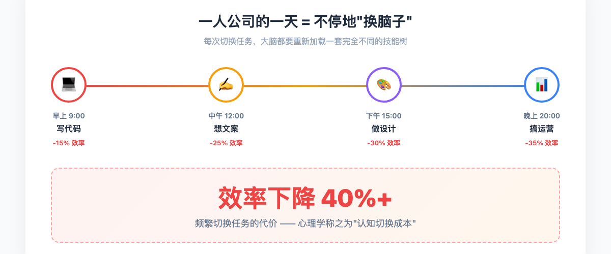
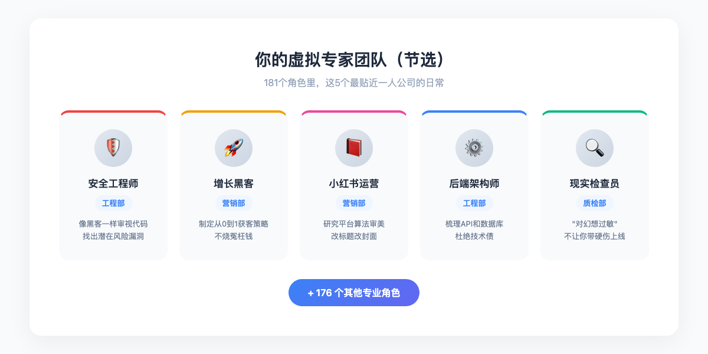
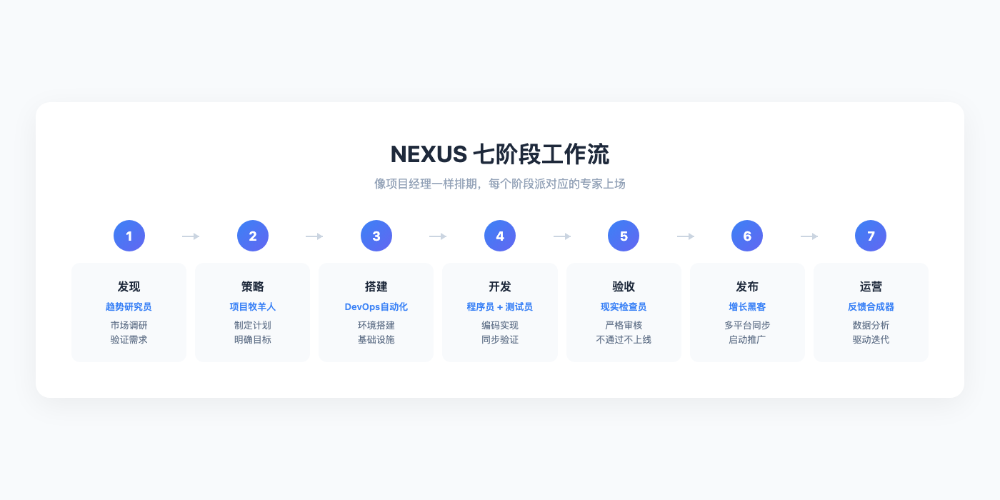
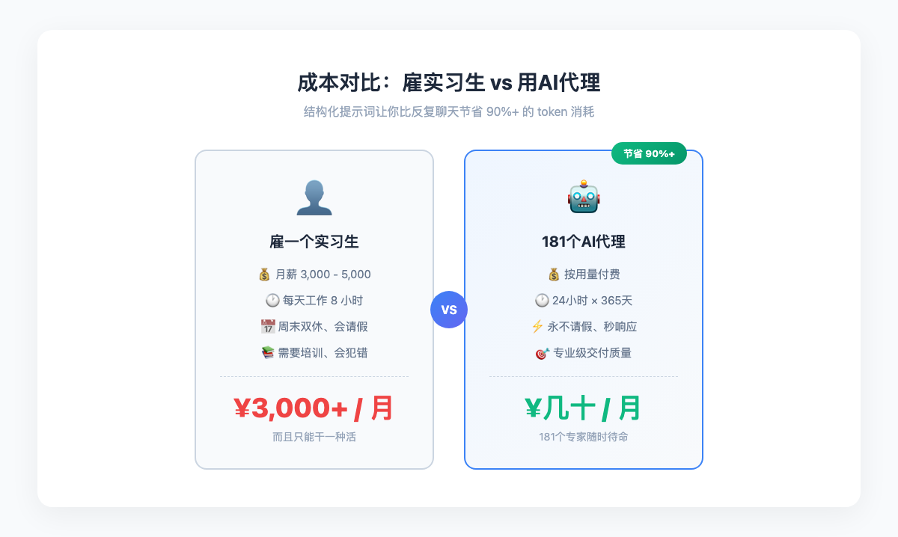
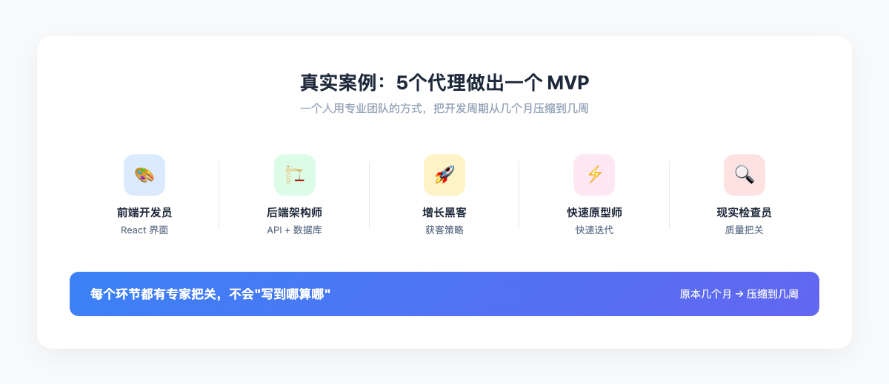
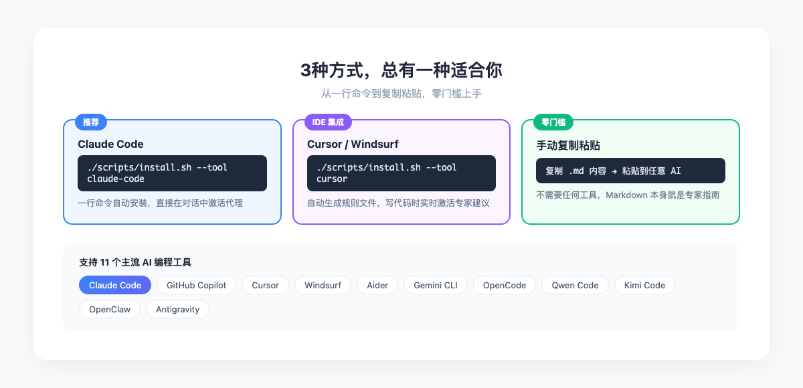
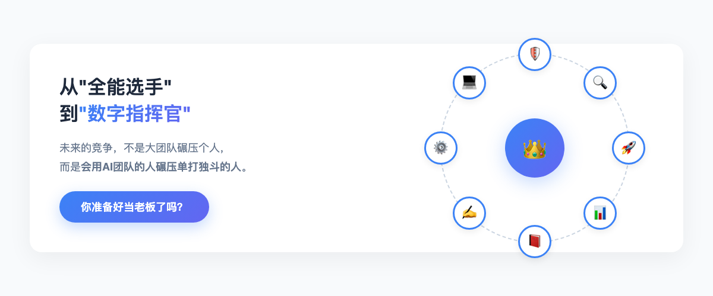

> 早上写代码，中午想文案，晚上做设计。这不是在炫耀你多才多艺，这是在慢性自杀。


上百个AI代理组成的专业团队，让一个人也能拥有大公司的职能深度。关键是：你不需要全能，会指挥就行。

---

## 一人公司最累的不是干活，是"换脑子"

如果你是个一人公司的老板，或者正在考虑成为独立开发者、自由职业者、自媒体人，这种日常大概不陌生：

- 早上刚进入心流状态写完一段核心代码
- 中午被迫切到微信，想一条看起来不尬的朋友圈文案
- 下午打开Figma，对着空白画布发呆半小时
- 晚上还要研究怎么让产品在Google上被搜到

工作量其实不是最大的问题。真正要命的是每次切换任务，大脑都要重新加载一套完全不同的技能树。心理学管这叫"认知切换成本"，有研究说频繁切换能让效率下降40%以上。

你明明只想安安静静写代码，却不得不活成一个全能选手。



> 没有人真的全能。你只是没有团队，所以不得不假装全能。

---

## 解决方案：请一支不领工资的"专家团队"

这个项目叫 The Agency（GitHub 仓库名 `agency-agents`），起源挺有意思的。作者在 Reddit 上发了个讨论 AI 代理专业化的帖子，12小时内收到了50多条请求，大家说"这种专家角色正是我们需要的"。于是他开始一个个写，写了几个月，攒出了上百个专业代理。

你可以把它理解为一个随叫随到、不领工资的专家外包团队。不用请假，不用加班费，24小时在线。

核心理念不复杂：把AI从一个"什么都能聊但什么都不精"的通用助手，变成有特定身份、经验和行事风格的专职员工。每个代理都按5条设计原则来构建：

| 设计原则 | 一句话解释 |
|---------|-----------|
| 强个性 | 有脾气、有风格，不是冰冷的模板 |
| 清晰交付物 | 给代码、方案、报告，不给"仅供参考"的废话 |
| 成功指标 | 每个代理知道自己做到什么程度算及格 |
| 经过验证的工作流 | 按步骤来，不东一榔头西一棒子 |
| 学习记忆 | 用得越多，越了解你的习惯 |

打个比方：以前你是去万能杂货店买东西，店主啥都有但啥都不专。现在你直接请了一群专业顾问，每个人只干自己最擅长的事。

---

## 你的虚拟团队里都有谁？

上百个角色被分成了十几个部门——工程、设计、营销、销售、产品、项目管理、测试、财务、游戏开发……几乎覆盖了一家公司需要的所有职能。别被数字吓到，对一人公司来说，常用的其实就那么几类：

| 你的痛点 | 对应的AI专家 | 他能帮你做什么 |
|---------|------------|--------------|
| 写的代码不知道有没有漏洞 | 安全工程师 | 像黑客一样审视你的代码，找出潜在风险 |
| 产品上线了不知道怎么推广 | 增长黑客 | 制定从0到1的获客策略 |
| 小红书发了10篇都没流量 | 小红书运营 | 研究平台算法和用户审美，改标题改封面 |
| 代码写得 messy 越来越乱 | 后端架构师 | 帮你梳理API设计和数据库结构 |
| 上线前总担心出bug | 现实检查员 | 专门负责挑刺，不让你带硬伤上线 |



这里面最有趣的是"现实检查员"。他的性格设定是"对幻想过敏"——你跟他说"这个功能很简单"，他会回你"证明给我看"。不吃情怀，只看证据。对于习惯了自己给自己验收的一人公司来说，这种人设简直太需要了。

---

## 他们怎么协作？NEXUS 工作流

有了一群人，还得知道怎么让他们协同工作，不然就是一盘散沙。项目设计了一个叫 NEXUS 的工作流程，把一个项目拆成7个标准阶段，每个阶段派对应的专家上场：



1. 发现阶段：先派"趋势研究员"去看看这事到底值不值得干
2. 策略阶段：让"项目牧羊人"把模糊的想法写成明确的执行计划
3. 搭建阶段："DevOps自动化员"先把开发环境搭好
4. 开发阶段：程序员写代码，"证据采集员"同步做测试验证
5. 验收阶段："现实检查员"出场，不通过不给上线
6. 发布阶段："增长黑客"和"内容创作者"在多个平台同步发
7. 运营阶段："反馈合成器"分析用户数据，准备下一轮迭代

说白了就是有个项目经理替你排好了所有人的工作顺序，你只需要在关键节点做决策。

这个流程还支持并行执行。冲刺模式下，15-25个代理可以在2-6周内完成一个复杂功能。换句话说，你一个人可以同时干15个人的活。

---

## 贵不贵？比你想象的要便宜

很多人听到"上百个AI专家"第一反应是：这得烧多少钱？

这个项目在设计上就考虑了成本控制。它里面专门有一个叫"自主优化架构师"的角色，干的就是财务总监的活：

- 智能选模型：简单的格式化任务派给便宜模型，复杂逻辑才用贵的
- 熔断机制：万一哪里出错导致AI疯狂重复调用，自动切断，防止你的账户被烧光
- 成本预估：做方案的时候就告诉你大概要花多少token

而且这些代理用的是结构化提示词，比你自己反复跟AI聊天要节省90%以上的token消耗。



用这套系统不是因为你不差钱，而是因为它确实比雇一个实习生还便宜。

---

## 真实案例：5个人怎么做出一个MVP

README 里给了一个挺实用的案例——用5个代理快速构建一个 Startup MVP：

1. 前端开发员负责搭建 React 界面
2. 后端架构师设计 API 和数据库
3. 增长黑客同步规划获客策略
4. 快速原型师在最短周期内迭代验证
5. 现实检查员在上线前做最终质量把关



结果：一个人用专业团队的方式，把原本需要几个月的开发周期压缩到了几周。每个环节都有专家把关，不会写到哪算哪。

还有个更猛的案例叫 "Nexus Spatial Discovery"，8个不同部门的代理同时出动（趋势研究员、后端架构师、品牌守护者、增长黑客、客服响应员、UX研究员、项目牧羊人、XR界面架构师），在一个会话里完成从市场验证到技术架构到品牌策略的全套方案。开一次会，产品、技术、设计、营销全搞定。

---

## 最小Demo：从安装到上手



说了这么多，怎么真正用起来？其实比想象中简单。

### Step 1：安装（推荐 Claude Code）

如果你用 Claude Code，只需要一行命令：

```bash
./scripts/install.sh --tool claude-code
```

它会自动把所有代理文件复制到 `~/.claude/agents/` 目录下。然后在对话里直接说：

```
用现实检查员帮我审核这个功能
```

Claude 就会以"现实检查员"的人设来回应你。

### Step 2：如果你用 Cursor / Windsurf

```bash
./scripts/install.sh --tool cursor
```

安装后会在项目目录下生成 `.cursor/rules/` 规则文件，写代码时自动激活专家建议。

### Step 3：如果你啥工具都不想装

最简单的方式——直接当模板用。找到你想用的代理文件（比如 `reality-checker.md`），把里面的内容复制粘贴到 Claude / ChatGPT / Kimi / 任何大模型的对话框里，然后描述你的需求就行。

每个 Markdown 文件本身就是一份详尽的专家工作指南，看不懂代码的人也能直接用。

### 支持的工具清单

这个项目支持11个开发工具：Claude Code、GitHub Copilot、Cursor、Windsurf、Aider、Gemini CLI、OpenCode、Qwen Code、Kimi Code……基本覆盖了主流的 AI 编程工具。

### 中文用户福利

这个项目还有中文本地化版本（`agency-agents-zh`），由社区维护。翻译了140多个代理，还额外新增了40多个面向中国市场的角色——小红书运营、知乎策略师、微信公众号管理员、百度SEO专家、抖音策略师、B站内容策略师。国内的一人公司拿来就能用。

---

## 总结



一人公司的最大瓶颈从来不是时间不够，而是一个人的认知边界太窄。

`agency-agents` 做的事情很简单：让你不用学会所有技能，只要会指挥一群专家就行。上百个AI代理不是来替代你的，是来放大你的能力的。从疲于奔命的"全能选手"，变成一个能运筹帷幄的"数字指挥官"。

会指挥的人，永远比单打独斗的人跑得快。你准备好当老板了吗？

---
