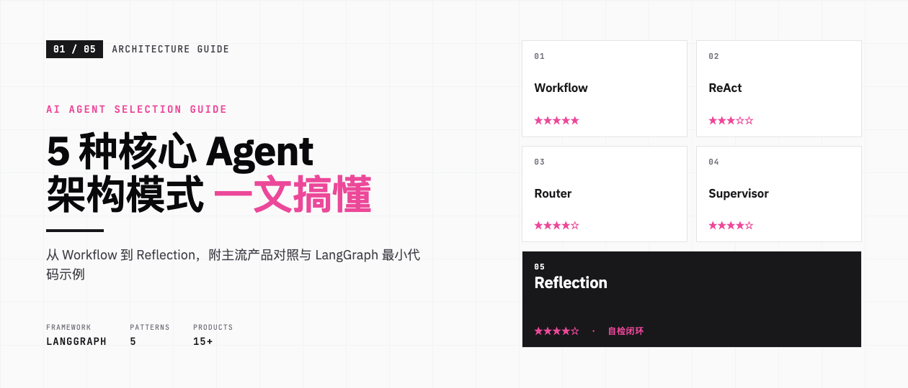
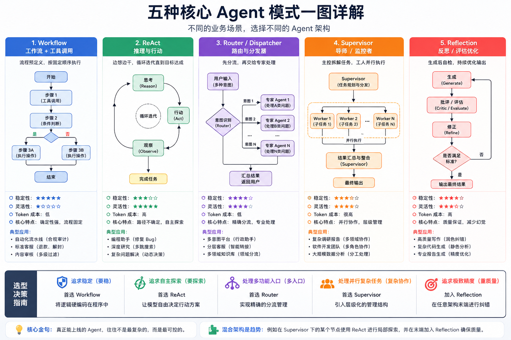
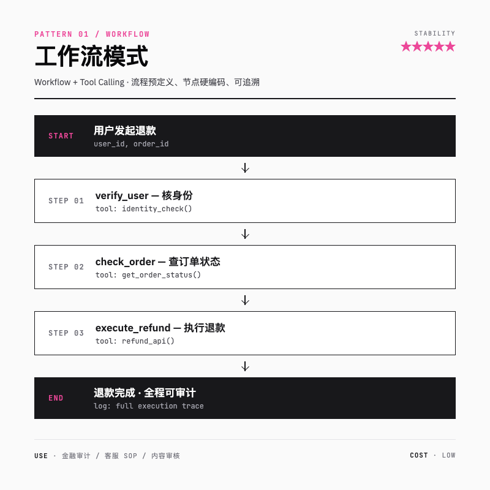
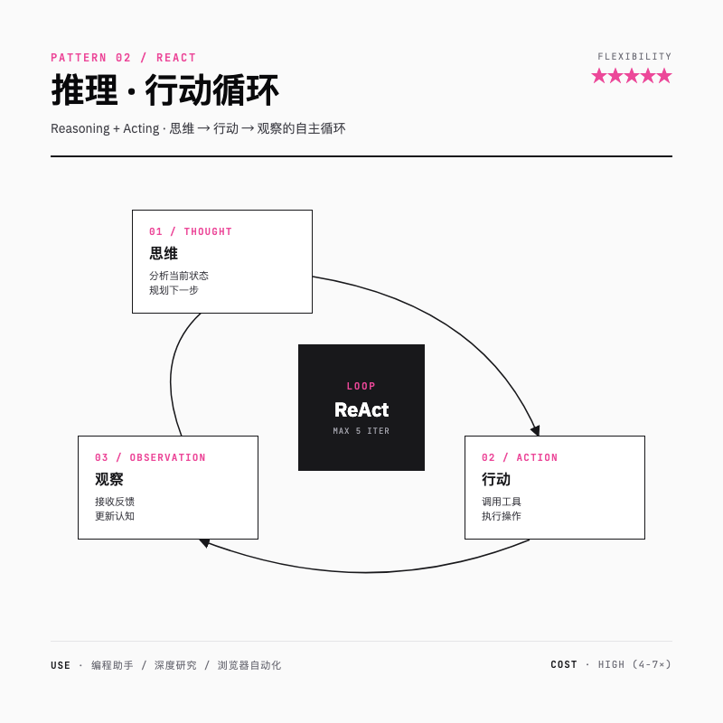
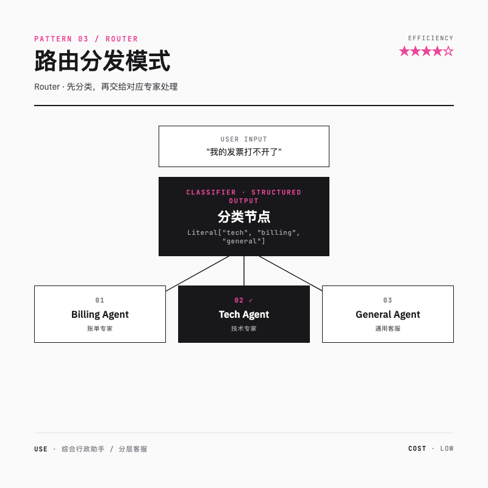
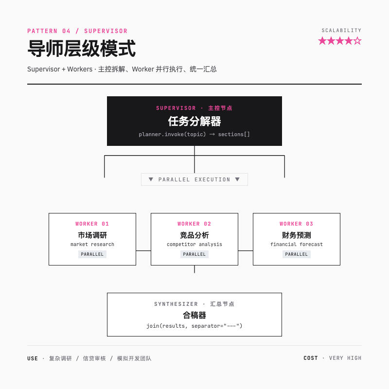
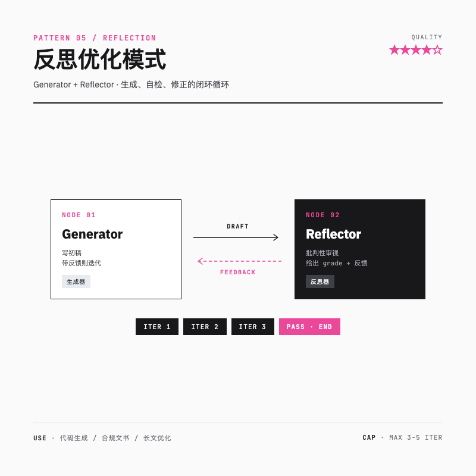
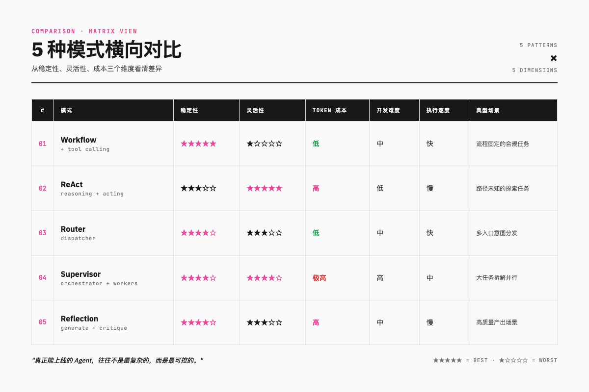
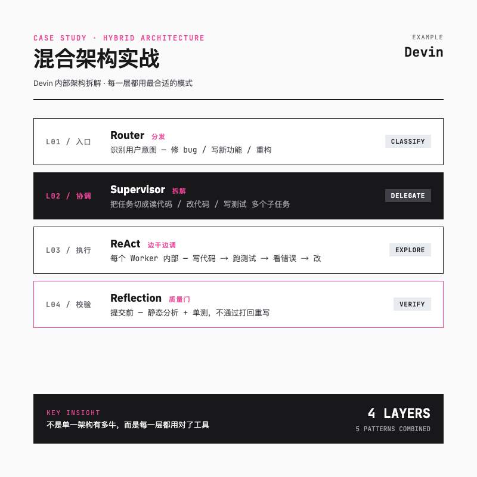

> 你刚加入团队，老板拍桌子让你搭一个智能客服 Agent。心里盘算"不就接个大模型再加几个 if-else"，结果一上线发现：流程乱跳、成本爆炸、出了 bug 都不知道在哪一步翻车。这时你才意识到，能上线的 Agent 早就分流派了。



---

## 一句话总结

**5 种主流 Agent 架构对应 5 种业务场景：求稳选 Workflow，要探索选 ReAct，多入口用 Router，复杂协作上 Supervisor，对质量较真就加 Reflection。**

---

## 为什么要懂 Agent 架构

把 LLM 比作大脑，单独一颗大脑没法干活，得有骨骼和神经。架构就是给 Agent 装骨骼神经的事。

选错架构的代价很真实：

- 一个本该 2 步搞定的任务，让 Agent 自己探索可能要烧 10 倍 token
- 金融审计的合规流程被模型随机跳过节点，监管那关都过不了
- 单个超大 Agent 上下文一长就开始幻觉，修一个 bug 牵动全身

下面这张图概括了 5 种核心模式，可以先收藏：



接下来一个个拆解。

---

## 模式一：Workflow + Tool Calling — 求稳就选它

> 想象你在工厂流水线上，每个工位只干一件固定的事，零件按顺序往下走。**Workflow 模式就是流水线工人**。

### 核心逻辑

流程预定义，模型只在关键节点做判断。这是 5 种模式里确定性最高的，把复杂任务拆成顺序子任务，每一步都按图索骥。

### 技术特征

| 维度 | 表现 |
|---|---|
| 稳定性 | ★★★★★ |
| 灵活性 | ★ |
| Token 成本 | 低 |
| 执行速度 | 快 |

### 适用场景

- **金融合规审计**：数据采集 → 预检 → 规则匹配 → 出报告，每一步都不能跳
- **客服标准流程**：核身份 → 查订单 → 校验政策 → 退款执行
- **内容审核**：多级敏感词过滤 + 自动分类

### 代表产品

**Dify**（国内最火的开源工作流编排）、**n8n**（自动化老牌选手集成 AI 节点）、**Amazon Bedrock Agents**（云厂商方案）。

### LangGraph 最小 demo

```python
from typing_extensions import TypedDict
from langgraph.graph import StateGraph, START, END

class State(TypedDict):
    user_id: str
    order_valid: bool
    refund_amount: float

def verify_user(state: State):
    # 调用身份核验工具
    return {"order_valid": True}

def check_order(state: State):
    # 查订单状态
    return {"refund_amount": 99.0}

def execute_refund(state: State):
    # 真实退款
    print(f"退款 {state['refund_amount']} 给用户 {state['user_id']}")
    return {}

builder = StateGraph(State)
builder.add_node("verify_user", verify_user)
builder.add_node("check_order", check_order)
builder.add_node("execute_refund", execute_refund)

builder.add_edge(START, "verify_user")
builder.add_edge("verify_user", "check_order")
builder.add_edge("check_order", "execute_refund")
builder.add_edge("execute_refund", END)

graph = builder.compile()
graph.invoke({"user_id": "u_001", "order_valid": False, "refund_amount": 0})
```

> 这里靠的是 `add_edge` 把节点硬编码成线性流。每一跳都能完整记录，监管审查时直接回放就行。



---

## 模式二：ReAct — 让 Agent 边想边干

> 一个会探案的侦探：到了现场先观察，做出假设，去验证假设，根据反馈再修正下一步。**ReAct 模式就是这个侦探**。

### 核心逻辑

模型在「思维 → 行动 → 观察」三步里循环。它不预设路径，而是根据上一步的结果决定下一步该干啥。**走到哪算哪，但每一步都有理由。**

### 技术特征

| 维度 | 表现 |
|---|---|
| 稳定性 | ★★★ |
| 灵活性 | ★★★★★ |
| Token 成本 | 高（通常是简单任务的 4-7 倍） |
| 执行速度 | 慢 |

### 适用场景

- **编程助手**：读报错 → 改代码 → 重新跑 → 看新报错，循环到通过
- **深度研究**：第一轮搜索结果决定第二轮关键词，多跳挖到底
- **浏览器自动化**：根据动态加载的页面内容实时判断点哪里

### 代表产品

**Devin**（Cognition AI 的 AI 软件工程师）、**Claude Code**（Anthropic 的终端 Agent）、**Salesforce Agentforce**（明确采用 Reason-Act-Observe-Repeat 范式）。

### LangGraph 最小 demo

```python
from langchain.tools import tool
from langchain.chat_models import init_chat_model
from langgraph.graph import StateGraph, MessagesState, START, END
from langgraph.prebuilt import ToolNode

@tool
def search(query: str) -> str:
    """搜索网页内容"""
    return f"搜索 '{query}' 的结果..."

llm = init_chat_model("claude-sonnet-4-6").bind_tools([search])

def llm_call(state: MessagesState):
    return {"messages": [llm.invoke(state["messages"])]}

def should_continue(state: MessagesState):
    # 模型还想调工具就继续，否则结束
    return "tool_node" if state["messages"][-1].tool_calls else END

builder = StateGraph(MessagesState)
builder.add_node("llm_call", llm_call)
builder.add_node("tool_node", ToolNode([search]))

builder.add_edge(START, "llm_call")
builder.add_conditional_edges("llm_call", should_continue, ["tool_node", END])
builder.add_edge("tool_node", "llm_call")  # 关键：循环回去

agent = builder.compile()
```

> 重点是 `tool_node → llm_call` 这条反向边，让 Agent 看完工具结果还能继续思考。记得加 `recursion_limit`，不然遇到模型幻觉它能转一晚上把账单转爆。



---

## 模式三：Router — 多入口分发的智能门面

> 医院前台的分诊护士：先问你哪儿不舒服，是头痛还是肚子疼，然后引导你去对应科室。**Router 模式就是分诊护士**。

### 核心逻辑

**先分类，再处理**。一个轻量分类节点把用户输入识别为某个领域，再交给对应的专家 Agent 或子工作流。

### 技术特征

| 维度 | 表现 |
|---|---|
| 稳定性 | ★★★★ |
| 灵活性 | ★★★ |
| Token 成本 | 低 |
| 执行速度 | 快 |

### 适用场景

- **综合行政助手**：识别是「请假审批」「IT 报修」还是「会议室预定」分别处理
- **分层客服**：技术支持 vs 账单咨询，分给不同模型实例
- **多业务智能助理**：前置一个分类器降低主模型负担

### 代表产品

**Salesforce Agent Router**（前身 Topic Selector）、**Coze 意图识别**（字节扣子）、**OpenAI Swarm**（其 Handoff 机制本质是路由）。

### LangGraph 最小 demo

```python
from typing_extensions import TypedDict, Literal
from pydantic import BaseModel, Field
from langgraph.graph import StateGraph, START, END

class Route(BaseModel):
    step: Literal["tech", "billing", "general"] = Field(description="问题分类")

router = llm.with_structured_output(Route)

class State(TypedDict):
    input: str
    decision: str
    output: str

def classify(state: State):
    decision = router.invoke(f"判断这条消息属于哪类：{state['input']}")
    return {"decision": decision.step}

def tech_agent(state: State):
    return {"output": f"[技术专家] 处理：{state['input']}"}

def billing_agent(state: State):
    return {"output": f"[账单专家] 处理：{state['input']}"}

def general_agent(state: State):
    return {"output": f"[通用客服] 处理：{state['input']}"}

def route_to(state: State):
    return {"tech": "tech_agent", "billing": "billing_agent", "general": "general_agent"}[state["decision"]]

builder = StateGraph(State)
builder.add_node("classify", classify)
builder.add_node("tech_agent", tech_agent)
builder.add_node("billing_agent", billing_agent)
builder.add_node("general_agent", general_agent)

builder.add_edge(START, "classify")
builder.add_conditional_edges("classify", route_to,
    {"tech_agent": "tech_agent", "billing_agent": "billing_agent", "general_agent": "general_agent"})
builder.add_edge("tech_agent", END)
builder.add_edge("billing_agent", END)
builder.add_edge("general_agent", END)

graph = builder.compile()
```

> `with_structured_output(Route)` 这一行是关键——强制模型只能输出枚举值之一，省掉了"我觉得这个问题既算技术也算账单"的扯皮。



---

## 模式四：Supervisor — 主控加工人的层级协作

> 一个项目经理带三个团队成员：PM 拿到「做个销售看板」的需求，拆成「设计 UI / 写后端 / 接数据库」分给三个人，最后汇总验收。**Supervisor 模式就是这位 PM**。

### 核心逻辑

**主控 Agent 拆解任务**，多个 Worker Agent 并行执行子任务，最后由主控汇总。把超大任务隔离到不同子空间，避免单 Agent 上下文过载。

### 技术特征

| 维度 | 表现 |
|---|---|
| 稳定性 | ★★★★ |
| 灵活性 | ★★★★ |
| Token 成本 | 极高（多 Agent + 主控频繁调用） |
| 执行速度 | 中（受并行影响） |

### 适用场景

- **复杂调研报告**：主控分配「市场调研 / 竞品分析 / 财务预测」给 3 个子 Agent
- **多源数据信贷审核**：征信 + 交易 + 反欺诈三个 Worker 并行查询
- **模拟开发团队**：PM 协调前端、后端、测试 Agent

### 代表产品

**CrewAI**（角色导向协作的代表）、**Microsoft Magentic-One**（内置 Orchestrator + WebSurfer/Coder 等 Worker）、**Microsoft Copilot Studio**（Connected Agents 模式）。

### LangGraph 最小 demo

```python
from typing import List
from pydantic import BaseModel, Field
from langgraph.func import entrypoint, task

class Section(BaseModel):
    name: str = Field(description="章节名")
    description: str = Field(description="章节简述")

class Sections(BaseModel):
    sections: List[Section]

planner = llm.with_structured_output(Sections)

@task
def supervisor(topic: str):
    """主控：拆解任务"""
    plan = planner.invoke(f"为「{topic}」生成一份调研报告大纲")
    return plan.sections

@task
def worker(section: Section):
    """工人：写一节"""
    return llm.invoke(f"写章节：{section.name}\n要求：{section.description}").content

@task
def synthesizer(sections: list[str]):
    """汇总：合稿"""
    return "\n\n---\n\n".join(sections)

@entrypoint()
def run(topic: str):
    sections = supervisor(topic).result()
    # 关键：fork 出多个并行任务
    futures = [worker(s) for s in sections]
    results = [f.result() for f in futures]
    return synthesizer(results).result()

report = run.invoke("2026 年大模型行业趋势")
```

> `[worker(s) for s in sections]` 这一行就让多个 Worker 并行跑了起来。Anthropic 试过这种并行调研，效率提升能到 90%。



---

## 模式五：Reflection — 让 Agent 自我审视

> 你写完一篇文章发给编辑，编辑红笔挑刺：「这段逻辑跳跃」「这里数据不对」，你回去改。改完再发，再挑，再改。**Reflection 模式就是这个改稿循环**。

### 核心逻辑

**生成 → 自检 → 修正** 的闭环。一个生成器节点产出初稿，一个反思器节点用更严格的 prompt 来挑毛病，不达标就打回重写，直到通过或达到最大轮次。

### 技术特征

| 维度 | 表现 |
|---|---|
| 稳定性 | ★★★★ |
| 灵活性 | ★★★ |
| Token 成本 | 高（成倍增加） |
| 执行速度 | 慢（多轮迭代） |

### 适用场景

- **代码生成**：生成代码 → 静态分析或试运行 → 改 bug，循环到通过
- **合规文书撰写**：对照政策条款逐条核查初稿
- **长文优化**：批评家 Agent 指出逻辑矛盾或冗余

### 代表产品

**Claude Code**（Anthropic 的深度推理终端）、**MCP Agent SDK**（内置 EvaluatorOptimizerLLM 类）、**OpenCode / Cline**（代码提交前严格验证）。

### LangGraph 最小 demo

```python
from typing_extensions import TypedDict, Literal
from pydantic import BaseModel, Field
from langgraph.graph import StateGraph, START, END

class Feedback(BaseModel):
    grade: Literal["pass", "fail"] = Field(description="是否合格")
    feedback: str = Field(description="不合格时给出改进意见")

evaluator = llm.with_structured_output(Feedback)

class State(TypedDict):
    topic: str
    draft: str
    feedback: str
    grade: str

def generator(state: State):
    """生成器：写初稿（如有反馈则带着反馈改）"""
    if state.get("feedback"):
        msg = llm.invoke(f"主题：{state['topic']}\n旧稿：{state['draft']}\n反馈：{state['feedback']}\n请改写")
    else:
        msg = llm.invoke(f"写一篇关于「{state['topic']}」的短文")
    return {"draft": msg.content}

def reflector(state: State):
    """反思器：批改"""
    fb = evaluator.invoke(f"评审下面的文章是否合格：\n{state['draft']}")
    return {"grade": fb.grade, "feedback": fb.feedback}

def route(state: State):
    return END if state["grade"] == "pass" else "generator"

builder = StateGraph(State)
builder.add_node("generator", generator)
builder.add_node("reflector", reflector)

builder.add_edge(START, "generator")
builder.add_edge("generator", "reflector")
builder.add_conditional_edges("reflector", route, {END: END, "generator": "generator"})

graph = builder.compile()
graph.invoke({"topic": "为什么 LangGraph 适合做 Agent", "draft": "", "feedback": "", "grade": ""})
```

> 实战里给反思器加个最大轮次（3-5 轮就够），不然两个模型互相挑刺能把账单挑到天上。



---

## 5 种模式横向对比

把上面 5 种模式拉到一张表里看：

| 模式 | 稳定性 | 灵活性 | Token 成本 | 开发难度 | 执行速度 | 一句话场景 |
|---|---|---|---|---|---|---|
| **Workflow** | ★★★★★ | ★ | 低 | 中 | 快 | 流程固定的合规任务 |
| **ReAct** | ★★★ | ★★★★★ | 高 | 低 | 慢 | 路径未知的探索任务 |
| **Router** | ★★★★ | ★★★ | 低 | 中 | 快 | 多入口意图分发 |
| **Supervisor** | ★★★★ | ★★★★ | 极高 | 高 | 中 | 大任务拆解并行 |
| **Reflection** | ★★★★ | ★★★ | 高 | 中 | 慢 | 高质量产出场景 |



---

## 选型决策指南

这张速查表能帮你 30 秒定方案：

| 你的需求 | 选谁 | 为什么 |
|---|---|---|
| **要稳** —— 业务有 SOP，不容许出错 | Workflow | 流程硬编码，每一跳可审计 |
| **要探索** —— 路径不确定，要边干边调整 | ReAct | 让模型自由决定下一步 |
| **多入口** —— 一个助手要管十几件事 | Router | 先分类再处理，降低主模型压力 |
| **复杂协作** —— 大任务能拆能并行 | Supervisor | 隔离子任务，提速又防上下文爆炸 |
| **重质量** —— 输出错了代价大 | + Reflection | 任意架构尾部加反思循环都行 |

> Reflection 不是独立架构，更像一个"精度增强器"，可以贴在前 4 种架构的末端。

---

## 实战：主流产品都是混合架构

真正落地的 Agent 几乎都是**多种模式混着用**。以 Devin 为例，它内部其实是这样的：

| 层级 | 用什么模式 | 干什么 |
|---|---|---|
| **最外层** | Router | 识别用户是来修 bug 还是写新功能 |
| **第二层** | Supervisor | 把任务拆解为「读代码 / 改代码 / 写测试」分发 |
| **第三层** | ReAct | 每个 Worker 内部边写边跑边调试 |
| **提交前** | Reflection | 静态分析 + 单测，不通过打回重写 |



混合的核心不是某个架构有多强，而是每一层都用对了工具。Salesforce Agentforce、Microsoft Magentic-One 这些大厂方案走的也是同一条路。

---

## 总结

调研报告里有一句话挺实在：

> **真正能上线的 Agent，往往不是最复杂的，而是最可控的。**

5 种模式各有专长，可以混着用。Workflow 是螺丝刀，最稳；ReAct 是瑞士军刀，灵活但贵；Router 是分诊台，专门分流；Supervisor 像总指挥，大场面靠它；Reflection 是放大镜，哪儿不放心就贴哪儿。

下次老板再问"咱们这 Agent 用啥架构"，先反问三个问题：
1. 业务流程是固定的还是开放的？
2. 要不要多入口？
3. 容错率多高？

答完这三个问题，架构基本就出来了。

---

> 参考素材：LangGraph 官方文档，Anthropic / Salesforce / Microsoft 公开案例。
