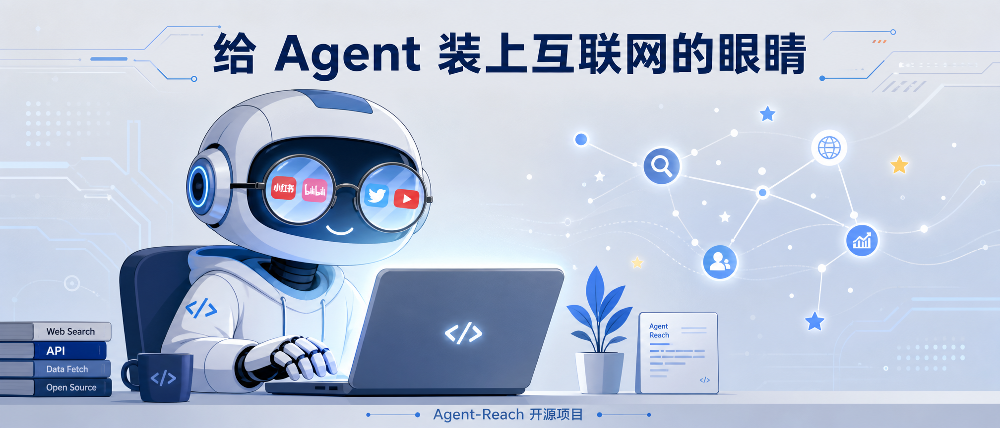
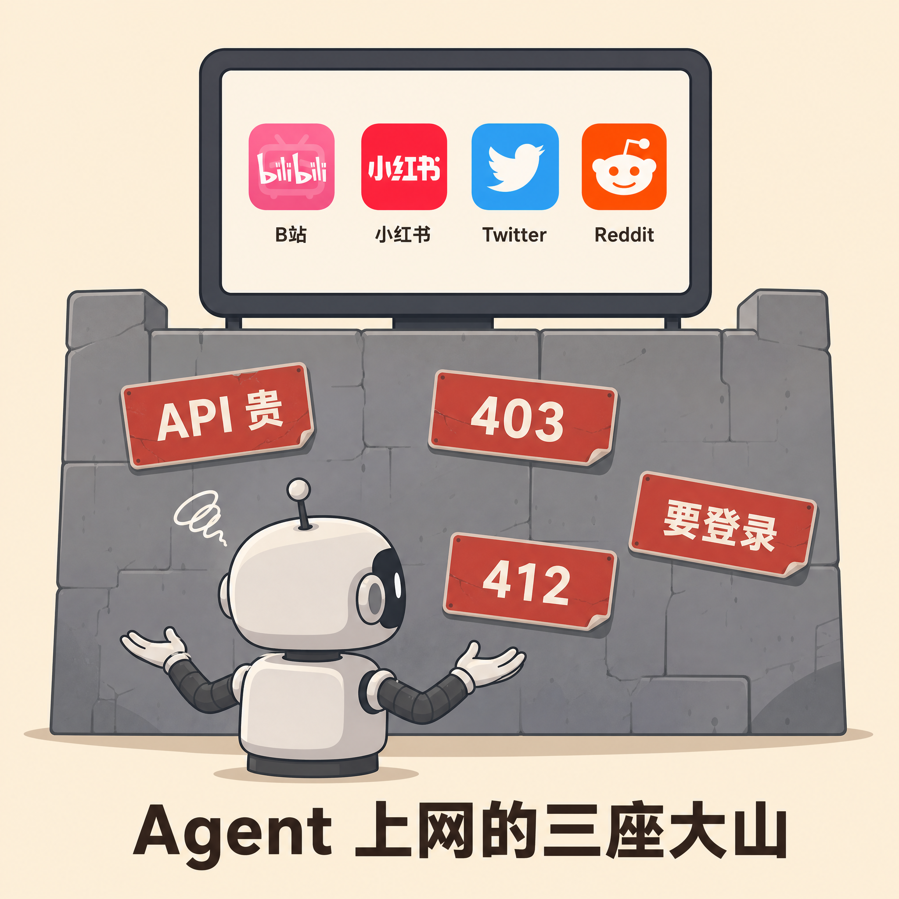
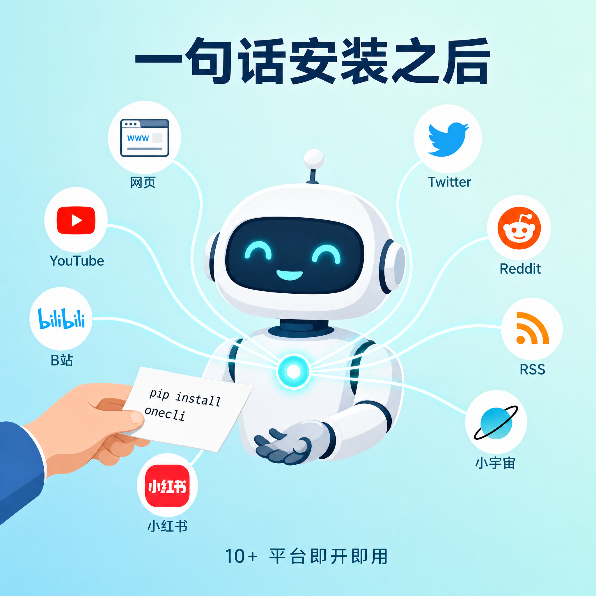
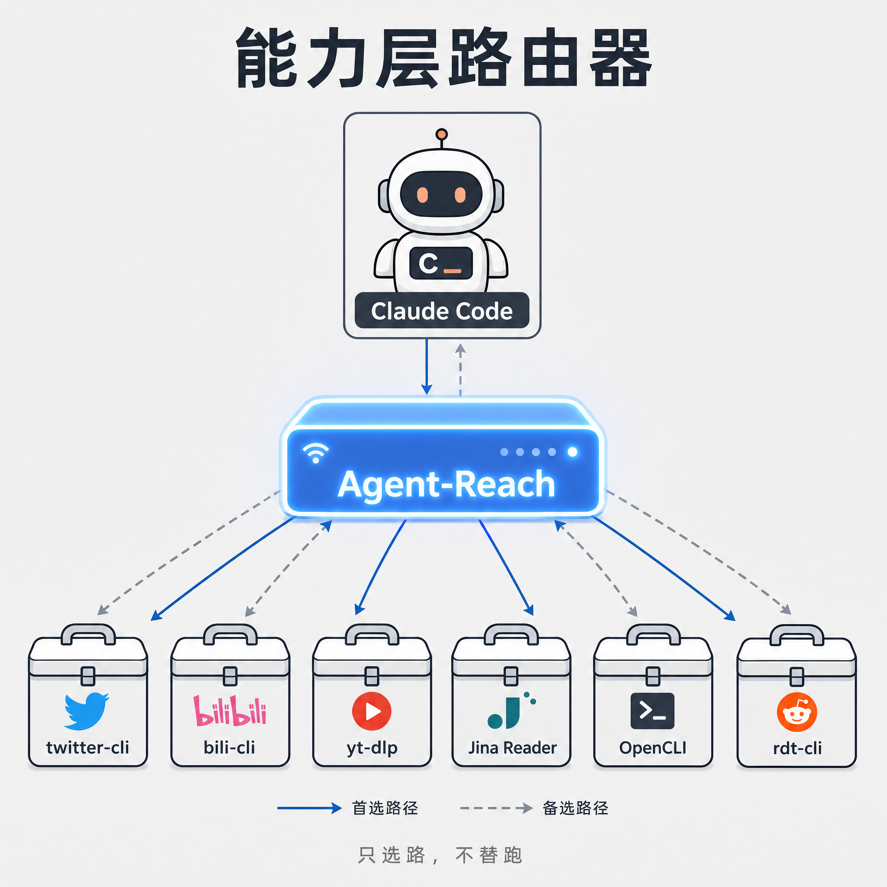
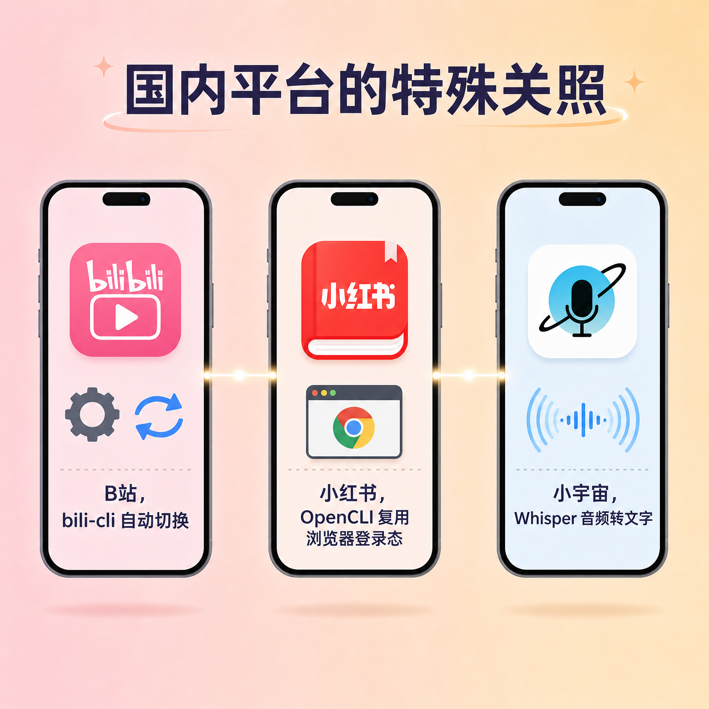
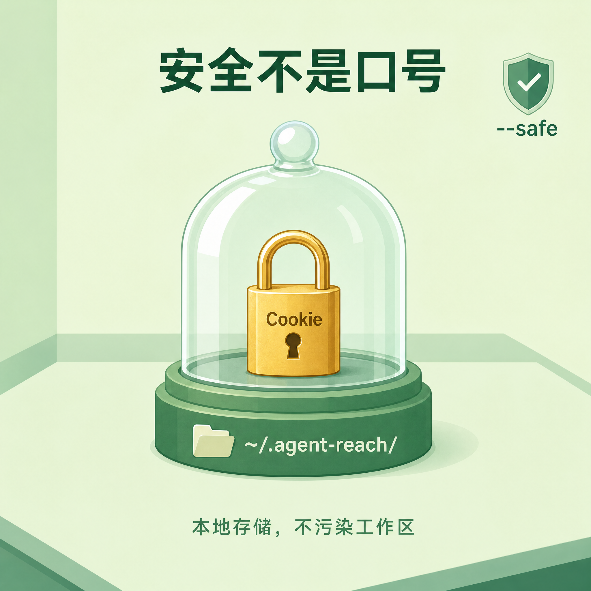

# Agent 不能上网？这个项目让 Claude Code、小龙虾 OpenClaw 都戴上互联网眼镜

> 你让 Claude Code 帮你查小红书上某款耳机的真实口碑，它回你「我无法访问实时网页」。你让小龙虾 OpenClaw 总结 B站 上那个 40 分钟的技术教程，它只能根据标题瞎猜。问题不是模型不够聪明，是它根本没有一副能看互联网的眼睛。



---

## 一句话总结

**Agent-Reach 是个 29K Star 的开源项目，定位不是又一个爬虫工具，而是 AI Agent 和底层 CLI 之间的能力层路由器。** 把它装到 Claude Code、Cursor、小龙虾 OpenClaw 这些编程 Agent 上，Agent 突然就能看懂网页了。不是装模作样看标题，是真的能读 B站字幕、翻小红书评论、搜推特帖子、听小宇宙播客。你不用逐个平台申请 API，不用写爬虫，不用跟风控斗智斗勇。一句话扔给 Agent，它自己帮你选好工具、装好依赖、测通渠道。

---

## Agent 上网，怎么就成了一座山

现在的 AI Agent 已经能写代码、改 Bug、整理文档、管项目。但你让它去网上查点东西，它立刻就卡住了。

不是它不想，是它真的看不到。

你让它总结 YouTube 教程，它没有字幕接口。搜 Twitter 上的产品评价？API 贵得离谱。去 Reddit 看看有没有人踩过同一个坑？IP 直接被 403 拒绝。小红书更麻烦，页面必须登录才能打开。就连抓个普通网页，回来的也是一堆 HTML 标签和广告脚本，Token 瞬间烧光。

API 要钱、风控拦路、登录门槛、数据乱得像垃圾场。Agent 被这四件事困在本地，动弹不得。

为了让 Agent 能上网，开发者往往要逐个平台踩坑。装一个推特 CLI、配一个 Reddit Cookie、写一个 B站 下载脚本、再搭一个网页清洗管道。光是为了让 Agent 能读一条推文，可能就得折腾半天。

更麻烦的是，这些上游工具今天能用，明天可能就废了。

2026 年 3 月，xhs-cli 宣布停止维护。到了 6 月，B站 风控升级，yt-dlp 被 412 全面封锁。Reddit 的匿名接口也早已被官方关闭。你刚配好的环境，过两个月就报错。你还得重新找工具、重新配环境、重新教 Agent 怎么用。

折腾几次之后，你就会想，有没有人能帮我管这些破事？

然后还真有人做了这么个东西。

Agent-Reach 就是从这个念头里长出来的。它自己站在中间，哪个后端现在能用、哪个快死了、哪个要换，它心里有数，你不用管。



---

## 一句话安装之后，世界变了

Agent-Reach 的安装方式简单到离谱。

把下面这句话复制给你的 Agent 就行。

```
帮我安装 Agent Reach，https://raw.githubusercontent.com/Panniantong/agent-reach/main/docs/install.md
```

然后你就看着它自己忙活。先看看你在本地还是服务器，pip 装好自己的命令行，顺手把 yt-dlp、feedparser 这些零配置工具带上。Node.js、gh CLI、mcporter 这些基建缺不缺，它也检查一遍。然后接入 Exa 语义搜索，不用你掏个人 API Key。最后往 Agent 的 skills 目录塞一份 SKILL.md，以后你说「帮我搜一下」「帮我看看这个视频」，Agent 就知道该调谁。

安装完之后，默认激活 6 个零配置渠道。

**读任意网页、读 YouTube 字幕、读 RSS、搜全网、读 GitHub 公开仓库、看 B站搜索和详情。** 这些都不需要登录，不需要 Cookie，不需要付费 API。你把链接或者关键词扔给 Agent，它就能开始工作。

需要登录的平台，比如 Twitter、小红书、Reddit、LinkedIn，Agent 会列出菜单问你要不要解锁。你点一个名，它再帮你配置。配置方式也被简化到极致，通常就是「浏览器登录 → Cookie-Editor 导出 → 发给 Agent」。

更新也是一句话。

```
帮我更新 Agent Reach，https://raw.githubusercontent.com/Panniantong/agent-reach/main/docs/update.md
```

装完之后，你随时可以用 `agent-reach doctor` 做一次全身检查。哪个渠道通了，哪个渠道挂了，当前走的是哪个后端，doctor 都会告诉你，还会给出修复处方。

这就是 Agent-Reach 的易用性核心。**它不是给你一把螺丝刀，更像一个会自己换零件的管家。**



---

## 它到底做对了什么

为什么 Agent-Reach 能做到「装完就忘」？不是靠黑科技，是靠一个很清醒的自我定位。

**它不是又一个工具，而是能力层。**

README 里第一句话就说，Agent-Reach 是一个 capability layer，比任何具体实现都高一层。它负责选型、安装、体检、路由，但不负责底层读取本身。读取由 Agent 直接调用上游 CLI 工具完成，没有包装层。

传统思路是写一个中间件，把所有平台的 API 封装成统一的函数调用。这样做看起来很优雅，但问题是，一旦某个平台的 API 变了、风控升级了、工具停更了，中间件就得重写。Agent-Reach 不干这个。它不包这些脏活，只管一件事，告诉 Agent 现在该用哪个工具，剩下的让 Agent 自己去调。

这个区别很关键。中间件是「我帮你把所有平台的接口都包一遍，你以后只调用我」；能力层是「你自己去调原生的上游工具，我只负责告诉你现在该调谁、怎么调」。前者看起来省事，实际上把脆弱性都集中到了自己身上。后者把读取能力还给了 Agent，自己只维护一张不断更新的路由表。

打个比方，Agent-Reach 不是翻译官，而是导游。它不替你说话，但它知道哪条路现在走得通、哪条路最近被封了、哪条路需要带护照。

这个定位带来几个直接的好处。

**每个平台都有一份「首选 + 备选」的有序后端列表。** B站 的 yt-dlp 被封了，它自动切到 bili-cli，再不行还有 OpenCLI 和搜索 API。Twitter、Reddit 也是类似的路子。一个后端死了，下一个顶上。每个渠道内部都排着这么一张候选名单，想换接入方式？调一下顺序就行，不用重写代码。

**doctor 不是静态检查，而是真实探测。** 很多工具的环境检查只是看看某个命令在不在 PATH 里。Agent-Reach 的 doctor 会向各个平台的实际接口发起轻量级请求，确认这条链路现在真的能用。如果某个后端因为 Cookie 过期、风控升级或者上游工具报错而失效，doctor 会给出具体的修复处方，而不是一个模糊的「连接失败」。

**SKILL.md 让 Agent 自己知道怎么用它。** Agent-Reach 安装时会往 Agent 的 skills 目录写一份使用指南。这不是给人看的说明书，而是给 Agent 看的提示词。以后你根本不需要记 `agent-reach` 有哪些子命令，只要说「帮我看看这个网页」「搜一下推特上大家对这事的评价」「这个 B站 视频讲了什么」，Agent 自己就知道该调哪个工具。

这几件事加在一起，就是 Agent-Reach 和其他工具不一样的地方。它不是最强悍的爬虫，也不是最全能的浏览器自动化工具。但它是目前最适合交给 Agent 自己去用的那一层。



---

## 国内平台，被特殊关照过

这个能力层的设计理念，在国内平台上体现得特别明显。

很多开源项目做网络接入，默认只考虑海外生态。YouTube、Twitter、Reddit 优先级最高，B站、小红书、小宇宙播客这些平台只是顺带提一句，甚至根本不管。但 Agent-Reach 把这些平台当成了头等公民，每个渠道都独立维护一份后端列表。

**B站** 就是一个典型例子。YouTube 的字幕提取本来用 yt-dlp 做得很好，很多人顺手也把 yt-dlp 拿去抓 B站。但 2026 年 6 月，B站 风控升级，yt-dlp 频繁触发 412 封锁，基本阵亡。Agent-Reach 的反应很快，把 B站 通道的首选后端从 yt-dlp 切换成 bili-cli，OpenCLI 当备选，再往下才是官方搜索 API。对普通用户来说，这几乎是无感的。你不用知道 yt-dlp 为什么被封，也不用自己去找 bili-cli。Agent 还是会正常回答「这个 B站 视频讲了什么」。

**小红书** 是另一种难。它必须登录才能看内容，而且反爬极强。Agent-Reach desktop 端的首选方案是 OpenCLI，直接复用你 Chrome 浏览器里的登录态。你只要平时刷过小红书，Agent 就能搜索、读笔记、看评论。服务器端则用 xiaohongshu-mcp，自带无头浏览器和扫码登录。过去常用的 xhs-cli 因为上游停更，已经被降级成备选后端。

最意外的是 **小宇宙播客**。说实话，我一开始没想到播客也能被 Agent「读」。直到我意识到它集成了 Groq-Whisper 和本地 ffmpeg，能把一期 90 分钟的创业访谈自动转录成文本，才反应过来这意味着什么。配置时需要申请一个免费的 Groq API Key，不算零配置，但整个过程依然很轻。Agent 不仅能读文字网页，还能「听」播客，然后把内容写进报告里。

这正是能力层思路的价值。Agent-Reach 自己不碰任何平台的数据解析逻辑，但它清楚每个平台现在该用哪个后端。B站 的后端换了，它更新路由顺序；小红书需要登录态，它帮你复用 Chrome Session；小宇宙是音频，它帮你转录成文本。对 Agent 来说，这些差异都被封装在一张路由表里。

雪球行情、LinkedIn、V2EX 这些平台也都被纳入支持列表。抖音、微信公众号等更多渠道也在持续接入中。Agent-Reach 没有因为某个平台小众就忽略它，而是把每一个有信息价值的内容源都当成独立渠道来维护。

这正是作者说的「每个渠道我会尽量保证能用、好用、免费」。



---

## 安全不是口号，是边界

Agent 能随便上网，听起来有点冒险。Agent-Reach 在安全上做了一整套边界设计，把这些风险尽量关进笼子。

你的 Cookie 不会离开本地机器。所有需要登录的平台，凭据都保存在 `~/.agent-reach/config.yaml` 里，存在你本地，别人打不开。这些凭据不上传任何第三方云端服务器，也不会传到 Agent-Reach 作者的服务器上。

它也不乱动你的工作目录。Agent-Reach 强制把所有配置文件、第三方工具源码、编译产物、临时交换文件隔离在独立路径下。持久化数据放 `~/.agent-reach/`，临时文件放 `/tmp/`。它不会在你的项目目录里克隆 GitHub 仓库，不会乱写配置文件，不会把 Cookie 撒得到处都是。

怕它乱改系统？有安全模式。如果你在生产服务器或者多人共用机器上部署，可以传 `--safe` 参数。这个模式下，Agent-Reach 只探测分析，不自动修改系统组件。它会把需要装的依赖、需要做的配置列出来，由你决定是否执行。安全合规团队可以用这个模式做审计，确认 Agent 到底会做什么。

想先预览再决定？Dry Run 给你看。`agent-reach install --dry-run` 会预览所有即将执行的操作，不做任何改动。这跟 `--safe` 类似，但更轻量，适合想先看看会发生什么再决定的用户。

这些设计不是说 Agent-Reach 绝对安全，而是它把风险边界画得很清楚。你的凭据在哪、它改了什么、怎么一键卸载，都清清楚楚。



---

## 最小 demo，三步上手

如果你想试试，流程可以压缩到三步。

把安装链接扔给 Agent，等它跑完。然后跑 `agent-reach doctor`，看看哪些渠道通了。最后直接说话。

比如你想知道某个 B站 视频讲了什么，直接对 Agent 说「总结一下这个 B站 视频的要点」，把链接发过去。Agent 会自己调用 bili-cli 拿详情和字幕，整理成一段摘要。

如果你想调研小红书上的产品口碑，说「在小红书上搜一下这个耳机的真实评价」，Agent 会调用 OpenCLI 的 xiaohongshu 通道，返回搜索结果和笔记内容。你不需要记任何命令。

这就是 Agent-Reach 想让你用的方式。**复杂的事交给工具链，你只管说话。**

---

## 总结

Agent-Reach 让我印象深刻的，不是它支持了多少平台，也不是它有多少 Stars。

而是它做对了一件很朴素的事，**把 Agent 上网这件事，从「每个开发者自己踩坑」变成了「一句话交给 Agent 自己解决」。**

它不重新发明爬虫，也不写厚重的包装层，只是站在 Agent 和已经存在的开源工具之间，当好一个选型的、安装的、体检的、路由的角色。某个后端失效了，它换下一个。某个平台风控升级了，它更新路由顺序。上游工具停更了，它把流量切走。

所以回到开头那个问题，Agent 缺的不是聪明，是一副能看互联网的眼睛。

Agent-Reach 做的就是这件事。装完之后，Claude Code 和小龙虾 OpenClaw 再看你的小红书链接，不会再回你「我无法访问实时网页」。它会直接告诉你，那款耳机到底值不值得买。

欢迎关注我的公众号「Chyris Tech Note」，获取更多 AI 技术解读与实践分享。
