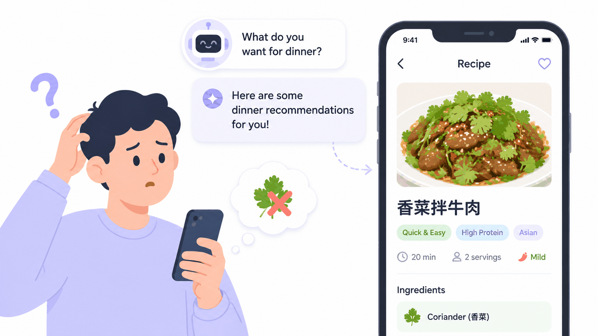
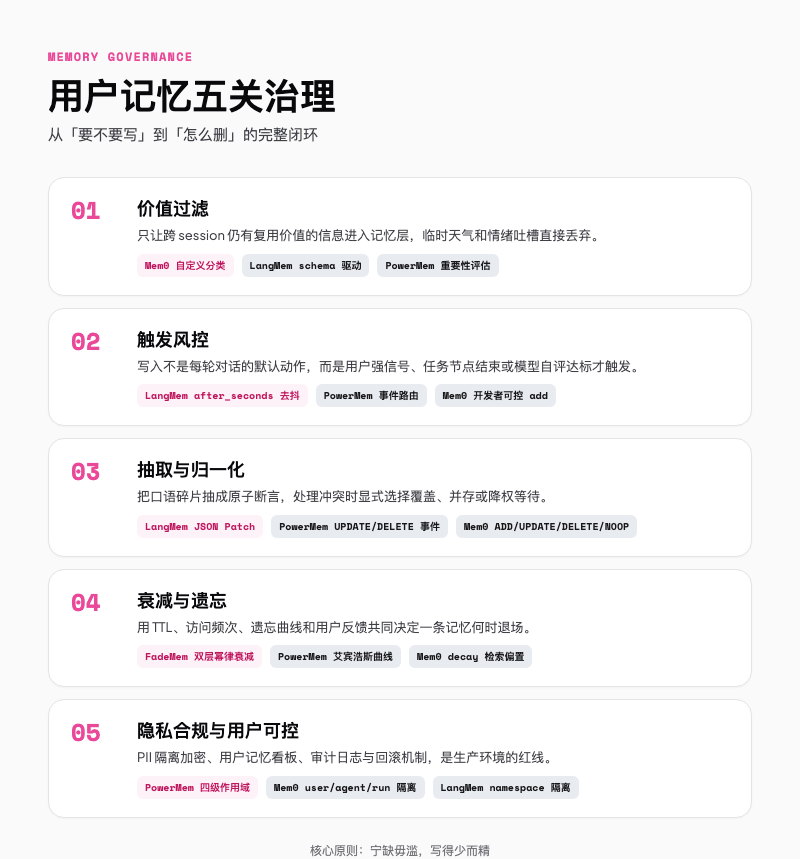
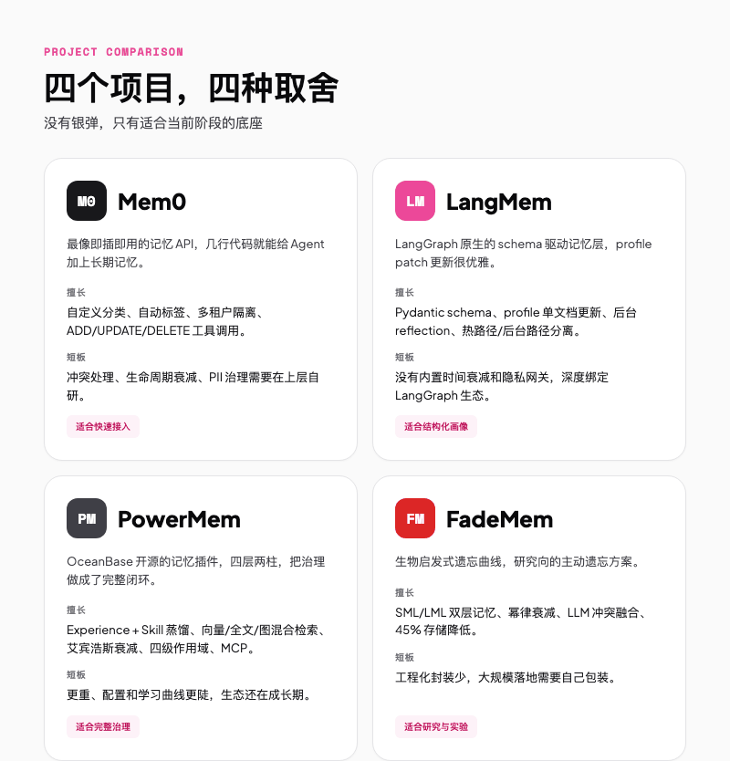
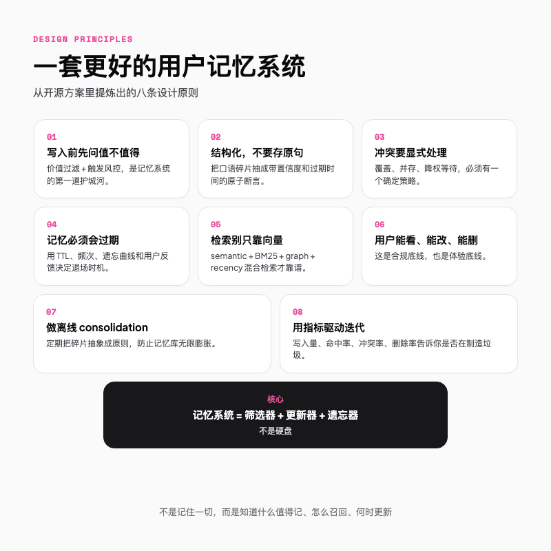

# 你的 Agent 记住了所有对话，为什么还是不懂你

> 长期记忆本该是 Agent 越用越懂你的笔记本。可惜大多数人最后都把它用成了聊天记录回收站。


---

## 一句话总结

说白了，好的记忆系统不是「记得多」，而是**记得对、找得到、舍得删**。

---

## 01｜记性太好，也是一种病

上周你刚跟 coding agent 说，新项目不用 Next.js，改用 Astro。昨天打开新对话，它第一句话是，「我帮你搭一个 Next.js starter 吧」。

你愣了一下。它明明把你过去三个月说的话都存下来了，你喜欢暗色模式、习惯用 pnpm、连你猫的名字都记得。可它偏偏漏掉了你上周最重要的那个决定。

这不算模型幻觉。库里同时躺着两条相反的话，它哪条都敢召回，更准确的说法叫噪音污染。



把每轮对话都写进长期记忆，系统迟早会同时召回「我喜欢 Next.js」和「我不用 Next.js」。向量相似度只看语义像不像，分不清哪句更新、哪句过时、哪句只是你随口吐槽。

记东西不难，真正难的是让它舍得把过时的删掉，这事儿大多数系统干不来。

---

## 02｜记忆不是聊天记录

我一开始也以为，用户记忆就是「把对话存下来，下次检索」。后来发现这最多算聊天记录，离记忆还差好几层。

其实 Agent 跟人一样，也有三种记性。

**短期记事本**，技术上叫 checkpointer（可以理解成对话里的便签纸）。你问了三轮问题它还没跑题，靠的就是这层。

**长期笔记本**，跨 session 复用。你上周的偏好、上个月的决策、去年的项目背景，都该写在这里。

**肌肉记忆**，更隐蔽，是 Agent 自己琢磨出来的「下次遇到类似情况该怎么干」。LangMem 里的 prompt optimizer、PowerMem 里的 Skill 蒸馏，干的都是这件事。

拿写 landing page 举个例。三轮对话里 agent 没跑偏，靠短期记事本；一周后它还记得你要用 Astro，靠长期笔记本；下次它主动先问你要不要暗色模式，靠的就是肌肉记忆。三层各司其职，混在一起必乱。

真正配进长期笔记本的，只有三类东西，**用户偏好、客观事实、踩过的坑总结出来的经验**。今天的天气、一次性的情绪吐槽、临时跳转的指令，都不该写进去。



光分清三层还不够，还有个更扎心的问题，不是什么东西都配进长期记忆。

---

## 03｜不是什么话都配被记住

第一道筛子要问的是，这句话值不值得被记住。

我自己每次会过一遍。下次开新对话，这条信息我还用得上吗？是用户认真说的，还是随口一吐槽？是不是那种踩过一次还会再踩的坑？命中一个，才往库里写。至于「我猫叫香菜」这种，记不记差别不大，除非你的 agent 要给猫过生日。

Mem0 的做法是让你给项目配**自定义分类**和**抽取指令**。你定义几个 categories，比如「技术栈偏好」「项目决策」「生活习惯」，再写清楚「只提取目标、约束、偏好，忽略问候和闲聊」。系统会自动给记忆打标签，检索时也能按分类过滤。这种规则化兜底，比指望模型自己判断靠谱得多。

LangMem 走的是**schema 驱动**路线。你用一个 Python 数据类把字段写死，name、timezone、tech_stack 列清楚，memory manager 只会从这些字段里抠信息。结构稳定，但灵活性低，特别适合用户画像这种字段明确的场景。

PowerMem 更工程化。它的智能处理器会先做语义分析、重要性评估、周期性判断，再决定这条记忆该进 User Profile、私有层、短期层，还是直接被遗忘。

这一关的精髓就一句话，写得少比写得多重要。

---

## 04｜别每轮对话都往库里写

知道什么该记之后，还要决定什么时候写。

**每轮对话都写，是生产环境的大忌。** 写入有存储成本，更糟的是未来的检索干扰成本。写得太勤，记忆库迟早变成一锅粥。

合理的写入触发应该是事件驱动的，常见三种信号。

用户给你强信号，「记住我的地址」「以后用微信联系我」，这是明确的写入许可。任务节点结束，订票成功、订单完成、会议预约确认，意味着一个语义片段讲完了，适合异步落盘。模型自评达标，用一个轻量 reflection 给候选记忆打分，过了阈值才写。这个分数最好留痕，方便后面审计。

LangMem 在这层想得最周到。它分**热路径**和**后台路径**。热路径是 agent 在对话里主动调用 manage_memory_tool，实时维护；后台路径用 after_seconds 做**非活动期去抖**，用户十来秒没说话，才异步抽取，不卡响应。

Mem0 没内置去抖，但 add() 完全由开发者把控，你可以在业务层做批量写入和延迟触发。PowerMem 同样走事件驱动，新信息先进 working memory，评估完重要性再路由到不同层。

---

## 05｜口语化原句不能直接存

对话是口语化、碎片化的，原句不能直接塞库。

用户说，「上次那个方案不行，还是得用 plan B」。系统不能只把这句话原样写进去，得做三件事，**抽实体、做断言、处理冲突**。

抽实体就是把「方案选择」这个主题捞出来。做断言就是整理成一条结构化事实，带置信度、来源、过期时间。这两步听着繁琐，但它们是后面一切的基础。

最关键的是处理冲突。用户上个月说喜欢蓝色，这个月说喜欢黑色，系统不能同时召回两条对立记忆。必须显式选一个策略，**覆盖、并存，还是降权等更多证据**。

Mem0 用**工具调用路由**处理这事。提取出的事实会被转成 ADD、UPDATE、DELETE、NOOP 四种操作之一，Mem0g 那套图记忆方案还会把实体和关系建成有向图，靠节点时间戳和关联指针排时序。要提醒的是，Mem0 默认抽取偏单趟直通，新事实多走 ADD，真要处理「蓝色变黑色」这种语义冲突，得在 prompt 或应用层补逻辑。

LangMem 的方式更干净。它把用户画像当成**一份唯一的 JSON 文档**，信息变了，LLM 直接改 JSON 上的字段，检索变成一次 GET，不用再拼向量。在集合模式下，它也会让 LLM 判断是删旧记忆、改旧记忆，还是合并成新记忆。

PowerMem 把冲突处理做成了**事件反馈**。add() 的返回里带 event 字段，标明是 ADD、UPDATE 还是 DELETE，连新旧记忆都列出来，调用方一眼看到这条信息替换了啥。

FadeMem 用 **LLM 引导的冲突消解和记忆融合**，相关事实合并，无关细节随时间淡出。

冲突都不处理的记忆系统，等于在给自己挖坑。

---

## 06｜Agent 也得学会忘记

人类会忘事，Agent 也得会。

一条一年没人用的临时偏好，如果还在检索里占权重，就是在污染当下的决策。衰减机制一般看四个维度，**过期时间、访问频次、最近访问、用户反馈**。

PowerMem 直接内置了**艾宾浩斯遗忘曲线**，公式是 R = e^(-t/S)。配置里有 initial_retention、decay_rate、reinforcement_factor，加 working、short-term、long-term 三层阈值。高重要性记忆会被强化、晋升到长期层，低重要性的衰减直到自动清理。

FadeMem 是这关上最学术的方案。它把记忆分成**短期层 SML 和长期层 LML**，用的是幂律衰减而不是简单指数衰减。短期层 β 设 1.2，超线性，琐事快速遗忘；长期层 β 设 0.8，亚线性，重要信息慢慢硬化沉淀。论文报告说这样能减少约 45% 存储，同时保住 82.1% 的关键事实。

Mem0 在平台版里有 **memory_decay** 开关和 retrieval_criteria 配置，能在检索时提升近期记忆权重。不过严格说，它更偏检索时的排序偏置，而不是物理层面的生命周期管理。真要 TTL 和冷备分层，得在应用层自己补。

LangMem 目前**没有内置时间衰减**，这是它最明显的短板之一。生产用 LangMem 几乎必然要自写一套遗忘和垃圾回收，它默认你偏好一辈子不变。

> 没有遗忘的长期记忆，不是资产，是债务。

---

## 07｜用户得能查看和删除自己的记忆

大厂上线记忆系统的红线，不是技术，是合规。

身份证、手机号、地址这些敏感信息，写入前必须**打标隔离**，必要时加密。别让 agent 变成行走的身份证号收集器。更基础的是，用户得有一个**记忆看板**，能看到 agent 记住了自己什么，能删、能改、能批量清。

PowerMem 在这块想得比较全。它有四层作用域，**AGENT、USER、GROUP、SYSTEM**，配 PermissionController、PrivacyProtector、ScopeController 做细粒度访问控制。多 agent 场景下，哪些记忆能共享、哪些只能本 agent 看，都能配。

Mem0 用 user_id、agent_id、run_id 做隔离，支持 metadata 过滤和历史审计，平台版还能用 custom_categories 把敏感信息单独归类。LangMem 靠 **namespace** 隔离，最简单的做法是把 user_id 写进 namespace，避免跨用户串味。FadeMem 和 YourMemory 这类偏研究的项目对合规涉及少，工程化时要自己补审计和删除链路。

还有个容易被忽略的点，**回滚**。如果发现某次写入被恶意 prompt 注入污染了，必须能按时间、来源、批次撤销。否则一次注入就可能变成永久漏洞。

---

## 08｜四个项目，四种解题思路

聊了这么多「应该怎么设计」，接下来看看现实里几个选手是怎么交卷的。



**Mem0** 最像即插即用的记忆 API。几行代码就能给 agent 加上 add、search、update、delete，还能自定义分类和抽取指令。接入快、生态多是它的优点，冲突处理、生命周期衰减、PII 治理要你在上层补是它的短板。如果你只是想给现有 agent 快速加个记忆层，三天内上线，选它。

**LangMem** 是 LangGraph 原生的 schema 驱动记忆层。Pydantic schema、profile 单文档 patch 更新、后台 reflection，这些设计对结构化用户画像特别友好。如果你已经在用 LangGraph，用户画像字段清晰，选它。代价是没有内置时间衰减，深度绑 LangGraph 生态。

**PowerMem** 是 OceanBase 开源的记忆插件，定位是「完整记忆层」。四层两柱架构，Experience + Skill 双层蒸馏，向量/全文/图混合检索，艾宾浩斯衰减，四级作用域，MCP 支持，基本把五关治理都覆盖到了。如果你在找企业级完整方案，能接受更重的基础设施，选它。代价是更重，学习和配置曲线也更陡。

**FadeMem** 是研究向的遗忘曲线方案。双层记忆、幂律衰减、LLM 冲突融合，适合做实验和小众场景。如果你是做研究或想验证遗忘机制，选它。工程化封装少，大规模落地得自己包装。

要我说，Mem0 是「先跑起来再说」，LangMem 是「给我规规矩矩建个档案」，PowerMem 是「企业级防翻车套件」，FadeMem 是「实验室里那个有趣的想法」。四样东西解决的，其实不是同一个阶段的问题。

---

## 09｜一套更好的用户记忆系统



把这些项目揉在一起看，我自己总结下来，一套能打的用户记忆系统得先过两道关，再补两件事。

**先筛再写。** 写入前过一遍筛子，写进库的得是原子断言，就是那种「主语-属性-值」一条条干净的事实，而不是整段对话原文。我见过太多项目把聊天记录原样塞进去，检索时翻出三句互相矛盾的结论，agent 当场精神分裂。

**冲突要处理，记忆要过期。** 蓝色变黑色得覆盖，临时偏好得挂过期时间，被用户否过的得标废弃。把 TTL、访问频次、遗忘曲线、用户反馈凑一起，才能决定一条记忆什么时候该退场。

剩下两件事更偏工程。检索别只靠向量，semantic、BM25 关键词、graph 实体关系、recency 近期偏置凑成混合检索，才不会把不相关的记忆硬召回。再就是用户得能看、能改、能删，这是合规底线也是体验底线，外加一个离线 consolidation，定期把碎片抽象成原则，否则记忆库会无限膨胀。最后看四个数，**写入量、命中率、冲突率、用户删除率**，它们会告诉你记忆系统是不是在偷偷制造垃圾。

说白了，一套好的记忆系统更像你身边那个靠谱的助理，该记的记、该改的改、该忘的忘，而不是一块只进不出的硬盘。

---

## 10｜最小 demo，用 Mem0 感受一遍治理

我选 Mem0 做 demo，不是因为它最完美，而是它最容易让你跑起来，亲手摸一摸「分类、写入、冲突、删除」这套流程。

```python
from mem0 import MemoryClient

client = MemoryClient(api_key="your-key")

# 1. 价值过滤：定义分类，明确写什么、忽略什么
client.project.update(
    custom_instructions="""
    Extract: user preferences, project decisions, recurring issues.
    Exclude: greetings, weather, temporary instructions, complaints.
    """,
    custom_categories=[
        {"name": "tech_preference", "description": "User's preferred frameworks or tools"},
        {"name": "project_decision", "description": "Decisions made for specific projects"}
    ],
    decay=True,
    retrieval_criteria=[
        {"name": "relevance", "description": "How relevant to current topic", "weight": 3},
        {"name": "recency", "description": "How recently accessed", "weight": 2}
    ]
)

# 2. 一次任务结束后写入一条项目决策
client.add(
    "For the new landing page project, we decided to use Astro instead of Next.js.",
    user_id="alice",
    metadata={"project": "landing-page"}
)

# 3. 检索时按用户和分类过滤，结果会干净很多
results = client.search(
    "What frontend framework should I use for the landing page?",
    filters={
        "AND": [
            {"user_id": "alice"},
            {"categories": {"in": ["project_decision", "tech_preference"]}}
        ]
    }
)

# 4. 用户改主意了，显式更新旧记忆
old = results["results"][0]
client.update(old["id"], "For the landing page, we switched back to Next.js.")

# 5. 删掉已经被推翻的旧版本
stale = client.search("Use Astro for landing page", filters={"user_id": "alice"})
for mem in stale.get("results", []):
    client.delete(mem["id"])
```

这段代码很小，但它能让你亲身体会一件事，**为什么只是加了 categories 过滤，检索结果就突然干净了**。记住只是第一步，怎么管住它们才是真功夫。

---

## 11｜总结

Agent 想要真正记住用户，远不只是把聊天记录塞进向量库。

真正让你觉得「这 agent 懂我」的，是它能在对的时机召回对的事实，在你改主意时更新旧判断，在信息过时的时候安静把它放下，还能让你随时查看和纠正自己正在被记住的东西。

Mem0、LangMem、PowerMem、FadeMem 给出了四种不同的答案，有人擅长快速接入，有人擅长结构化，有人擅长完整治理，有人擅长生物启发式的遗忘。但不管选哪个底座，价值过滤、触发风控、抽取归一、衰减遗忘、隐私合规这五件事想不清楚，记忆越多，agent 越蠢。

所以下次有人跟你说「我们 agent 有长期记忆」，你可以反问一句。

**它会忘记吗？**

---

欢迎关注我的公众号「Chyris Tech Note」，获取更多 AI 技术解读与实践分享。
