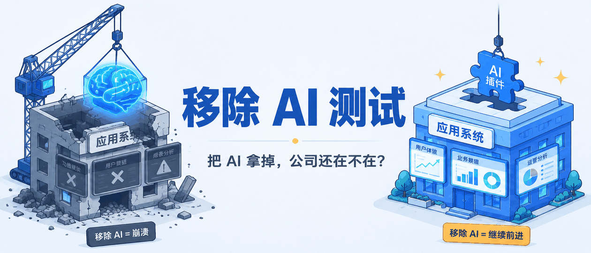
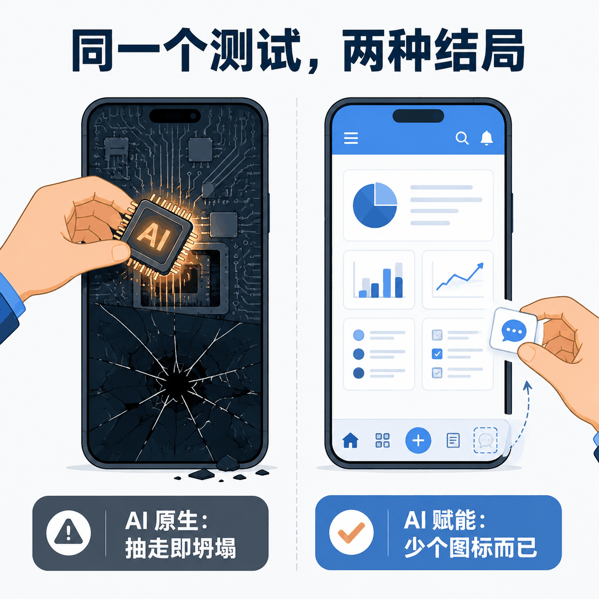
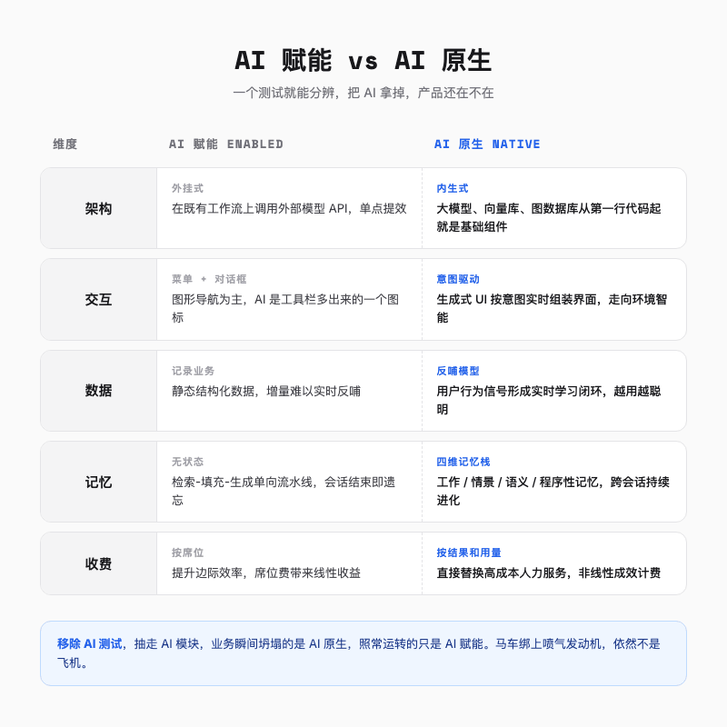
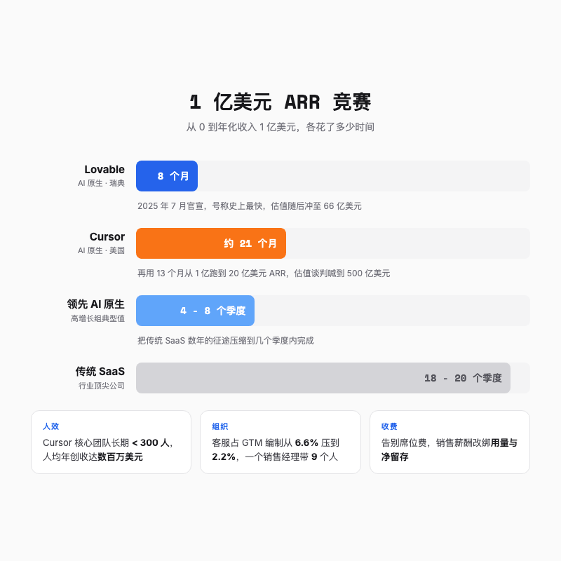
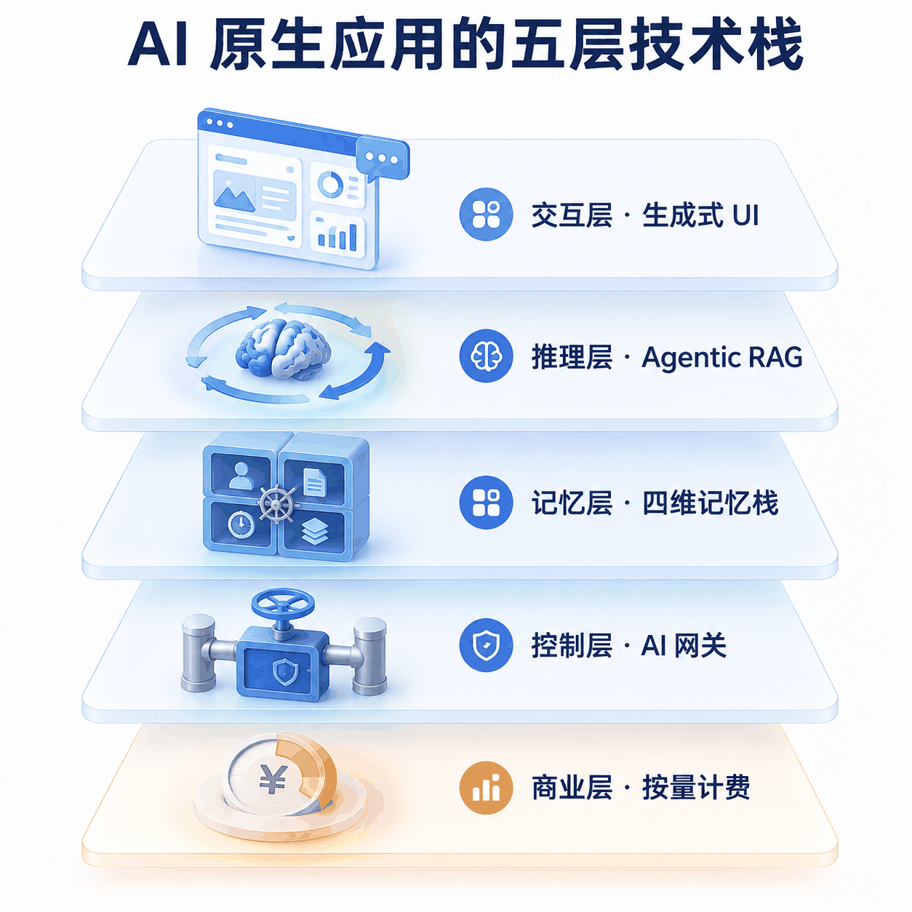
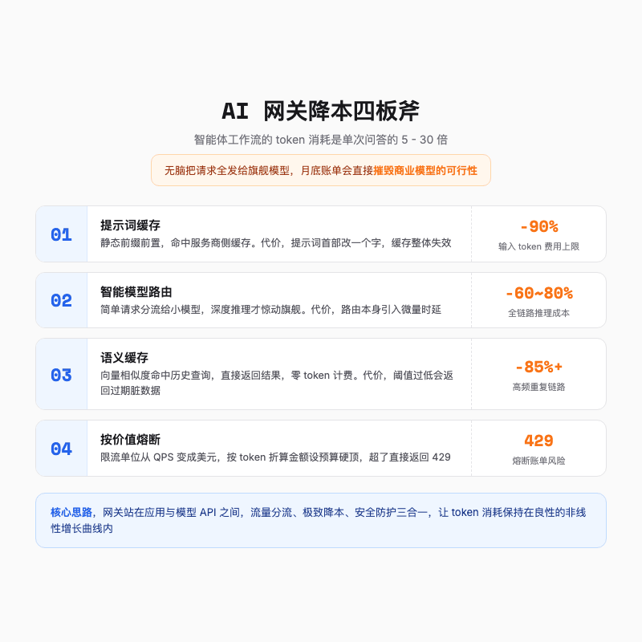
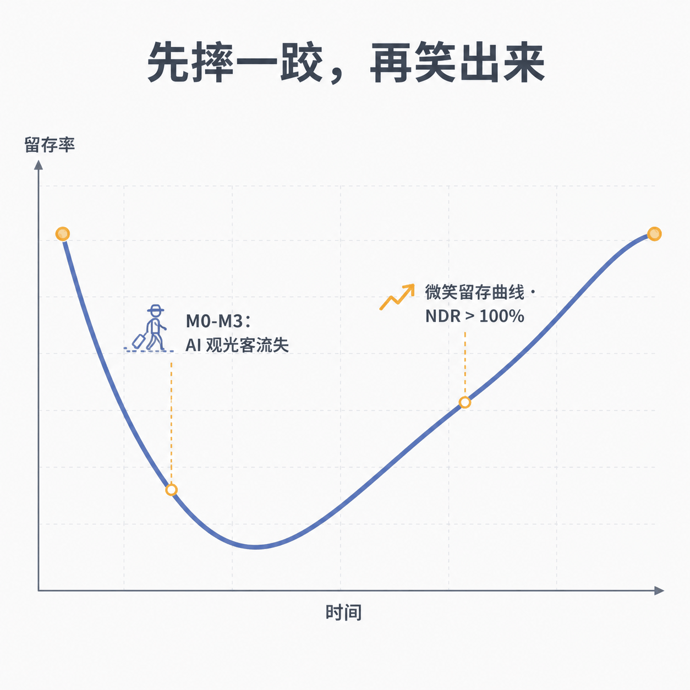

# AI 原生 vs AI 赋能，差的不只是一个对话框

> 同样的模型，差不多的 API，一批公司跑出了软件史上最快的增长，另一批公司只是给旧产品缝了个对话框。

---

## 一句话总结

判断一个应用是不是 AI 原生，不看它用了多强的模型，只看一件事，把 AI 拿掉，这家公司还在不在。

---

## 一、先把 AI 拿掉试试

2025 年 7 月，瑞典公司 Lovable 宣布年化经常性收入突破 1 亿美元，此时距离产品上线只过去了 8 个月。作为对照，传统 SaaS 时代最顶尖的公司，走完这段路平均需要 18 到 20 个季度。

也不是只有 Lovable 在跑。Cursor 从 0 到 1 亿美元 ARR 用了不到两年，从 1 亿美元到 20 亿美元，只花了一年出头。2026 年 2 月，它的年化收入站在 20 亿美元上，又过了两个月，估值谈判的价码喊到了 500 亿美元。

与此同时，另一批公司的故事完全不同。它们也接入了大模型，也在产品里加了 AI 对话框，有的还顺手把 logo 换成了渐变色，但增长曲线几乎没动。

**同样的模型，差不多的 API，差距不在模型上，在产品还没写出来之前的那个决定上。**

业界判断这个决定的方法叫「移除 AI 测试」，规则很简单。把系统里的 AI 模块完全剥离，如果业务模型和用户价值瞬间坍塌，它是 AI 原生。如果拿掉之后产品照常运转，它只是 AI 赋能。

拿 Cursor 做这个测试，抽掉模型之后剩下的是一个没人要的编辑器壳子，连语法高亮都轮不到它出彩。再拿那些加了 AI 助手的办公软件做一遍，关掉对话框，你照样写文档、做表格、开视频会议，AI 只是菜单栏里多出来的一个图标。

这个区别听起来像文字游戏，落到架构上就是两条完全不同的路。传统软件接 AI，像在马车上绑一台喷气发动机，短期内速度确实快了，但车架、轮子、车夫没有一个部件是为这种动能设计的。AI 原生应用则是从第一行代码开始，就把机器智能当作车辆本身的动力系统。

两者的差异可以压缩成一张小表。

| 维度 | AI 赋能 | AI 原生 |
| --- | --- | --- |
| 架构 | 外挂 API | 模型在核心层 |
| 交互 | 菜单和表单 | 意图驱动 |
| 数据 | 记录业务 | 反哺模型 |
| 收费 | 按席位 | 按结果和用量 |

表格只有四行，但每一行背后都是一次伤筋动骨的重构。后面几章，我把这张表逐行拆开看。

---

## 二、三种命运

过去两年，市场上其实同时上演着三个剧本。

**第一个剧本是新物种。**Cursor 的团队 Anysphere 从第一天起就没有「现有产品」可以改造，编辑器只是载体，真正的产品是模型推导需求、生成代码、跑测试、提 PR 的整套闭环。Lovable 更极端，用户输入一句话，它直接交付一个包含前端、后端和数据库的完整应用。这两家公司做的事情，在技术上叫「从思考工具变成制造工具」，用人话说，软件不再帮你干活，软件直接把活干完。同样的故事也发生在别的行业，做客服智能体的 Decagon 估值冲上 45 亿美元，做防伪安全的 Doppel 拿到了 a16z 领投的 7000 万美元。

**第二个剧本是存量转型。**Notion 是跑得最好的一个，它的 AI 不是外挂对话框，而是深度嵌进文档、表格和知识库的协同卡片。一年时间，Notion 的付费 AI 附加率从 20% 拉到 50% 以上，AI 专属收入撑起了公司整体 ARR 的半壁江山。这个剧本的门槛在于，你得有真实的高频工作流让 AI 嵌进去，不是每家公司都有。

**第三个剧本是防御性嫁接。**搜索引擎 Ecosia 每个月花约 30 万美元调用 Exa 的专有 AI 搜索，广告变现模式一点没改，换来了核心用户留存 5% 到 10% 的提升。这个钱花得值，但它本质上是给存量大盘买了一份保险，不是第二增长曲线。

三个剧本没有绝对的高下，但活法有讲究。防御性嫁接能活，前提是嫁接在自己已有的流量和场景上，Ecosia 就是沾了自有用户盘的光。真正危险的是纯套壳，没有专有数据，没有自有工作流，只把通用 API 包了一层皮的轻应用。大模型厂商随手一次更新，就能把它们的全部功能变成平台自带特性。

---

## 三、拆开看看，AI 原生应用肚子里有什么

如果只看产品界面，AI 原生应用和传统应用的差别似乎只是一个输入框。拆开架构看，里面是一整套五层技术栈，每一层都和老软件不一样。

**最上面是交互层。**传统 GUI 的所有页面都是提前硬编码的，而生成式 UI 是在运行时根据模型输出和用户意图动态组装的。你说一句「分析一季度销售趋势」，界面给你的不是一段干巴巴的文字，而是实时装配出来的仪表盘，带着过滤器、趋势图和可以直接编辑的报表卡片。这带来一个设计上的新难题，模型的输出是一个概率分布而不是确定结果，设计团队必须在模型运行之前就穷尽映射所有可能的输出形态，包括答得好的、答得差的和答非所问的。

对普通用户来说，这件事的意义很直白，同一个应用，在不同人手里、不同场景下，长得不一样。

**中间是推理层。**传统的检索增强生成是一条单向流水线，检索、填充、生成，用完即弃。智能体化 RAG（Agentic RAG）在这条管道上面加了一个会规划、会评估、会自我修正的控制回路，遇到没预设过的复杂任务，它能自己拆步骤、试路径、改方案。

**往下是记忆层，这是我最感兴趣的一层。**原因很私人，我自己折腾 AI 小工具的时候，死在记忆上的次数最多，上下文一长，它就开始一本正经地胡说八道。

AI 原生应用对这个问题给出的答案是把记忆分成四种，管理方式和人脑有点像。工作记忆像你的桌面，东西再多也受上下文窗口限制，占用率到 80% 就得立刻做摘要和关键信息提取，不能粗暴截断。情景记忆负责记录智能体每次决策的路径和结果，像飞机的黑匣子，90 天内随查随用，之后转入冷归档。

语义记忆存放客观事实和领域规则，用图数据库把实体和关系结构化存起来，避免向量相似度匹配带来的幻觉。最后是程序性记忆，可以理解为肌肉记忆，把业务流程建模成技能图谱，按使用频率和成功率动态调整权重，常用的留下，过时的淘汰。

记忆解决的是「记住」，数据飞轮解决的是「变好」。以 Cursor 为例，官方公开过它的做法，自研模型靠亿万次用户对建议的接受和拒绝持续训练。每个用户按下的每一次 Tab，都在替产品投票。这就是对比表里「数据」那一行的真正含义，传统软件的数据躺在数据库里记账，AI 原生软件的数据每天都在上班。

**再往下还有两层**，控制层和商业层。这两层值得单独说，因为一个管账单，一个管收入。

---

## 四、账单不会说谎

先说控制层。很多人没意识到，把大模型推进生产环境，最大的阻力不是技术，是账单。

智能体工作流的 token 消耗，和单次问答完全不是一个量级。一次业务流程里，智能体要反复自我规划、调度多个工具、出错还要重试，整体消耗是单次问答的 5 到 30 倍。如果把这些请求不加区分地全部发给旗舰模型，月底账单会直接摧毁商业模型的可行性。所以五层栈里的控制层，实体就是一个 AI 网关，站在应用和模型 API 之间，干四件事。

前两件事都是缓存，思路是把「重复的钱」省下来。系统提示词、长文档、few-shot 样本这些高度重复的内容，通过调整提示词结构让服务商侧缓存命中，输入 token 费用最高能砍掉 90%，代价是提示词开头改一个字，缓存整体失效。

语义缓存更激进，用户请求先转成向量，在内存数据库里查有没有语义相近的历史查询，命中就直接返回缓存结果，零 token 计费，响应压到亚百毫秒级，高频链路上能省 85% 以上，代价是阈值设低了，会把似是而非的过期答案当成正确答案返回。

第三件事是智能路由。网关对请求做复杂度分级，格式转换、简单分类这类活丢给便宜的小模型，只有深度推理、长文档审查才惊动旗舰模型。典型混合负载下，这一招能削掉 60% 到 80% 的推理成本。

最新鲜的是第四件事，按价值熔断。传统限流按 QPS 算，AI 网关按美元算，实时核算每个用户消耗的 token 折算成多少钱，标准版每小时 10 美元额度，企业版 100 美元，超了直接返回 429。限流的单位从「次」变成「元」，成本控制的颗粒度细到了每一块钱。

---

## 五、增长逻辑也变了

控制层管住了成本，商业层负责把效率变成收入。技术架构的变化，最终都会传导到财务报表和组织图上。

先看增长。高增长 AI 原生公司把 1 亿美元 ARR 的征途从 18 到 20 个季度压缩到 4 到 8 个季度，Lovable 甚至只用了不到 3 个季度。再看人效，Cursor 核心团队长期保持在 300 人以内，按年化收入和团队规模折算，人均年创收达到数百万美元，这在传统软件公司是不可想象的。

组织结构的变化更有意思。传统 SaaS 公司把一半以上的 GTM 编制压在销售上，AI 原生公司则把更多编制挪给了客户成功，客服人员的占比被压到极低，销售管理层也在缩编，一个经理带 9 个人。翻译一下，销售团队更小了，但每个留下来的人，对客户用量的责任更大了。

考核逻辑也在重写。按量计费的商业模式下，签约只是开始，用量才是收入。所以销售代表的薪酬从绑定合同金额，转向绑定客户后续的实际消耗和净留存。对 AI 原生公司组织结构的调研里有两个数字很能说明这种捆绑有多彻底，一个是 44% 的按量计费公司把客户成功团队直接并入了销售负责人的汇报线，客户用得多不多就是最直接的收入信号。另一个是收入运营团队普遍改向 CFO 汇报，近三成精力花在数据建模上，因为用量模式下的收入预测，比传统签约模式难得多。

还有一个新角色正在变得越来越贵，前线部署工程师（Forward-Deployed Engineer，FDE）。他们驻在客户现场，写生产级代码，做系统缝合，装配微型智能体，同时还得能和客户高管对话。Anthropic 和 OpenAI 给这类岗位开出的总包从 35 万美元到 120 万美元以上。不过业内也有清醒的警告，如果公司没有可复用的产品骨架，只靠堆驻场工程师做定制，就会滑向低毛利的 IT 咨询服务，被资本市场重新定价为外包公司。

最后是留存上的一个怪现象。AI 原生产品发布初期会涌来大量 AI 观光客，头三个月的流失非常陡峭。但穿过这波退潮之后，留下来的核心用户会画出一条微笑留存曲线，随着模型升级和数据积累，净留存率反弹到 100% 以上。老用户越走越值钱，这在传统 SaaS 里是稀有动物。

---

## 六、一个可以带走的测试

回到开头那个问题，差距到底在哪。

不在模型，不在融资额，甚至不在团队聪明程度。**差距在产品出生的那一刻，AI 到底是动力系统，还是装饰品。**

下次再看到一个号称 AI 驱动的产品，可以在心里做一遍那个测试。把 AI 拿掉，它的界面还在不在转，它的数据还在不在流，它的收入还在不在涨。三个问题的答案，比任何发布会 PPT 都诚实。

我自己拿这面照妖镜照过手机里的应用，结果挺扎心，真正离不开 AI 的没几个，大多数产品的 AI 功能，关掉之后我一个星期都想不起来。

也不用太纠结「AI 原生」这个词本身。就像今天已经没人强调某个产品是「互联网原生」或者「云原生」一样，这个标签迟早会过期，因为所有软件都会变成它描述的样子。到那天，这个测试也就不需要了，因为没什么可拿的。

在那之前，它是个不错的照妖镜。

---

欢迎关注我的公众号「Chyris Tech Note」，获取更多 AI 技术解读与实践分享。
