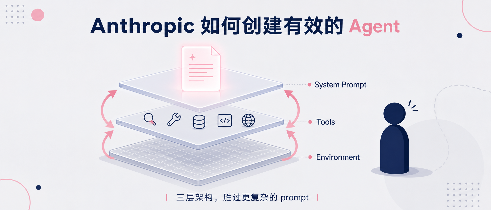
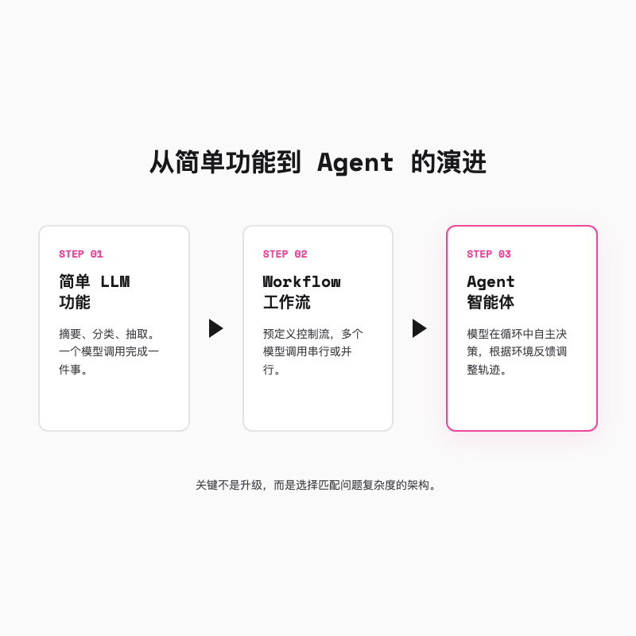
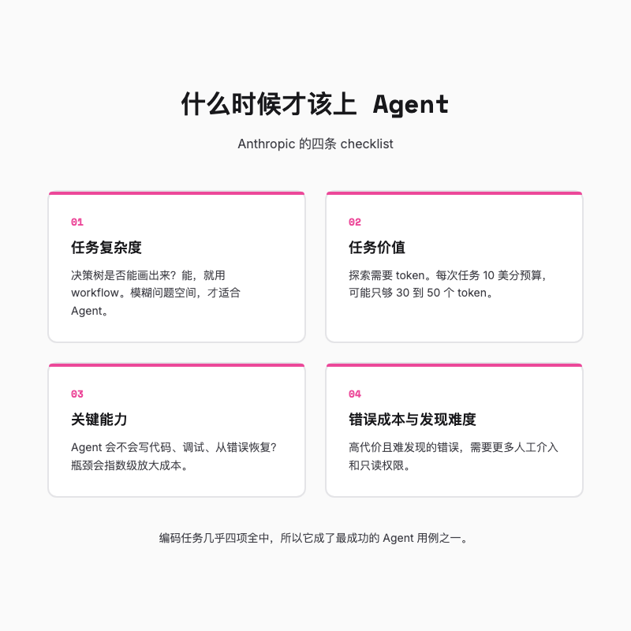
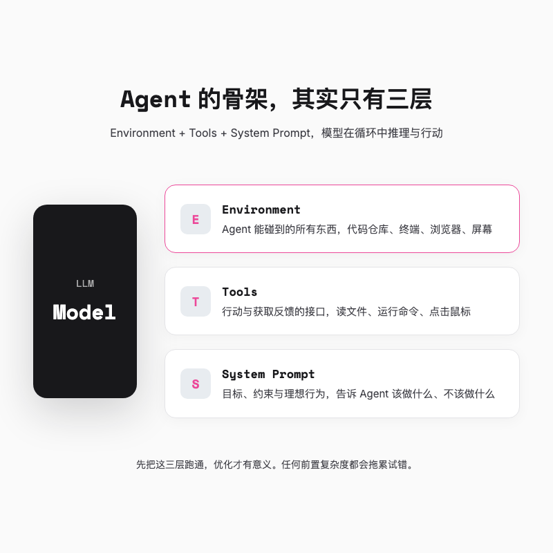
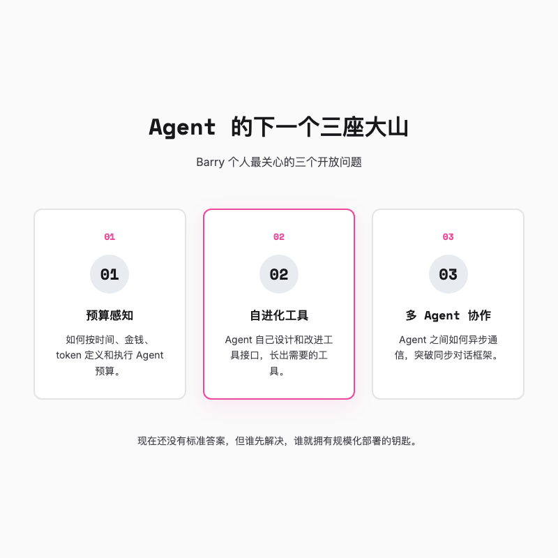

> Barry 在台上讲了 12 分钟，只说了三件事。不要什么任务都上 Agent，保持简单，像你的 Agent 一样思考。听起来像正确的废话，但拆开看，这三句话能解释为什么不少 Agent 项目做着做着就发现自己花了很多钱，却换不回稳定的输出。



---

## 一句话总结

有效的 Agent 来自分层架构，而不是把单个大模型做得更复杂。先判断任务值不值得用 Agent，再用 Environment、Tools、System Prompt 搭出最小循环。循环跑通之后，优化才有意义。

---

## 一、Agent 不是 workflow 的「下一代」

两三年前，大家做的都是最简单的那类 LLM 功能。摘要、分类、抽取。当时像魔法，现在已经是基操。

后来产品成熟了，一个模型调用不够，于是我们开始把多个模型调用串成预定义的控制流。这叫 workflow。它的好处是明确、可控、成本低。你可以精确控制每一步做什么，也能在成本和延迟之间做权衡。

再往后，模型能力更强，领域 Agent 开始真正进入生产。和 workflow 不同，Agent 能自己决定下一步怎么走，根据环境反馈几乎独立地运行。

Barry 把这条路径总结得很清楚。

> 简单 LLM 功能 → workflow → agentic system。

这不是版本号升级，而是三种不同的问题解决方式。workflow 适合你能把决策树画出来的场景，Agent 适合问题空间本身就很模糊的任务。

workflow 不够性感。它不会自己「思考」，不会给你惊喜，也不会在 demo 时让人眼前一亮。但它在生产环境里往往更可靠。你能预测它每一步会做什么，出了问题也知道去哪查。Agent 则相反，它更灵活，但也更像一个黑箱。灵活性是有价格的，价格是成本、延迟和不可预测性。

那什么时候 workflow 不够用了？当你发现预定义的流程覆盖不了所有情况，每个分支都需要写大量例外处理，或者用户请求的可能性空间太大，你根本不可能枚举完。这时才值得考虑把控制权交给 Agent。

很多人犯的错误，是拿着一个本可以用 workflow 解决的问题，硬要套一个 Agent 上去。结果得到一个循环调用模型、成本不可控、行为不可预测的系统，还美其名曰「智能体」，其实就是一个会烧钱的 while 循环。



---

## 二、别急着上 Agent，先回答这四道题

Anthropic 给了一个 checklist。四道题，答完就知道该不该用 Agent。

第一，**任务复杂度**。如果决策树你随手就能画出来，那就直接写成 workflow，把每个节点优化好。Agent 真正的舞台是模糊问题空间。

第二，**任务价值**。探索是要花钱的。Barry 举了个例子，如果你做一个高并发的客服系统，每次任务预算只有 10 美分，那只能支撑 3 万到 5 万个 token。这时候用 workflow 覆盖最常见场景，就能拿到大部分价值。反过来说，如果你第一反应是「我不在乎花多少 token，只要把事情做完」，那 Agent 可能适合你。

第三，**关键能力**。有没有明显的能力瓶颈会卡住 Agent 的轨迹。比如编码 Agent，它需要能写好代码、能调试、能从错误中恢复。如果有瓶颈，成本会指数级放大。通常做法是缩小范围、简化任务，再试一次。

第四，**错误成本和错误发现难度**。如果错误代价高且很难被发现，你就很难放心让 Agent 自主行动。一个能自动转账的 Agent 和一个只能读报表的 Agent，出问题后的后果完全不同。前者的错误可能是真金白银的损失，后者的错误可能只是少看了一行数据。可以通过只读权限、更多人工介入来缓解，但这也会限制 Agent 真正能铺开的空间。

我看完这四道题，第一反应是，很多团队想上 Agent 的项目，连第一道题都过不了。决策树明明能画出来，却非得上一个会自己「思考」的系统，结果思考出来的全是不确定性。

不过有四道题全中靶心的用例，那就是编码。从设计文档到 PR，任务模糊且复杂。代码价值高。模型本身擅长编码。最关键的是，输出可以通过单元测试验证。这也是为什么现在成功的编码 Agent 最多，从 Anthropic 自己的 Claude Code，到各路 SWE-bench 刷榜的方案，基本都在这个赛道。

一个有意思的旁证来自产品经理 Paweł Huryn 的实测。他拿同一个市场调研任务跑三种模式。workflow 是固定流程，读表格、查新闻、写邮件，一气呵成。agentic workflow 是多了一步编排层，但步骤还是预定义的。完整 Agent 则只给目标，让它自己决定查多少源、怎么组织报告。结果是 workflow 快约 2 倍、token 成本低约 12 倍。Agent 能在更复杂的任务上做到 100% 成功，但代价很明显。这个数字不是 Anthropic 给的，却和他们的判断完全对得上。



---

## 三、Agent 的骨架，其实只有三层

Barry 给了一个非常简单的定义。

> Agent 就是模型在循环中使用工具。

听着简单，但循环里得有东西让它循环起来。Barry 把它拆成三层。

Environment，就是 Agent 能碰到的所有东西。对 coding Agent 来说，是你的代码仓库、终端、测试 runner。对 computer use Agent 来说，是屏幕、浏览器、文件系统。

Tools，是 Agent 用来行动和获取反馈的接口。读文件、运行命令、点击鼠标，都是 tool。

System Prompt，则定义目标、约束和理想行为。

模型就在这三者之间转圈。先看环境，再决定调哪个工具，拿到反馈后再看环境，周而复始。

他们吃过复杂的亏。任何前置的复杂度都会拖累试错。先把这三层跑通，再谈优化。

Barry 提到，Anthropic 内部和客户的几个 Agent 用例，产品表面看起来完全不同，范围和能力也不同，但背后的代码骨架几乎一样。真正的设计决策只有两个，给 Agent 什么工具，以及给它什么 prompt。

这也对应了 Anthropic 那篇博客里的一个判断。框架能帮你起步，但也会遮住底层。很多生产团队最后会把框架剥掉，只保留核心循环。不是框架不好，而是当你知道自己在干什么的时候，框架反而成了中间商。



---

## 四、最小循环长什么样

说得再抽象，不如看一个最简化的伪代码。

```python
system_prompt = "你是一个 coding agent，目标是修复 issue"
tools = [read_file, run_test, edit_file]
environment = {"repo": "./my-project", "issue": "#123"}

while not task_done():
    state = observe(environment)
    action = llm.think(system_prompt, state, tools)
    result = execute(action)
    environment.update(result)
```

这就是全部。没有 orchestrator（编排器），没有 reflection layer（反思层），没有 memory module（记忆模块）。先让这五步跑通，再考虑加缓存、加并行、加子 Agent。很多项目反着来，先把框架搭得五花八门，最后发现核心循环里一个 tool 描述写错了，整个系统都在瞎转。

---

## 五、像 Agent 一样思考

这是最容易被忽略的一点。

我们习惯从自己的视角设计 Agent，然后在它犯错时感到困惑。Barry 的建议是，**把自己放进 Agent 的上下文窗口里**。

Agent 表现出的行为可以很复杂，但每一步本质上都是在有限的上下文里做推理。模型对当前世界状态的全部认知，可能就压缩在 10 到 20K token 里。这意味着它看不到你屏幕上的光标在哪，不知道你脑子里在想什么，也不记得三分钟前它自己为什么做了某个决定，除非那段历史被明确写进了上下文。

演讲里用一个 computer use 的例子让观众代入。假设你是一个 computer use Agent，你拿到的只是一张静态截图和一段写得不太好的描述。你有一组工具和一个任务。你可以思考、推理，但真正能影响环境的只有工具调用。

你尝试点击，但其实看不到实时反馈。模型推理和工具执行的那几秒，相当于你闭上眼睛在黑暗中操作电脑。等再睁开眼睛，可能一切正常，也可能系统已经被你关掉了。这是一个巨大的感知断层。

Barry 推荐做一个小练习。挑一个你的 Agent 任务，完全从它的视角走一遍。走完你会意识到 Agent 真正需要什么。屏幕分辨率、推荐动作、操作限制，这些上下文对它是救命稻草。

还有一个更实用的办法，**用 Claude 检查 Claude**。把 system prompt 丢给 Claude，问它哪些指令是模糊的。把 tool 描述丢给它，看它是否能正确使用。把整个运行轨迹丢给它，问它某个决策当时是怎么想的。

比如你的 tool 描述里写「读取用户请求的文件」，Claude 可能会反问，什么叫「用户请求的文件」？是用户明确提到的文件名，还是用户当前正在看的文件？这个模糊点不解决，Agent 每次调用这个 tool 时都在猜。

这不能替代你自己的理解，但能帮你站到 Agent 的角度看世界。


---

## 六、Barry 还没想清楚的三个问题

演讲最后 Barry 放了三个开放问题，也是他个人最关心的方向。

第一个是预算感知。相比 workflow，Agent 的成本和延迟更难控制。如何定义和执行预算，按时间、按金钱、按 token，现在还没有好答案。如果 Agent 跑到一半发现预算超了，它是该硬中断还是优雅收尾？是让它把半成品交出来，还是允许它再花一点 token 把任务闭环？大部分系统连这个问题都没想清楚。解决这个问题，Agent 才能真正大规模部署。

第二个是自进化工具。Agent 自己设计和改进工具接口，听起来很酷，但我怀疑短期内能真正落地。它意味着 Agent 不仅要完成任务，还要判断自己缺什么能力，然后长出新工具。这个 meta 能力一旦跑通，Agent 会通用很多，但也会更难预测。

第三个是多 Agent 协作。Barry 认为到今年年底，生产环境会看到更多多 Agent 系统。并行执行、职责分离，这些都是明显的好处。子 Agent 处理完子任务，只把结果摘要传回主 Agent，主 Agent 的上下文就不会被中间细节撑爆。但核心问题是，Agent 之间怎么通信。现在我们的系统基本围绕同步的用户助手对话构建，怎么扩展到异步通信和更多角色，是个大问号。

三个问题里，我最关心的是第一个。因为不管后面两个多漂亮，预算控制不住，就没法上线。



---

## 总结

Barry 在演讲结尾，回到了开头那三个判断。

不要什么任务都上 Agent。如果找到了合适的场景，尽可能长时间保持简单。迭代的时候，试着像 Agent 一样思考。

这三句话说到底就一个意思。Agent 好不好用，跟模型参数关系不大，关键是架构要清楚。任务边界、工具接口、提示词责任，这三件事分清楚了，输出才能稳定。分不清楚，就是花大钱买个抽奖机。

想清楚这三件事，Agent 才有机会从 demo 变成产品。想不清楚，就继续调 prompt 吧，反正模型下次更新的时候，你现在的 prompt 可能又废了。

视频源地址 ： https://www.youtube.com/watch?v=D7_ipDqhtwk  

---

欢迎关注我的公众号「Chyris Tech Note」，获取更多 AI 技术解读与实践分享。
