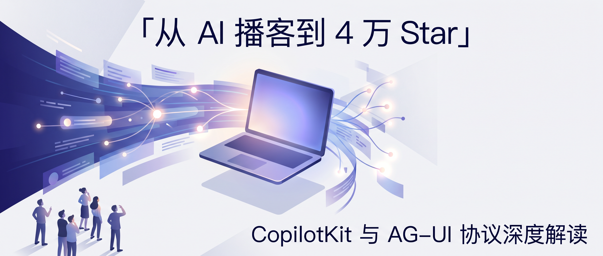
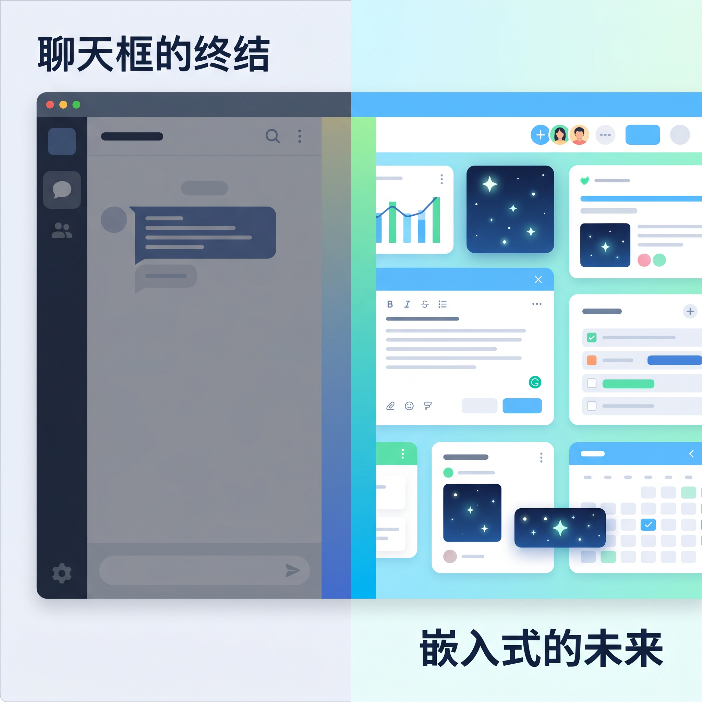
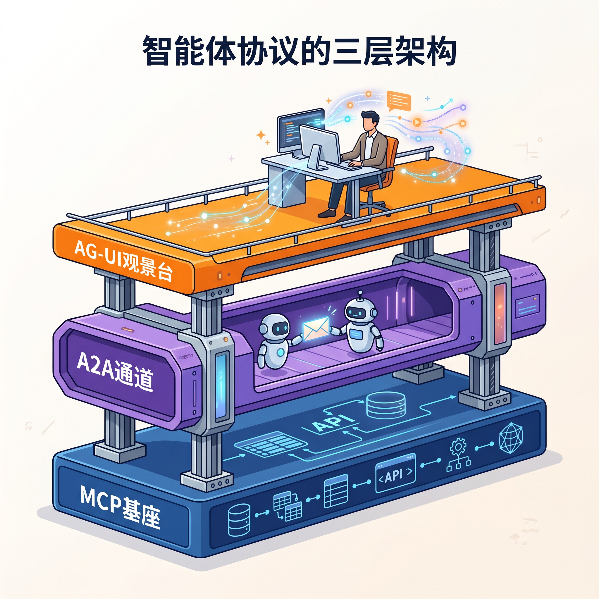
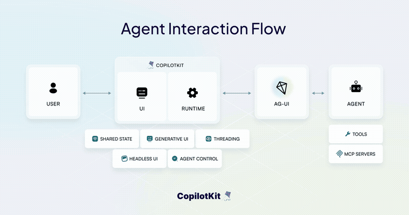
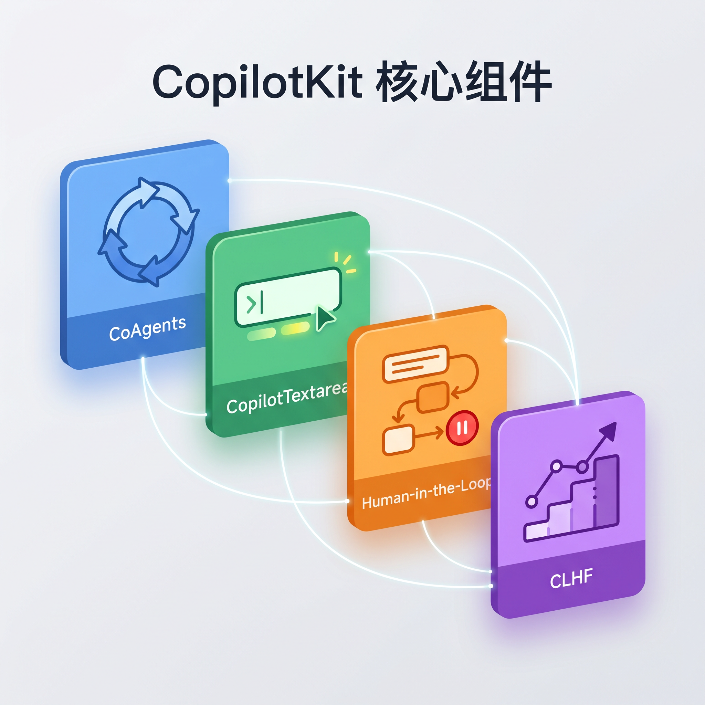
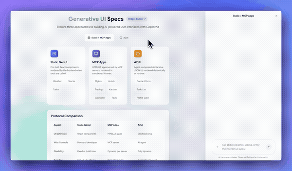
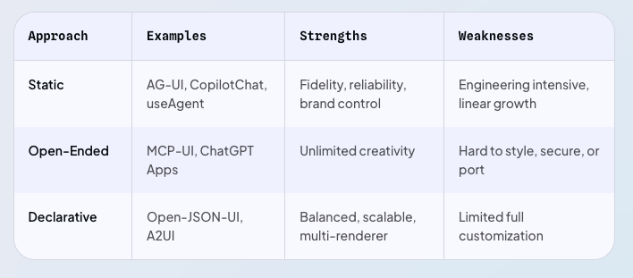
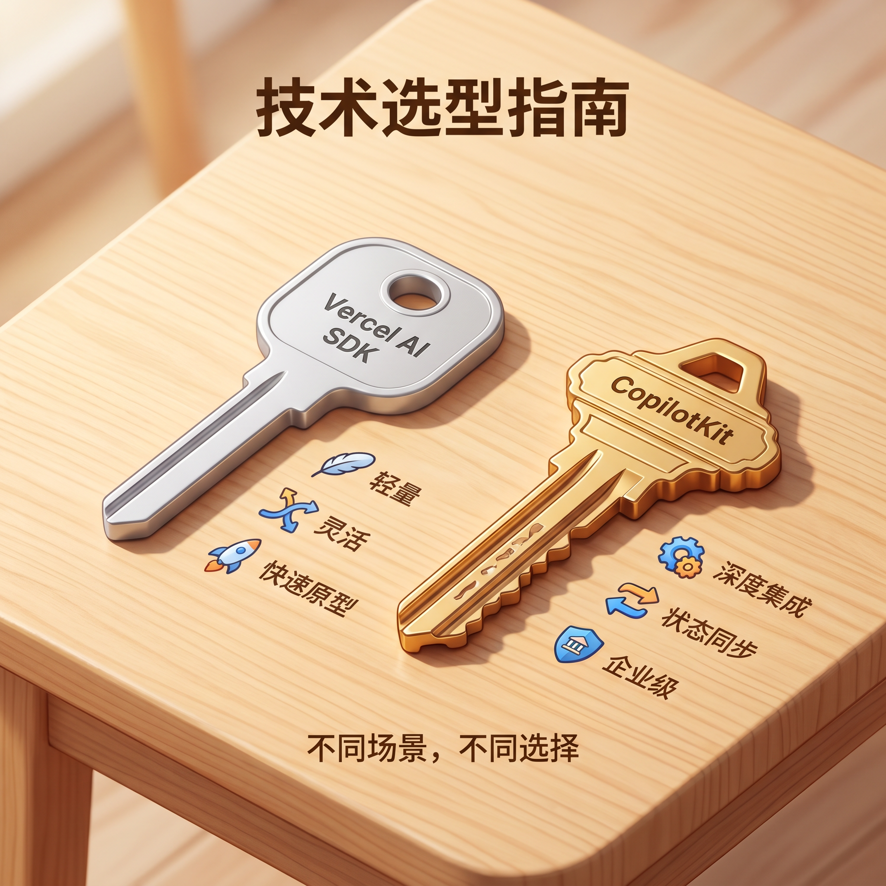
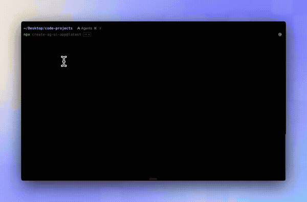

# 前端框架的下一站，让 AI 从聊天框里走出来

> 你有没有想过，为什么用了这么久的「AI 助手」，它始终是个孤零零的聊天框？你问一句，它答一段，然后你手动把答案复制粘贴回工作区。AI 和你真正在用的软件之间，隔着一条马里亚纳海沟。



---

## 一句话总结

**CopilotKit 是个开源框架，核心想法很简单，别让 AI 蹲在旁边当聊天框，让它直接混进你的工作流里，该出手时就出手。** 它提出的 AG-UI 协议，正在悄悄成为智能体时代人机交互的通用语言。

---

## 一个播客平台的意外转型

2023 年，以色列兄弟 Atai 和 Uli Barkai 在特拉维夫创立了一家公司，名字叫 Tawkit Inc.。他们的初心很朴素，做一款 AI 驱动的播客平台。但播客做着做着，他们发现了一个更大的痛点。

团队需要给自己的产品加上 AI 交互能力。他们发现，当时的前端框架对于「如何让 AI 深度融入应用界面」这件事几乎没有任何现成的解决方案。想要什么效果，都得从零开始写胶水代码。于是 Barkai 兄弟顺手写了一套内部工具，专门解决 AI 与前端 UI 的集成问题。

然后剧情发生了戏剧性转折。

这套内部工具被开源到 GitHub 后，反响出乎意料地热烈。开发者们的反馈让他们意识到，播客平台的市场需求可能远不及这套「前端 AI 基础设施」。Barkai 兄弟做了一个狠决定，**放弃播客业务，全身心投入前端智能体框架的开发**。公司更名为 CopilotKit，并入孵 Techstars Seattle 2023 加速器。

这个决定后来被证明是正确的。到 2026 年，CopilotKit 在 GitHub 上已经斩获 **4 万多个 Star**，有 **150 多名活跃贡献者**，每周下载量达到数百万次。超过半数的财富 500 强企业和全球 50 强企业已经在生产环境中用上了它的开源工具或企业级方案。客户名单里能看到 DocuSign、Cisco、Deutsche Telekom、S&P Global 这些名字。

**2700 万美元是什么概念？** 在 2023 年的 AI infra 赛道，这已经算是很硬的背书了。700 万美元种子轮加 2000 万美元 A 轮，投资方包括投过 Lyft 和 DoorDash 的 NFX，以及专注企业软件的 Glilot Capital Partners。DocuSign、Cisco 出现在客户名单里，说明它不只是开发者玩具，是真的有人在生产环境押注。

一个播客平台的副产品，居然成了 AI 时代前端基础设施的热门选手。Barkai 兄弟大概也没想到，解决自己的痛点，顺便解决了整个行业的问题。

---

## 为什么聊天框不是答案



现在打开任何一个号称「AI 原生」的 SaaS 产品，界面布局几乎是一个模子刻出来的。左侧是你的工作画布，右侧是一个聊天侧边栏。你需要 AI 帮忙时，得先停下手中的活，把上下文翻译成文字描述，丢进聊天框，等 AI 回复，再把回复内容手动搬运回你的工作区。

这个交互模式有一个根本性的悖论。**AI 明明是为提升效率而生的，但使用 AI 的过程本身却在不断打断你的工作流。**

CopilotKit 创始人在 A 轮融资中提出了一个很有意思的观察。人类智能的分布是「均匀而稳定」的，我们能处理各种任务，虽然不一定每项都顶尖。而 AI 智能的分布是「尖峰状」的，在某些特定任务上堪称超人，在另一些任务上却会出现幻觉和逻辑短路。

尖峰状的后果是，AI 在某些地方强得离谱，在另一些地方又蠢得让你想摔键盘。所以你不能把活儿全交给它，也不能让它在旁边干看着，得有个机制，让它在擅长的地方自动上，在不擅长的地方乖乖等人。

这就是**人和 AI 之间的「协作层」**。CopilotKit 的核心假设很简单，在真实的 SaaS 系统里，AI 不该蹲在旁边当聊天框，它应该混进你的工作流里，在需要的地方直接出手。

---

## AG-UI，智能体交互的通用语言

要理解 CopilotKit 的技术价值，得先理解它在整个智能体生态中的位置。

现在智能体行业的协议层，大致可以分成三块。虽然边界没那么绝对，但各自侧重的方向还算清楚。



第一层 MCP，Anthropic 搞的，管的是智能体怎么安全地接本地文件和数据库，你可以理解为「输入端」。

A2A 协议解决的是多个智能体之间怎么协作，像是智能体的「群聊协议」。

第三层 AG-UI 是 CopilotKit 牵头的，专门管智能体跑起来之后，怎么跟用户界面实时互动，也就是展现端。

三层凑齐了，智能体才算真正跑通。MCP 负责喂数据，A2A 负责智能体之间的协作，AG-UI 负责把这一切呈现给用户并接收反馈。



AG-UI 的设计思路挺聪明的。它不是那种笨重的 RPC 调用，而是走事件驱动，底层用 SSE 或 WebSocket 跑，每个流式响应被拆成一串有序的 JSON 事件。整个协议定义了 **17 种核心事件**，大致可以归成几类。

生命周期事件管的是智能体运行的边界，什么时候开始、什么时候结束、当前走到了哪一步。特别有用的是 STEP_STARTED 和 STEP_FINISHED，它们能把智能体的「思考步骤」直接展示给用户。用户等 AI 干活的时候，至少能看到「正在分析文档」「正在生成回复」这种进度提示，不至于对着空白屏幕干瞪眼。

文本消息事件管的是最基本的打字机效果，字一个个往外蹦。但它聪明在把「怎么显示」和「怎么传」拆开，前端想怎么渲染都行，不用被后端的传输节奏绑架。

工具调用事件可能是交互体验最丝滑的部分。AG-UI 支持工具调用参数的流式传输，参数还没完全生成完，前端就可以开始流式预填表单。用户看到的是一个逐步展开的界面，而不是等所有内容都到齐后才一次性弹出。

状态同步事件让前后端的状态保持一致。初始连接时下发一份完整的状态快照，之后用 JSON Patch 增量更新的方式只传变化的部分，数据量极小，却能保持毫秒级同步。这种设计让多人协作编辑场景成为可能，类似于 Google Docs 的实时同步体验。自定义事件给开发者留了一扇后门，可以在不修改协议标准的情况下扩展自己的业务逻辑。

说实话，第一次看这套事件设计的时候，我觉得有点过度工程化了。但仔细一想，如果以后真要在生产环境跑智能体，这些细粒度的事件确实能让前端做到很丝滑的反馈。用户不用盯着空白屏幕猜 AI 到底在干嘛，每个状态变化都有迹可循。

真正让 AG-UI 不一样的是，它把智能体框架与前端框架的对接问题从「M × N」变成了「M + N」。以前 LangGraph、CrewAI、Mastra 等 M 个后端框架要对接 React、Angular、Vue 等 N 个前端框架，每种组合都得写适配器。现在任何支持 AG-UI 的后端都可以无缝对接到任何 AG-UI 兼容的前端上。

目前，AG-UI 已经被 Google、亚马逊、微软、甲骨文等科技巨头，以及 LangChain、Mastra、Pydantic AI、Agno、LlamaIndex 等主流 AI 框架采纳并内置支持。

---

## CopilotKit 做了什么

AG-UI 是协议层，CopilotKit 是在协议之上构建的开发者套件，提供了 React、Angular、Vue 和 React Native 的 SDK，把复杂的协议细节封装成了几个简单好用的 Hook 和组件。



### CoAgents，前后端的无缝绑定

传统 AI 开发的一个老大难问题是，后端的工作流状态很难直接映射到前端 UI 上。CopilotKit 联合 LangChain 推出的 CoAgents 套件解决了这个问题。

通过 `useCoAgent` Hook，前端可以像操作 React 的 `useState` 一样与后端的 LangGraph 状态机深度绑定。

如果你需要更底层的控制，可以用 `useAgent` Hook 直接操控 agent 实例。

```typescript
const { state, setState } = useCoAgent("content_generation_agent");
```

这种同步是毫秒级的。当 LangGraph 智能体在云端运行并经过不同执行节点时，当前节点、中间状态和运行日志都会流式推送到客户端。前端开发者可以用 `useCoagentStateRender` 实时更新进度指示器或子任务列表。

说完状态同步这些「看不见」的机制，再来看看「看得见」的组件。

### Chat UI，开箱即用的聊天界面

CopilotKit 提供了一个开箱即用的 `<CopilotChat />` 组件，支持消息流式输出、工具调用和智能体响应。但它和普通的聊天框不一样，它深度嵌入了你的应用上下文，agent 能「看到」用户当前在操作什么，并据此调整回复策略。

### CopilotTextarea，智能输入组件

CopilotKit 里我最喜欢的一个小东西是 `<CopilotTextarea />`。它看起来就是个普通输入框，但背后接了 `useCopilotReadable` 钩子，能自动「看到」你应用里的上下文状态。

举个例子，在邮件客户端里，它能获知当前发件箱的内容、历史往来邮件乃至用户的个人设置，并在用户输入时流式提供智能的行内补全。它还自带悬浮编辑窗口，Mac 上按 Cmd+K、Windows 上按 Ctrl+K 可以调起悬浮编辑面板，对所选文本做流式总结、扩写或语气转换。

### Human-in-the-Loop，红线审批

完全自主的智能体在涉及敏感操作时，越权风险极高。CopilotKit 的 `renderAndWait` 机制可以在任意 Action 上设置审批卡点。

举个例子，智能体要帮用户转账 10 万块。这时候后端工作流自动挂起，前端弹出一个确认卡片，展示收款人、金额和手续费。用户点了确认，执行权才带着参数回到智能体。用户要是发现金额不对，直接在卡片上修改后再提交。整个过程不需要写额外的状态管理代码，AG-UI 的事件流自动处理了前后端的暂停、恢复和参数传递。

说完这些安全管控，再来看看 CopilotKit 怎么让 agent 自己长脑子。

### CLHF，越用越聪明

CopilotKit 还搞了个叫 CLHF 的东西，全称 Continuous Learning from Human Feedback，名字听着唬人，说白了就是「越用越聪明」。

原理不复杂。传统 AI 优化靠模型微调，又贵又慢。CLHF 的做法是实时收集用户在前端的行为信号，点赞、拒绝、手动编辑、审批时的参数修改，在学习容器里攒一攒，然后即时重写提示词。不用重新训练模型，交互精度就能随着使用慢慢往上爬。

CLHF 具体怎么运作？举个例子，你第一次用的时候，agent 给你的回复你点了「不太对」，系统就记下了。下次遇到类似场景，它会自动调整提示词里的措辞。用久了，它甚至能摸清楚你写邮件喜欢用正式语气还是口语化表达。所有偏好都跟着你的账号走，换台电脑登录也不会「失忆」。

### Generative UI，动态生成界面

CopilotKit 还支持一种叫 Generative UI 的模式，智能体可以根据用户意图和当前状态，在运行时动态生成和更新 UI 组件。



这在实际场景中很有用。比如用户说「帮我订一张去东京的机票」，智能体不需要返回一大段文字描述，而是直接生成一个带日期选择、价格对比和确认按钮的交互卡片。用户可以在卡片上操作，智能体根据操作结果继续推进流程。

CopilotKit 把这种 UI 生成方式分成了三类，从左到右越来越灵活。



最左边是静态 AG-UI 协议，智能体返回预定义的结构化 UI 组件。中间是声明式的 A2UI，智能体描述 UI 约束条件，前端负责渲染。最右边是最开放的 MCP Apps 模式，智能体直接操作开放的 JSON 结构，自由度最高，但也需要更多的前后端约定。

对于大多数 SaaS 产品来说，左边的静态模式已经足够用了。它简单、可控、易于调试。

### 同一个 agent，到处运行

CopilotKit 的多平台能力被很多人低估了。你写的同一个 agent，不仅可以跑在 Web 应用里，还可以一键部署到 Slack 和 Microsoft Teams 上。对于已经在用这些协作工具的企业来说，这意味着用户不需要打开一个新的网页，直接在熟悉的聊天频道里就能和 agent 交互，发消息、审批工作流、查看生成的 UI，所有体验都和 Web 端一致。

React Native 的支持也在路上了，以后同一个 agent 还能跑进移动端应用里。

---

## 选型指南，CopilotKit vs Vercel AI SDK

读到这儿你可能会问，那 Vercel AI SDK 呢？它不是也做 AI 前端吗？

没错，提到 AI 前端框架，Vercel AI SDK 是最常被拿来对比的。两者的根本差异在于对「应用层职责划分」的假设不同。



**Vercel AI SDK 的哲学是轻量化**。它聚焦于底层连接与流式输出管道，把 UI 呈现、状态管理和多端适配完全留给开发者。在快速试验、构建轻量级聊天机器人或极高定制化的文本生成流时，效率很高。

**CopilotKit 的哲学是深度集成**。它认为在真实 SaaS 系统中，流式拼接和状态管理是重复性极高的基础设施噪音。因此它从高层应用出发，直接向开发者暴露封装好的副驾 UI 控件和跨前后端的状态层。

两者的底层实现也有差异，混用的时候可能会踩坑。CopilotKit 用 GraphQL-Yoga 处理请求，Vercel AI SDK 走现代 Web 标准的流式响应，两套协议在同一个 Next.js 路由里会打架。目前的 workaround 是建双路由端点隔离运行，社区也在做桥接包，但这件事确实需要多花点心力。

**我的建议是**，如果你在做快速原型或轻量级聊天功能，Vercel AI SDK 更轻更快。但如果你正在给已有的复杂 SaaS 产品添加 AI 能力，需要前后端状态同步、人机审批、多平台部署等企业级能力，CopilotKit 能帮你省掉大量的胶水代码。

---

## 30 分钟搭一个 AI 副驾

说了这么多，不如看一行代码。

CopilotKit 的脚手架命令可以秒级拉起一个基础工程。

```bash
npx copilotkit@latest init
# 某些版本也可用 create
```

这个命令会创建一个集成了 Core 核心包与 React UI 库的完整项目，背后自动配置了 AG-UI 协议的事件流管道和前后端状态同步层。



如果你想更轻量地体验，可以直接替换项目里的 textarea 组件。

```tsx
import { CopilotTextarea } from "@copilotkit/react-textarea";

<CopilotTextarea
  textareaPurpose="撰写一封专业的商务邮件"
  placeholder="开始写邮件..."
/>
```

就这么简单。它会自动接入你应用中的上下文状态，在你输入时提供智能补全，选中文字后按 Cmd+K 还能调起编辑面板做扩写、润色或语气调整。

CopilotKit 和其他框架最大的区别，体现在你需要把 LangGraph 的后端工作流实时映射到前端 UI 的时候。其他框架里你需要自己写 SSE 连接、状态解析、增量更新、错误处理一整套代码。在 CopilotKit 里，这被封装成了几个 React Hook。

---

## 总结

CopilotKit 的起点并不宏大。

它只是两个做播客的创业者，在给自己产品加 AI 功能时发现前端缺了一块基础设施，顺手写了一套工具，开源出去，没想到火了。从播客平台到前端基础设施，这个转型没有什么顶层设计，就是一个团队在解决自己的问题时，恰好踩中了一个行业性的空白。

AG-UI 协议的价值也不需要拔得太高。它的作用很实在，给智能体和用户界面之间定了一套双向的、实时的事件语言，让后端和前端的对接从「每种组合都得写适配器」变成「支持协议就能互通」。Google、微软、亚马逊、LangChain、Mastra 都在支持者名单上，这说明行业里确实有这个需求。

对普通开发者来说，CopilotKit 最大的好处是把「给 SaaS 加 AI 能力」这件事的门槛降低了。你不需要从头写 SSE 连接、状态同步、错误处理，几个 React Hook 就能搭出一个像样的 AI 副驾。

所以回到开头那个问题。AI 和你真正在用的软件之间，确实还隔着一条沟。CopilotKit 搭了一座桥，桥不宽，有时候还会晃，但至少你不用再对着一个孤零零的聊天框发呆了。

欢迎关注我的公众号「Chyris Tech Note」，获取更多 AI 技术解读与实践分享。
