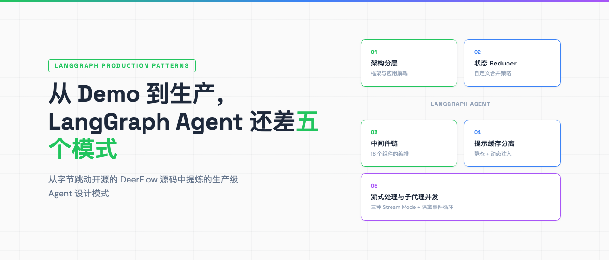
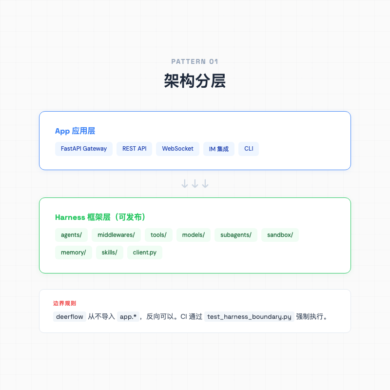
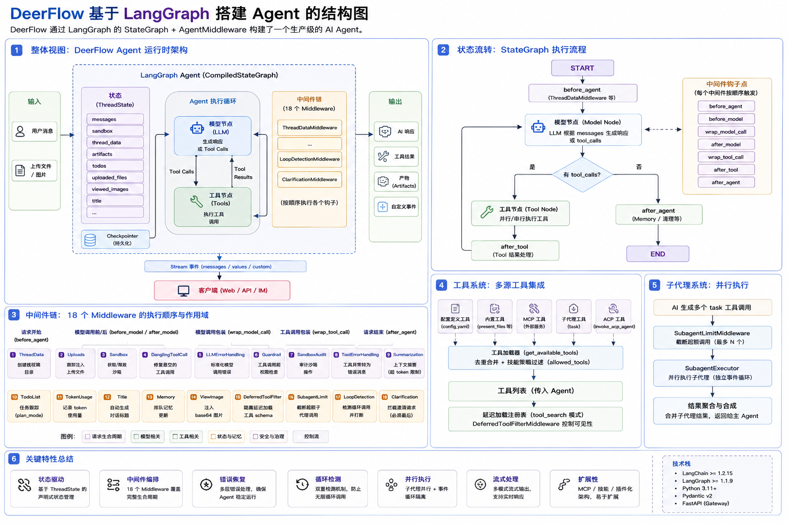
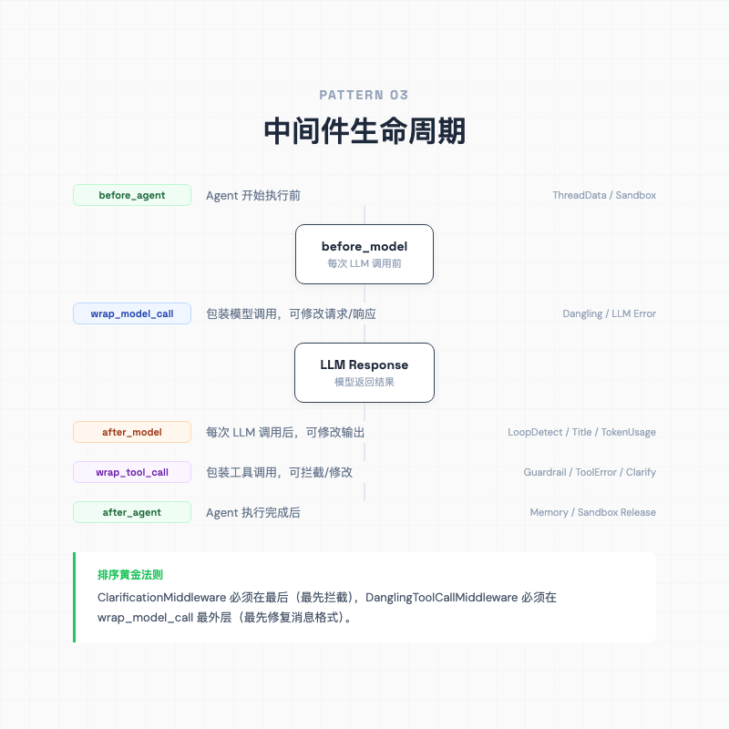
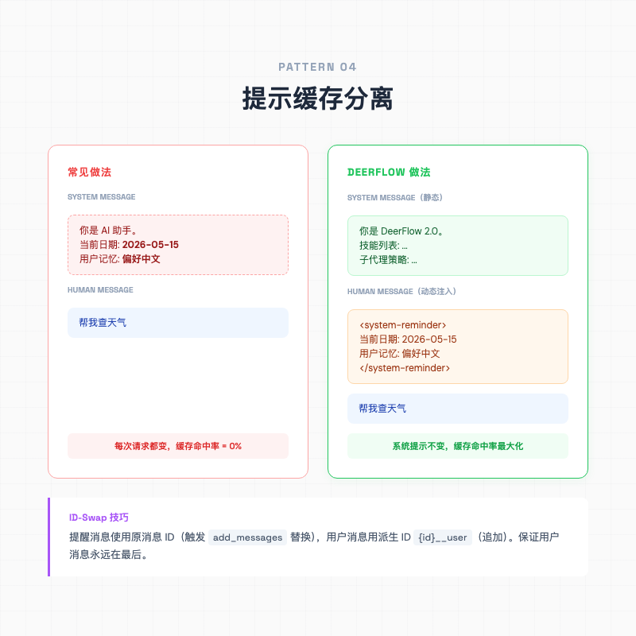

> 大多数 LangGraph 教程在「跑通一个 ReAct Agent」就停了。但真正的生产系统要面对的问题远不止调用 LLM 和工具。



---

## 一句话总结

从 DeerFlow 源码里扒出 5 个让 LangGraph 从 demo 变成生产系统的设计模式。

---

## Demo 能跑，然后呢？

写过一个 LangGraph demo 的人都知道那个「Aha Moment」。几十行代码就能让 LLM 调用工具、自动推理、循环执行直到任务完成。你会觉得, Agent 开发不过如此。

然后你把它放到真实环境里。用户中断了请求，消息历史里出现了没有配对的 `tool_calls`，下次调用直接 400。Agent 反复调用同一个工具 20 次，token 烧完了还在循环。三个子代理同时跑，把事件循环堵死了。

这些问题是 LangGraph 从「能跑」到「能用」之间必须填补的工程鸿沟。

DeerFlow 是字节跳动开源的一个基于 LangGraph 的 AI 超级代理系统。我花了两天读它的源码，发现了大量教科书不教的工程智慧。这篇文章从里面提炼出 5 个可以直接复用的 LangGraph 设计模式。每个模式都从一个具体的工程问题出发, 展示 DeerFlow 怎么解决，以及背后的 LangGraph 机制。

先从最不起眼但最基础的问题开始, 代码怎么组织。

---

## 01 / 把框架和应用拆干净



先看一个看似和 LangGraph 无关的问题, 你的 Agent 代码组织得怎么样？

大部分 LangGraph 项目会把 Agent 定义、工具注册、API 路由、配置加载全塞在一个文件里。跑 demo 没问题，但当你需要在不同环境（HTTP API、CLI、嵌入式 SDK）复用同一个 Agent 时，这种结构会变成噩梦。

DeerFlow 的做法是严格分两层,

```
backend/
├── packages/harness/deerflow/    # 可发布的 Agent 框架
│   ├── agents/                   # Agent 定义 + 中间件
│   ├── tools/                    # 工具系统
│   ├── models/                   # 模型工厂
│   └── client.py                 # 嵌入式客户端
│
└── app/                          # 应用层（不可发布）
    ├── gateway/                  # FastAPI API
    └── channels/                 # IM 平台集成
```

关键约束只有一条, `deerflow`（harness 层）从不导入 `app.*`，但 `app` 可以自由导入 `deerflow.*`。这条边界通过 `tests/test_harness_boundary.py` 在 CI 中强制执行。

这意味着 Agent 的核心逻辑（中间件、状态管理、工具注册）完全不依赖部署方式。你可以用 FastAPI 暴露 HTTP API，可以嵌入到另一个 Python 进程，也可以接入飞书或 Slack。

应用层有个值得说的组件, **RunManager**。它负责管理 Agent 执行的生命周期, 比如同一个对话同时来了两个请求怎么办。DeerFlow 提供了三种策略, `reject`（拒绝新请求）、`interrupt`（中断旧的保留当前状态）、`rollback`（中断并回滚到之前的状态）。`create_or_reject()` 用 `asyncio.Lock` 保证原子性，避免 TOCTOU 竞争条件。

一个用户消息从发起到响应的完整路径是这样的,

```
用户输入 → Gateway POST → RunManager.create_or_reject()
  → run_agent() 在 background asyncio.Task 中执行
  → make_lead_agent(config) 动态构建 Agent
  → agent.astream() LangGraph 执行
  → StreamBridge.publish() 事件推送到内存队列
  → SSE 消费者 subscribe() 前端实时接收
```

中间的 `StreamBridge` 是个事件总线，把 LangGraph 的输出（生产者）和前端 SSE 连接（消费者）解耦。后面的模式五会细讲它的去重机制。



最小 demo, 一个可复用的 Agent 包结构

```python
# my_agent/agent.py - 纯 Agent 逻辑，不依赖任何部署框架
from langchain.agents import create_agent

def make_agent(config):
    model = create_chat_model(config.model)
    tools = load_tools(config.tools)
    return create_agent(model=model, tools=tools, ...)

# my_agent/client.py - 嵌入式客户端
class AgentClient:
    def chat(self, message, thread_id):
        agent = make_agent(self.config)
        return agent.invoke(
            {"messages": [HumanMessage(content=message)]},
            config={"configurable": {"thread_id": thread_id}},
        )

# app/main.py - 应用层，可以换
from my_agent import AgentClient
app = FastAPI()
client = AgentClient(config)

@app.post("/chat")
async def chat(req):
    return client.chat(req.message, req.thread_id)
```

说白了，分层最大的好处是 Agent 逻辑不用启动 HTTP 服务就能测试，API 层可以随时替换成 gRPC、WebSocket 或任何你想要的协议。这块不展开讲了，DeerFlow 的 `test_harness_boundary.py` 值得直接去看。

---

## 02 / 用 Reducer 管好共享数据

LangGraph 的核心抽象是**状态图**（StateGraph）。图中的每个节点读取和更新共享状态，状态定义是理解任何 LangGraph 项目的第一步。

DeerFlow 的 `ThreadState` 扩展了 LangGraph 内置的 `AgentState`,

```python
class ThreadState(AgentState):
    sandbox: NotRequired[SandboxState | None]
    thread_data: NotRequired[ThreadDataState | None]
    title: NotRequired[str | None]
    artifacts: Annotated[list[str], merge_artifacts]
    todos: NotRequired[list | None]
    uploaded_files: NotRequired[list[dict] | None]
    viewed_images: Annotated[dict[str, ViewedImageData], merge_viewed_images]
```

`AgentState` 已经包含了 `messages` 字段，使用 LangGraph 内置的 `add_messages` reducer。DeerFlow 在此基础上加了 7 个业务字段。

这些字段看似简单，但有一个 LangGraph 中容易踩的坑, **当多个节点更新同一个 key 时，最终值怎么定？**

靠 **Reducer**。

`Annotated[list[str], merge_artifacts]` 告诉 LangGraph, 每当有节点往 `artifacts` 里写新值时，不要直接覆盖，而是调用 `merge_artifacts` 函数来合并。

```python
def merge_artifacts(existing: list[str] | None, new: list[str] | None) -> list[str]:
    if existing is None:
        return new or []
    if new is None:
        return existing
    # 去重同时保持顺序
    return list(dict.fromkeys(existing + new))
```

这个 reducer 的逻辑很简洁, 拼接两个列表，用 `dict.fromkeys` 去重保序。想象一下，主 Agent 和两个子代理同时在 `artifacts` 里写东西，像三个人同时往同一个 Google Doc 里粘贴内容——没有合并策略的话，后粘贴的直接覆盖前面的，你就丢了数据。

另一个有趣的 reducer 是 `merge_viewed_images`,

```python
def merge_viewed_images(existing, new):
    # 空字典是一个特殊信号, 清空所有已查看图片
    if len(new) == 0:
        return {}
    return {**existing, **new}
```

这里空字典 `{} ` 不表示「没有新数据」，而是一个语义信号, **清空所有已查看图片**。这种「哨兵值」设计在状态管理中很常见，但在 LangGraph 的 reducer 上下文中尤其有用，因为你无法传递「删除」操作，只能通过特殊值来触发。

**Reducer 选择的实践建议**

- 字段只被一个节点写入, 不需要自定义 reducer，默认覆盖就行
- 字段需要跨节点追加（如 artifacts）, 用 `Annotated[type, append_reducer]`
- 字段需要复杂合并逻辑（如去重、条件覆盖）, 写自定义 reducer
- 永远不要假设「只有一个节点会更新这个字段」，因为中间件也会修改状态

---

## 03 / 把横切逻辑织进 Agent 生命周期



前两个模式解决了「代码怎么组织」和「状态怎么管」，接下来这个模式解决的是「行为怎么控」。DeerFlow 用中间件链来做这件事。说实话，这块是我读源码时花时间最多的部分，因为 18 个中间件的编排逻辑确实复杂。

LangChain 的 `AgentMiddleware` 定义了 6 个钩子点，覆盖 Agent 执行的完整生命周期,

```
before_agent    →  Agent 开始执行前
  before_model  →  每次 LLM 调用前
    wrap_model_call → 包装模型调用（可修改请求/响应）
  after_model   →  每次 LLM 调用后
    wrap_tool_call  → 包装工具调用（可拦截/修改）
  after_tool    →  工具执行后
after_agent     →  Agent 执行完成后
```

DeerFlow 组装了 18 个中间件，按严格顺序排列。我挑三个最有生产价值的来讲。

### DanglingToolCallMiddleware, 修复「悬空」工具调用

你肯定遇到过这种情况, 用户发了一个请求，Agent 开始调用工具，但在工具返回结果之前，用户中断了请求（网络断开、超时、手动取消）。这时候消息历史里会出现一条 `AIMessage` 包含 `tool_calls`，但没有对应的 `ToolMessage`。

下次用户再发消息，LLM API 收到的消息序列变成了, `HumanMessage → AIMessage(tool_calls) → HumanMessage`。中间缺了 `ToolMessage`，直接 400 错误。

DeerFlow 的解法是在 `wrap_model_call` 钩子中扫描消息历史，自动补全缺失的 `ToolMessage`,

```python
class DanglingToolCallMiddleware(AgentMiddleware):
    def wrap_model_call(self, request: ModelRequest, handler):
        patched = self._build_patched_messages(request.messages)
        if patched is not None:
            request = request.override(messages=patched)
        return handler(request)
```

补全的方式是插入一条合成的错误消息,

```python
ToolMessage(
    content="[Tool call was interrupted and did not return a result.]",
    tool_call_id=tc_id,
    name=tc.get("name", "unknown"),
    status="error",
)
```

说白了，生产环境里消息历史就是不完整的。中断、超时随时发生，你必须在调用模型之前做格式修复。

### LoopDetectionMiddleware, 防止 Agent 跑飞

看到这个中间件的时候我差点拍大腿, 因为 Agent 陷入无限循环调用同一个工具，真的太常见了。你可能见过 Agent 反复读取同一个文件 20 次，或者一遍又一遍地执行同一个搜索。

DeerFlow 的 `LoopDetectionMiddleware` 用了两层检测。先用哈希, 对每次模型输出的 `tool_calls` 集合做哈希，在滑动窗口中跟踪。同一个哈希出现 3 次，注入警告提醒模型换策略。出现 5 次，直接清空 `tool_calls` 强制停止。然后看频率, 即使工具调用的参数不同（比如读了 40 个不同的文件），只要同一类型的工具被调用超过阈值，也会触发警告。

```python
def after_model(self, state, runtime):
    call_hash = _hash_tool_calls(tool_calls)
    history.append(call_hash)

    if count >= warn_threshold:
        # 在模型输出中追加警告，不中断执行
        return {"messages": [patched_msg_with_warning]}

    if count >= hard_limit:
        # 清空 tool_calls，强制 Agent 停止
        return {"messages": [stripped_msg]}
```

注意 `after_model` 钩子可以**修改模型输出**，包括清空 `tool_calls`。你不需要改 Agent 的核心逻辑，只需要在中间件层拦截就行。

### ClarificationMiddleware, 用 Command 中断图执行

还有一种情况你可能没想到, Agent 自己发现需要追问用户。当模型调用 `ask_clarification` 工具时，DeerFlow 不真的执行这个工具，而是通过中间件拦截它，返回一个 `Command` 来中断整个图的执行,

```python
class ClarificationMiddleware(AgentMiddleware):
    def wrap_tool_call(self, request, handler):
        if request.tool_call.get("name") != "ask_clarification":
            return handler(request)  # 非澄清工具，正常执行

        # 拦截, 返回 Command 中断到 END
        return Command(
            update={"messages": [tool_message]},
            goto=END,
        )
```

`Command(goto=END)` 是 LangGraph 中提前结束图执行的标准方式，比抛异常好的地方在于可以携带状态更新, 中断的同时把工具消息写进去。

**中间件排序的黄金法则**

DeerFlow 的 18 个中间件有严格的顺序要求。最关键的一条是, **`ClarificationMiddleware` 必须在最后**。按中间件的洋葱模型，最后一个注册的中间件最先拦截工具调用，确保它能最先拦截到 `ask_clarification`，不被其他中间件的 `wrap_tool_call` 逻辑干扰。

另一个重要顺序是 `DanglingToolCallMiddleware` 必须在 `wrap_model_call` 链的最外层，这样消息格式修复在所有其他处理之前完成。

---

## 04 / 把静态和动态拆干净



中间件这块还有很多细节，18 个中间件的完整排序和每个的实现可以在源码里看。接下来换个话题, 聊一个容易被忽视但影响真金白银的问题, 提示缓存。

大多数 LangGraph 项目会这样写系统提示,

```python
# 常见做法, 把所有信息塞进系统提示
system_prompt = f"""你是一个 AI 助手。
当前日期: {datetime.now().strftime("%Y-%m-%d")}
用户记忆: {load_memory(user_id)}
可用工具: {format_tools(tools)}
"""
```

问题是，每次用户发消息，系统提示都会变（日期变了、记忆更新了、工具列表不同了），LLM 提供商的**前缀缓存**就失效了。前缀缓存是一个巨大的性能和成本优化, 如果系统提示在所有请求之间保持不变，提供商可以缓存它的 KV 计算结果，后续请求直接复用。

DeerFlow 的做法是把系统提示**完全静态化**,

```python
def apply_prompt_template(...) -> str:
    return SYSTEM_PROMPT_TEMPLATE.format(
        agent_name=agent_name or "DeerFlow 2.0",
        soul=get_agent_soul(agent_name),
        skills_section=skills_section,
        # 注意, 没有日期，没有记忆
    )
```

那动态信息（当前日期、用户记忆）怎么注入？通过 `DynamicContextMiddleware` 在每轮对话中以 `<system-reminder>` 的形式注入到 `HumanMessage` 中,

```python
class DynamicContextMiddleware(AgentMiddleware):
    def _inject(self, state):
        if last_date is None:
            # 首次对话, 注入记忆 + 日期
            reminder = self._build_full_reminder()
            return {"messages": [reminder_msg, user_msg]}

        if last_date != current_date:
            # 跨午夜, 只更新日期
            return {"messages": [date_update_msg, user_msg]}
```

这里有个棘手的问题。动态上下文不能简单地追加一条 `HumanMessage`，因为那会改变用户消息的位置，可能影响 LangGraph 的消息处理逻辑。DeerFlow 用了一个精妙的 **ID-Swap 技巧**来解决,

```python
def _make_reminder_and_user_messages(original, reminder_content):
    stable_id = original.id or str(uuid.uuid4())
    # reminder 使用原消息的 ID（触发替换）
    reminder_msg = HumanMessage(content=reminder_content, id=stable_id)
    # 用户消息使用派生 ID（被追加）
    user_msg = HumanMessage(content=original.content, id=f"{stable_id}__user")
    return reminder_msg, user_msg
```

新的提醒消息「偷」了原用户消息的 ID，触发 LangGraph 的 `add_messages` reducer **替换**原消息。而真正的用户消息用派生 ID，被**追加**到后面。

最终效果是, 原来的一条 `HumanMessage("帮我查天气")` 变成了两条消息, `HumanMessage("<system-reminder>当前日期: 2026-05-15\n<memory>用户偏好: 中文回复</system-reminder>")` 和 `HumanMessage("帮我查天气")`。

**这个设计有三个收益**

1. **前缀缓存命中率最大化**, 系统提示在所有用户、所有请求之间完全相同
2. 动态信息不污染系统提示，记忆更新、日期变化不需要重新编译整个 Agent
3. 用户消息永远在最后一条，模型处理逻辑不受影响

---

## 05 / 流式处理与子代理并发

最后一个模式涉及两个紧密相关的问题, 怎么把 Agent 的执行过程实时推送给用户，以及怎么让子代理在后台安全地跑。

### 三种 Stream Mode 的配合

LangGraph 支持三种流式模式，DeerFlow 同时用了全部三种。最细粒度的是 `messages` mode，每出一个 token 就推一次，前端拿来做打字效果。粗一点的是 `values` mode，每执行完一个节点就推一次完整状态快照，用来更新消息列表、标题、产物列表这些 UI 元素。还有个 `custom` mode，通过 `StreamWriter.write()` 在任意时刻推送自定义数据，子代理进度通知就靠它。

DeerFlow 的 `DeerFlowClient` 同时订阅三种模式。从实现上看，`StreamBridge` 作为事件总线，把 LangGraph 的输出推到内存队列，前端通过 SSE 订阅消费,

```python
for item in self._agent.stream(
    state,
    config=config,
    stream_mode=["values", "messages", "custom"],
):
    mode, chunk = item

    if mode == "messages":
        # token 增量, 实时打字
        yield StreamEvent(type="messages-tuple", data={...})

    elif mode == "values":
        # 完整快照, 更新 UI
        yield StreamEvent(type="values", data={...})

    elif mode == "custom":
        # 自定义事件
        yield StreamEvent(type="custom", data=chunk)
```

同时用两种 mode 会带来一个实际问题, **同一条消息会被发送两次**。`messages` mode 已经推送了 AI 回复的每个 token，`values` mode 又会把完整的消息列表推一遍。

DeerFlow 的解法是用消息 ID 去重,

```python
seen_ids: set[str] = set()

for item in self._agent.stream(...):
    if mode == "messages":
        streamed_ids.add(msg_id)
        yield ai_text_event

    elif mode == "values":
        for msg in messages:
            if msg_id in streamed_ids:
                continue  # 跳过已推送的消息
            yield message_event
```

### 子代理的并发控制

DeerFlow 支持将任务委派给子代理并行执行。但并发不能无限, `SubagentLimitMiddleware` 在 `after_model` 钩子中截断超额的 `task` 工具调用,

```python
def _truncate_task_calls(self, state):
    task_indices = [i for i, tc in enumerate(tool_calls) if tc.get("name") == "task"]
    if len(task_indices) <= self.max_concurrent:
        return None  # 没超限，不干预

    # 只保留前 max_concurrent 个
    indices_to_drop = set(task_indices[self.max_concurrent:])
    truncated = [tc for i, tc in enumerate(tool_calls) if i not in indices_to_drop]

    # 用相同 ID 的 AIMessage 触发替换
    updated_msg = clone_ai_message_with_tool_calls(last_msg, truncated)
    return {"messages": [updated_msg]}
```

这里的技巧是, 修改 `messages` 列表中已有消息的 `tool_calls` 属性时保持相同的 `id`。LangGraph 的 `add_messages` reducer 看到 ID 相同，会**替换**而不是追加。

子代理在后台线程中执行，使用独立的持久事件循环避免与主循环冲突,

```python
_isolated_subagent_loop: asyncio.AbstractEventLoop | None = None

def _get_isolated_subagent_loop():
    loop = asyncio.new_event_loop()
    thread = threading.Thread(target=loop.run_forever, daemon=True)
    thread.start()
    return loop
```

为什么要隔离？因为 LangGraph 的 Agent 执行本身就在一个 asyncio 事件循环中。如果子代理尝试在同一个循环里创建新的 Agent 实例并执行，会导致 `RuntimeError: This event loop is already running`。每个进程维护一个隔离的守护线程事件循环，专门跑子代理任务。

---

## Demo 和生产之间差了什么

回到开头的问题。

Demo 和生产之间的差距不在 LLM 调用，不在工具注册，甚至不在提示词。差距在那些你看不见的地方, 中断后的消息修复、跑飞时的循环检测、并发写入的状态合并、系统提示的缓存策略、子代理的资源隔离。每一个在 demo 里都不会出现，但在真实用户量上来之后都可能让你的系统直接崩溃。

DeerFlow 的源码在 GitHub 上完全公开。读完之后最大的感受就是, 官方文档教的那点东西，离上线差得远。

---

## 最小复现 Demo

把三个核心模式塞进一个最小 Agent, 自定义 Reducer 做状态合并、循环检测中间件防跑飞、多模式流式输出。

```python
from langchain.agents import create_agent, AgentState
from langchain.agents.middleware import AgentMiddleware
from langchain_core.messages import HumanMessage, AIMessage
from typing import Annotated

# 自定义 Reducer, 去重合并
def merge_results(existing: list | None, new: list | None) -> list:
    if not existing: return new or []
    if not new: return existing
    return list(dict.fromkeys(existing + new))

class MyState(AgentState):
    results: Annotated[list[str], merge_results]  # 自动去重合并

# 循环检测中间件
class LoopGuard(AgentMiddleware):
    def __init__(self, max_repeats=3):
        self.history, self.max = [], max_repeats

    def after_model(self, state, runtime):
        tool_calls = state["messages"][-1].tool_calls
        if not tool_calls: return None
        h = str(sorted(tc["name"] for tc in tool_calls))
        self.history.append(h)
        if self.history.count(h) >= self.max:
            return {"messages": [AIMessage(content="检测到循环，已停止。")]}
        return None

agent = create_agent(model=model, tools=tools, middleware=[LoopGuard()], state_schema=MyState)

for mode, chunk in agent.stream({"messages": [HumanMessage(content="搜索 LangGraph")]}, stream_mode=["messages", "values"]):
    if mode == "messages" and isinstance(chunk[0], AIMessage) and chunk[0].content:
        print(chunk[0].content, end="", flush=True)
```

完整代码和更多模式可以在 DeerFlow 仓库找到, https://github.com/bytedance/deer-flow

### 怎么测, Fake LLM + 真实代码

生产级项目没有测试是不可能上线的。但 Agent 测试有个天然矛盾, 你不可能每次测试都调真实 LLM（贵、慢、不稳定），可如果 mock 太多又测不到真实逻辑。

DeerFlow 的做法很巧妙, **只替换 LLM，其他所有层都用真实生产代码**。它实现了一个 `FakeToolCallingModel`，预定义好两轮输出（第一轮输出 `tool_call`，第二轮输出最终文本），然后跑完整个 Agent 循环。

```python
class FakeToolCallingModel(FakeMessagesListChatModel):
    def bind_tools(self, tools, **kwargs):
        return self  # 不实际绑定

def build_single_tool_call_model(tool_name, tool_args):
    return FakeToolCallingModel(responses=[
        AIMessage(content="", tool_calls=[{"name": tool_name, "args": tool_args, "id": "call_1"}]),
        AIMessage(content="done"),
    ])
```

测试的时候直接拿它替换真实模型,

```python
async def test_setup_agent():
    model = build_single_tool_call_model("setup_agent", {"name": "test-agent"})
    agent = create_deerflow_agent(model=model, tools=[setup_agent_tool], ...)
    result = await agent.ainvoke({"messages": [HumanMessage(content="create")]})
    # 验证文件系统副作用, 不验证 LLM 输出
    assert config_path.exists()
```

这种「Fake LLM + 真实代码」的模式有两个好处, 零成本零延迟跑测试，同时覆盖了从中间件到工具执行到状态更新的完整链路。DeerFlow 的测试金字塔是, 底层 150+ 个中间件单元测试（纯 Mock，秒跑完），中层 20 个集成测试（内存数据库 + 文件系统），顶层 E2E 测试（Fake LLM + 真实代码）。

---

欢迎关注我的公众号「Chyris Tech Note」，获取更多 AI 技术解读与实践分享。
