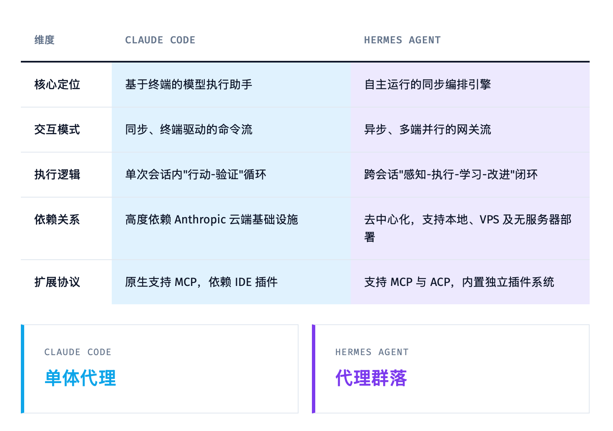
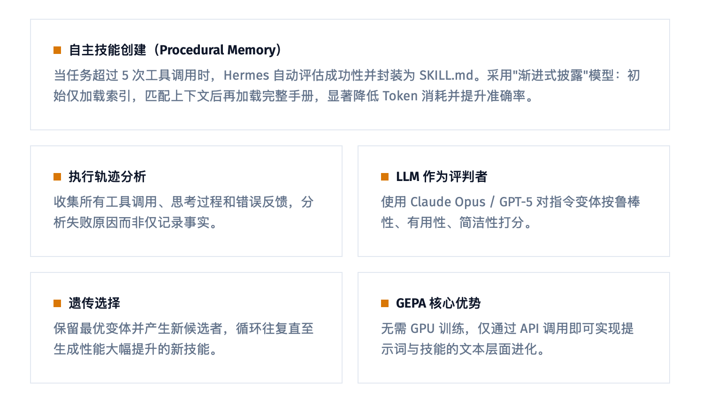
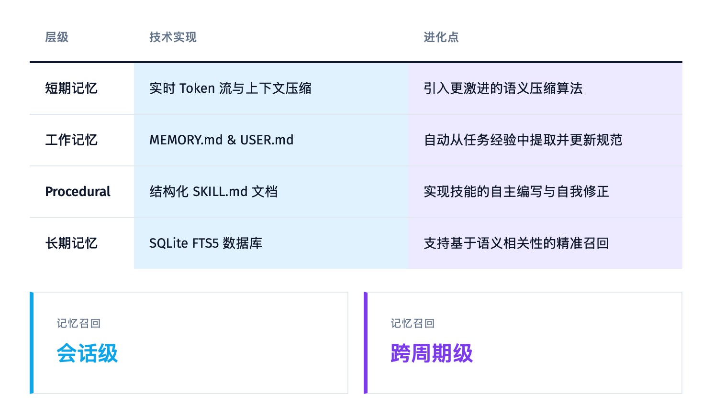
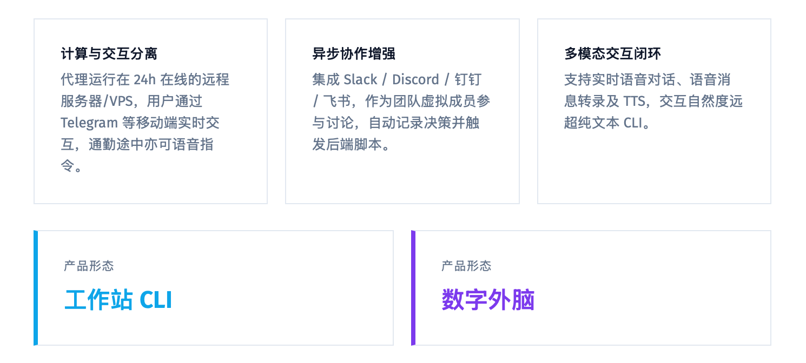
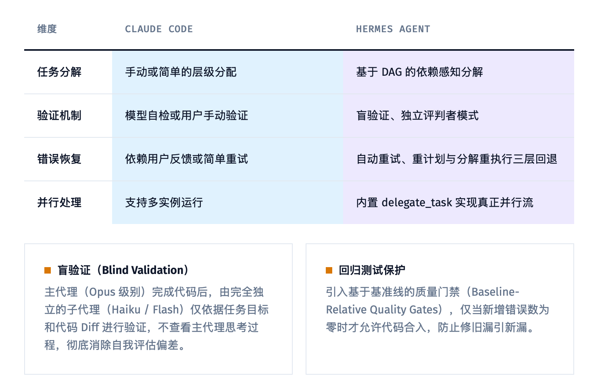
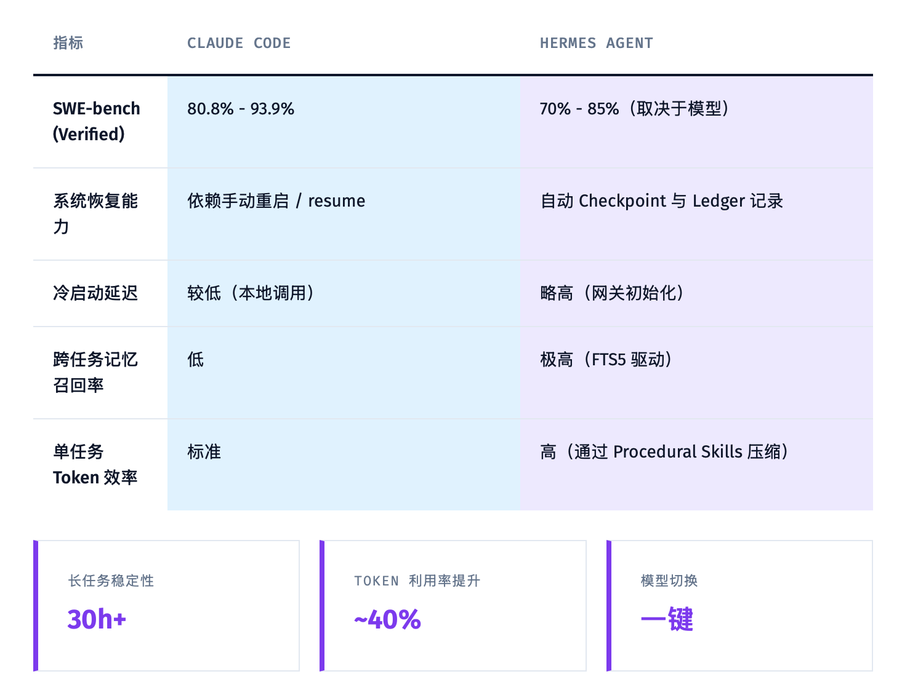
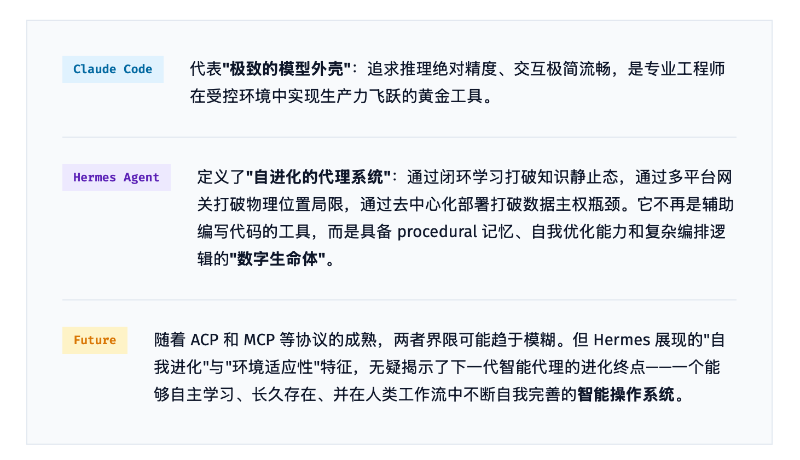

# Claude Code vs Hermes Agent：谁才是你的 24 小时"数字外脑"？

> 如果 Claude Code 是台顶级跑车，那 Hermes Agent 就是能自己进化的自动驾驶系统。

2026 年，AI 代理的主旋律已经变了。

不是 "模型有多强"，而是 **"Agent 离开你的视线后，还能不能自己长大"**。

Anthropic 的 Claude Code 依然是神级存在：推理精准、交互丝滑、SWE-bench 干到 93.9%。它就像一个满级工匠，你叫它干嘛，它就以满分手艺给你干完。

但另一边的 Hermes Agent，一个来自 Nous Research 的开源框架，走的完全是另一条路。它不满足于 "被调用"，它想要 **"自己活着"**。

两者的差别，不是功能清单的长短，而是底层哲学的分野：

**Claude Code = 极致的模型外壳。**
**Hermes Agent = 自进化的代理操作系统。**

这到底意味着什么？往下看。

---

## 01｜从 "单体代理" 到 "代理群落"

Claude Code 的核心是 "模型外壳"（Agentic Harness）。模型是决策中心，CLI 负责翻译执行。这种模式在单次会话里无敌，逻辑严密、高度可控。

但 Hermes Agent 干了一件事：**把 AI Agent 循环本身变成了核心同步编排引擎。**

它不再是被你按在终端里使唤的 "单体代理"，而是一个能 **持续在后台运行、自我管理、还能生出一堆子代理并行干活** 的 "代理群落"。

通过内置的 `delegate_task`，Hermes 可以生成带有隔离上下文和受限工具集的子代理。复杂任务被拆解成 DAG 图上的节点，下游代理基于上游的结构化数据接力，而不是靠自然语言传话。

**翻译成人话：Claude Code 是你请的一位顶尖私教，而 Hermes Agent 是一个能自己招小弟的工程队长。**

---

## 02｜它会自己写 "武功秘籍"

Claude Code 的记忆主要靠 `CLAUDE.md` 和 Auto-memory。本质上，它记住的是你告诉它的规范。

Hermes Agent 不一样，它有个 **"闭环学习系统"**。

当一项任务超过 5 次工具调用并成功后，Hermes 会自动把这个过程封装成一份结构化的 SKILL.md。里面不仅有操作步骤，还有踩过的坑和验证方法。

更变态的是 GEPA（遗传-帕累托提示进化）。它不需要 GPU 微调，而是靠 API 调用就能对系统提示词和技能文件进行 **"文本层面的进化"**。

第一周要重试好几次的部署任务，第四周可能因为技能被自动优化而一次性搞定。

**这不是记忆，这是成长。**

---

## 03｜记忆：从 "会话级" 到 "跨周期级"

用 Claude Code 的人都知道，新会话经常像 "间歇性失忆"。虽然有 `/resume`，但本质上每次对话还是一块块孤岛。

Hermes Agent 直接把记忆干成了 **持久化知识库**：

- **SQLite + FTS5**：所有历史对话存在本地，秒级检索数周前的设计决策。
- **动态用户建模**：通过 Honcho 插件，它能记住你的沟通风格、技术偏好、常用库，自动维护一份 `USER.md` 画像。
- **渐进式披露**：Skills 不是一次性全塞进上下文，而是先给索引，匹配上了再加载完整手册，Token 省一大半。

**换句话说：Claude Code 是你每次见面都要重新自我介绍的同事，而 Hermes 是那个知道你喝几分糖、习惯先写测试再写代码的老搭档。**

---

## 04｜交互：从 "工作站 CLI" 到 "数字外脑"

Claude Code 的假设是：你坐在电脑前，打开终端，开始工作。

Hermes Agent 说：**凭什么？**

它内置了 15 个以上平台的网关：Telegram、Discord、Slack、WhatsApp、企业微信、钉钉、飞书、Home Assistant……

这意味着代理可以跑在 24 小时在线的 $5/月 VPS 上，你通勤时发条语音消息，它就能帮你做服务器巡检或代码审查。集成到 Slack 里，它就是团队的虚拟成员，自动记决策、触发脚本。

计算和交互彻底分离，**这才是真正的 "数字外脑"**。

---

## 05｜多代理编排 + 盲验证：怎么防止 AI 骗自己？

AI 写代码最怕什么？幻觉、自我欺骗、修旧 bug 引新 bug。

Claude Code 的验证主要依赖模型自检或用户手动确认。Hermes 则搞了一套 **"实现与验证分离"** 的机制：

- **盲验证**：主代理（比如 Opus）写完后，系统会生成一个完全独立的子代理（比如 Haiku），只看任务目标和代码 Diff，不看主代理的思考过程，单独做验证。
- **回归测试保护**：引入 Baseline-Relative Quality Gate，只有新增错误数为 0，才允许代码合入。

这就避免了 "我自己写的代码，我自己吹" 的评估偏差。

---

## 06｜性能对比：跑分不是唯一指标

单看 SWE-bench，Claude Code 的 93.9% 依然碾压。但如果你看 **系统性效能**，Hermes 有自己的主场：

- **长任务稳定性**：30 小时以上的自主任务，Hermes 靠状态持久化和崩溃恢复，成功率更高。
- **Token 利用率提升约 40%**：并行子代理 + Procedural Skills 压缩上下文。
- **模型切换无感化**：复杂架构设计用 Opus，琐碎清理切 Qwen，成本和质量自己把控。

---

## 你站哪边？

如果你要的是 **"在受控环境下，一次对话打出极限输出"**，Claude Code 仍然是黄金工具。

但如果你想要一个 **"会自己学习、7×24 小时在线、记得住你习惯、还能自己部署在 $5 VPS 上替你干脏活累活"** 的数字生命体，Hermes Agent 展示的才是下一代 Agent 的终局形态。

**最后问你一句：你更愿意当 AI 的老板，每次亲自下指令；还是拥有一个越来越懂你、越来越强的 "数字副驾"？**

---

*参考资料：Nous Research Hermes Agent 技术文档、Anthropic Claude Code 官方博客*
