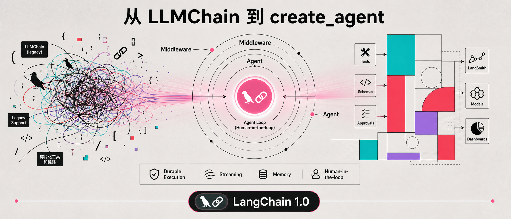
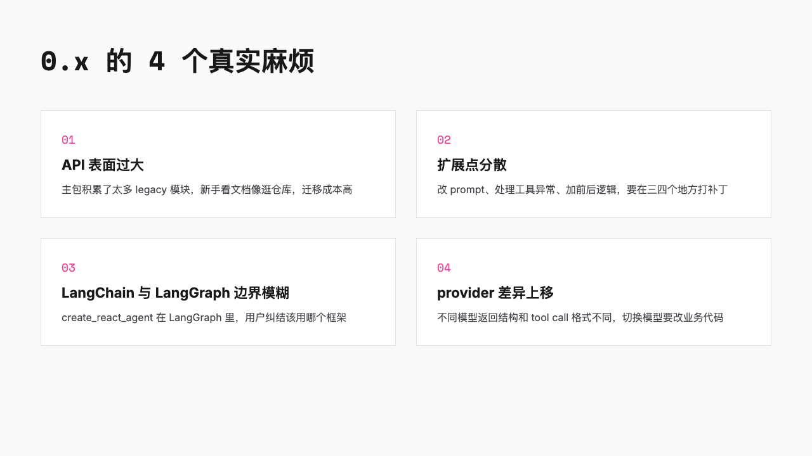
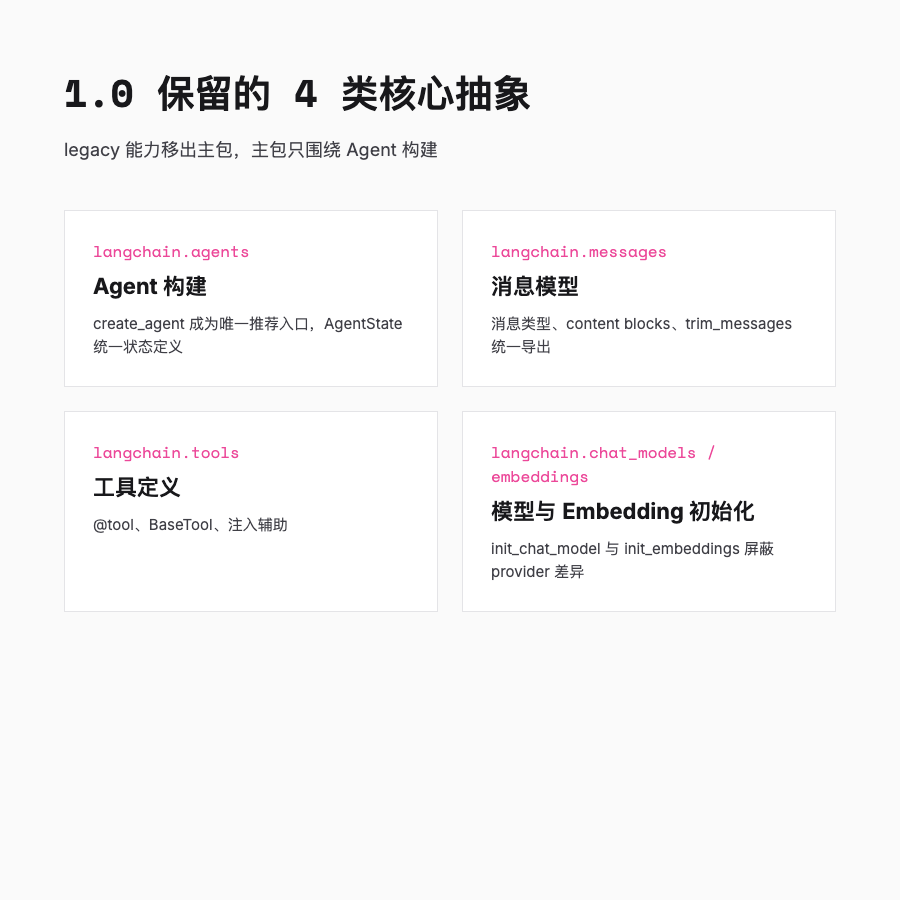
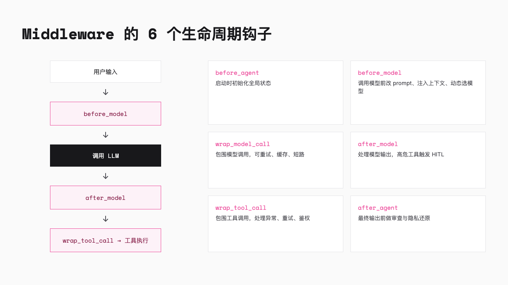
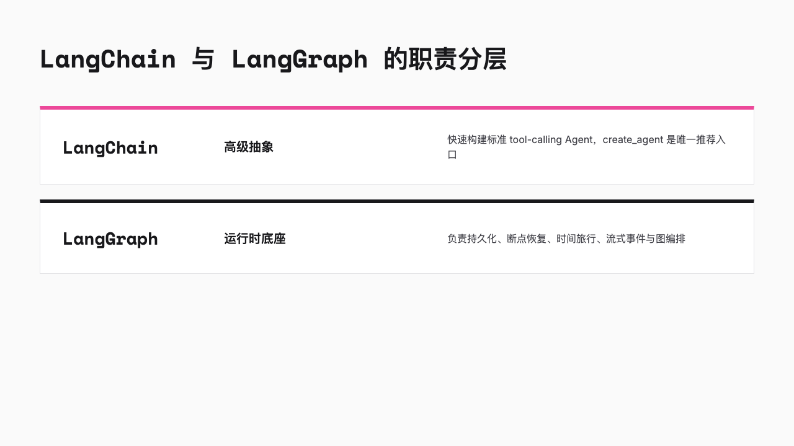
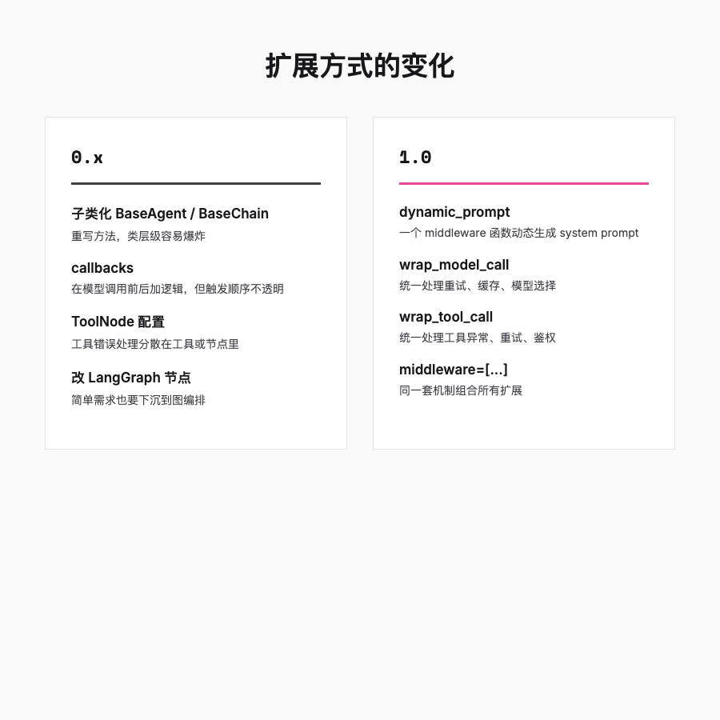

# 从 LLMChain 到 create_agent，LangChain 1.0 把主包削成了 4 个核心抽象

> 去年写的 `LLMChain` 代码今年 import 报错，新同事还在问「LangChain 和 LangGraph 到底用哪个」，而官方文档已经悄悄把答案改成了同一句话。



---

## 一句话总结

**LangChain 1.0 没想着加功能，而是在砍主包。** 砍完只剩四类东西，扩展全走 middleware，底层循环直接交给 LangGraph。实际写起来，更像是把几个 middleware 往 `create_agent` 里一塞，而不是继承 `BaseAgent` 写一堆子类。

---

## 0.x 年代，LangChain 是个什么都要的工具箱

2022 到 2024 年，如果你用 Python 写 LLM 应用，大概率绕不开 LangChain。

它像个巨大的工具箱，`LLMChain`、`RetrievalQAChain`、`ConversationalRetrievalChain`、`AgentExecutor`、`PromptTemplate`、`Memory`、`Hub`、`CacheBackedEmbeddings` 全塞在主包里。想要什么，伸手进去掏，总能掏到一个能用的类。

但这种「大而全」很快就带来几个真实的麻烦。

**API 表面太大。** 新手看文档会有一种逛宜家仓库的感觉，每样东西都长得像解决方案，但不知道哪件适合自己。迁移成本也高，小版本更新经常动到公共接口。

**扩展点又太分散。** 想动态改 system prompt，要重写 prompt template；想处理工具异常，要配 ToolNode 或在工具里 try-catch；想在模型调用前后加逻辑，要写 callback 或继承 `BaseAgent`。同一个需求，可能要在三四个不同的地方打补丁。

**LangChain 和 LangGraph 的边界也模糊。** `create_react_agent` 明明在 `langgraph.prebuilt` 里，功能却越来越像 LangChain 该干的事。用户经常被一个问题困住，「我该直接用 LangChain，还是跳去 LangGraph？」

**最麻烦的是 provider 差异被推到上层代码。** OpenAI、Anthropic、Google 的模型返回结构、tool call 格式、结构化输出接口都不一样。切换模型时，业务代码往往要改。

这些问题加在一起，让 0.x 的 LangChain 很像一大团聪明的胶水代码。它能粘住几乎所有东西，但粘得越多，拆起来越疼。



---

## 1.0 的减法，从「无所不能」到「只做好 Agent」

2025 年 10 月左右，LangChain 发布 1.0，和 LangGraph 1.0 同步上线。官方没有堆新功能，反而做了一件反直觉的事，**把主包削薄了**。

`LLMChain`、`ConversationChain`、Retriever、Indexing、Hub、CacheBackedEmbeddings 这些 legacy 能力被移到一个叫 `langchain-classic` 的包。主包 `langchain` 只保留 4 类核心抽象。

保留下来的是 4 类核心抽象。

`langchain.agents` 管建 Agent，`create_agent` 成了唯一推荐入口，`AgentState` 统一状态定义。

`langchain.messages` 管消息模型，导出消息类型、content blocks 和 `trim_messages`。

`langchain.tools` 管工具定义与调用，包括 `@tool`、`BaseTool` 和注入辅助。

最后一类是模型与 Embedding 初始化，`langchain.chat_models` 里的 `init_chat_model` 和 `langchain.embeddings` 里的 `init_embeddings` 一起屏蔽 provider 差异。

你会发现留下的全是构建一个标准 Agent 最小必要的拼图，多一个都嫌多。LangChain 不再想当 LLM 应用的「百货商店」，它只想当好一件事，**快速构建标准 Agent**。

`create_agent` 成为唯一推荐入口。你不再需要纠结 `AgentExecutor` 和 `create_react_agent` 该选哪个，也不再需要为了写一个标准 tool-calling Agent 去碰 LangGraph 的节点和边。

需要精细控制的时候，再下沉到 LangGraph。不需要的时候，几行代码就能跑起来。

但模块搬家只是表象。**真正让它立得住的，是 middleware。**



---

## Middleware 是 1.0 真正的灵魂

如果只是把模块搬家，那 1.0 不过是一次清理仓库。真正让这次升级有架构味道的，是 **Middleware（中间件）** 机制的引入。

我看完迁移文档后的第一反应是，官方终于不想再用「继承 + callback + 改 LangGraph 节点」这三件套来教用户扩展 Agent 了。他们把 Agent 循环里那些横向需求，全部抽成了 middleware。

0.x 扩展 Agent 行为的方式很零散。改 prompt、改模型、处理工具错误、做人工审核、管理 token、脱敏隐私数据，每种需求都有一套自己的玩法。1.0 把这些「横切关注点」统一抽象成一组在 Agent 循环关键点插入逻辑的钩子。

`create_agent` 的默认循环可以简化成下面这样。

```
[用户输入]
    ↓
[before_model]  ← 改 prompt、注入上下文、动态选模型
    ↓
[调用 LLM]
    ↓
[after_model]   ← 处理模型输出、修改响应、记录日志
    ↓
  ├─ 工具调用 → [wrap_tool_call]  ← 处理工具异常、重试、鉴权
  │                ↓
  │             [工具执行]
  │                ↓
  └─ 最终答案 → 返回
```

Middleware 在这个循环的 6 个位置提供钩子，before_agent、before_model、wrap_model_call、after_model、wrap_tool_call、after_agent。多个 middleware 可以像洋葱一样一层层包在 Agent 外面，彼此不干扰，也可以叠加组合。

官方内置了三个最常被需要的 middleware。

**Human-in-the-loop（HITL）** 在工具执行前暂停，让用户 approve、edit 或 reject。0.x 要靠手写 LangGraph 中断节点，不同项目实现不一致；1.0 直接提供一个标准中间件。

**Summarization** 在消息接近上下文窗口时自动总结历史。0.x 要自己维护 `ConversationTokenBufferMemory` 或写节点逻辑；1.0 把它做成可插拔组件。

**PII Redaction** 在发给模型前对邮箱、电话、SSN 等做脱敏。0.x 多靠 prompt 工程或外部后处理；1.0 给了统一抽象。

这三个 middleware 共同说明一件事，**官方把 Agent 运行时需要操心但又不是核心业务的脏活，都抽成了可以插拔的小零件。**

Human-in-the-loop 管人工审核，Summarization 管 token 爆炸，PII Redaction 管隐私脱敏。每个零件只干一件事，彼此叠加，互不干扰。



---

## 可组合为什么优于可继承

知道 middleware 长什么样之后，更值得问的是，**为什么非要用它，而不是像以前那样继承 `BaseAgent`？**

Middleware 带来的最大认知变化，是扩展方式从「继承和重写」转向「组合和叠加」。

0.x 的典型思路是，定义一个类，继承 `BaseAgent` 或 `BaseChain`，然后重写方法。这在项目小的时候没问题，但 Agent 的行为往往由很多小决策组成，prompt 策略、模型选择、错误处理、人工审核、隐私合规。如果每个决策都通过子类化来表达，类层级会迅速爆炸。

1.0 的做法是，把这些小决策拆成独立的 middleware。每个 middleware 只负责一件事，然后像搭积木一样组合。

```python
from langchain.agents import create_agent, dynamic_prompt
from langchain.agents.middleware import wrap_tool_call

@dynamic_prompt
def system_prompt(state, context):
    return f"You are a helpful assistant for user {context.get('user_id')}"

@wrap_tool_call
def safe_tool_call(tool_call, next):
    try:
        return next(tool_call)
    except Exception as e:
        return {"error": str(e), "retryable": True}

agent = create_agent(
    model="openai:gpt-5",
    tools=[get_weather],
    system_prompt=system_prompt,
    middleware=[safe_tool_call]
)
```

上面的代码里，动态 prompt 和工具错误处理用同一套机制表达。它们不再分散在 template、callback、tool node 和子类化里，而是统一成 middleware 列表里的两个函数。

这种写法对维护更友好。你接手别人项目时，只要看 `middleware=[...]` 这一行，基本就知道他在 Agent 循环里动了哪些手脚，不用翻三四层继承链。

---

## LangGraph 成为运行时底座

1.0 另一个重要的设计决策，是明确 LangChain 和 LangGraph 的分层。

LangChain 定位在高级抽象，适合快速构建标准 tool-calling Agent，几行代码就能跑起来。

LangGraph 定位在底层运行时表示与编排，适合复杂状态、多分支、长运行、需要精细控制节点的场景。

两者不再竞争，而是栈里的上下两层。`create_agent` 内部跑在 LangGraph 上，但开发者通常不需要直接写 graph。LangGraph 负责持久化、断点恢复、时间旅行、流式事件这些运行时能力。LangChain 负责提供简洁的 Agent 构建接口。

`langgraph.prebuilt.create_react_agent` 在 LangGraph 1.0 中被标记为废弃。这个变化本身就在说，**高层 Agent 封装不是 LangGraph 该管的事**。

这个分层回答了很多 0.x 用户的困惑。以前大家纠结「用 LangChain 还是 LangGraph」，现在答案变成，**先用 LangChain，不够用了再下沉到 LangGraph**。



---

## 三个不起眼但很实用的小统一

Middleware 解决的是扩展方式问题，但 1.0 顺手还把三件让人头疼的小事也统一了，上下文传参、模型返回结构、状态定义。

**第一是运行时上下文化。** 0.x 习惯通过 `config.configurable` 传参，字典套字典，既隐蔽又容易写错。1.0 改成显式的 `context` 参数。

```python
# 0.x
result = agent.invoke(input, config={"configurable": {"user_id": "abc"}})

# 1.0
result = agent.invoke(input, context={"user_id": "abc"})
```

这个改动没什么技术含量，但确实让状态传递从「藏在 config 里的魔法」变成了「摆在函数签名里的普通参数」。

**第二是 Standard Content Blocks。** `langchain-core` 1.0 引入 `.content_blocks`，把不同 provider 的返回统一成标准内容块，文本、工具调用、思考 trace、引用等都有带类型的接口。

这意味着，切换模型对上层代码的影响被降到最低。你在 Agent 里处理的是「内容块」，而不是 OpenAI 的某个具体字段或 Anthropic 的某个特定结构。provider 兼容问题从 LangChain 主包下沉到 `langchain-core`。

**第三是状态定义统一成 TypedDict。** 0.x 的 LangGraph 提供过 `AgentState`、`AgentStatePydantic`、`AgentStateWithStructuredResponse` 等多种状态类型。1.0 把它们统一成 `langchain.agents.AgentState`，一个标准的 TypedDict。

Agent 状态应该被理解为图节点间传递的 plain dict，而不是被 Pydantic schema 绑死的对象。这样更灵活，序列化开销也更小。如果你通过 middleware 往状态里注入自定义字段，也需要把这些字段定义在继承自 `AgentState` 的 TypedDict 里。这个约束看起来有点严格，但它保证了高并发下的数据一致性和序列化性能。

这三件事加上 middleware，基本就是 1.0 全部工程化改进，传参变清楚了，模型返回变统一了，扩展也从继承变成了拼积木。

---

## 同样的需求，0.x 和 1.0 写出来差多少

概念说完了，用一个实际例子看看两种写法到底差在哪里。这里拿同一个需求做对比，动态 system prompt 加工具错误处理。

0.x 的做法通常长这样。

```python
from langchain.agents import AgentExecutor
from langchain.prompts import ChatPromptTemplate
from langgraph.prebuilt import ToolNode, create_react_agent

prompt = ChatPromptTemplate.from_messages([
    ("system", "You are a helpful assistant for user {user_id}"),
    ("human", "{input}")
])

agent = create_react_agent(llm, tools, prompt)
executor = AgentExecutor(agent=agent, tools=tools)
```

动态 prompt 要靠 template 参数传递，工具错误处理要靠 ToolNode 配置或工具内 try-catch。两个需求在两个不同的地方解决。

1.0 的做法是。

```python
from langchain.agents import create_agent, dynamic_prompt
from langchain.agents.middleware import wrap_tool_call

@dynamic_prompt
def system_prompt(state, context):
    return f"You are a helpful assistant for user {context.get('user_id')}"

@wrap_tool_call
def safe_tool_call(tool_call, next):
    try:
        return next(tool_call)
    except Exception as e:
        return {"error": str(e), "retryable": True}

agent = create_agent(
    model="openai:gpt-5",
    tools=[get_weather],
    system_prompt=system_prompt,
    middleware=[safe_tool_call]
)
```

同一套机制覆盖了两个原本需要不同机制才能完成的任务。这不是语法糖，是设计范式的变化。



---

## 这对普通开发者意味着什么

那实际写代码的人呢？

老项目里的 `LLMChain` 和旧 `AgentExecutor` 已经被挪到 `langchain-classic`，长期看官方会慢慢淡化支持。新项目直接用 `create_agent` 就行，老项目可以按需迁移，没必要一次性全改。

以后想给 Agent 加功能，第一反应别再写个子类继承 `BaseAgent`，或者下沉到 LangGraph 改节点。先想想你的需求落在 Agent 循环的哪个阶段，写个 middleware 函数通常更省事，别人读起来也不累。

至于 LangChain 和 LangGraph 选哪个，答案反而变简单了。先用 LangChain，真不够用了再下沉到 LangGraph。两个框架不再是二选一，而是栈里的上下两层。

---

## 总结

LangChain 1.0 看着像是终于认命了，它不可能什么都做，不如把边界收紧，把不属于自己的交出去。

它不再想当 LLM 应用的万能工具箱，而是专注做 Agent 的快速构建层。扩展从继承变成组合，运行时从自建循环变成 LangGraph 底座，provider 差异从上层代码消化变成 `langchain-core` 统一。

我个人觉得，1.0 真正想干的事，是把 LangChain 从「什么都能粘」的胶水，变成一套有标准接口的拼装件。能不能真成生产框架，还得看社区 middleware 生态能不能起来。但至少对开发者来说，少写补丁、多写业务逻辑，已经够有吸引力了。
