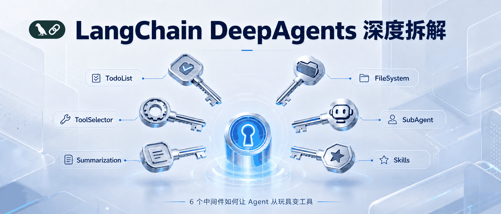
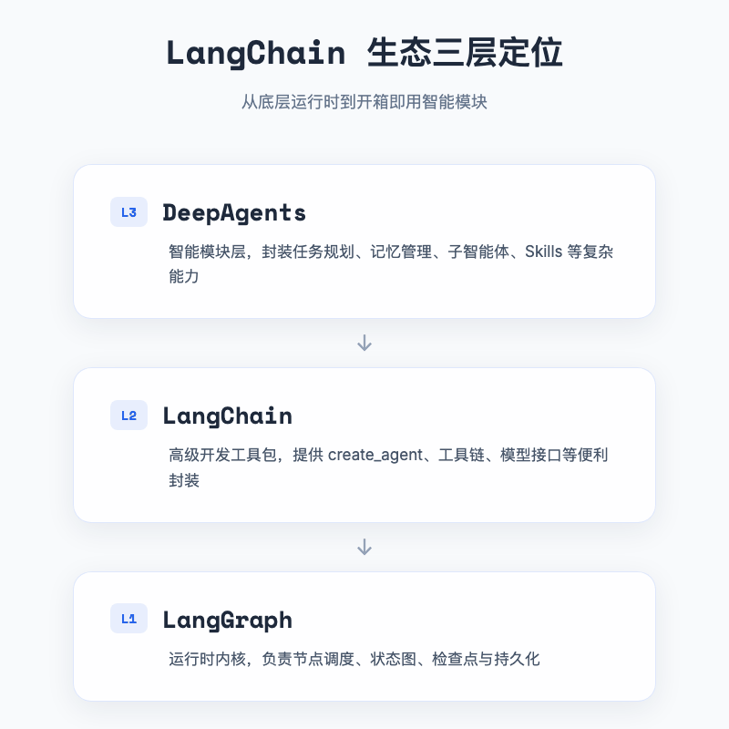
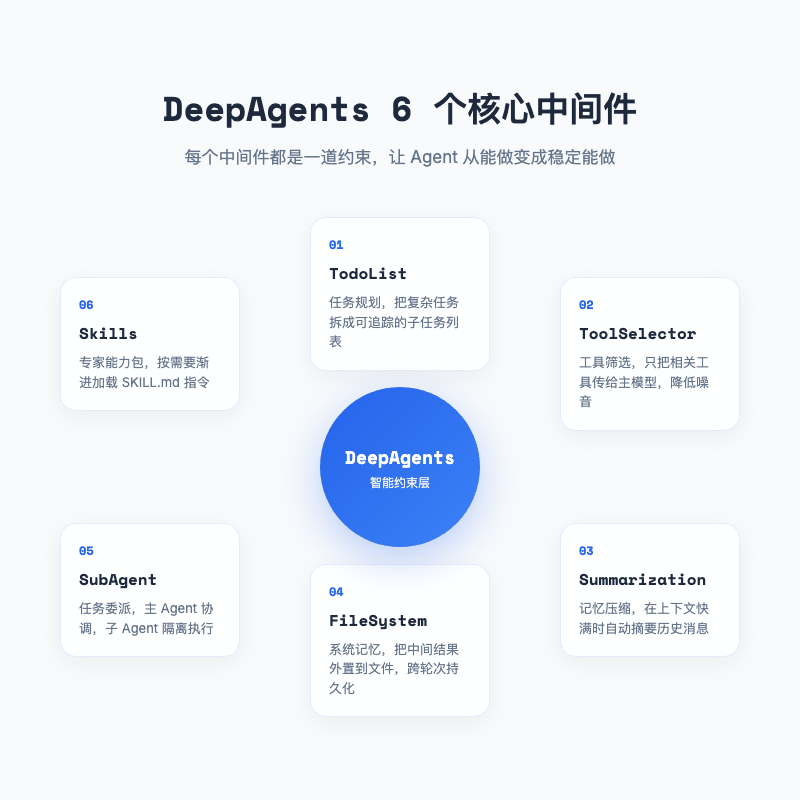
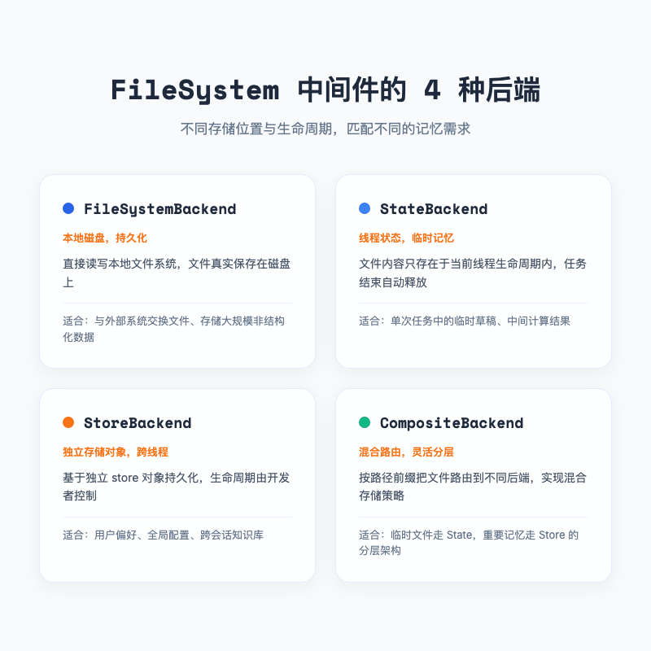
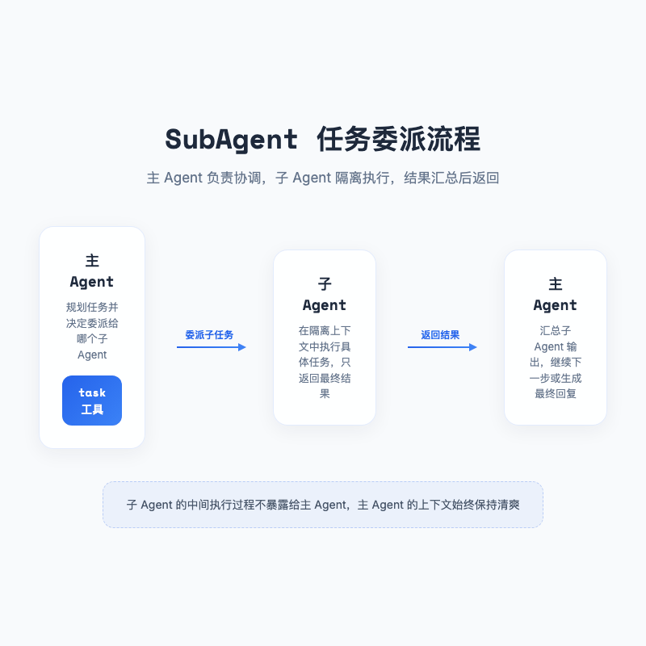

# LangChain DeepAgents 深度拆解，6 个中间件如何让 Agent 从玩具变工具

> 上个月我让基于 `create_agent` 的智能体写一份「三个主流 Agent 框架选型报告」。第 3 步它开始反复搜索同一个框架的文档，第 7 步忘了还要对比另外两个，第 12 步把上下文窗口撑爆，最后问我「用户刚才想要多少字来着」。我盯着屏幕看了半天，终于明白一件事，问题不在模型，而在 ReAct 那层循环太薄了。



---

## 一句话总结

DeepAgents 是 LangChain 官方为复杂、长时序、多步骤任务设计的中间件层。它把任务规划、上下文管理、子智能体、文件系统、长期记忆这些通用能力抽成可插拔组件，让 Agent 从偶尔能跑通变成大概率能跑通。

---

## 一、为什么 LangChain 还需要 DeepAgents

### 1.1 一个让人抓狂的调研任务

那份框架选型报告本身不难。但执行到第 5 轮，Agent 开始跑偏。

它先调用搜索工具查 LangGraph，然后忘了 AutoGen 和 CrewAI；再查 CrewAI 时，又把 LangGraph 已经查过的内容重新搜了一遍。上下文里堆满重复的网页摘要、工具返回和 AI 自己的碎碎念。等到第 12 轮，模型仿佛失忆了一样，开始重复提问。

这种场景做 Agent 的人都熟悉。`create_agent` 的定位就是「循环调用工具直到完成」，适合单次查询、简单工具链。一旦任务跨越多轮、涉及多个工具、需要保存中间结果，它就开始力不从心。

### 1.2 从内核到 SUV

LangChain 生态大致分三层。

**LangGraph** 是运行时内核。节点、边、状态图、检查点，很强大，但写起来像从零组装一台电脑。

**LangChain 1.0** 是基于内核的工具包。`create_agent` 把 ReAct 图封装成一个函数，几十行就能跑起来。但它没有任务规划、没有长期记忆、没有子任务委派。

**DeepAgents** 是在工具包之上又盖了一层。`create_deep_agent` 看起来和 `create_agent` 很像，但内部默认装配了任务规划、上下文管理、子智能体、文件系统、长期记忆等能力。官方的说法是，它把 Claude Code、Manus 这类深度 Agent 的共性能力打包成了开箱即用的组件。



打个比方。`create_agent` 是一辆自行车，轻便好骑，但驮不动重物。LangGraph 是一套汽车零部件，你可以组装成任何车型，但得自己会造。DeepAgents 则是一辆出厂就装好了导航、后备箱、副油箱和备用轮胎的 SUV，你要做的就是告诉他目的地。

### 1.3 DeepAgents 的设计哲学

DeepAgents 最打动我的地方有三点。它没把规划、记忆这些东西硬塞进某个 Agent，而是抽成可插拔的中间件。它让主模型只负责拍板，把任务状态、历史记录、中间结果都扔出去。它也不会一上来就把所有说明书塞进上下文，而是按需要加载。

这种按需加载的思路，既省了 token，也降低了模型犯糊涂的概率。

---

## 二、6 个中间件，6 道约束

下面这 6 个机制是我跑 demo 时反复用到的。硬要分类的话，可以拆成任务拆分、上下文管理、记忆存储三类，但其实它们经常互相串门，比如 SubAgent 也会帮你隔离上下文，FileSystem 也能减轻记忆压力。为了好讲，我先这么分。

- **任务怎么拆**，TodoList、SubAgent
- **上下文怎么用**，ToolSelector、Summarization
- **记忆怎么存**，FileSystem、Skills

其中 TodoList、SubAgent、Summarization、FileSystem、Skills 都是 DeepAgents 默认栈或官方文档重点推荐的能力。ToolSelector 来自 LangChain 1.0 的通用中间件，但和 DeepAgents 组合起来效果非常好，所以我也把它放进来一起讲。



---

## 三、TodoList，给复杂任务画一张路线图

### 3.1 为什么 Agent 会迷路

人在面对复杂任务时，会先列个清单。写论文要列大纲，做项目要排甘特图。Agent 也一样。如果没有清单，它就像进了超市却没有购物清单的人，东拿一个西拿一个，最后发现漏了最重要的东西。

DeepAgents 的 TodoList 中间件，就是给 Agent 自动维护这张购物清单。它向 Agent 注入一个 `write_todos` 工具，当用户输入多步骤任务时，Agent 会先生成子任务列表，再按顺序执行，每完成一项标记为 `completed`，然后推进到下一项。

### 3.2 TodoList 的工作方式

实现起来非常简单。创建 Agent 时，把 `TodoListMiddleware` 丢进 `middlewares` 列表即可。

```python
from langchain.agents import create_agent
from langchain.agents.middleware import TodoListMiddleware

agent = create_agent(
    model=model,
    tools=[],
    middleware=[TodoListMiddleware()],
)
```

调用后，Agent 的返回结果里会多出一个 `todos` 字段。每个子任务包含 `content` 和 `status`，status 有三种取值，

- `pending`，还没做
- `in_progress`，正在做
- `completed`，已完成

我跑「分析加州杏仁种植业未来 30 年气候风险」任务时，Agent 自动把任务拆成了四步，收集气候数据、估算产量影响、计算经济损失、换算比特币价值。拆分不一定完美，但它至少让 Agent 有了一张不会忘的路线图。

### 3.3 什么时候用，什么时候不用

TodoList 适合多步骤、有依赖、需要进度可见性的任务。写报告、做调研、跑数据分析流水线都很合适。

但它不是免费的。每次调用 `write_todos` 都要消耗一次模型调用，对于「请把 2+3*4 算出来」这种一步完成的任务，加上 TodoList 就是画蛇添足。

---

## 四、ToolSelector，给 Agent 的工具箱做减法

### 4.1 工具多了也是负担

很多做 Agent 的人有一种误解，工具越多越好。于是挂上搜索引擎、计算器、数据库查询、API 调用、文件读写、Git 操作……结果 Agent 反而变笨。

原因很直观。每次模型调用时，所有工具的描述都会塞进上下文。10 个工具还好，100 个工具就是几千 token 的噪音。模型不仅要从中挑出合适的，还要避免被无关工具的参数描述干扰判断。

ToolSelector 中间件就是来解决这个问题的。它在每次调用主模型之前，先让一个小模型基于当前对话筛选出最相关的工具，只把精简后的工具子集传给主模型。

### 4.2 ToolSelector 的配置

这个能力来自 LangChain 1.0 的 `LLMToolSelectorMiddleware`，和 DeepAgents 可以无缝组合。关键参数有三个。

- `model`，负责筛选工具的模型，通常可以和主模型共用同一个
- `max_tools`，每次最多保留多少个工具
- `always_include`，无论相关性如何都必须保留的工具名称列表

```python
from langchain.agents.middleware import LLMToolSelectorMiddleware

agent = create_agent(
    model=model,
    tools=[tool_1, tool_2, tool_3, tool_4, calculate],
    middleware=[
        LLMToolSelectorMiddleware(
            model=model,
            max_tools=2,
            always_include=['tool_1'],
        ),
    ],
)
```

我测试过一个数学计算任务。虽然工具列表里有 5 个工具，但 ToolSelector 只把 `calculate` 和 `tool_1` 留给了主模型。结果 Agent 准确地调用了 `calculate`，没有被其他无关工具带偏。

### 4.3 真正的价值在降噪

ToolSelector 真正的价值不在「帮 Agent 选工具」，而在帮主模型屏蔽噪音。它把一次 O(100) 的工具选择问题，降成了 O(few) 的决策问题。对于工具集庞大的企业级 Agent，这一步能显著降低 token 消耗和提升准确率。

不过要注意，ToolSelector 本身也会消耗一次模型调用。如果工具数量不多，直接全量传给主模型可能更划算。

---

## 五、Summarization，给记忆做减法

### 5.1 上下文窗口不是无限的

再强的模型也有上下文上限。8K、32K、128K、200K，数字在涨，但复杂任务的增长速度更快。一次网页搜索可能返回几万字的摘要，多轮对话叠加起来，窗口很快就满了。

Summarization 中间件的作用，是在接近阈值时自动把较旧的对话记录压缩成摘要。它保留最近的关键消息，把更早的内容总结成一段精炼的概述。

### 5.2 Summarization 的核心参数

Summarization 属于在模型调用前生效的中间件。三个核心参数是，

- `trigger`，触发条件，可以是消息数量、token 数量或上下文占比
- `keep`，摘要后保留的最近消息数量
- `model`，用于生成摘要的模型，建议用轻量快速的模型

```python
from langchain.agents.middleware import SummarizationMiddleware

agent = create_agent(
    model=model,
    tools=[internet_search, calculate],
    middleware=[
        SummarizationMiddleware(
            model=model,
            trigger=("messages", 5),
            keep=("messages", 3),
        ),
    ],
)
```

我构造过一个 7 条消息的对话历史。当新增一条消息后，消息总数超过阈值，Summarization 自动触发，把前 4 条消息压缩成 1 条摘要，最终模型看到的是「摘要 + 最近 3 条原始消息」。

### 5.3 压缩多了会丢信息

压缩必然伴随信息损失。DeepAgents 的设计原则是「能不压就不压」。我更建议把 Summarization 当作兜底方案，配合 FileSystem 一起使用。重要的中间结果写到文件里，而不是全部堆在上下文里。

---

## 六、FileSystem，让 Agent 拥有系统级记忆

### 6.1 第一次用的时候差点弄脏仓库

我第一次写 FileSystem 相关代码时，没加 `virtual_mode=True`。Agent 直接在项目根目录建了一堆 `report_v1.md`、`report_v2.md`，差点把代码仓库弄脏。从那以后，我都会先想清楚文件要写到哪。

Summarization 是在内存里做压缩，FileSystem 则是把信息外置到文件里。它的作用很直接，一是把上下文清出来，二是让中间结果能跨会话活下去。

DeepAgents 的 FileSystem 中间件会给 Agent 注入一组文件操作工具，`ls`、`read_file`、`write_file`、`edit_file`、`glob`、`grep`，如果后端支持沙箱协议，还可能有 `execute`。

### 6.2 四种后端，四种记忆层级

FileSystem 中间件的核心在于 `backend` 参数。DeepAgents 提供了 4 种后端，对应不同的记忆生命周期。



**FilesystemBackend** 直接读写本地磁盘。适合需要与外部系统交换文件、或者需要长期保存大文件的场景。使用时要注意权限控制，别让 Agent 乱跑你的根目录。

**StateBackend** 把文件存在当前线程的运行状态里。任务结束，文件就消失。它像一张草稿纸，适合单次任务中的临时记录。

**StoreBackend** 基于独立的存储对象（如 `InMemoryStore`），可以跨线程共享。适合保存用户偏好、全局配置、跨会话的知识库。

**CompositeBackend** 把多种后端组合起来，按路径前缀路由。比如 `/memories/` 下的文件走 StoreBackend，其他走 StateBackend。这样既保证了临时草稿的速度，又保证了重要记忆的持久化。

```python
from deepagents.middleware.filesystem import FilesystemMiddleware
from deepagents.backends import FilesystemBackend

agent = create_agent(
    model=model,
    tools=[],
    middleware=[
        FilesystemMiddleware(
            backend=FilesystemBackend(root_dir="./test_dir", virtual_mode=True)
        )
    ]
)
```

### 6.3 一个分层记忆的实战思路

我在实际项目中常用这样的组合，

- 会话内的临时中间文件 → StateBackend
- 用户偏好和项目约定 → StoreBackend，持久化到 `/memories/preferences.txt`
- 需要交付的最终报告 → FilesystemBackend，写到项目目录

这种分层让 Agent 既不会因为临时文件撑爆长期存储，也不会因为状态丢失而忘记用户的习惯。

---

## 七、SubAgent，任务委派与上下文隔离

### 7.1 单一 Agent 的极限

当任务步骤增多，单一 Agent 的上下文会越来越臃肿。模型不仅要记住最终目标，还要记住每一步的细节、每一次工具返回、每一个中间结论。最后的结果往往是「迷失在细节里」。

SubAgent 机制的做法很简单，主 Agent 只负责规划和协调，具体子任务交给专门的子 Agent 去做。子 Agent 的上下文与主 Agent 隔离，执行过程不暴露给主 Agent，只返回最终结果。

### 7.2 两种创建方式

DeepAgents 支持两种创建子 Agent 的方式。

**方式一，字典配置。** 适合快速原型。

```python
internet_subagent = {
    'name': 'internet_agent',
    'description': '从网络中搜索信息',
    'system_prompt': '你是一个网络搜索智能体',
    'tools': [internet_search],
}

agent = create_deep_agent(
    model=model,
    subagents=[internet_subagent]
)
```

**方式二，编译后的子 Agent。** 适合需要精细控制的场景。

```python
from deepagents import CompiledSubAgent
from langchain.agents import create_agent

summary_agent = create_agent(
    model=model,
    system_prompt='根据现有资料总结并提供短篇报告'
)

summary_subagent = CompiledSubAgent(
    name='summary-agent',
    description='根据新闻或搜索信息编写 500 字以内报告',
    runnable=summary_agent
)
```

### 7.3 task 工具是核心

DeepAgents 在创建主 Agent 时会自动注入一个 `task` 工具。主 Agent 通过它把任务派发给子 Agent。每个子 Agent 的 `description` 非常重要，主 Agent 就是靠这个描述来决定该把任务派给谁。

我跑「国际情报分析师」demo 时，主 Agent 先把资料搜集派给 research-agent，再把撰写报告派给 summary-agent。主 Agent 的上下文里只有「委派了什么任务」和「收到了什么结果」，中间大量的搜索细节都被隔离在子 Agent 里。



### 7.4 使用 SubAgent 的边界

SubAgent 不是万能药。它适合多步骤、专业领域、需要上下文隔离的任务。对于单步任务，或者高度依赖中间细节的任务，引入子 Agent 反而会增加复杂度和成本。

另外要注意，DeepAgents 默认会注入一个 `general_purpose` 子 Agent。如果自定义子 Agent 的 `description` 写得不清不楚，主 Agent 可能会选择默认子 Agent，而不是你期望的那个。

---

## 八、Skills，渐进式加载的专家能力包

### 8.1 什么是 Agent Skill

Skill 是 LangChain 提出的 Agent Skills 规范。你可以把它理解成一个文件夹，里面至少有一个 `SKILL.md` 文件，还可以附带 `scripts/`、`references/`、`assets/` 等目录。

```
my-skill/
├── SKILL.md          # 必须，包含 name 和 description
├── scripts/          # 可选，执行脚本
├── references/       # 可选，参考资料
└── assets/           # 可选，模板、图片等资源
```

Skill 的设计理念是**渐进式加载**。初始化时，Agent 只知道每个 Skill 的名称和描述。只有当用户意图匹配到某个 Skill 时，系统才会读取 `SKILL.md` 的完整内容，甚至加载脚本和资源。

### 8.2 DeepAgents 如何集成 Skills

DeepAgents 通过 `SkillsMiddleware` 和 `FilesystemMiddleware` 的协作，完成了 Skill 的发现、注入、加载和执行。

1. **发现**，扫描指定目录下的所有 `SKILL.md`，提取 name 和 description
2. **注入**，把 Skill 列表注入系统提示，让模型知道有哪些能力可用
3. **加载**，当模型决定使用某个 Skill 时，读取完整说明书
4. **执行**，按说明书调用工具和资源，完成任务

代码只需要一行配置。

```python
agent = create_deep_agent(
    model=model,
    backend=FilesystemBackend(root_dir="./", virtual_mode=True),
    skills=["./skills/"],
    checkpointer=checkpointer,
)
```

我测试过一个 docx 文档处理 Skill。Agent 先识别到用户要生成 Word 文档，然后渐进式加载 doc Skill，最后调用脚本生成了 `笑话.docx`。整个过程对开发者来说几乎是透明的。

### 8.3 Skill 是提示词工程的高级形态

Skill 把「专业知识」从一次性 prompt 里抽出来，变成了可复用、可迭代、可共享的模块。团队里有人做了 PDF 处理 Skill，所有人都能用；项目里沉淀了代码审查 Skill，新成员也能直接继承最佳实践。

---

## 九、最小可复现 Demo，一个研究助理

讲完六个约束模块，来看一个可以直接跑的研究助理示例。它综合了 TodoList、SubAgent 和 FileSystem 三个核心能力。

```python
from dotenv import load_dotenv
from deepagents import create_deep_agent
from deepagents.backends import FilesystemBackend
from langchain.agents import tool
from langchain_deepseek import ChatDeepSeek

load_dotenv()

# 你需要自己实现或替换为一个真实的搜索工具
@tool
def internet_search(query: str) -> str:
    """从网络搜索信息并返回摘要。"""
    # 这里可以接入真实的搜索 API，如 Tavily、SerpAPI 等
    return f"关于 {query} 的搜索结果摘要 ..."

model = ChatDeepSeek(model="deepseek-chat")

research_subagent = {
    "name": "research-agent",
    "description": "用于深度搜索网络信息",
    "system_prompt": "你是一个网络搜索大师",
    "tools": [internet_search],
}

agent = create_deep_agent(
    model=model,
    system_prompt="你是一位技术选型专家",
    subagents=[research_subagent],
    backend=FilesystemBackend(root_dir="./test_dir", virtual_mode=True),
)

for event in agent.stream(
    {"messages": [{"role": "user", "content": "调研 LangGraph、AutoGen 和 CrewAI，写一篇 1500 字选型报告"}]},
    stream_mode="values",
):
    print(event)
```

运行后你会看到，Agent 先写 todo、再派子 Agent 搜集资料、更新任务状态、最后生成报告并保存到文件。整个流程就是一堆中间件拼在一起干活。

---

## 十、流式输出，让多 Agent 协作可被观测

### 10.1 为什么流式输出不只是为了体验

没有流式输出时，用户面对的是一个黑盒。模型在思考、子 Agent 在跑、工具在调用，屏幕上却什么都没有。几分钟后，要么突然弹出一堆结果，要么直接报错。

流式输出把执行过程实时暴露出来，每一轮模型输出、每一次工具调用、每一个子 Agent 的进度，都能被前端捕获和展示。

### 10.2 命名空间是事件路由的关键

我第一次跑多 Agent 任务时，屏幕上啥也没有，只能盯着光标发呆。后来才发现 DeepAgents 的 `stream()` 会吐出带命名空间的事件，每个事件有 `type`、`ns` 和 `data` 三个字段，`ns` 就是告诉你「这事是谁干的」。

`ns` 字段标识事件的来源，

- `()`，主 Agent
- `("tools:abc123",)`，通过 task 工具创建的子 Agent
- `("tools:abc123", "model_request:def456")`，子 Agent 内部的 model_request 节点

```python
for chunk in agent.stream(
    {"messages": [{"role": "user", "content": query}]},
    stream_mode="updates",
    subgraphs=True,
    version="v2",
):
    if chunk["type"] == "updates":
        if chunk["ns"]:
            print(f"[subagent: {chunk['ns']}]")
        else:
            print("[main agent]")
```

### 10.3 三种 stream_mode 的选择

DeepAgents 支持多种流式模式，适用不同场景。

- `updates`，节点级进度追踪，适合展示「主 Agent 正在规划」「子 Agent 正在搜索」
- `messages`，token 级输出，适合聊天式 UI 的逐字显示
- `custom`，自定义事件，适合汇报领域特定进度，比如「数据处理完成 30%」

我在生产环境中常用组合模式 `stream_mode=["updates", "messages", "custom"]`，然后按事件类型分别路由到不同的 UI 组件。这样一套代码就能覆盖进度条、聊天流和自定义通知。

---

## 十一、生产级参照，DeepAgents Code 怎么做

### 11.1 从 Demo 到产品有多远

学会 `create_deep_agent` 只是第一步。一个真正能跑在生产环境的 Agent，还要处理模型切换、会话恢复、长期记忆、权限控制、沙箱执行、UI 渲染等问题。

写到这儿，你可能觉得 demo 已经能跑了。但把它塞进真正的产品里，问题才刚刚开始，用户想切换模型怎么办？会话崩了怎么恢复？Agent 把 `main` 分支当 `feature` 分支改了怎么办？LangChain 官方做了一个示例产品，**DeepAgents Code**（简称 dcode）， basically 把这些问题挨个用中间件补了一遍。

### 11.2 客户端与服务端分离

DeepAgents Code 的第一课是架构，客户端和服务端运行在两个独立进程中。客户端负责展示和输入，服务端负责执行和状态管理，两者通过流式协议通信。

拆成两端之后，好处很明显，UI 不会被 Shell 命令卡住，状态不再和 UI 揉成一团，以后想远程执行也容易。

### 11.3 中间件在生产中的扩展

DeepAgents Code 没有只停留在 SDK 自带的中间件上，而是基于同样的机制扩展了几个真正救过我命的中间件。

其中最让我意外的是 **LocalContextMiddleware**。我原本没觉得 Agent 需要知道自己在哪个 Git 分支，直到有一次它把未提交改动写进了 `main` 分支。这个中间件会自动把分支、未提交文件、包管理器类型塞进系统提示。听起来很细，但真的能救命。

**ConfigurableModelMiddleware** 解决的是另一个头疼问题。用户可能上午用 GPT-4，下午想切到 Claude。没有它，你得重启整个会话；有了它，目标模型通过运行时的 `context` 对象传进去，中间件每次调用前拦截替换就行。`context_schema` 只是用来做类型校验，真正传数据的是 `context` 对象。

还有两个也值得提。**ResumeStateMiddleware** 把 `_context_tokens` 和 `_model_spec` 持久化到检查点，会话恢复时不会丢失上下文计数和模型信息。**MemoryMiddleware** 则从 `AGENTS.md` 文件加载长期记忆，用户可以直接编辑 Markdown 调整 Agent 行为，不用改代码。

### 11.4 后端的能力降级策略

DeepAgents Code 按优先级尝试三种后端，配置了沙箱时走远程沙箱后端；默认开启 Shell 时走 LocalShellBackend；关闭 Shell 时退到纯 FilesystemBackend。

同一套代码，可以跑在隔离环境、本地开发环境和高安全环境中。

---

## 十二、总结，DeepAgents 适合谁

DeepAgents 不是银弹。它的价值在于把复杂 Agent 的通用能力标准化、中间件化。如果你的场景符合以下特征，它值得认真考虑，

- 任务需要多步骤规划和执行
- 上下文窗口容易被撑爆
- 工具集庞大，需要筛选
- 需要长期记忆或跨会话状态
- 需要子 Agent 分工协作
- 需要 Skill 形式沉淀领域知识

如果你的需求只是「调用一个工具回答一个问题」，那 `create_agent` 就够了。多引入一层抽象，反而会让代码变重。

我用 `create_agent` 时最崩溃的一次，就是 Agent 跑了 12 轮之后把任务忘了。DeepAgents 并没有让模型变得更聪明，它只是给系统加了约束，TodoList 不让它跑偏，FileSystem 不让它失忆，SubAgent 不让它硬扛所有细节。剩下几个约束分别管工具噪音、上下文长度和能力加载。

这些约束叠加起来，Agent 才从偶尔能跑通变成大概率能跑通。现在我再用 DeepAgents 跑那份框架选型报告，它还是会犯错，但至少不会再跑到第 12 轮来问我「刚才想要多少字来着」。

对于正在做 Agent 产品的人来说，DeepAgents 最值得学习的也许不是某个 API，而是这种把通用能力下沉为中间件的思路。约束系统不会因为模型变强就失效，反而会因为模型越来越强而变得更加重要。

欢迎关注我的公众号「Chyris Tech Note」，获取更多 AI 技术解读与实践分享。

