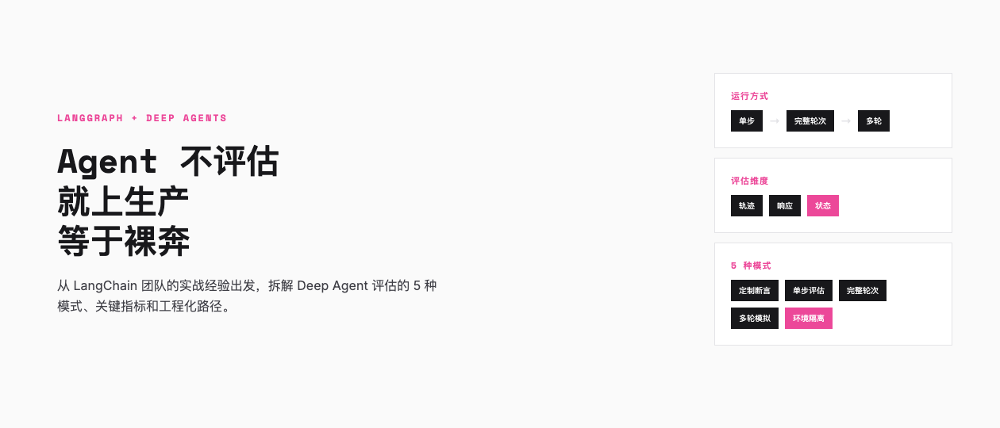
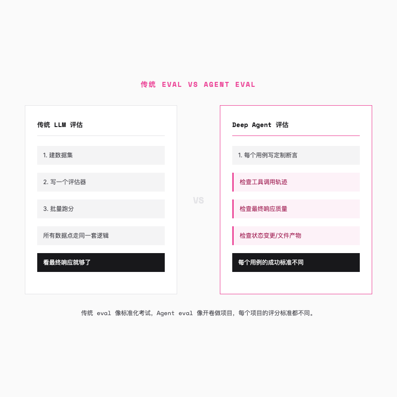
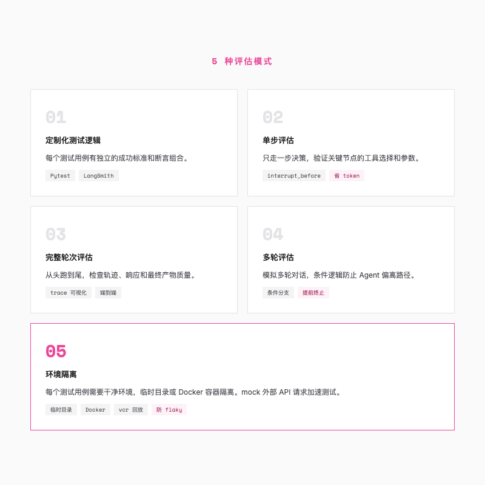
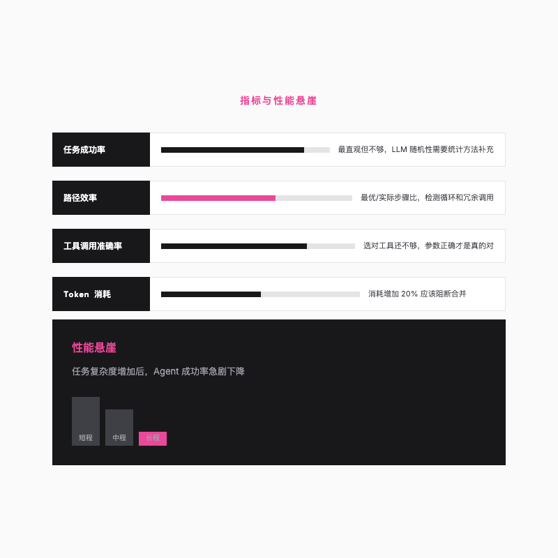

# Agent 评估指南，LangChain 团队踩出来的 5 个模式

> LangChain 一个月连发 4 个 Deep Agent 应用后发现，传统 eval 套路根本不够用。



---

## 一个让 LangChain 团队重新思考评估的月份

2026 年初，LangChain 团队在一个月内密集交付了 4 个基于 Deep Agents 框架的应用，DeepAgents CLI（编码智能体）、LangSmith Assist（应用内助手）、Personal Email Assistant（个性化邮件助手），以及 Agent Builder（无代码智能体构建平台）。

每个应用上线前都需要加评估，然后他们发现了一件尴尬的事，过去那套「造个数据集、写个评估器、跑一遍出分」的标准流程，跑不通了。

原因很简单。传统 LLM 评估假设所有数据点用同一套评判标准。你做问答系统，每个回答都可以用同一个标准去打分。但 Deep Agent 不一样。一个日程管理 Agent，用户说「记住别在早上 9 点前给我安排会议」，你不仅要看它的回答对不对，还要检查它有没有真的去更新记忆文件，记忆文件的内容是否正确，以及它有没有告诉用户「我已经记住了」。

一个测试点，三四种不同的断言。每个测试点的断言还不一样。

这不是简单的「加几个指标」能解决的。这是评估思路的转换。

---

## 先搞清楚 Agent 怎么跑、跑完看什么



在讲具体方法之前，先理清两个概念。

Agent 怎么跑？LangChain 团队把运行方式分成三种。单步运行（Single Step），只走一步决策，看看 Agent 下一步打算干什么。完整轮次（Full Turn），给一个输入让 Agent 从头跑到尾，中间可能调用好几次工具。多轮运行（Multiple Turns），模拟用户和 Agent 的多轮对话，来来回回好几轮。

跑完之后看什么？也有三个维度。轨迹（Trajectory），就是 Agent 调了哪些工具、按什么顺序、参数对不对，这是「行为记录」。最终响应（Final Response），Agent 最后给用户返回了什么。其他状态（Other State），运行过程中产生的文件、配置变更等副产品。

传统评估基本只看最终响应。Deep Agent 的评估三个都要看，而且每个测试用例的侧重点不同。搞清楚「怎么跑」和「看什么」之后，接下来的问题是，具体怎么把它们组合起来？

---

## 五种评估模式，从 LangChain 的实战中来

LangChain 团队从这 4 个应用的评估实践中，提炼出了 5 种核心模式。这不是教科书式的分类，是他们在真实项目中踩出来的经验。



### 每个测试用例，就是一套独立的评判标准

传统评估的流程是，建数据集、写评估器、批量跑分。每个数据点走同样的逻辑，用同一个评估器打分。

Deep Agent 打破了这个前提。不同场景下 Agent 的「成功」定义不一样，有的只关心它调没调对工具，有的关心最终回答的质量，有的关心它有没有正确更新某个文件。硬用一个评估器覆盖所有情况，要么太宽松放过了 bug，要么太严格把正确的也给毙了。

LangChain 的做法是用 Pytest 写定制化的测试逻辑。每个测试函数针对该场景写不同的断言，检查轨迹、响应和状态中的任意组合。LangSmith 的 Pytest 集成会自动把每个测试用例的输入、输出和反馈记录到实验面板里，方便回溯调试。

```python
@pytest.mark.langsmith
def test_remember_no_early_meetings() -> None:
    user_input = "不要在早上 9 点前给我安排会议"
    t.log_inputs({"question": user_input})

    response = run_agent(user_input)
    t.log_outputs({"outputs": response})

    tool_calls = get_agent_tool_calls(response)

    # 断言：Agent 必须调用 edit_file 工具更新记忆文件
    assert any(
        tc["name"] == "edit_file"
        and tc["args"]["path"] == "memories.md"
        for tc in tool_calls
    )

    # 用 LLM-as-judge 检查最终消息是否确认了记忆更新
    communicated = llm_as_judge_A(response)
    t.log_feedback(key="communicated_to_user", score=communicated)

    # 用另一个 LLM-as-judge 检查记忆文件内容是否正确
    memory_ok = llm_as_judge_B(response)
    t.log_feedback(key="memory_updated", score=memory_ok)
```

这个测试做了三件事，检查工具调用是否正确，检查响应是否告知用户，检查文件内容是否包含正确信息。换一个测试场景，断言逻辑就完全不同了。

### 单步评估，Agent 的「单元测试」

LangChain 团队发现，大约一半的测试用例是单步评估。

这是个很有意思的发现。你可能会觉得，Agent 评估肯定要让它从头跑到尾才能看出问题。但实际上，大部分回归都出现在单个决策点上。Agent 在某一步选错了工具，或者参数传错了，后续的执行就全歪了。与其等它跑完全程再发现问题，不如在关键节点提前检查。

在 LangGraph 中实现单步评估很直接，利用 `interrupt_before` 参数在工具执行前打断 Agent，看看它准备调什么工具。

```python
@pytest.mark.langsmith
def test_single_step() -> None:
    state = await agent.ainvoke(
        inputs,
        interrupt_before=["tools"]  # 在工具执行前暂停
    )
    # 检查 Agent 准备调用的工具和参数
    print(state["messages"])
```

好处也明显，快、省 token，而且能精确定位问题出在哪一步。

### 完整轮次和多轮评估

单步评估解决单个决策点的问题，但有些场景必须看 Agent 的完整执行过程。完整轮次评估就是让 Agent 从头跑到尾，检查轨迹上某个工具是否被调用过（不管顺序），或者检查最终产物的质量。编码 Agent 生成的代码能不能跑，研究 Agent 找到的资料链接对不对，这些只有完整跑完才能判断。

LangSmith 的 trace 可视化在这种场景下特别有用，你能看到每一步的延迟、token 消耗、工具调用详情，既能看全局指标，又能钻到每一个模型调用看细节。

多轮评估更进一步，模拟用户和 Agent 之间的多轮对话。麻烦的地方在于 Agent 不是确定性的，第一轮输出可能有好几种合理走法，如果硬编码第二轮输入，一旦 Agent 走法跟预期不同，后续输入就失去意义了。LangChain 团队的解法是在测试中加入条件逻辑，先跑第一轮，检查输出是否符合预期，符合则继续，不符合直接 fail。这样做不需要穷举所有分支，每个检查点都是提前终止的机会。

反过来，如果想单独测试第三轮的行为，直接构造包含前两轮状态的初始上下文，从第三轮开始测就行。

### 干净的环境是评估可信的前提

这条经验听着不起眼，但一旦忽略了它，你的测试结果就是不可信的。

Deep Agent 是有状态的，运行过程中会读写文件、修改配置、调用外部 API。如果测试用例之间共享环境，前一个测试留下的状态会影响后一个测试的结果。本地调试时可能看不出来，但在 CI/CD 环境里会导致测试时好时坏，也就是所谓的 flaky test。

LangChain 对 DeepAgents CLI 用了轻量级方案，每次测试创建临时目录，跑完就删。TerminalBench 等需要更强隔离的场景，则用 Harbor 框架在 Docker 容器里跑，每个测试用例一个干净的容器。

除了测试用例之间的隔离，测试与外部世界的隔离同样重要。LangSmith Assist 需要连接真实的 LangSmith API，每次测试都走真实接口既慢又贵。团队用 vcr 库把 HTTP 请求录制下来，测试时直接回放，速度大幅提升，结果也可复现。

---

## 有个现象叫「性能悬崖」



讲完「怎么测」，接下来是「测完看什么」。

任务成功率是最直观的指标，但光看通过率不够。Agent 不像传统软件，同样输入可能产生不同输出。LangChain 团队在实践中发现，有些指标比通过率更能暴露系统的深层问题。

路径效率（Step Efficiency）是我觉得最值得关注的。最优步骤数除以实际步骤数，比值越接近 1 越好。一个常见的退化模式是 Agent 陷入循环，反复调用同一个工具却得不到想要的结果，token 烧了一大堆，问题没解决。如果某次代码改动导致平均 token 消耗增加了 20%，这应该是一个阻断合并的信号。

还有一个现象值得单独拿出来说。我在看 SWE-bench 这类基准测试的结果时注意到，一个能轻松完成 3 步任务的 Agent，把任务拉到 10 步，成功率可能直接腰斩。这不是某个特定模型的问题，几乎所有 Agent 系统都会遇到这个「性能悬崖」。任务越长，中间出错的概率越大，一个早期的小偏差会在后续步骤里不断放大。这意味着评估 Agent 时，光看简单任务通过率是不够的，必须重点关注它在长路径任务下的状态保持能力。

至于 Pass@k 和 Pass^k 这类统计指标，它们能帮你对抗 LLM 的不确定性，但先把路径效率和长程稳定性盯住，比纠结统计方法更有实际价值。

---

## 从「能跑」到「可靠」

有了测试方法和指标，还需要一套工程化流程把它串起来。

首先是测试数据。构建**黄金数据集（Golden Dataset）**是起点，这是经过人工标注的高质量测试集，包含典型场景、边缘案例和对抗性用例。数据集需要像代码一样做版本管理，业务逻辑变了，标签也要同步更新。LangSmith 有个实用的功能，可以把生产环境中发现的失败 case 一键加入测试集，形成质量闭环。

测试本身要分层。节点级测试验证单个节点的输入输出逻辑，不经过 LangGraph 引擎，速度极快，适合开发阶段频繁跑。路径测试验证条件路由是否正确跳转。端到端测试验证整个 Agent 的完整表现。层级越低，定位问题越快。这套分层策略跑通之后，接入 CI/CD 就是水到渠成的事，每次提交代码自动运行评估套件，成功率下降超过阈值或 token 消耗异常增长，自动阻断合并。

---

## 评估不是开发完才做的事

回到 LangChain 那个密集交付的月份。4 个应用、4 套评估、无数次的迭代调优。

有一个细节让我印象深刻。LangChain 团队在写那些 Pytest 测试用例的时候，每一条断言其实都是在回答一个问题，「这个 Agent 在这个场景下应该怎么表现」。测试用例写完，Agent 的行为规格也就定义清楚了。评估和开发是一件事的两面。

所以如果你正在做 Agent 项目，我的建议是，别等开发完了再想评估。从第一个功能开始就写测试，哪怕只是单步评估。因为你会发现，当你坐下来写「这个 Agent 应该怎么表现」的时候，你对它的理解会变得完全不一样。

---

欢迎关注我的公众号「Chyris Tech Note」，获取更多 AI 技术解读与实践分享。
