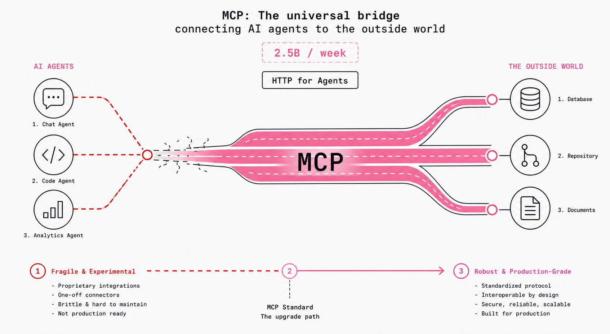
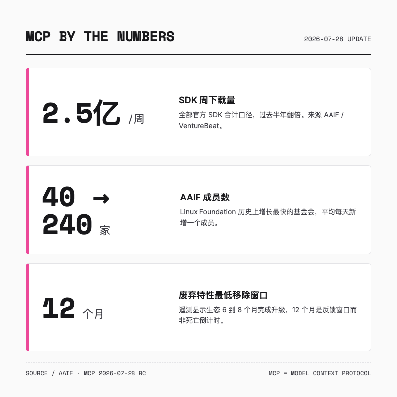
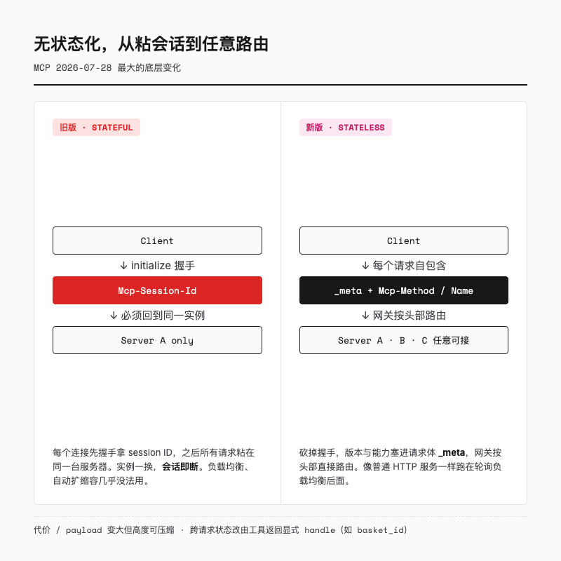
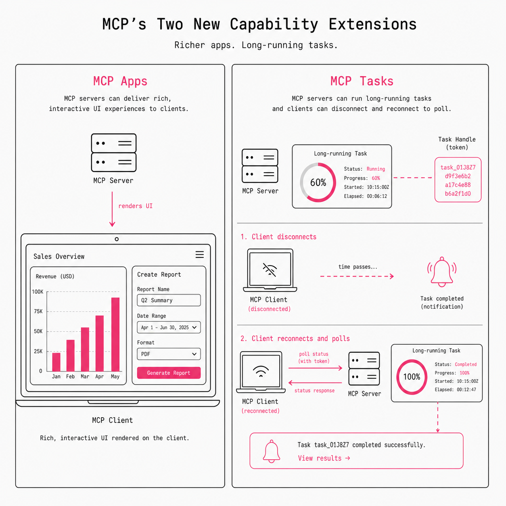
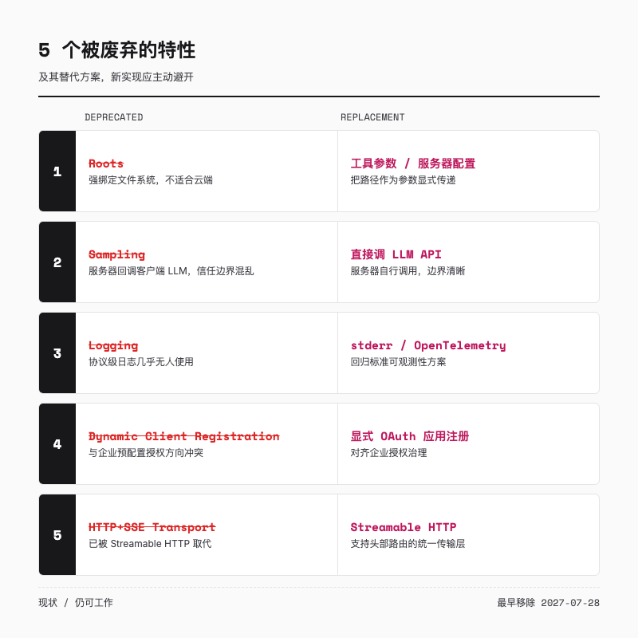

# MCP 发布史上最大更新，AI Agent 的「互联网协议」终于要真正工程化了

> 一个 MCP Server 在你的笔记本上跑得丝滑，Claude Desktop 一连，查库、调 GitHub、读写飞书文档，样样都飞快。你把它丢进公司的 Kubernetes，前面挂个负载均衡，第二轮请求就开始 404。



---

## 一句话总结

MCP 不再是一个实验协议。状态、认证、稳定性，这几个卡住企业上生产的硬骨头，这次都被啃动了。

---

## 增长很快，但几乎都停在概念验证

理解这次更新的分量，看几个信号。

**每周约 2.5 亿次 SDK 下载。** 这是 VentureBeat 和 AAIF 的口径，把 TypeScript、Python 等全部官方 SDK 合在一起算，过去半年翻了一倍。

**AAIF 成员从 40 家涨到 240 家。** 这是 Linux Foundation 历史上增长最快的基金会之一，平均每天新增一个成员。名单里有 Anthropic、Microsoft、OpenAI、Google、Amazon、Block、Vercel、Cloudflare、Shopify，还有 CERN 和 Consumer Reports。

用的人也覆盖了大半条 Agent 链路。ChatGPT、Claude、Cursor、Gemini、Microsoft Copilot、VS Code、JetBrains 都已经支持 MCP，全球数万个 MCP Server 在跑。

但这里有个反差。几乎所有大规模部署，到现在为止都是概念验证。真正的企业级生产部署，被几个结构性问题卡在门外。



---

## HTTP 赢了 30 年，靠的是三件事

AAIF 执行董事 Mazin Gilbert 反复用一个类比。HTTP 之所以能变成今天这种「看不见的基础设施」，赢得全球信任，靠的是三件事。

一是开放标准，由中立的组织治理，谁都能实现、谁都能接，不会某天被一家公司改断。二是无状态可扩展，浏览器不用绑定某台特定服务器，所以才有今天的互联网规模。三是稳定可预期，协议演进有规矩，不会突然不兼容。

Gilbert 自己说，一年前这三件事 MCP 一件都没到位，半年前也没到位。

2026 年 7 月 28 日的更新，就是冲着补齐这三件事去的。具体改了什么，挨个看。

---

## 变化一，无状态架构，让 MCP 敢进 Kubernetes

这是本次更新最大、最底层的变化。

旧版 MCP 要求每个连接先做一次 `initialize` 和 `initialized` 握手，服务器返回一个 `Mcp-Session-Id`，之后这个连接上的所有请求都必须带着这个 ID。翻译成部署语言就三个字，粘会话。负载均衡器必须保证同一个会话的所有请求都落到同一台服务器实例上。一旦那台实例挂掉、被扩缩容回收、或者请求被路由到别的实例，整个会话就断了。为了撑住这个，你得维护一个共享的 session store，既增加运维负担，又埋下单点故障。在 serverless 和 Kubernetes 自动扩缩容的环境里，这几乎是死结。

Gilbert 说，你不可能让浏览器只访问某个特定服务器，如果没有这种无状态的切换能力，就不会有今天这样的互联网。

新版砍掉了 `initialize` 握手和 `Mcp-Session-Id`。每个请求都自包含，协议版本、客户端信息、能力标志都塞在请求体的 `_meta` 字段里。服务器的能力不再在握手时一次性下发，而是通过一个新的 `server/discover` 方法按需获取。传输层也跟着变了，Streamable HTTP 现在要求每个请求必须带 `Mcp-Method` 和 `Mcp-Name` 两个头部，这是个关键设计，负载均衡器和网关可以直接根据头部做路由，不用解析 JSON body 做深度包检测。

新旧两种姿势，放一起看最直观。

```text
# 旧版，必须先握手
initialize            → 服务器返回 Mcp-Session-Id: sess-abc
tools/call            → (Header: Mcp-Session-Id: sess-abc)
tools/call            → (Header: Mcp-Session-Id: sess-abc)  ← 实例一换就 404

# 新版，请求自包含
tools/call  → (Body._meta: { protocolVersion, clientInfo, capabilities })
tools/call  → (Body._meta: { protocolVersion, clientInfo, capabilities })  ← 任意实例可接
```

结果是，MCP Server 可以像普通 HTTP 服务一样，跑在最朴素的轮询负载均衡后面，任何一台实例都能处理任何一个请求。运维复杂度从「特制的 MCP 基础设施」降级成「普通的 HTTP 服务」。

天下没有免费的午餐。无状态化的代价是 payload 变大了，原本存在 session 里的状态，现在要在每次请求里来回搬运。不过维护者很坦诚，这些状态高度可压缩，相对普通 HTTP 请求来说仍然很小。打个比方，旧版是你办了张会员卡，每次办事必须回同一个柜台，新版是你每次带齐证件，任意柜台都能办，柜台标准化了，但你包里得多装点东西。

如果你的服务确实需要跨请求保持状态，比如一个购物车、一个多步工作流，新版推荐的姿势和写普通 HTTP API 一样。由工具显式返回一个 handle，比如一个 `basket_id`，模型在后续调用里把这个 handle 当普通参数传回来。这样的状态对模型是可见的、可推理的，而不是藏在传输层里给运维添堵。



---

## 变化二，认证升级，企业级安全不再凑合

MCP 旧版的认证，说难听点就是「能跑就行」。这次更新直接对齐了 OAuth 2.1 和 OpenID Connect 在真实企业里的部署方式。

最关键的一个改动，是强制验证 `issuer` 参数，也就是 `iss`。这关上了一类叫「mix-up attack」的攻击大门。它的机理不难懂，客户端在多个授权服务器之间可能被误导，把 A 服务器的授权响应当成 B 服务器的，结果拿 A 的凭据去访问 B 的资源，凭据就这么串了。

AAIF 还引入了一个叫 Enterprise-Managed Authorization 的扩展，简称 EMA。它让企业的身份提供商，比如 Okta、Azure AD，成为 MCP Server 访问的权威守门人。员工用企业凭证登录，IT 部门可以集中配置谁能访问哪些 MCP Server，而不是让每个人拿自己的个人账号去授权。

换句话说，IT 部门终于能像管公司里的 SaaS 一样管 MCP Server 的访问权限，员工拿企业 Okta 登录就能进，不用每个人再去搞自己的授权。

---

## 变化三，12 个月废弃政策，治好了企业的「不敢押注」

这次更新里最「企业味」的可能不是一段代码，而是一条政策。任何被正式废弃的特性，至少 12 个月之后才能被移除。

这个数字不是拍脑袋定的。维护者和 Google、Microsoft、Amazon 都商量过，认为 12 个月是个合理的中间值。他们自己的遥测数据显示，大多数生态升级发生在 6 到 8 个月内，所以这 12 个月与其说是死亡倒计时，不如说是一个反馈窗口。

Gilbert 把这条政策称为企业信任的第三条腿。他说一年前三件事一件都没到位，半年前也没到位，现在都到位了。对企业来说这句话翻译过来就是，你可以放心押注了，今天写的集成，不会明天突然不兼容。

---

## 变化四，MCP Apps 和 Tasks，不再只是文字墙和干等

最后这两个变化，把 MCP 的能力边界从「文本请求响应」往外推了一大步。两者都被正式升级为协议扩展。

MCP Apps 让服务器能直接渲染交互界面。以前 MCP Server 只能返回文本或数据，怎么展示全靠客户端自己决定。现在服务器可以推送一个丰富的、可交互的、服务器渲染的 UI 到客户端。举个落地场景，一个 HR Agent 查完员工数据，可以直接弹出一张能填、能提交的审批表单，而不是吐回一段 JSON 让前端再渲染一遍。数据分析 Agent 也能直接返回一张能点的图表。Agent 的输出，终于可以不再是一堵文字墙。

MCP Tasks 解决的是另一头，长任务不用一直开着连接干等。现实里很多任务不是一瞬间能跑完的，转码一段视频、批量处理数据、训练一个模型、跑一份复杂报告。旧版 MCP 要求客户端一直维持连接等着。新版让服务器返回一个持久的 task handle，客户端可以断开、可以重启、可以轮询，任务完成了服务器再通知你。你在处理一段播客音频，服务器完成后通知客户端，不需要一直开着流等。

顺带还有一个相关变化，多轮往返请求。它允许服务器和客户端在一个逻辑操作里反复协商参数，直到把事办成。



---

## 顺带，这五样东西要被废了

为了给核心协议瘦身，新版废弃了几个旧特性。

- **Roots**，原来强绑定文件系统假设，不适合云端，改成把路径作为工具参数或服务器配置传
- **Sampling**，原来让服务器回调客户端的 LLM，信任边界混乱，改成服务器直接调 LLM API
- **Logging**，协议级的日志能力几乎没人用，改用 stderr 或 OpenTelemetry
- **Dynamic Client Registration**，和企业预配置授权的方向冲突，改用显式 OAuth 应用注册
- **HTTP+SSE 传输层**，已经被 Streamable HTTP 取代，迁移过去就行

注意，它们现在仍然能工作。最早的移除时间点是 2027 年 7 月 28 日，刚好一年后。新写的实现应该主动避开。



---

## 开发者现在该做什么

如果你在维护一个 MCP Server，按这个顺序查。一看代码是不是依赖 `initialize`、`Mcp-Session-Id` 或任何连接级状态。二准备按 `Mcp-Method` 和 `Mcp-Name` 头部做路由。三给 `tools/list` 这类响应加上 `ttlMs` 和 `cacheScope`。四评估要不要从 Roots、Sampling、Logging 迁走，以及要不要接 MCP Apps 或 Tasks。

如果你在维护一个 MCP Client，去掉 `initialize` 握手，改成每个请求带 `_meta`，支持 `server/discover` 获取能力。把 OAuth 流程升级到 2.1 和 OIDC，记得验证 `iss` 参数。企业客户再考虑支持 EMA 扩展。

如果你还没开始做，恭喜，直接按 7 月 28 日的新版上手，省掉所有历史包袱。

有个好消息。官方 SDK，TypeScript、Python、C#、Rust、Java、Go，会吸收掉大部分变更。维护者甚至半开玩笑说，任何一个模型都能 one-shot 帮你完成迁移。这句话本身也挺有意思，协议设计者已经开始按「AI 能自动迁移」的标准来设计变更了。

---

## 这对中国开发者意味着什么

技术上有一件事是确定的。AAIF 明确表态，MCP 对任何模型都保持中立，无论是 Anthropic 的模型、Gemma，还是任何一个国产模型。协议层不会因为厂商背景把谁排除在外，只要遵循协议，就不被挡在全球 Agent 生态的外面。这对想把自家模型或云端服务接进全球化 Agent 工作流的国内团队，是个实打实的通道。

对落地也更友好了。你可以直接拿现有的 Kubernetes、API 网关、负载均衡体系来部署 MCP Server，不用再造一套特制基础设施，企业 SSO 和权限治理也接得上了。如果你去年曾因为在 Kubernetes 里跑 MCP 摔过坑而把它放下，这次值得重新捡起来看看。

---

## 结语，MCP 的成人礼

回到开头那个场景。那个在你笔记本上跑得丝滑、一进 Kubernetes 就 404 的 MCP Server，现在协议层不再拦路了。当然，迁移要花点功夫，检查 session 依赖、改握手、对齐认证，但至少你不用再为它写一套特制的运维脚本。

过去 20 个月，MCP 是 AI 领域增长最快的协议之一。但直到这次更新，它才第一次有了大规模生产部署的骨架，无状态是其中最关键的一块。

它不完美，不过这一次，企业确实有理由把 Agent 集成从概念验证往生产里推了。

Gilbert 说，互联网花了 30 年才变成今天这种看不见的基础设施。Agent 的互联网才第一年、第二年。但现在，它终于有了能承载负载的管道。

---

欢迎关注我的公众号「Chyris Tech Note」，获取更多 AI 技术解读与实践分享。

