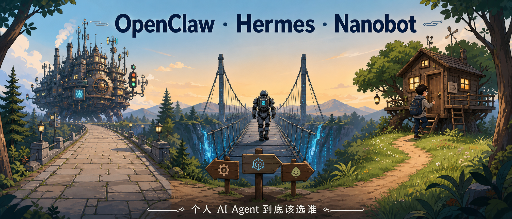
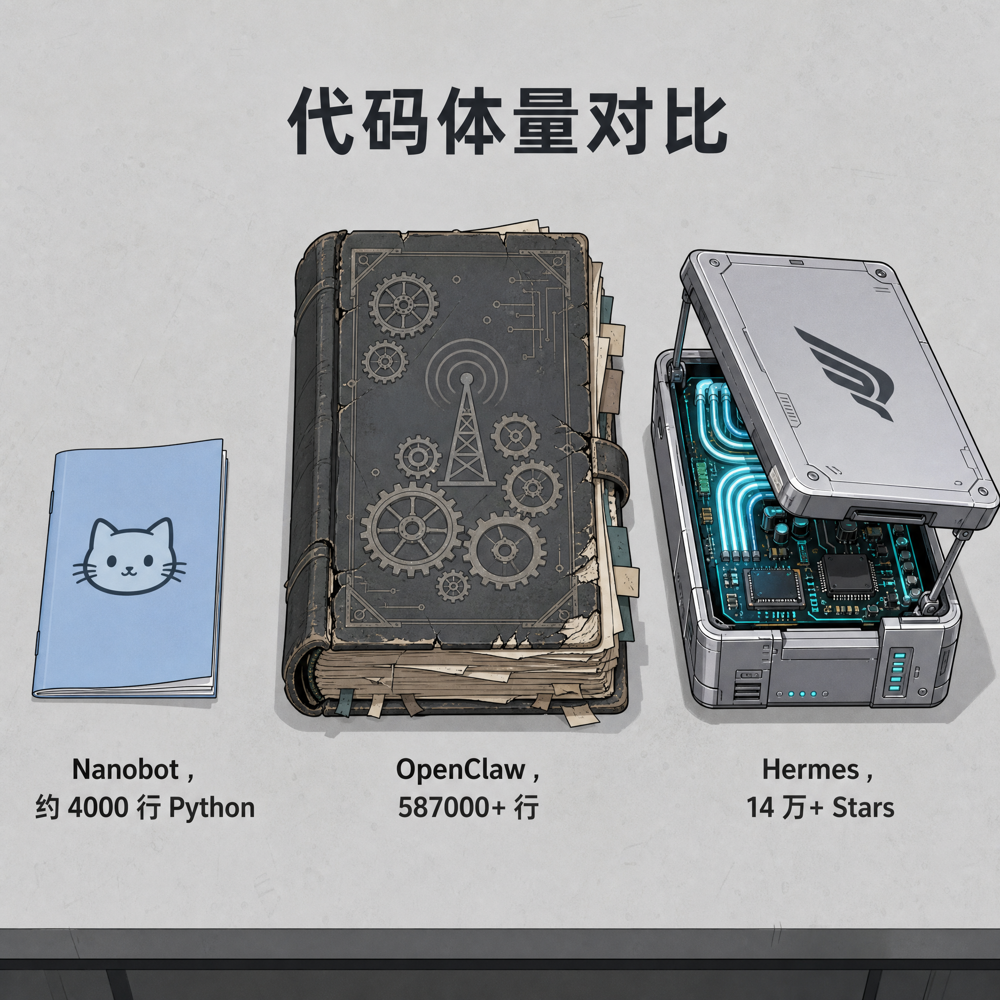
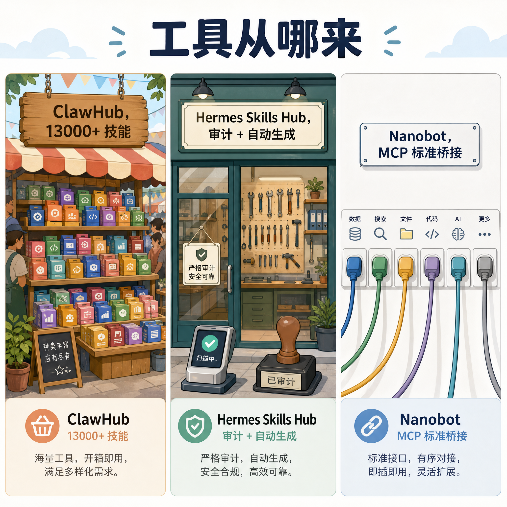
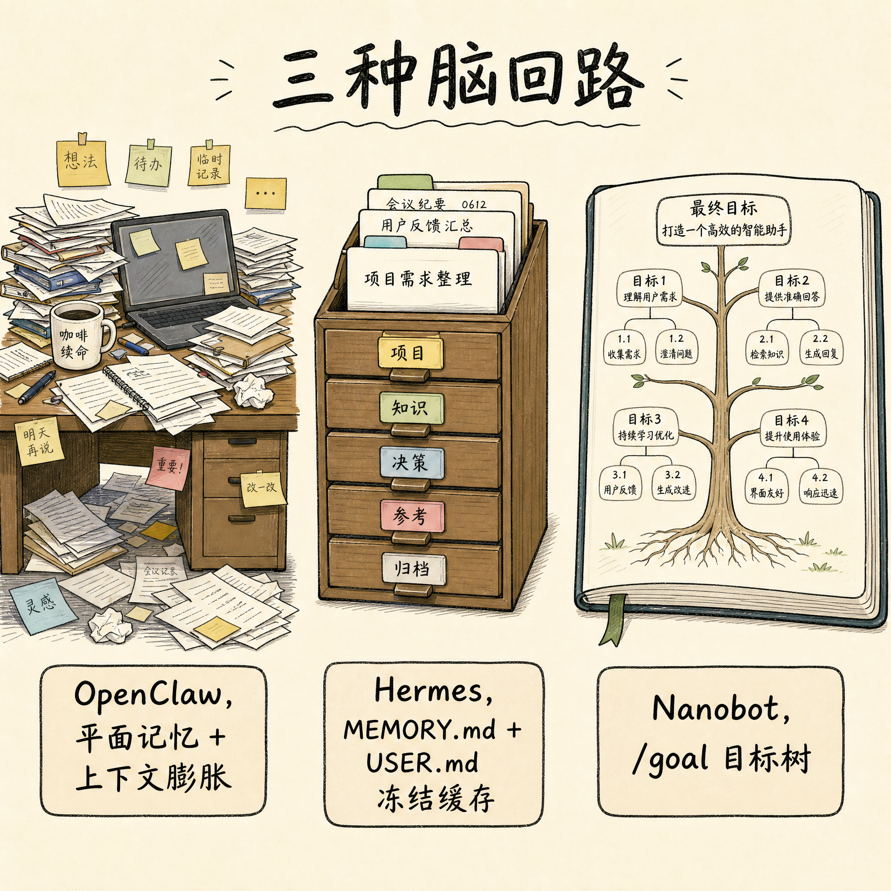
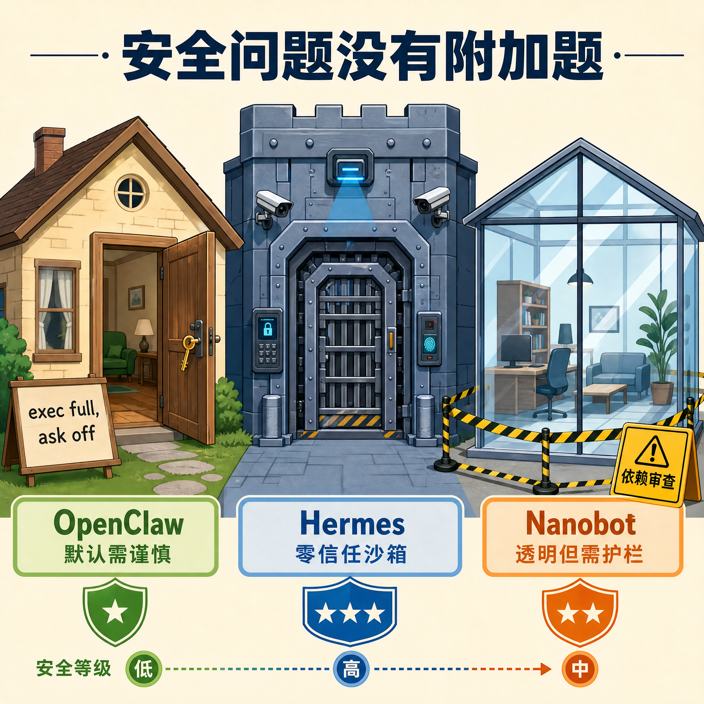
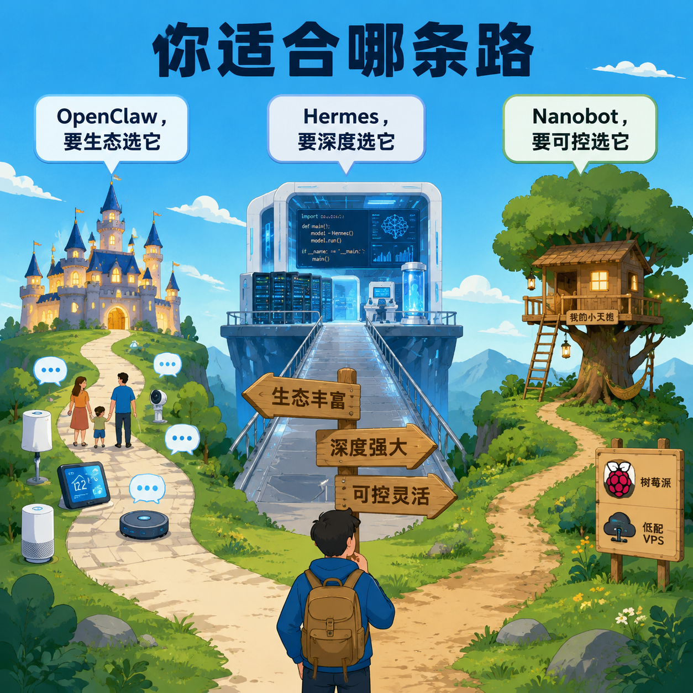

# 四千行 Python 的 Nanobot，凭什么在个人 AI Agent 里有一席之地

> 当你想在电脑上养一个 24 小时在线的 AI 助理，通常会遇到三类麻烦。有的装完发现占了半个硬盘，后台还偷偷吃掉一堆内存；有的配置复杂到让你怀疑人生，API 账单像流水；还有的号称开箱即用，但你根本不知道它在后台到底干了什么。香港大学数据科学实验室做的 Nanobot，选择了一种完全不同的思路，把核心压缩到 4000 行 Python，然后靠 MCP 协议借全世界的力。

---

## 一句话总结

**Nanobot 是一个为技术人设计的极简个人 AI Agent**。它没打算当万能平台，也没打算自己长脑子，就是 4000 行 Python，加上 MCP 借工具、/goal 管目标，做成一个 Unix 风格的小玩意。如果你烦透了臃肿的框架、想自己看明白代码在干嘛、或者只是不想为 agent 单独买台服务器，它可能对你胃口。

---

## 01 Nanobot 长什么样

Nanobot 由香港大学数据科学实验室（HKUDS）开源，核心理念是，**agent 框架本身不应该变成代码仓库的堆积地**。

它用纯 Python 写成，核心代码大约 **4000 行**，GitHub 上约 4.4 万 Stars。我花了两个下午把核心逻辑过了一遍，读完的感觉有点像拆完一块机械表，每个零件都看得见，没有藏起来的暗盒。

它的架构很干净。消息从各种通道进来，经过 `MessageBus` 交给 `AgentLoop`，`AgentLoop` 构建上下文后交给 `AgentRunner` 去调用 LLM 和执行工具。工具通过 **MCP**（Model Context Protocol）标准协议接入，支持 stdio、HTTP、SSE 三种传输方式。记忆用 Markdown 文件持久化，`/goal` 指令可以维护跨会话的长期目标树。

这种设计让它看起来不像一个「平台」，更像一个「宿主」。它自己不生产工具，而是给工具提供一个标准化的家。这种轻量感也延续到了安装体验上。

对于习惯了 Claude Code、Cursor Agent 的人来说，Nanobot 的上手方式也很亲切。`pip install nanobot-ai` 或者 `uv tool install nanobot-ai` 就装完了。运行 `nanobot onboard` 会有一个交互式向导帮你初始化配置。最新 v0.2.1 版本把 WebUI 也打包进了 wheel，可以直接在浏览器里当 workbench 用。

---

## 02 4000 行代码，是偷懒还是刻意

第一次看到 4000 行这个数字，我下意识觉得是不是功能砍太多了。但仔细看了它的设计后，我觉得这是故意的。

个人 agent 这个圈子有个怪现象，框架做着做着就膨胀成操作系统。OpenClaw 就是典型，它的目标是「连接一切」，所以自己实现了 24 种以上即时通讯平台的接入，还有 Windows Hub、macOS App、Android/iOS 节点。

桌面协议层也没放过，屏幕截图、摄像头调用、语音合成全都要管。结果是代码量约 58.7 万行，维护复杂度和资源占用都很高。

Nanobot 选择不接这个锅。它只做 agent 最核心的几件事，消息路由、上下文管理、LLM 调用、工具调度。至于怎么接 WhatsApp、怎么控制智能家居、怎么读数据库，全部交给 MCP 服务器。

MCP 是 Anthropic 推动、整个行业都在跟进的标准协议，可以理解为 AI 世界的 USB-C。越来越多的工具开始提供 MCP 接口，Nanobot 只要支持 MCP，就能自动拥有这些能力。它不需要在自己的仓库里堆几万行工具代码，却能蹭上整个行业的生态。

这跟 Hermes Agent 也不一样。Hermes 也不臃肿，但它把精力花在了另一个方向，让 agent 自己学会新技能。它的 `skill_manage` 模块会在 agent 解决复杂任务后，自动把经验写成 `SKILL.md` 存起来。Nanobot 没有这种自主进化机制，它的技能来源就是 MCP 和你自己写的配置。

所以三家的代码量差异，反映的是三种不同的边界感。OpenClaw 的策略是包圆，Hermes 想陪你一起变聪明，Nanobot 的态度则是，我就干 agent 的本职，其他的借。

对喜欢 Unix 哲学的人来说，Nanobot 的边界感很舒服。

---

## 03 工具靠 MCP 借，到底靠不靠谱

Nanobot 最 radical 的设计，就是完全拥抱 MCP，不自建庞大的技能仓库。

具体怎么用？读本地文件就接一个 `@modelcontextprotocol/server-filesystem`，搜索网页就接 Kagi 或 Tavily 的 MCP 服务，查数据库就找对应的数据库 MCP 服务端。启动时，Nanobot 会自动收集这些工具的 schema 并注册好。

这个方案的优点很直接，**轻、透明、跟行业同步**。你不需要等 Nanobot 官方支持某个具体工具，只要那个工具有 MCP 版本，立刻就能用。而且你的工具列表完全由配置决定，不会出现「为了用一个功能而引入一整个大礼包」的情况。

缺点也很直接，**如果某个具体工具没有 MCP 版本，你需要自己包装**。这对普通用户是个门槛，但对会写代码的人来说只是多写几行配置。

相比之下，OpenClaw 的 **ClawHub** 有 **13000 多个**社区技能，开箱即用程度最高。但这也意味着质量参差不齐，而且 2026 年初的 ClawHavoc 供应链攻击证明，技能市场越大，被恶意包渗透的风险越高。

Hermes 走中间路线。它的官方 **Skills Hub** 有严格审计，而且还支持**自主技能构建**。agent 自己解决复杂问题后，会把步骤写成 `SKILL.md`，下次直接复用。这种「边用边学」的能力是 Hermes 的核心竞争力，也是 Nanobot 完全没有的。

所以工具策略可以这么理解。OpenClaw 像超市，货架上堆了 13000 多个第三方技能，挑起来爽，但踩雷的风险也高，ClawHavoc 那次供应链攻击就是例子。Hermes 像带认证的工坊，工具都要过审，而且还会自己造新工具。Nanobot 没这么热闹，它就是一面标准接口墙，有插头就能用。

---

## 04 /goal 目标树，是 Nanobot 比较亮眼的设计

Nanobot 的记忆机制不算复杂，但有一个设计很亮眼，就是 `/goal` 目标管理指令。

个人 agent 要处理长期任务，比如「帮我跟踪这个 GitHub issue 的进展，每天提醒我一次」，或者「接下来两周帮我收集关于 MCP 的资料」。这种任务不能依赖单次会话的对话历史，因为会话一断就丢了。

Nanobot 的做法是维护一个**目标树**。你可以用 `/goal` 创建主目标和子目标，每个子目标可以设置超时和重试逻辑。目标状态跨会话持久化，agent 会按照目标树的结构推进任务。

这个设计没有 Hermes 的记忆系统那么精密，但很实用。Hermes 在本地 `~/.hermes/memories/` 下严格划分了 `MEMORY.md`（2200 字符硬性限制）和 `USER.md`（1375 字符硬性限制）。

这些数字不是随便定的，是为了刚好塞进支持 Prompt Caching 的模型前缀窗口，让多轮请求的缓存命中率拉满。它还通过 `SubdirectoryHintTracker` 动态加载局部规则，用完就卸载。

这种设计对缓存和成本控制非常友好，但也更复杂。Nanobot 的 `/goal` 更像一个待办事项树，简单、可见、好调试。

OpenClaw 的记忆则是另一个极端。它把对话历史、临时变量、向量检索召回的信息直接拼进当前上下文，长期运行容易膨胀，甚至会把几天前的会话变量混进当前任务。

所以三家三种风格。OpenClaw 的记忆像我的电脑桌面，东西都在，但找起来靠运气。Hermes 像那种分类狂魔的卡片盒，每个格子有严格尺寸。Nanobot 简单得多，`/goal` 就是几页 Markdown，翻起来不费劲。

---

## 05 安全这件事，小不代表天然安全

Nanobot 因为代码少，有一个天然优势，**极易审计**。你不需要借助复杂的自动化工具，自己就能把核心逻辑看一遍。这种透明感本身就是一种安全。

不过别误会，代码少和「安全」是两回事。Nanobot 的架构比较依赖底层依赖库，如果某个依赖有漏洞，整个系统都会受影响。research 里提到一个事件，Nanobot 因为底层调用了带漏洞的 LiteLLM 依赖，被黑客通过特定输入触发内存越界泄露，导致本地 config 里的 API Key 和系统凭证被外发。看到这条的时候我立刻检查了自己的 LiteLLM 版本，建议你如果也在用 Nanobot，也顺手检查一下，这种依赖链上的漏洞，小框架确实比大框架更难防御。

这个事件说明，轻量级框架需要像 Hermes 那样构建系统级沙箱作为后盾，而不是只依赖自己的小体积。

Hermes 的安全设计很严密。它默认在沙箱里执行所有命令和外部代码，Docker 沙箱是持续维持状态的 VM，资源严格限制，还剥离了 Linux Capabilities。

运行时还有静态威胁扫描器，会拦截 `ignore previous instructions`、`do not tell the user`、`curl $API_KEY` 等可疑指令。敏感写操作可以开启 `write_approval`，先生成 diff 等用户确认。

OpenClaw 的安全历史则比较坎坷。它默认把 `exec` 执行器的 `security` 配成 `full`，`ask` 配成 `off`，agent 可以在不询问的情况下以当前用户权限执行 shell 脚本。加上 ClawHub 的供应链攻击事件，OpenClaw 用户必须主动加固。

三家安全策略差别很大。Hermes 默认全副武装，Docker 沙箱、资源限制、Capabilities 剥离，可疑指令自动拦截。Nanobot 像一间玻璃小屋，里面看得一清二楚，但你得自己在外围拉警戒线。OpenClaw 功能很强，默认状态却有点像大门敞开，需要用户手动上锁。

---

## 06 部署成本，是 Nanobot 另一个值得说的优势

如果你只是想低成本地跑一个个人 agent，Nanobot 的优势非常明显。

它可以跑在 **512MB RAM** 的树莓派上，或者每月 5 美元的低配 VPS 上。安装就是一条 pip 命令，启动速度快，后台开销极小。对于不想为了 agent 专门买一台机器的人来说，这很有吸引力。

OpenClaw 则是另一个极端。它需要常驻后台维护多个伴侣节点和 WebSocket 心跳，资源占用明显更高。如果你的机器配置一般，或者希望 agent quietly 躲在后台，可能会觉得它有点重。

Hermes 的资源策略很聪明。它支持 Modal、Daytona 等 Serverless 后端，没有交互时沙箱完全冻结，不消耗算力也不计费；收到消息时毫秒级冷启动唤醒。这种模式很适合云端部署，兼顾了可用性和成本。

API Token 成本方面，Nanobot 也有自己的省钱技巧。它支持 `modelPresets` 和 `fallback_models`，可以把日常琐事派给便宜的本地模型或轻量模型，复杂任务再交给 Claude 旗舰版。这样日常运行的账单可以压得很低。

Hermes 虽然初始 Token 开销大，但因为 Prompt Caching 命中率可以接近 **90%**，长期账单反而可控。OpenClaw 则因为缺乏冻结优化，长会话里每次请求几乎都是全文本计算，账单容易不知不觉膨胀。

我自己用下来，Nanobot 的日常账单确实最低，日常琐事丢给便宜模型，复杂任务再切 Claude 旗舰版，不会心疼。Hermes 初始开销大，但缓存拉满后长期可控。OpenClaw 则要小心，资源和账单都容易不知不觉膨胀。

---

## 07 最小上手 demo

说了这么多，最实际的问题还是，怎么跑起来。

如果你只是想先试一把，三步就够了。

第一步，安装。`uv tool install nanobot-ai` 比 pip 更快，装完后 `nanobot --version` 确认一下。

第二步，初始化。运行 `nanobot onboard`，它会问你 provider、model、API key。我通常选 OpenRouter，model 填 `anthropic/claude-sonnet-4`，然后把自己的 API key 贴上。配置会写到 `~/.nanobot/config.json`。

第三步，发一条消息。`nanobot agent -m '帮我列出 ~/.nanobot/workspace 下的文件'`，如果一切正常，它会调用内置的文件工具给你一个列表。

到这一步，你只是用了内置工具。真正体现 Nanobot 特点的是接 MCP。以 filesystem MCP 为例，在 `config.json` 的 `tools.mcpServers` 里加一段配置，指向一个你想让 agent 访问的目录。重启 gateway 或重新运行 agent，agent 就会自动多出一组文件操作工具。

不用写任何 Python 代码，你的 agent 就多了读写某个目录的能力。这种「借工具」的体验，就是 Nanobot 的核心手感。

---

## 08 那到底选谁

聊了这么多 Nanobot，最后还是要回答一个实际问题，跟 OpenClaw、Hermes 比起来，它适合谁？

**选 Nanobot，如果你**

- 讨厌臃肿代码，想自己掌控 agent 的每个行为。
- 硬件预算有限，想在树莓派或低配 VPS 上跑。
- 愿意拥抱 MCP 生态，不介意自己配置工具。
- 主要需求是后台脚本、长期目标跟踪、日常自动化。

**选 Hermes Agent 的话**，通常是你要跑长期复杂任务，比如代码重构、科研数据分析；或者你对安全和沙箱有严格要求；又或者你希望 agent 能自己总结经验、生成技能。它的配置比 Nanobot 复杂，但深度也更高。

**选 OpenClaw 的场景更偏向「全家桶」**。你不是技术用户，只想快速搭一个能回 WhatsApp、管日程、控制智能家居的个人助理，并且愿意为此承受更高的资源占用和安全风险。用它的时候，记得对第三方技能做审查，别默认放行所有权限。

一句话说清三者的区别，Nanobot 适合想自己掌控的人，Hermes 适合要深度能力的人，OpenClaw 适合要生态广度的人。

---

## 总结

Nanobot 让我印象最深的地方，不是它有多少功能，而是它够小。4000 行代码，至少我能看明白它在后台干了什么。

这听起来像个低标准，但在一个动不动几十万行代码的圈子里，这其实是个难得的优势。大家都在往框架里塞东西，它却把核心压到 4000 行 Python，把工具、渠道、记忆这些职责交给更合适的标准或用户自己。

它当然不是万能的。没有 OpenClaw 的生态，没有 Hermes 的沙箱，也没有自主进化的技能系统。但如果你跟我一样，只想在树莓派或老 VPS 上跑一个看得懂、控得住、不占资源的 agent，Nanobot 可能是目前最干净的选择。

我目前还在用它跑一些日常自动化，没遇到大坑。如果你也在找这样的东西，可以试试看。至于 OpenClaw 和 Hermes，我下次折腾完再聊。

欢迎关注我的公众号「Chyris Tech Note」，获取更多 AI 技术解读与实践分享。
