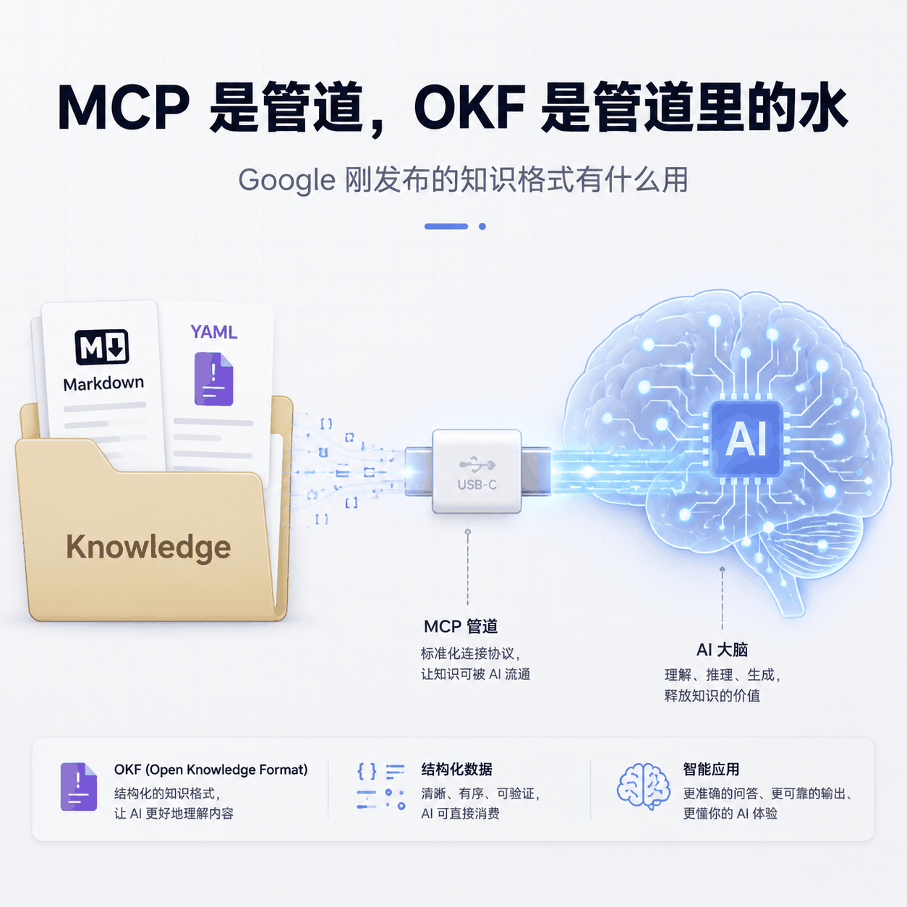
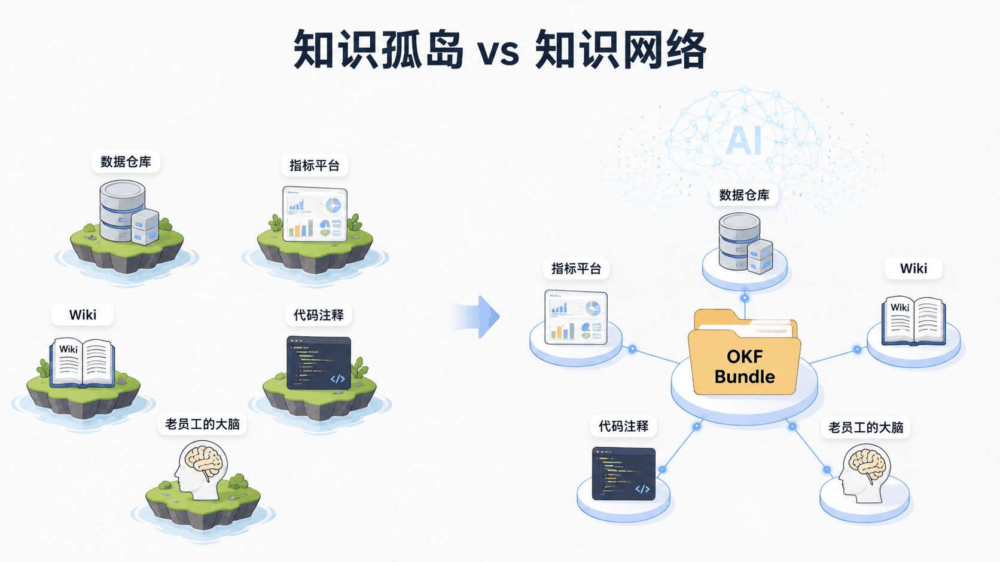
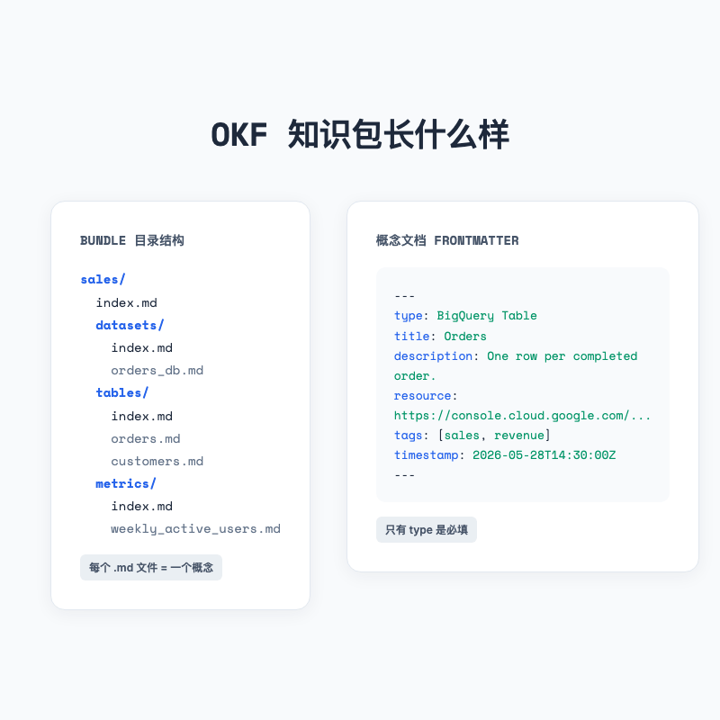
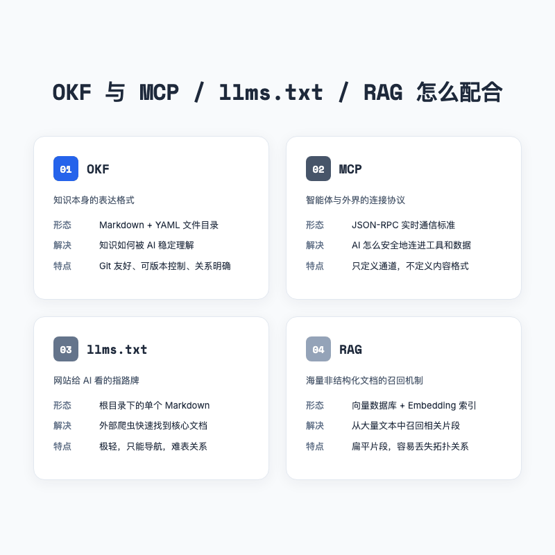
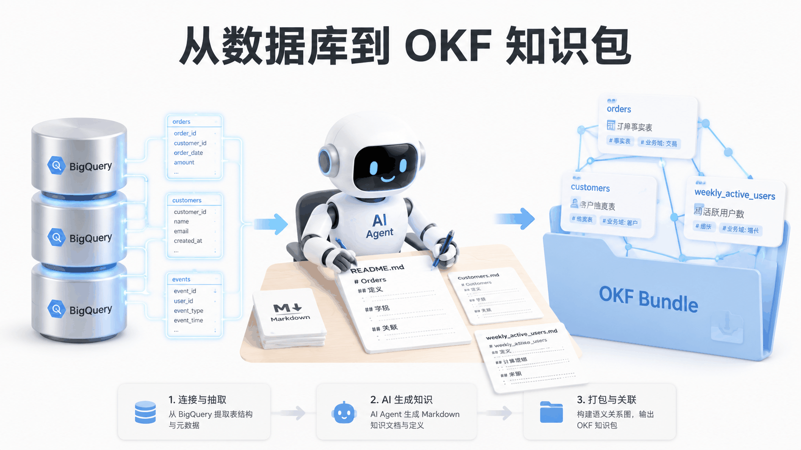
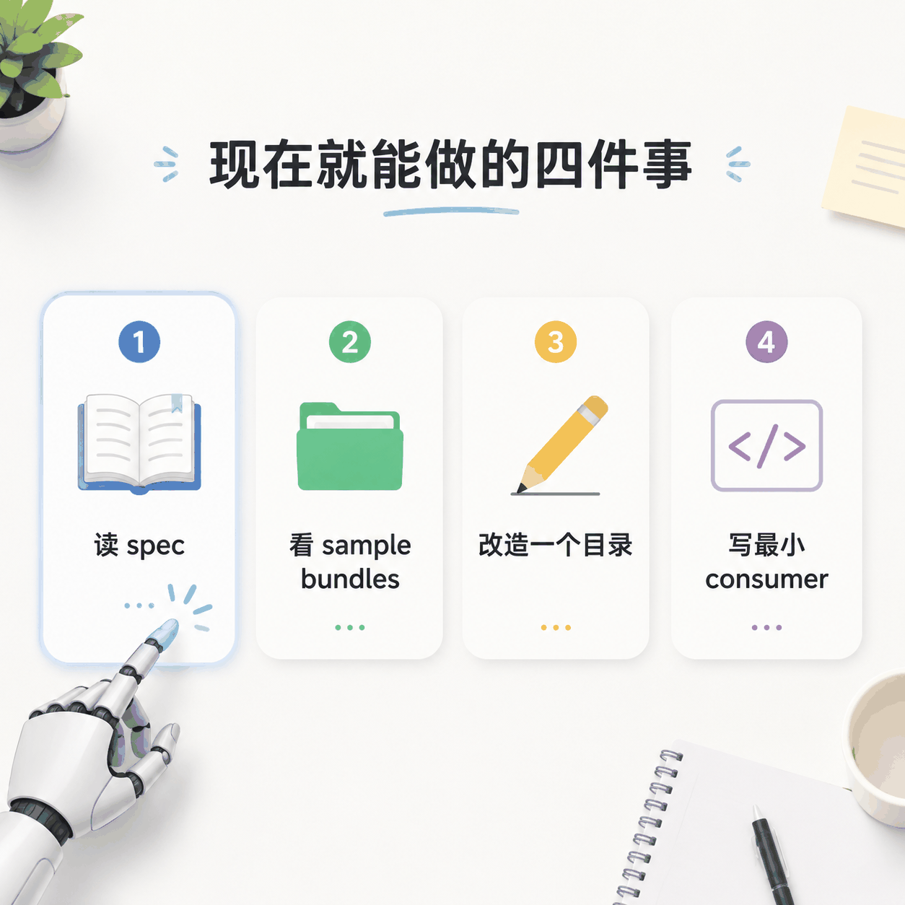

# MCP 是管道，OKF 是管道里的水，Google 刚发布的知识格式有什么用

> 当你问 AI「我们上周的活跃用户数怎么算」，它可能要同时翻数据仓库、指标平台、Wiki 和某个老工程师的聊天记录。问题往往不是模型不够聪明，而是知识本身被困在十几个不同的系统里。



---

## 一句话总结

Google 在 2026 年 6 月开源了一个叫 Open Knowledge Format（OKF）的标准。它把 AI 需要的知识打包成一组带 YAML 前导的 Markdown 文件，人类能读、智能体能读，还能丢进 Git 做版本控制。

---

## 01 真正卡住 AI 的，不是模型能力，而是上下文装配

前段时间和一个做数据平台的朋友聊天。他说他们团队接入大模型已经半年，效果时好时坏。

同一个问题，「本周活跃用户数环比下降，帮我定位原因」，有时候 AI 能给出靠谱的分析路径，有时候却会把已经下线的字段当成主键，或者把两个口径不同的指标混为一谈。

他们排查了很久，发现问题不在模型。GPT-4、Claude、Gemini 都能写 SQL，都能做归因。真正让结果翻车的，是 AI 拿到的上下文不完整。

业务指标的定义躺在指标平台里，字段含义藏在数据仓库的注释里，Join 路径只有老工程师记得，而某个字段上周刚改过一次口径，通知却发在 Slack 的一个子频道里。

**每个 AI 项目上线前，团队都要重新做一遍「上下文装配」。** 从不同的系统里把知识捞出来，清洗、对齐、写成 prompt，再塞进模型。新项目来了，再重复一次。

这就像是每换一部手机，都要重新买一根充电线。不是手机不够先进，是接口没统一。



---

## 02 OKF 是什么，一句话加一杯咖啡的时间

OKF 的全称是 Open Knowledge Format，Google Cloud 在 2026 年 6 月 12 日发布的 v0.1 草案。

它其实就是个**文件级别的开放标准**，不是某个云产品，也不是 Google 专有。

OKF 把知识表示成一棵树状的文件夹，里面全是 Markdown 文件。每个文件代表一个「概念（concept）」，可以是一张表、一个指标、一个 API、一份故障处理手册，甚至是一条业务规则。

文件的相对路径去掉 `.md` 就是这个概念的全局 ID。比如 `/tables/orders.md` 就是 orders 这张表的概念文档。

每个概念文件分两部分。

**上面是 YAML 前导**，只要求一个必填字段 `type`，其他都是推荐字段。

```markdown
---
type: BigQuery Table
title: Orders
description: One row per completed customer order.
resource: https://console.cloud.google.com/bigquery?p=acme&d=sales&t=orders
tags: [sales, revenue]
timestamp: 2026-05-28T14:30:00Z
---
```

**下面是 Markdown 正文**，写 Schema、写示例、写 Join 路径，完全自由。

概念之间用普通 Markdown 链接互相引用，比如 `[customers](/tables/customers.md)`。链接多了，这些孤立的概念就被串了起来，整个文件夹也就从一棵树变成了一张知识图谱。

如果你用过 Obsidian vault、Notion 知识库，或者 Karpathy 那个著名的 LLM Wiki gist，这个形态会很熟悉。OKF 没发明新东西，它只是把大家已经在用的 LLM-wiki 模式做了标准化，让不同人写的知识包能被不同的 AI 智能体直接消费。



来源，Google Cloud Blog「How the Open Knowledge Format can improve data sharing」

---

## 03 Google 为什么现在做这件事

AI 应用正在从「玩具」变成「工作流」。今年上半年，几乎每个团队都在讨论 Agent、RAG、MCP。

至少我今年接触到的项目里，模型能力的差距在缩小，上下文质量的差距反而在放大。

同样的 Claude 4，喂给它干净的业务语义和干净的 Schema，它能写出漂亮的分析；喂给它碎片化、互相矛盾的知识，它也会一本正经地胡说。

Andrej Karpathy 在去年那个 LLM Wiki gist 里写过一句话，我印象很深。

> 「LLMs don't get bored, don't forget to update a cross-reference, and can touch 15 files in one pass.」

人维护 wiki 会懒、会忘、会嫌麻烦，但 LLM 不会。既然 LLM 能自动维护链接、不会偷懒，那知识是不是也可以像代码一样被版本化和自动化处理？这就是「知识即代码（Knowledge as Code）」开始流行的原因。

OKF 出现之前，这种 wiki 模式已经在各种地方冒出来了。Obsidian + coding agent、CLAUDE.md / AGENTS.md、数据团队里的 metadata-as-code 仓库，本质上都是同一套思路。

但问题是，每个团队都在用自己的约定。文件名什么意思、frontmatter 里该写什么字段、链接怎么写，没有统一答案。结果是，知识仍然被困在各自的 wiki 里。

Google 选择在这个时间点发布 OKF，更像是想给这个正在生长的生态定一个通用接口。它就像 USB-C，不生产数据，只是让大家能用同一根线。

来源，Google Cloud Blog 与 Karpathy LLM-wiki gist

---

## 04 MCP 是管道，OKF 是管道里的水

很多人第一次听到 OKF 会下意识问，这和 MCP 有什么区别？

一句话区分，**MCP 解决的是「怎么连」，OKF 解决的是「连过去之后传什么」。**

MCP 是模型上下文协议，定义的是 AI 客户端和外部工具、数据库、API 之间的通信方式。它是一套 JSON-RPC 通道，让智能体能调用你的文件系统、数据库、浏览器。

OKF 不是协议，是格式。它不关心数据怎么传，它关心传过去的内容长什么样。换句话说，MCP 负责把 agent 接到你的数据库门口，OKF 负责告诉它「这张表叫 orders，主键是 order_id，那个已经下线的字段别碰」。

打个比方，MCP 是管道，OKF 是管道里流动的水。没有管道，水送不到；没有水，管道是空的。

实际生产中它们完全互补。你可以写一个 MCP server，暴露的核心资源就是本地 Git 仓库里的一套 OKF 知识包。智能体通过 MCP 连进来，然后按照 OKF 的 `index.md` 一层层导航，沿着超链接追 Join 路径，最终拿到高确定性的业务上下文。

既然说到定位，免不了还要和另外两个经常被提到的方案做对比，`llms.txt` 和传统 RAG。

`llms.txt` 更像一个网站给 AI 看的「指路牌」，站在根目录告诉爬虫哪些文档重要。它很轻，但也只能指路，没法表达复杂的关系。

RAG 则是在一堆文档里做向量相似度召回，适合处理海量非结构化的材料。但它切出来的片段是扁平的、没有拓扑的，很容易丢失上下文。

OKF 的定位在这两者之间。它比 llms.txt 重一点，又比 RAG 更有结构；和 MCP 比，它是静态的、偏内容的。它适合承载企业内部那些有明确关系、需要版本控制、需要人类审核的「高价值知识」。



---

## 05 Google 放了哪些参考实现出来

为了降低上手门槛，Google 在 GitHub 上开源了三样东西。

第一样是 Enrichment Agent，一个基于 LLM 的生产端参考实现。你把它指向一个 BigQuery 数据集，它会自动遍历所有表和视图，为每个资产生成一份 OKF 概念文档。然后它还会第二轮爬取官方文档，把字段含义、表间 Join 路径、示例 SQL 自动补进 Markdown 里。听起来很理想，但实际效果取决于你的表注释写得怎么样。如果注释本来就是乱的，AI 也只能把乱摊子整理成结构化乱摊子。你可以想象，它生成的文档就像一份精致的病历，结构对，病因还是错的。

换句话说，它能把一个冷冰冰的数据库，编译成一本 AI 能读的数据字典。

第二样是个很妙的小工具，Static HTML Visualizer。整个工具就是一个单文件 HTML，不需要后端，不需要安装，在浏览器里打开就能读取本地的 OKF 知识包，把概念和链接画成一张交互式图谱。这个设计证明了 OKF 作为一个静态文件格式，可以被零泄露、零依赖地消费，敏感数据不需要上传到任何云端。

第三样是三个 sample bundles（示例包），GA4 电商数据集、Stack Overflow 数据集、Bitcoin 区块链数据集。全部是 Enrichment Agent 自动生成的真实示例，可以直接拿来参考 OKF 长什么样。



来源，GitHub `GoogleCloudPlatform/knowledge-catalog/tree/main/okf`

---

## 06 最小可复现 demo，你的第一个 OKF 知识包

OKF 的门槛其实很低。你甚至不需要写代码，只要会写 Markdown 就能开始。我自己试了一下，最简单的方式就是拿你现有的笔记开刀。

假设你有一个个人知识库，里面有一篇「用户增长指标」的笔记。你可以把它拆成 OKF 的形态。

目录结构可以长这样。

```
my-knowledge-bundle/
├── index.md
├── metrics/
│   ├── index.md
│   └── weekly_active_users.md
└── tables/
    ├── index.md
    └── events.md
```

`metrics/weekly_active_users.md` 的内容可以写成这样。

```markdown
---
type: Metric
title: Weekly Active Users
description: 过去 7 天内至少完成一次核心行为的独立用户数。
tags: [growth, product]
timestamp: 2026-07-10T00:00:00Z
---

# Definition

WAU = count(distinct user_id) where event_date between 6 days ago and today.

# Source

基于 [events](/tables/events.md) 表，按 `user_id` 去重。

# Owner

增长团队，口径变更请在 #growth-metrics 频道同步。
```

一个 agent 读到这里，不需要再问「这个指标从哪张表来」「owner 是谁」，因为答案就在文件里，而且可以用 Git 做版本控制。

这就是 OKF 的实用之处。它没想把 wiki 搞复杂，只是想让每一页都能被机器稳定理解。

---

## 07 三个值得关注的趋势

OKF 看起来只是个文件格式，但它踩中了三个正在发生的趋势。下面是我的判断，不是 Google 的官方承诺。

这三个趋势其实都指向同一件事，知识正在从「人类随手记的笔记」变成「机器能直接消费的资产」。

**第一，Agentic Accessibility（智能体可访问性）会吃掉一部分 SEO 的红利。**

过去企业做官网是为了被搜索引擎抓到。未来越来越多的用户会直接问 AI，而不是点搜索结果。比如你可能直接问 Perplexity「这家 SaaS 的 SLA 是多少」，而不是去官网翻文档。企业需要把核心能力、SLA、定价逻辑、合规资质编译成 AI 能读懂的知识包，让智能体在生成答案时直接引用官方内容。

**第二，专家经验可能变成可交易的知识资产。**

咨询顾问、行业专家积累下来的排障流程、审计模板、合规检查清单，可以封装成一套 OKF 知识包卖给企业。企业像合并代码一样把它 merge 进自己的知识目录，AI 瞬间就具备了专家级的处理能力。这种资产很轻，边际成本接近零。

**第三，本地合规和主权 AI 会因此更容易落地。**

OKF 只是本地文件，不需要上传到任何 SaaS。放在内网 Git 仓库里，配合本地部署的大模型，敏感 metadata 一个字节都不用出公司网络。这对金融、医疗、政务类场景会很有吸引力。

---

## 08 现在就能做的四件事

如果你看完觉得 OKF 确实值得跟踪，可以先从这几件小事开始。

先把 spec（规范）读一遍。OKF v0.1 的完整规范只有一页，比大多数 README 还短。

然后去 GitHub 翻看那三个 sample bundles（示例包），看看 GA4、Stack Overflow、Bitcoin 这些数据集是怎么被表达成 Markdown 的。

接着拿你常用的一个笔记或数据字典开刀，加上 YAML frontmatter，把概念拆成单独文件，用 Markdown 链接把关系串起来。

最后写一个很小的消费端脚本（consumer）。用几十行 Python 读取 bundle 里的 `index.md`，递归解析链接，就能做出一个简单的知识导航器。

这四件事都不需要买云服务，也不需要等 Google 的下一个版本。OKF 从第一天起就不绑定任何平台，本地能跑，也能私有部署，社区还能接着扩展。



---

## 总结

Google 开源 OKF，不像在发新产品，更像在尝试定义一个**AI 时代的通用知识接口**。

它用很小的约束，把企业散乱的业务语义、技术元数据和最佳实践，变成一组 Markdown 文件。人看得懂，机器也解析得了，还能直接丢进 Git。

MCP 解决的是智能体怎么连进你的世界，OKF 解决的是连进来之后，它能不能真正理解你的世界。

对于做数据、做 Agent、做知识管理的人来说，这个标准值得关注。它没空谈未来，而是在解决一个今天已经让人很疼的问题，知识被困在十几个系统里，而每个新 AI 项目都在重复造轮子。

欢迎关注我的公众号「Chyris Tech Note」，获取更多 AI 技术解读与实践分享。

