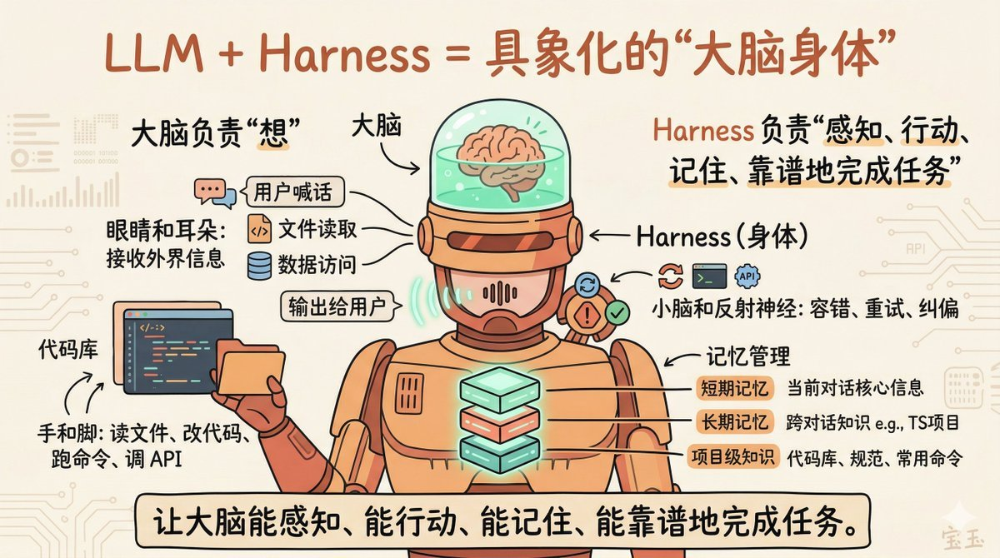
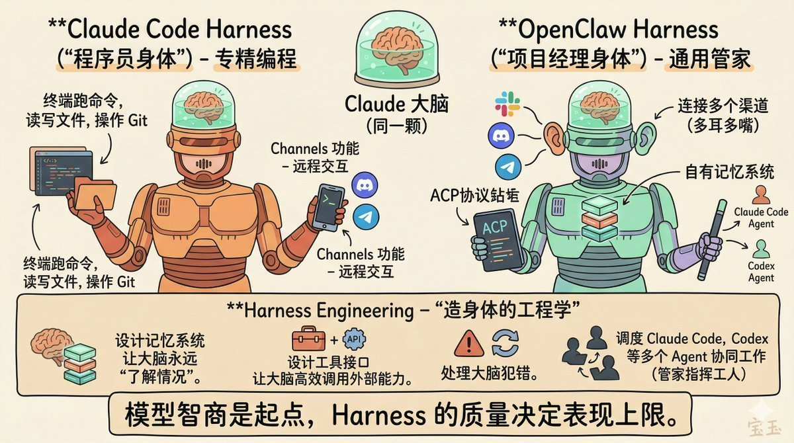
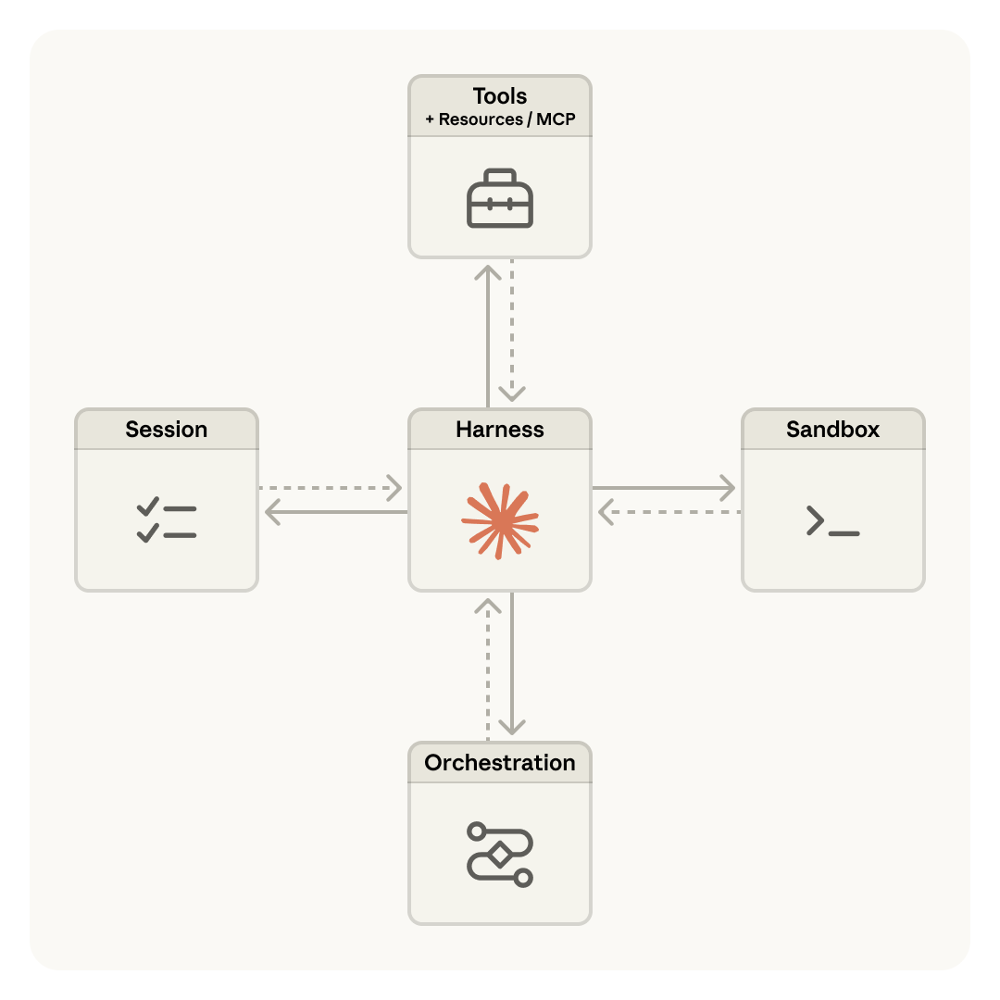
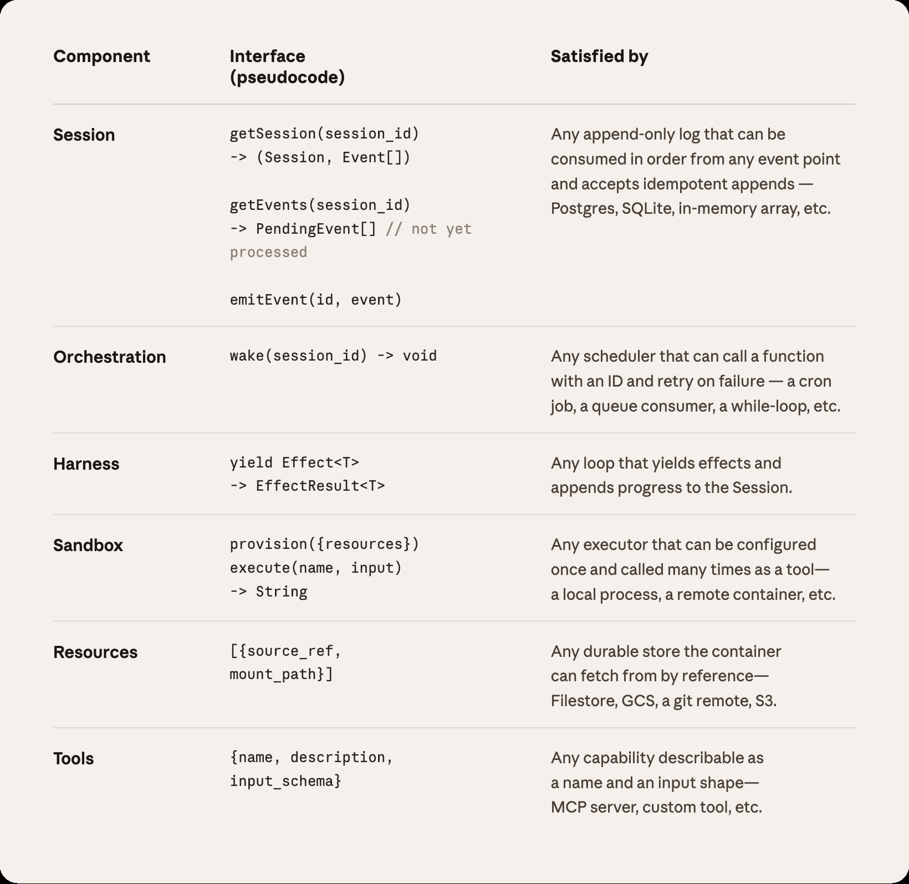
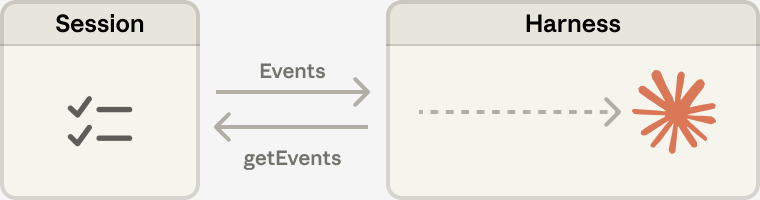

> 同一颗 Claude 大脑，为什么体验天差地别？有人用出天才程序员，有人用出全能管家，还有人养出了会自学的研究员。秘密就在 Harness——给 AI 装上的"身体"。

---

## 一、Harness 是什么？

想象一下：有一个智商200的超级大脑，但它被困在培养皿里——没有眼睛、没有耳朵、没有手脚。你对它说话它听不见，它想帮你做事也做不了。

这就是今天的大语言模型（LLM）。**Harness，就是给这颗大脑装上的"全套身体"。**

### Harness 给大脑装上什么？

| 身体部位 | Harness 对应功能 | 作用 |
|---------|-----------------|------|
| 眼睛和耳朵 | 文件读取、数据访问、用户输入 | 让AI能"看到"外界信息 |
| 嘴巴 | 输出给用户、发送消息 | 让AI能"表达"想法 |
| 手和脚 | 读文件、改代码、跑命令、调API | 让AI能"行动"做事 |
| 小脑和反射神经 | 容错、重试、纠偏机制 | 出错时自动修复 |
| 记忆系统 | 短期记忆+长期记忆+项目知识 | 让AI"记得"你是谁 |

**一句话总结：大脑负责"想"，Harness 负责"让它能感知、能行动、能记住、能靠谱地完成任务"。**

---

## 二、同样是 Claude 大脑，为什么表现天差地别？

你可能用过 Claude Code，也可能听说过 OpenClaw。它们背后都是 Claude 这颗大脑，但体验完全不同。

**秘密就在于：它们用的是不同的 Harness（身体）。**

### Claude Code：程序员专用身体

Claude Code 是 Anthropic 官方打造的 Harness，专为编程场景设计：

- 能直接在终端里跑命令
- 能读写文件、操作 Git
- 整个循环是"想→做→看结果→再想"
- 最近加了 Channels 功能，能通过插件与微信、Telegram 远程交互

**简单说：给 Claude 装了一副"程序员的身体"。**

### OpenClaw：项目经理/管家的身体

OpenClaw（龙虾）则是社区打造的更通用 Harness：

- 能同时连接 Slack、Discord、Telegram 等多个渠道
- 有自己的记忆系统和插件生态（ClawHub）
- 能通过 ACP 协议调度多个 Agent 协同工作

**简单说：给 Claude 装了一副"项目经理的身体"——一个管家指挥多个工人干活。**

---

## 三、新秀登场：Hermes Agent

最近有个新项目势头很猛——**Hermes Agent**（爱马仕，GitHub 已接近 3 万星）。它被认为是 OpenClaw 以来第一个真正意义上的竞争对手。

两者都是自托管开源 Agent，都支持多模型、多平台接入，但设计哲学完全不同：

### 1. 架构理念：网关 vs 引擎

| 维度 | OpenClaw | Hermes |
|-----|---------|--------|
| 核心定位 | Gateway（网关） | Engine（引擎） |
| 设计重心 | 统一接入各种聊天平台 | Agent 自身的执行循环 |
| 类比 | 多渠道个人助理操作系统 | 能自我进化的 Agent 引擎 |

OpenClaw 像一个"调度中心"，把你的各种聊天应用连接到 AI。Hermes 则围绕"Agent 怎么变得越来越强"设计，官方叫 **closed learning loop（闭环学习循环）**。

### 2. 技能系统：人工编写 vs 自动生成

这是 Hermes 最独特的地方：

**Hermes：**
- 完成复杂任务后（通常涉及 5 次以上工具调用），自动生成结构化技能文档（Markdown）
- 下次遇到类似任务，直接加载技能，不用从头解决
- 技能会自我迭代——执行时发现更好的方法，自动更新文档
- Reddit 用户反馈：两小时内生成 3 份技能后，重复任务速度提升 40%

**OpenClaw：**
- 依赖人工编写和社区贡献（ClawHub 技能市场）
- 生态更成熟，选择更丰富

### 3. 记忆体系：搜索引擎 vs 笔记本

| 特性 | Hermes | OpenClaw |
|-----|--------|---------|
| 技术方案 | SQLite + 全文检索 | Markdown 文件 + 语义检索 |
| 记忆分层 | 常驻关键信息（MEMORY.md）+ 全量历史检索 | 工作区文件即记忆 |
| 容量 | 无限容量，按需调用 | 依赖文件系统 |

简单说：**Hermes 像给 Agent 装了一个搜索引擎式的大脑，OpenClaw 像是给它一个笔记本。**

### 4. 安全思路

**Hermes：**
- 五层纵深防御：用户授权、危险命令审批、容器隔离、凭据过滤、上下文注入扫描
- 默认对高风险操作（执行终端命令、写文件）要人工审批
- 超时未批准自动拒绝

**OpenClaw：**
- 强调信任模型和配置审计
- 提供 `openclaw security audit` 命令扫描隐患
- 但历史上曾有安全问题：2 月被曝多个高危漏洞，13.5 万个实例暴露公网，300+ 恶意技能

---

## 四、Anthropic 的官方答案：Managed Agents

面对 Harness 的复杂性，Anthropic 推出了 **Managed Agents**——一个托管服务，帮用户搞定所有 Harness 的脏活累活。

### Managed Agents 的核心理念

Anthropic 发现，**Harness 会随着模型迭代而过时**。比如 Claude Sonnet 4.5 有"上下文焦虑"（快用完上下文窗口时提前结束任务），需要 Harness 来重置上下文；但 Claude Opus 4.5 就没有这个问题——之前的 Harness 优化变成了"死重"。

所以 Anthropic 设计了一个**能经得起时间考验的架构**：把 Agent 拆成三个独立组件，通过标准接口通信。

### 三个核心组件

| 组件 | 作用 | 类比 |
|-----|------|------|
| **Session（会话）** | 只追加的事件日志，记录所有历史 | 外部硬盘 |
| **Harness（大脑+身体）** | 调用 Claude 并将工具调用路由到基础设施 | 操作系统 |
| **Sandbox（沙盒）** | 执行代码和编辑文件的环境 | 手和脚 |

### "大脑"与"手"解耦

传统架构把 Harness 和 Sandbox 放在同一个容器里，导致：
- 容器挂了，Session 就丢了
- Harness 假设所有资源都在它旁边，无法连接用户的私有云

**Managed Agents 的解决方案：**

1. **Harness 离开容器** → 通过 `execute(name, input)` 调用 Sandbox，像调用任何其他工具一样
2. **Sandbox 变成"牲畜"** → 如果容器死了，Harness 捕获错误传给 Claude，Claude 决定重试时新建一个
3. **Harness 也变成"牲畜"** → 因为 Session 在外部，Harness 崩溃后可以重启，通过 `wake(sessionId)` 恢复

**效果：**
- 启动时间（TTFT）的中位数降低 60%，95 分位数降低 90% 以上
- 可以连接用户的私有云资源
- 一个 Harness 可以管理多个 Sandbox（多手），多个 Harness 可以共享 Session（多脑）

### Session 不是上下文窗口

长任务会超出 Claude 的上下文窗口，传统做法（压缩、修剪）都是**不可逆的决策**——你不知道未来需要哪些信息。

Managed Agents 的 Session 是一个**存在于上下文窗口之外**的上下文对象。Harness 可以通过 `getEvents()` 接口灵活地读取历史事件的任意片段，甚至可以在传给 Claude 之前进行转换。

### 安全边界

传统架构中，不可信代码和凭证在同一个容器里运行——提示注入攻击只需要说服 Claude 读取自己的环境变量。

Managed Agents 把凭证放在 Vault 里，通过代理访问：
- Git 令牌在 Sandbox 初始化时注入本地 git remote，Agent 从不直接接触
- MCP 工具的 OAuth 令牌存在 Vault，通过代理调用

---

## 五、普通人如何选择？

### 如果你现在用着顺手——不用换

如果你的 Agent 已经满足需求，没必要折腾。工具是为人服务的，不是人为工具服务。

### 如果你想要"零运维"体验——选 Managed Agents

不想折腾 Harness、Sandbox、Session 这些概念，希望开箱即用——**选 Anthropic Managed Agents**。它托管在 Claude Platform 上，你只需关注任务本身。

### 如果你想要"多渠道助理平台"

需要接入 微信、飞书、QQ，想用社区现成的技能市场——**选 OpenClaw**。34.6 万星标不是白来的，生态更成熟。

### 如果你关心 Agent 的长期进化能力

希望它用得越久越聪明，或者你是做 AI 研究的，需要生成训练轨迹、跑强化学习实验——**选 Hermes**。它的闭环学习架构更对口。

### 如果你想要编程专用助手

主要是写代码、改代码、跑命令——**选 Claude Code**。这是官方为编程场景专门优化的 Harness。

### 成本参考

| 方案 | 成本 | 特点 |
|-----|------|------|
| **Claude Code** | Anthropic 订阅费 | 官方出品，编程专用 |
| **Managed Agents** | 按使用量计费 | 零运维，托管服务 |
| **OpenClaw** | 自托管，取决于部署 | 生态成熟，多渠道 |
| **Hermes** | 5 美元/月 VPS 起步 | 自进化，研究友好 |

---

## 六、一个值得思考的未来

Anthropic 在文章中引用了一个计算机科学的经典问题：**如何为"尚未被想到的程序"设计系统？**

操作系统给出的答案是——虚拟化硬件为通用抽象（进程、文件），让抽象比实现更持久。`read()` 命令不关心底层是 1970 年代的磁盘还是现代 SSD。

**Managed Agents 遵循同样的模式：**

> 我们对接口的形状有主见，但对背后运行什么没有主见。

这意味着：
- 今天的 Harness 实现可以被明天的更好实现替换
- 你可以用自己的 Harness，只要符合接口规范
- Claude Code、Hermes、OpenClaw，理论上都可以跑在 Managed Agents 的基础设施上

**模型智商是起点，Harness 的质量决定了实际表现的上限。**

同一颗 Claude 大脑，Claude Code 让它成为天才程序员，OpenClaw 让它成为全能管家，Hermes 让它成为会自学的研究员，Managed Agents 让它成为即插即用的云服务。

**选 Harness，就是选你想要的"身体"。**

---

## 参考来源

- [Scaling Managed Agents: Decoupling the brain from the hands](https://www.anthropic.com/engineering/managed-agents) - Anthropic Engineering Blog
- [Building effective agents](https://www.anthropic.com/engineering/building-effective-agents) - Anthropic
- [Effective harnesses for long-running agents](https://www.anthropic.com/engineering/effective-harnesses-for-long-running-agents) - Anthropic
- 宝玉老师分享的 Hermes Agent 使用体验

---

*本文部分素材来源于宝玉老师的分享，感谢开源社区的贡献者们。*
