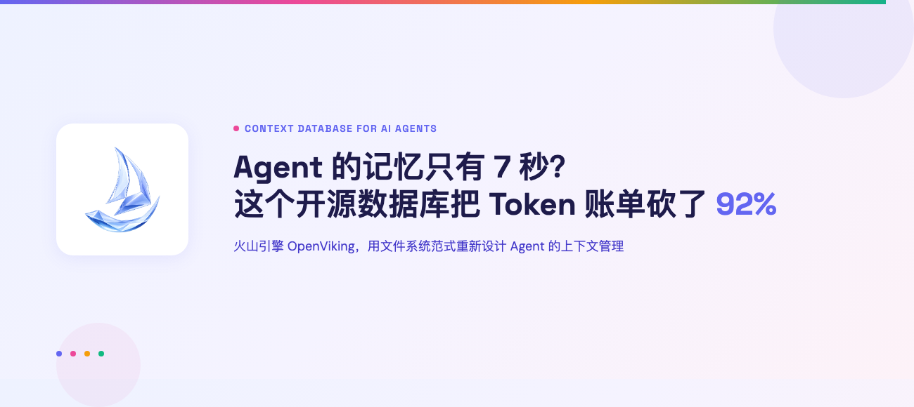
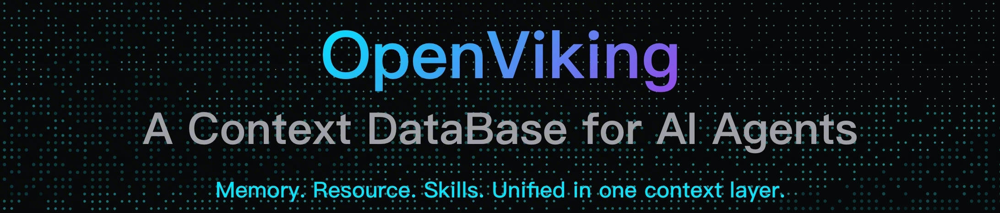
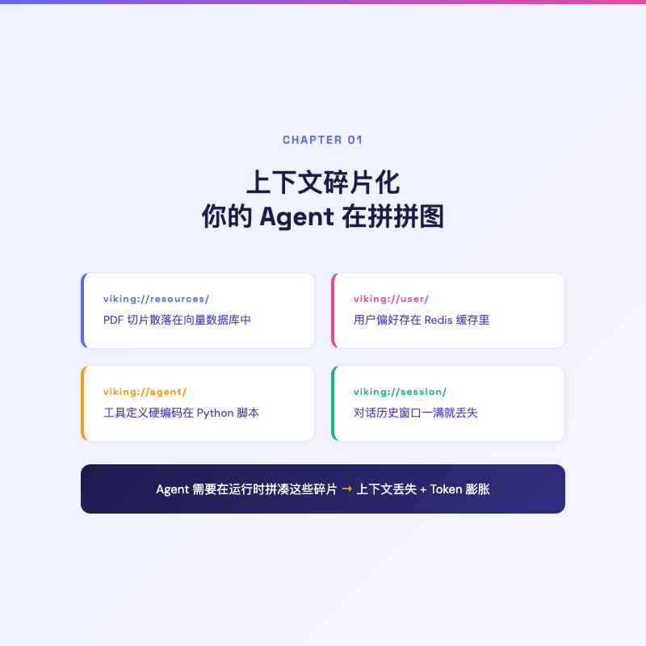
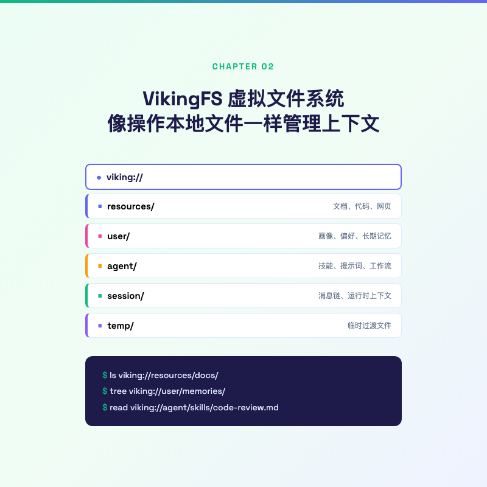
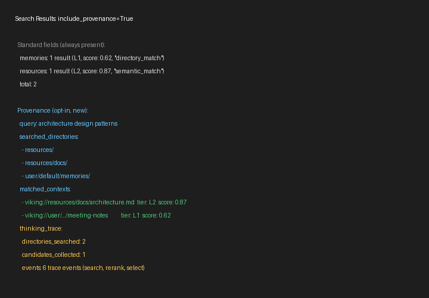
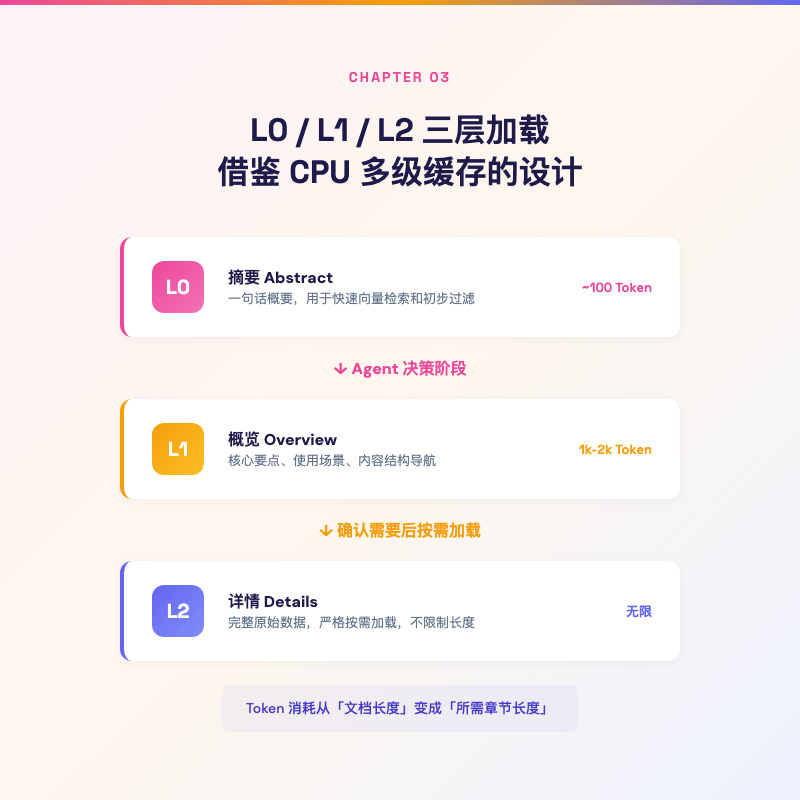
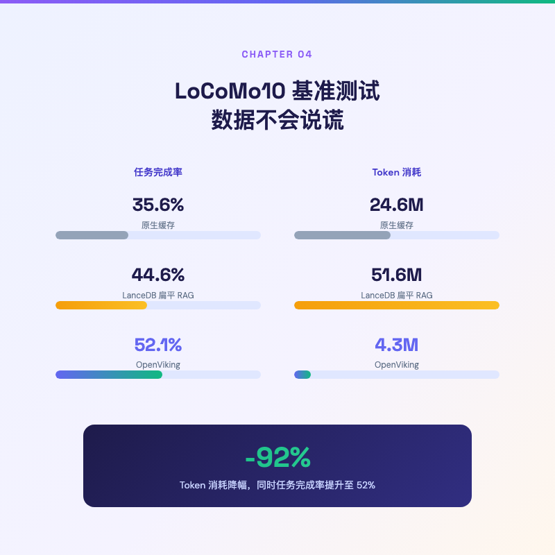
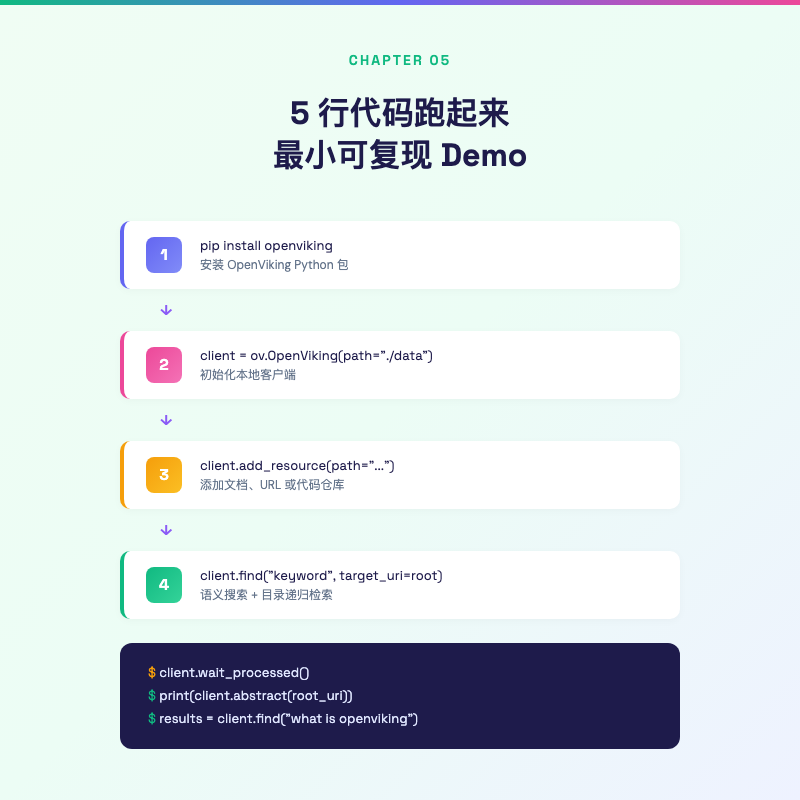
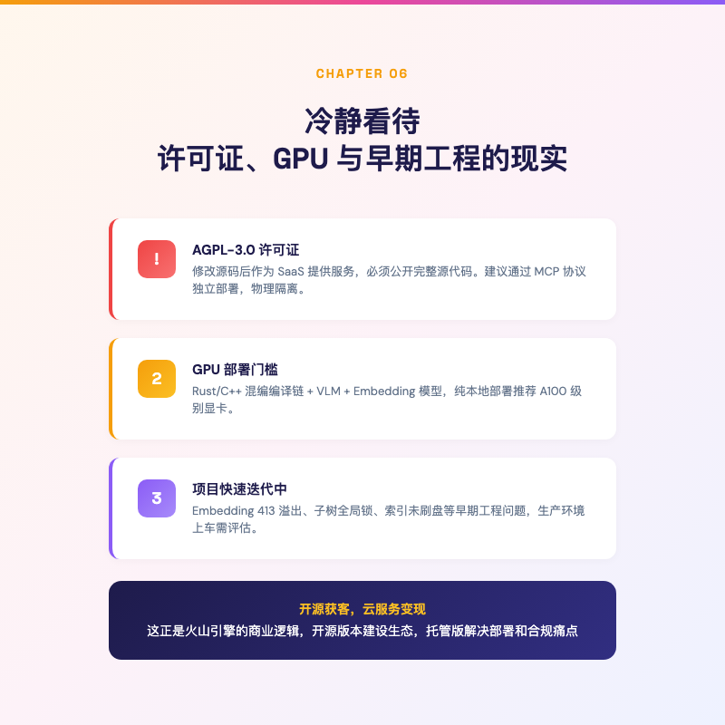

# Agent 的记忆只有 7 秒？这个开源数据库把 Token 账单砍了 92%

> 你的 Agent 聊了 10 轮后开始失忆，API 账单却翻了 5 倍。这不是模型的问题。




---

## 一句话总结

火山引擎开源的上下文数据库 OpenViking，用文件系统的思路重新设计了 Agent 的记忆管理，在长程对话基准上 Token 节省最高 96%，任务完成率从 35% 拉到 52%。



---

上周我用 Claude Code 写一个需要跨多个文件重构的任务。前 10 轮对话一切完美，Agent 精准地理解每个文件的关系，改得行云流水。

到第 15 轮的时候，事情开始不对劲了。

它开始问我「这个函数是干什么的」，而我在第 3 轮就解释过。它忘了我们约定好的命名规范。最离谱的是，它开始重复执行已经完成的操作。

我打开 API 后台看了一眼账单，单次调用的 Token 消耗已经从最初的 2000 涨到了接近 10000。

**Agent 没变笨，是它的上下文在慢慢淹死它。**

这叫上下文碎片化（Context Fragmentation）。你的 Agent 的记忆散落在代码里、向量库里、聊天记录里、System Prompt 里。每次对话，模型都要在一片混沌中重新拼凑自己是谁、在哪、要干什么。



这就是 OpenViking 要解决的问题。

---

## 你的 Agent 没有「文件系统」

你给 Agent 喂了几篇 PDF 技术文档，它需要参照这些文档回答用户的问题。同时，你还希望 Agent 记住用户的偏好，比如用户是 Python 程序员，不爱看 Java 示例。你还给 Agent 配了三个工具，查天气、发邮件、搜代码。

在传统 RAG 架构下，这些东西的存储位置大概是这样，

- PDF 切片存在某个向量数据库里（比如 Pinecone 或 LanceDB）
- 用户偏好存在 Redis 里
- 工具定义硬编码在 Python 脚本里
- 对话历史存在内存里，窗口一满就丢掉

**它们各自存在完全不同的系统中，Agent 需要在运行时把这些碎片拼起来。** 就像一个程序员的代码散落在十个不同的硬盘上，每次开机都要手动挂载。

更糟糕的是向量检索本身的问题。传统 RAG 把文档切成等长的片段，全部扁平化塞进一个向量空间。一篇技术文档的「第三章第二节」和「第五章附录」在向量空间里变成了两个毫无关系的点。原本的父子关系、先后顺序、逻辑链路全部丢失。

这个现象有个很形象的叫法，向量汤（Vector Soup）。

检索的时候，系统捞出和查询向量最相似的 Top-K 片段。但因为缺少结构信息，你经常得到这样的结果，上半段来自产品手册的安装说明，下半段来自 API 文档的错误码列表。拼在一起完全牛头不对马嘴，但每个单拿出来相似度都很高。

OpenViking 的做法很不一样。

**它给 Agent 造了一个文件系统。**



---

## VikingFS，像操作本地文件一样操作上下文

OpenViking 的核心设计叫 VikingFS，一个虚拟文件系统。

它的思路很简单，把 Agent 需要的所有上下文，全部抽象成文件和目录，用统一的 `viking://` 协议进行寻址。

整个文件系统分五个命名空间，

- **`viking://resources/`**，文档、代码、网页等静态资源，长期持久存储
- **`viking://user/`**，用户画像、偏好、长期记忆，持续自进化更新
- **`viking://agent/`**，技能定义、System Prompt、工作流指令，运行时相对静态
- **`viking://session/`**，当前会话的消息链和元数据，会话生命周期
- **`viking://temp/`**，处理过程中的临时文件，瞬时生命周期

举个例子，用户告诉 Agent「我不用 Java，给我 Python 版本的」，Agent 会把这个偏好自动存到 `viking://user/preferences` 下。下次用户问技术问题，Agent 检索时会自动扫描这个目录，直接过滤掉 Java 相关内容。

Agent 操作上下文的指令和 Linux 命令几乎一样，

```
ls viking://resources/docs/        # 浏览文档目录
tree viking://user/memories/       # 查看记忆结构
read viking://agent/skills/code-review.md  # 读取技能定义
```

这还带来一个额外好处，**检索过程变得可观测了。**

传统 RAG 的检索是个黑盒。你问「为什么召回了这段」，答案是「因为向量相似度 0.87」。为什么会是 0.87？不知道。

OpenViking 的做法是，在每次 `search()` 执行时，完整记录目录树的遍历路径。你能看到系统先定位到哪个父目录，再沿着哪个子目录深入，每一步的得分传播是怎样的。



这张图来自 OpenViking 的可视化检索轨迹功能。黄色的节点是被检索到的目录，连接线显示了从根目录到目标文件的完整路径。调试 RAG 终于不用靠猜了。

---

## L0/L1/L2，Token 省 92% 的秘密

VikingFS 解决了「上下文存在哪」的问题。但还有一个更棘手的问题，每次对话要把多少上下文喂给模型？

传统做法简单粗暴，把检索到的相关片段全部塞进 Prompt。这导致 Token 消耗随着上下文积累而线性膨胀，最终触及模型窗口上限。

OpenViking 借鉴了 CPU 多级缓存的设计，在数据写入时自动生成三层信息，

**L0 层（摘要，Abstract）**，一句话概要，大约 100 Token。保存在 `.abstract.md` 中，用于快速向量检索和初步过滤。Agent 在做初步规划时只看这一层就够了。

**L1 层（概览，Overview）**，包含核心要点、使用场景和内容结构导航，控制在 1k-2k Token。保存在 `.overview.md` 中。子目录的 L0 摘要会自动向上聚合到父目录的 L1，形成天然的层级导航图。

**L2 层（详情，Details）**，完整的原始数据，不限制长度。**严格按需加载**，只有当 Agent 读完 L1 确认需要后，才会调用 `read` 接口拉取。

说实话，第一次看到这个设计时我想的是，这不就是 CPU Cache 的思路吗。L1 Cache 小而快，L2 Cache 大一些，内存更大但更慢。OpenViking 把这个思想搬到了文本检索上。

以前的做法是「把所有可能相关的文档切片全灌进去，让模型自己挑」。现在是「先看目录和摘要，定位到具体文件后，只加载需要的那一章」。



一个实际例子，一份 200 页的技术规范文档存入 OpenViking 后，Agent 在规划阶段只需要浏览约 300 Token 的 L1 概览就能理解文档的整体结构。当它定位到需要参考第 7 章的安全规范时，只加载那一章，而不是整份文档。

**Token 消耗从「文档长度」变成了「所需章节长度」。**

---

## Benchmark 不会骗人

说得好听没用，看数据。

LoCoMo10 是一个专门评估长程多轮对话的数据集。OpenViking 团队用 OpenClaw 智能体框架做了一组对照实验，测试不同记忆后端的表现，

- **原生对话缓存**（无记忆系统），完成率 35.65%，Token 消耗 24.6M
- **LanceDB 扁平 RAG**，完成率 44.55%，Token 消耗 51.6M
- **OpenViking（未压缩）**，完成率 **52.08%**，Token 消耗 4.3M
- **OpenViking（开启压缩）**，完成率 51.23%，Token 消耗 **2.1M**

几个值得细看的数字，

LanceDB 的扁平向量检索虽然把完成率从 35% 提到了 44%，但 Token 消耗暴增到 51.6M，因为它反复读取冗余的文档切片。

OpenViking 在不开压缩的情况下，完成率拉到 52.08%，Token 砍掉了 92%。

开启会话压缩后，Token 再次减半到 2.1M，降幅 96%，完成率几乎不变。



用 OpenViking 做记忆后端，Token 花销降了一个数量级，任务还做得更多。

这个数字在长任务场景下会被进一步放大。你的 Agent 跑的不是 10 轮对话，而是 100 轮、1000 轮的时候，Token 效率的差距就是能不能活下去的区别。

另外，OpenViking 的记忆是会自己进化的。每次提交会话时，后台会异步让模型提炼结构化的长期记忆，自动归类到用户的偏好、项目方案、常用工具等八个标准类别中。随着使用次数增加，Agent 对用户的理解会越来越精准，「越用越聪明」不是一句广告词。

OpenViking 还内置了 Grafana 监控面板，检索延迟、索引吞吐、会话并发数一目了然。上下文数据库不是一个黑盒，它应该像一个数据库那样被运维。


数据好看，但上手难不难？

---

## 5 行代码跑起来

最小 demo 长这样，

```python
import openviking as ov

client = ov.OpenViking(path="./data")
client.initialize()

# 扔一篇文档进去
res = client.add_resource(
    path="https://raw.githubusercontent.com/volcengine/OpenViking/refs/heads/main/README.md"
)
root_uri = res["root_uri"]

# 看看目录结构
print(client.ls(root_uri))

# 等语义处理完，直接问
client.wait_processed()
results = client.find("what is openviking", target_uri=root_uri)
for r in results.resources:
    print(f"  {r.uri} (score: {r.score:.4f})")
```

安装也简单，`pip install openviking` 一条命令。

当然，如果你不只是想玩玩 demo，还有一些前置条件，Python 3.10+，以及一个 VLM 模型和一个 Embedding 模型。官方支持火山引擎豆包、OpenAI、Azure、OpenAI Codex 等多种 Provider。纯本地不想联网的话，可以通过 Ollama 跑本地模型，当然这就对 GPU 有要求了。



---

## 冷静一下，AGPL 和 GPU 的现实

看到这里你可能已经想 `pip install` 了。但有几个现实问题值得冷静看待。

**许可证是个绕不开的话题。** OpenViking 的主项目使用 AGPL-3.0，不是宽松的 MIT 或 Apache-2.0（注，CLI 和示例代码采用 Apache 2.0，但核心服务端是 AGPL-3.0）。这意味着如果你修改了 OpenViking 的源码，并把它作为 SaaS 服务提供给外部用户，你必须公开修改后的完整源代码。对很多企业来说，AGPL-3.0 是法务部门的红线。一个可行的规避方式是用 MCP 协议（Model Context Protocol）把 OpenViking 作为独立服务部署，通过网络接口调用，物理和法务上做好隔离。

**部署门槛也不低。** OpenViking 不是纯 Python 包，它的虚拟文件系统层用 Rust 和 C++ 混编，编译需要 Cargo 和 C++17 编译器。语义处理管线强依赖 VLM 和 Embedding 模型，纯本地部署推荐 A100 级别的显卡，虽然低配机器也能跑 Ollama 方案，但体验会打折扣。

**项目还很年轻。** Issue 区有一些典型的早期工程问题，超长文本导致的 Embedding 413 错误（Issue [#2132](https://github.com/volcengine/OpenViking/issues/2132)）、子树更新时的全局锁瓶颈、本地向量索引偶发的未刷盘 Bug（Issue [#2118](https://github.com/volcengine/OpenViking/issues/2118)）。都是可以修的问题，但说明它还处在快速迭代期，生产环境上车需要做好心理准备。

换个角度想，这些门槛恰恰解释了火山引擎为什么要开源 OpenViking。开源版本承担生态建设和技术布道的角色，而免去部署和运维烦恼的托管版服务，自然指向火山引擎的公有云。



---

写这篇文章的时候，我又打开上周那个 Claude Code 项目看了一眼。

如果当时用了 OpenViking，Agent 在第 15 轮不会忘记我第 3 轮说过的话。它的 L0 摘要里会有一条，「用户偏好蛇形命名法，所有函数名保持一致」。对话历史会自动压缩归档，长期记忆会在后台静默更新。

OpenViking 不完美，AGPL 的许可证、GPU 的门槛、快速迭代中的工程问题，都是现实。但它的核心思路是对的，Agent 的上下文不应该靠烧 Token 来维持，文件系统这个隐喻比向量汤优雅得多。

上下文数据库这个品类才刚刚开始。

---

欢迎关注我的公众号「Chyris Tech Note」，获取更多 AI 技术解读与实践分享。
