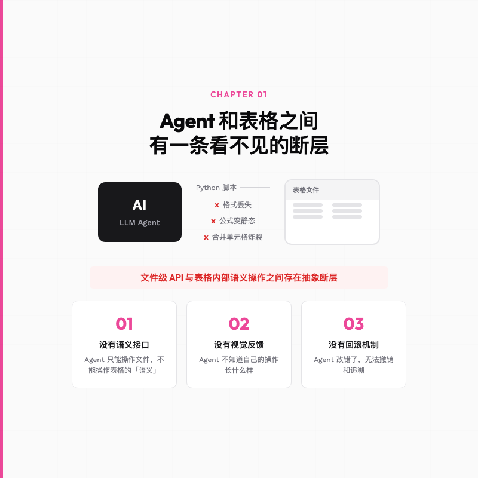
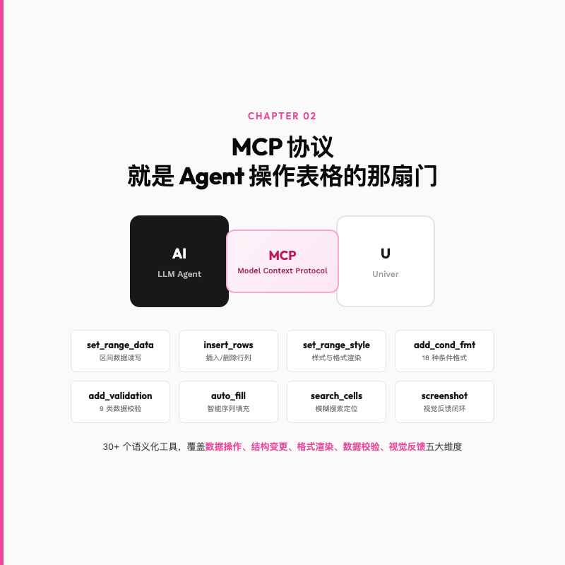
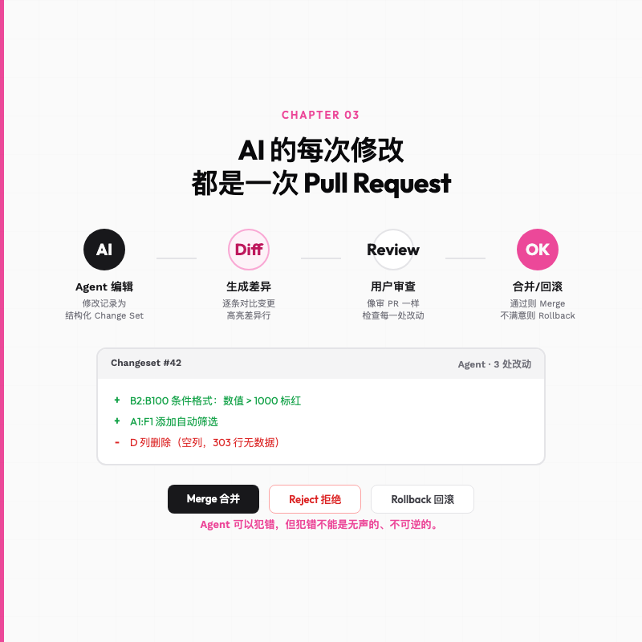
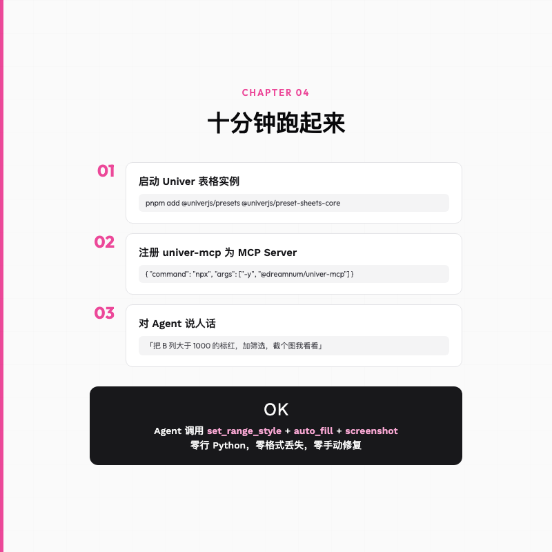

#  一个 MCP 服务让 你的Agent 学会操作表格

> 你让 Claude Code 帮你处理一个 Excel 报表，它写了 50 行 Python 代码，跑了一半报错，最后生成一个 CSV 丢给你说「大概是对的吧你看看」。


---

我上个月遇到一件事。

产品经理丢过来一个 Excel，里面是 2000 条用户反馈数据，让我按关键词分类、标颜色、加筛选条件、把重复项合并掉。这种活我干过无数次，筛选、条件格式、去重、加一列分类标签，熟练工十分钟搞定。

但我那天偷了个懒。我正好开着 Claude Code，心想这种脏活累活不如让 Agent 干。

我把 Excel 路径给它，写了一句 prompt，「帮我分析这个表格，按关键词分类，高亮异常数据，把结果整理好」。

五分钟之后我后悔了。

Claude 写了一个 47 行的 Python 脚本，用 openpyxl 解析。第一次跑，报错，它假设所有列都是数字格式，结果第三列是日期。我让它修。第二次跑通了，但生成的 xlsx 里，原始的条件格式全丢了，合并单元格炸了，公式变成了静态值。它给我的「整理好的报表」本质上是一个格式全毁、只剩数据的裸表。

最后我还是自己花了十分钟手动搞定。Agent 没给我省时间，反而浪费了五分钟看我瞎折腾。

**这不是 Claude Code 不够聪明。是表格这件事，根本没给 AI 留门。**



---

## 一句话总结

LLM 的推理能力已经足够强了，但表格引擎从未把 AI 当成自己的用户。MCP 协议 + Git 风格 Diff 工作流，是眼下能看到的一条务实出路。

---

## 为什么 Agent 不会操作表格

要理解这件事，得先看看人和 Agent 操作表格的本质区别。

你打开 Excel 或 Google Sheets，点一个单元格，输入数据，拖一下填充柄，设个条件格式，合并两列。每一步操作背后的本质是什么。是你在对一个结构化的数据模型下达「语义化指令」，「第 3 行到第 50 行的 B 列，如果数值大于 100，背景设为红色」。

这个指令是你通过鼠标和键盘传递给 GUI 的，GUI 再把它翻译成内部的状态变更。

现在换一个场景，你把表格文件丢给 Agent，它怎么操作。

Agent 从头到尾没有鼠标，没有键盘，也没有 GUI。它只能通过两种路径间接操作表格，一种是写代码（Python + openpyxl / pandas），一种是整体读写（导出 CSV、整体覆盖）。

**写代码这条路的问题在哪。**

openpyxl 也好，pandas 也好，它们是文件级别的操作工具。每一次修改都要走「读文件 → 解析 → 脚本处理 → 写文件」的完整链路。这条路上每一步都可能出问题，格式丢失、公式变成静态值、合并单元格被拆散、条件格式规则错位。

说白了，Agent 和表格之间隔着一层东西。文件级 API 和表格引擎内部的语义化操作，是两套完全不同的语言。Agent 不知道表格里有「条件格式规则」这个概念，它只知道有单元格，有值，有样式。它在操作一个它并不完全理解的复杂对象。

你可能会说，那 Google Sheets 不是有 API 吗，Agent 调用 API 不就行了。

确实，Google Sheets API 能读写单元格、设置格式、操作工作表。但这里有两个问题。

第一个，它锁定了云端的 Google Sheets。你的数据必须在 Google 生态里。大多数企业的内部系统、离线场景、私有化部署的需求，这条路走不通。

第二个，即使是 Google Sheets API，它也不是为 Agent 设计的。它是一个给人类开发者用的 REST API，Agent 需要自己学会拼 URL、处理 OAuth Token、理解 API 文档中的几百个参数。这个过程和写 Python 脚本没有本质区别，只是从「写代码操作文件」变成了「写代码调用 API」。**Agent 还是在写代码，不是在操作表格。**

回到根本问题。

Agent 需要的不是更多的 API 文档，不是更好的 Python 库。它需要的是**表格引擎本体向它开放一套语义化、结构化、可撤销的交互接口**。它需要能像一个真实用户一样，选中区域、设置格式、插入行列、添加条件规则，然后看到自己修改的视觉结果，确认无误再提交。

这个需求，绝大多数表格引擎根本没考虑过。

传统表格引擎是为人类设计的。它们的交互模型是「用户在 GUI 上点来点去」，数据模型、操作接口、UI 渲染三者紧密耦合。人类的操作进入 GUI 后变成内部状态变更，而 Agent 根本没有进入 GUI 的通路。

**这中间断裂的，是表格引擎的可编程性。**

---

## MCP 就是那扇门

聊到这，该请出今天的主角了。

Univer 是一个开源的全栈办公 SDK，由 DreamNum 团队开发。它的底层用 Canvas2D 渲染替代了传统的 DOM 方案，用 Web Worker 异步计算公式链，用插件架构组织功能模块。这些架构选择本身值得单独写一篇文章。

但我今天想聊的不是渲染性能，是 Univer 的一个更有意思的东西。

Univer 团队做了一个叫 `univer-mcp` 的服务，完整实现了 MCP（Model Context Protocol），也就是大模型和外部工具之间的标准通信协议。通过这个服务，Agent 可以调用 30 多个语义化工具来直接操作电子表格。



这些工具不是「读单元格」「写单元格」这种底层原语。它们是按人类操作习惯抽象出来的高级指令。

你想让 Agent 筛选数据，不需要让它写 `df[df['column'] > 100]`，直接说「把 B 列大于 100 的行高亮」，Agent 会调用 `set_range_style`。你想加一列，不是 `df.insert(2, 'new_col', '')`，是 `insert_columns`。

**Agent 从写代码变成了说话。**

数据读写、行列插入删除、单元格合并、条件格式规则（18 种）、数据校验规则（9 类）、截图验证，每一个人类用户在 GUI 上能干的事，都对应了一个语义化工具。Agent 调用的 `set_range_style` 和你用手指在 Google Sheets 上点「背景色」按钮，在表格引擎内部走的是同一条逻辑路径。

这意味着 Agent 的操作和你手动操作一样安全。不是文件级别的暴力覆盖，不是 Python 脚本的外部侵入，而是表格引擎内部的、受控的、可追溯的状态变更。

MCP 在这个架构里也值得多聊两句。在没有 MCP 之前，每个表格引擎接入 AI 都得自己设计 API 格式和认证机制，Agent 开发者面对的是 Google Sheets REST API、Excel Graph API、各种开源 SDK 拼起来的碎片化生态。MCP 把这个局面统一了，只要引擎实现了 MCP 服务，任何支持 MCP 的 Agent 框架都能直接调用。

---

## 谁敢让 Agent 直接改生产数据

到这里，Agent 已经有了一双能操作表格的手。但还有一个绕不开的问题。

**你敢让 Agent 直接改你的生产数据吗。**

我反正不敢。LLM 会幻觉，会理解错意图，会把「高亮异常值」理解成「把所有大于平均值的单元格删掉」。如果它的操作是直接生效、不可逆的，那每一次让 Agent 帮你处理表格都是在赌命。

这就是为什么 `univer-mcp` 做了我整篇调研里最喜欢的一个设计。

**Git 风格的 Diff 工作流。**

Agent 对表格的每一处改动，不会被直接写入原始数据。而是被记录为一组结构化的 Change Set（变更集），以 Diff 的形式呈现给用户。



你看到的界面，和审查代码 Pull Request 一模一样。左边是原始数据，右边是 Agent 改过的版本，差异行被高亮。你可以逐条审查 Agent 干了什么，它改了哪几个单元格、删了哪一列、加了一条什么条件格式规则、这条规则的范围是什么。

通过了，点 Merge。不满意，点 Reject。改坏了，一键 Rollback。

这个设计好就好在，它不是跟用户说「相信我，AI 很靠谱的」。它是跟用户说「AI 可能会犯错，所以我把每一次修改都摊开来给你看，你来拍板」。

在这个设计下，Agent 的每次操作都是可追溯的。把表格交给 AI，不再是信任问题，变成了审核问题。

我见过太多「AI 一键生成报表」的 demo，看起来很炫，但细想一下，它生成的报表你敢直接用吗。你敢把它做的数据清洗结果直接发给客户吗。我相信大部分人的答案是不敢。不是不信任 AI 的能力，是不信任它在每一次具体操作中的准确性。

Git Diff 工作流解决的正是这个信任断层。它把一个黑箱操作变成了白箱审查。Agent 不再是那个神秘地吐出一个结果的黑盒，而是一个你可以监管、可以纠偏、可以随时让它重来的协作者。

**Agent 可以犯错，但犯错不能是无声的、不可逆的。**

---

## 说不如跑一下

理念聊得够多了。实际上手是什么感觉。

假设你已经有 Node.js 环境和 Claude Code（或其他支持 MCP 的 Agent 客户端）。三步就能让 Agent 操作表格。

第一步，装包启动表格实例：

```bash
pnpm add @univerjs/presets @univerjs/preset-sheets-core
```

几行代码就能拉起一个带公式计算、条件格式、数据校验的完整表格，具体配置参考 [Univer 官方文档](https://docs.univer.ai/guides/sheets/getting-started/installation) 的 Preset 模式。

第二步，在 Claude Code 的项目根目录创建 `.mcp.json`：

```json
{
  "mcpServers": {
    "univer": {
      "command": "npx",
      "args": ["-y", "univer-mcp"]
    }
  }
}
```

重启 Claude Code，可用工具列表里会多出 `set_range_data`、`insert_rows`、`add_conditional_formatting_rule` 等 30+ 个表格操作工具。

第三步，**对 Agent 说人话**。

> 「帮我把 B 列从第 2 行到第 100 行，数值大于 1000 的单元格标红，然后在第 1 行加上筛选，最后截个图让我看看效果。」

Agent 会依次调用 `add_conditional_formatting_rule`、`scroll_and_screenshot`，你看到截图确认没问题，它再 Merge 变更。



整个过程，Agent 没有写一行 Python，没有碰 openpyxl 或 pandas，没有丢格式，没有炸合并单元格。它在操作一个真正的表格引擎，而不是在操作一个文件。

没有自己的表格应用也没关系，Univer 官方的 [Showcase](https://docs.univer.ai/showcase) 页面可以直接在线体验 MCP 驱动的表格交互，打开页面，连上 Agent 客户端，直接说话就行。

---

## 总结

回到开头那个场景。

我让 Claude Code 帮我处理 Excel，它写了 47 行 Python，格式全丢，我最后还是手动搞完。

如果当时我手里有 Univer 和 univer-mcp，流程会完全不一样。我不需要把 Excel 文件丢给 Agent，不需要等它写脚本、报错、修脚本、再报错。我只需要把数据导入 Univer 表格，然后说一句「帮我分类标注，高亮异常值，加筛选」，Agent 直接操作表格引擎，每一步改动以 Diff 形式呈现给我，我审核通过，Merge，完事。

**差的不是 Agent 的脑子，是表格这双手。**

LLM 的推理能力在过去两年里进步飞快，从 GPT-4 到 Claude 4，模型越来越能听懂复杂指令、做多步规划。但表格迟迟没有向 AI 开放自己的语义层。

Univer 做的事情不复杂，把表格引擎的内部操作接口按 MCP 标准暴露给 Agent，再配上一个可审查的变更记录。未来的电子表格、文档、演示文稿，都得考虑 Agent 这个新用户，不是把它当成一个写脚本的外部调用者，而是当成一个真实用户来设计交互接口。

你下次再让 Agent 处理表格的时候，希望它不是打开 Python 解释器，而是直接开口跟你确认，我帮你把第三列标红了，你看看对不对。

---

欢迎关注我的公众号「Chyris Tech Note」，获取更多 AI 技术解读与实践分享。
