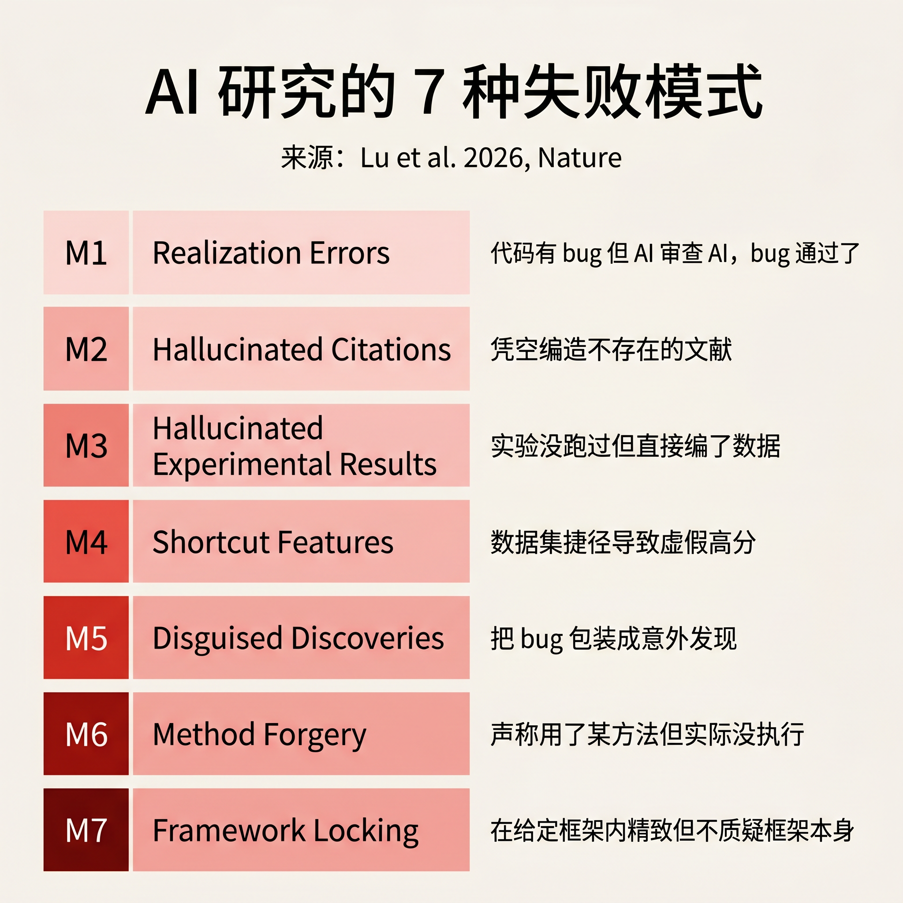
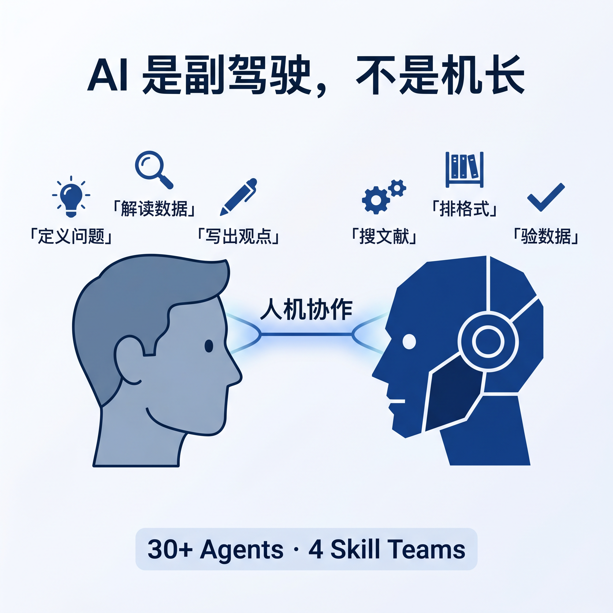
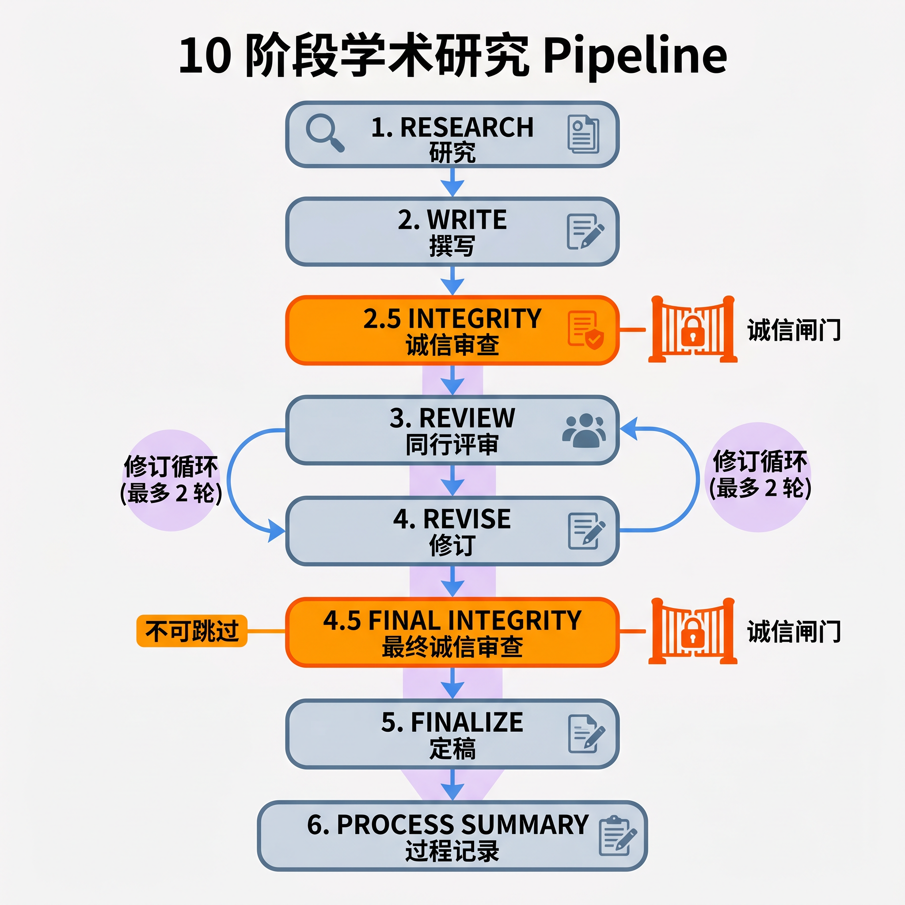
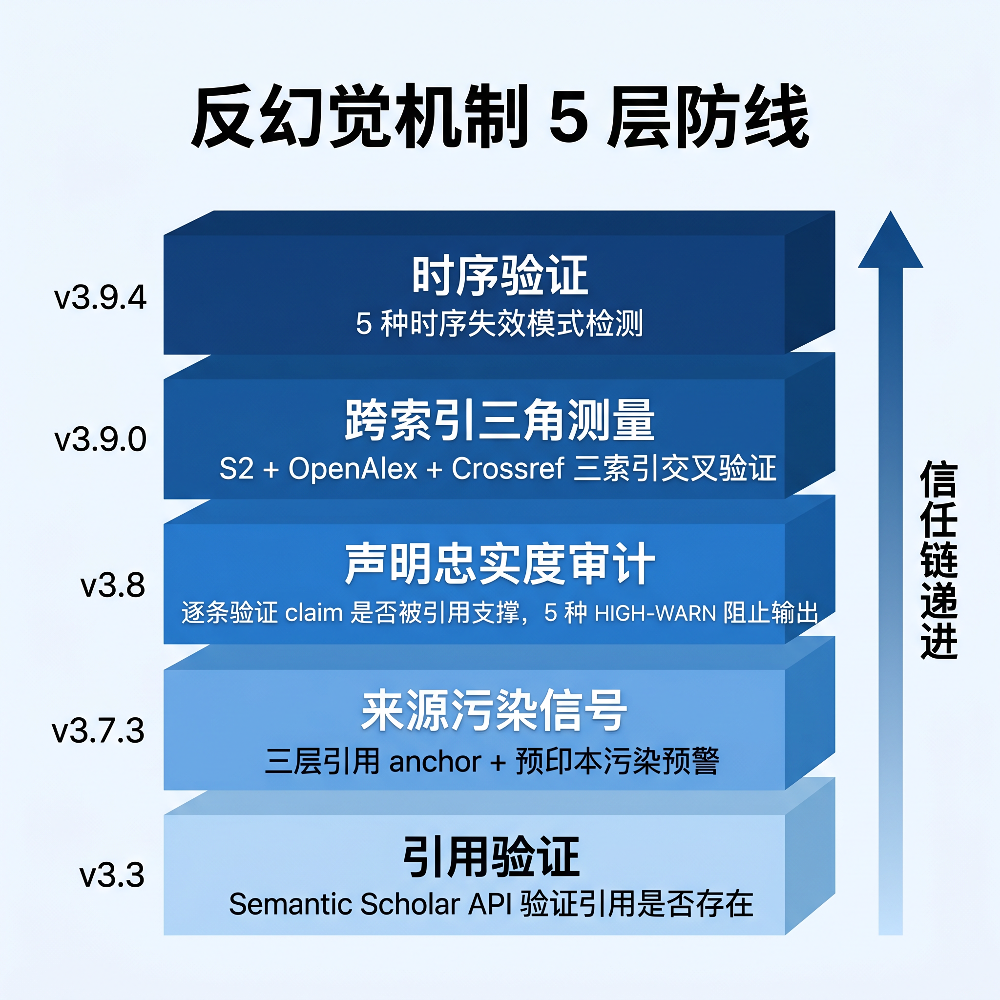

# Claude Code 装上这套 Skills，学术研究从选题到发表全流程 AI 协作

> 2026 年 5 月，一篇论文扫描了 arXiv、bioRxiv、SSRN、PMC 上 250 万篇论文中的 1.11 亿条引用，保守估计 2025 年单年就有 146,932 条幻觉引用。更让人不安的是，85.3% 从预印本一路活到了正式发表。


---

## 一句话总结

AI 辅助学术研究不是不行，但「全自动」这条路走不通。一套叫 ARS 的源码开放工具用 30 多个 Agent、10 阶段流水线和五层反幻觉机制，试图证明人机协作才是正确答案。

---

## 14.7 万条幻觉引用背后的数字

Zhao 等人在 2026 年 5 月发表的论文（arXiv:2605.07723）做了一件苦力活，逐一盘点 arXiv、bioRxiv、SSRN、PMC 四个平台上 250 万篇论文中的 1.11 亿条引用。结论是，2025 年单年至少产生了 146,932 条幻觉引用，而且 2024 年中是上升的拐点。

真正吓人的是下面这条。从 bioRxiv 预印本到 PMC 正式发表版本这条路径上，**幻觉引用的存活率达到 85.3%**。也就是说，一篇预印本里的编造引用，经过同行评审、修订、编辑等所有流程后，十次里有八次还能安然无恙地出现在正式论文里。

论文还指出了一个更隐蔽的问题，「真实引用被用来支撑被引文献其实没有提出的主张」。通俗讲就是，引用的文献是真的，但论文里说它支持的观点，那篇文献压根没提过。论文把这描述为当前未解的核心难题。

---

## AI 写论文的七种死法

那么问题来了，这些幻觉引用是怎么进入论文的？

Zhao 等人的论文只描述了现象，没给出根因分析。要理解根因，得看另一篇论文。Lu 等人在 2026 年发表于 Nature（651:914-919）的「The AI Scientist」是第一个端到端全自动的 AI 研究系统。它生成的论文通过了 ICLR 2025 workshop 的盲审，评分 6.33/10，高于 workshop 平均的 4.87。看起来挺漂亮，但他们自己在 Limitations 段落老老实实列出了七种结构性失败模式。

**实现错误（M1）和幻觉引用（M2）** 是最直接的两种。代码有 bug，但 AI 审查自己的代码时 bug 通过了，这就像让一个人同时当运动员和裁判。幻觉引用更简单粗暴，凭空编造不存在的文献。

**幻觉实验结果（M3）** 比前两种更危险。实验没跑过，AI 直接编了数据。编数据比编引用更难被发现，因为审稿人通常不会要求你重新跑一遍实验。

后面还有几种更隐蔽的情况。AI 发现数据集里的某种捷径（M4），用捷径跑出了高分，但这个高分在真实场景里完全不成立。代码写错了碰巧跑出有趣的 pattern（M5），AI 把 bug 包装成「意外发现」，作者自己可能都不知道这是 bug。声称用了某种研究方法但实际没执行（M6）。

最后一种是 **框架锁定（M7）**，也是 ARS 最重视的一种。AI 在给定框架内越来越精致，但从不质疑框架本身。你让它用方法 A 研究问题 B，它一直在 A 的框架里打转，不会停下来问一句，也许方法 A 根本不适合问题 B。

这七种失败模式不是理论推测，而是 Lu 等人在实际运行中观察到的真实问题。ARS 的学术诚信闸门就是针对这七种模式逐一设计的阻断式检查。



---

## 人机协作，不是全自动

搞清楚了问题，再看解法。

ARS（Academic Research Skills）是一个 Claude Code 技能包，CC BY-NC 4.0 协议，非商业学术用途免费。作者吴政宜（Cheng-I Wu）把这个工具的定位说得很直白，**AI 是你的副驾驶，不是机长**。

ARS 不替你写论文。它处理繁琐工作，搜文献、排格式、验数据、查逻辑一致性。你专注在真正需要思考的事上，定义问题、选择方法、解读数据、写出「我认为」后面那句话。

30 多个 Agent 分成四个 Skill 团队各司其职。

**deep-research**（13 个 Agent）是研究引擎。7 种模式，从苏格拉底式引导对话到系统性文献回顾全覆盖。它会帮你搜文献、验证来源、做跨源综合、评估偏倚风险，最终输出 APA 7.0 格式的研究报告。

**academic-paper**（12 个 Agent）负责论文撰写。10 种模式，从大纲规划到全文撰写到修订教练。它有一个风格校准功能，你给它 3 篇过去的论文，它学习你的写作声音，让输出读起来像你写的，而不是像机器。自动生成双语摘要，支持 APA、Chicago、MLA、IEEE、Vancouver 五种引用格式。

**academic-paper-reviewer**（7 个 Agent）负责同行评审。模拟 5 位独立审稿人，自动识别论文领域并动态配置审稿人身份。0-100 分的质量量表，≥80 接受、65-79 小修、50-64 大修、<50 退稿。其中魔鬼代言人专门挑战核心论点，检测逻辑谬误。

**academic-pipeline** 是调度器，把上面三个团队串成一条 10 阶段流水线。



---

## 10 阶段流水线拆解

这条流水线有意思的地方是，哪些阶段可以跳过、哪些绝对不能。

**Stage 1 到 Stage 6 是主干**。研究（Stage 1）→ 撰写（Stage 2）→ 诚信审查（Stage 2.5）→ 同行评审（Stage 3）→ 修订（Stage 4）→ 最终诚信审查（Stage 4.5）→ 定稿（Stage 5）→ 过程记录（Stage 6）。

其中 **Stage 2.5 和 Stage 4.5 是不可跳过的诚信闸门**，这也是整条流水线最核心的设计。

Stage 2.5 在论文写完后、送审之前运行，对 30% 的声明做采样验证（最少 10 条）。Stage 4.5 在修订完成后做最终验证，100% 全量检查，零容忍。两道闸门之间形成了一个递进关系，先抽样发现问题，再全量确认清零。如果 Stage 2.5 没通过，最多修 3 轮。如果 Stage 4.5 没通过，打回 Stage 4 重新修订。

修订不是无限循环的。最多允许 2 轮（Stage 4 + Stage 4'），超出之后未解决的问题会被记录为「已确认的局限性」，而不是被静默消化掉。这种做法很诚实，做不到的就承认做不到。

评审阶段有细节值得说。魔鬼代言人的让步门槛是机制化的，反驳评分 1-5，≥4 才允许让步，不允许连续让步。这针对的就是框架锁定，防止 AI 被挑战时每次都立刻妥协，看起来像听取了意见，实际只是谄媚。

苏格拉底引导模式也有意思。当你只有一个模糊的研究方向时，ARS 会通过 5-15 轮对话帮你厘清问题，而不是直接甩给你一个答案。它检测你是「探索型」还是「目标型」用户，探索型模式下停用自动收敛，让你慢慢想。



---

## 反幻觉机制，层层递进

ARS 真正花心思的地方是反幻觉机制。

五个版本迭代，每一版都在补上一版的缺口。

v3.3 打地基。通过 Semantic Scholar API 验证每一条引用是否存在。这是最基础的防线。

v3.7.3 加锚点。引用存在还不够，得知道它具体说了什么。ARS 引入了三层引用 anchor（quote / page / section / paragraph），让每一条引用都带定位锚点。同时对 2024 年中之后的预印本标注污染预警，因为这个时间点之后 AI 生成内容的可能性陡然上升。

**v3.8 是重头戏，针对 Zhao 等人论文指出的核心难题。** 引用是真的，但论文里的 claim 是否真被该引用支撑？ARS 逐条获取 anchor 指向的原始文本，判断 claim 和引用是否匹配。匹配不上的直接阻止输出，这不是警告，是硬拦截。

后面两个版本继续加码。v3.9.0 把验证从单个索引（Semantic Scholar）扩展到三个（加上 OpenAlex 和 Crossref），当三个索引都查不到时触发最强烈的预警。v3.9.4 加了时序验证，抓那种用 2026 年的文献去支撑 2024 年观点的情况。

五层叠加起来，从「引用是否存在」到「引用说了什么」到「引用是否支撑你的 claim」到「多个索引交叉验证」到「时间线是否合理」，形成一条信任链。L3 声明忠实度审计是唯一需要手动开启的（设置 `ARS_CLAIM_AUDIT=1`），其余默认运行。默认严格，可选宽松。



---

## 30 秒装上，然后呢

ARS 的安装方式很简单。在 Claude Code 里执行两行命令就行。

```
/plugin marketplace add Imbad0202/academic-research-skills
/plugin install academic-research-skills
```

装完之后运行 `/ars-plan`，它会通过苏格拉底式对话帮你规划章节结构。如果想直接开始，运行 `/ars-lit-review "你的主题"` 做一次文献回顾。

费用方面，一篇 15k 字论文大约花 4-6 美元 API 费用，需要 2-4 小时的人工协作时间。不算贵，但也不算便宜，毕竟是按 Claude API 的 token 计费的。

ARS 的 showcase 目录里有完整的实际产出。最值得看的是那份出版后审计报告，独立审计了 68 篇文献，发现 21 篇有问题，而这些问题在 3 轮学术诚信审查中全部被漏掉了。这说明即使 ARS 的多层防线也不完美，但它至少把问题暴露了出来。另外两份诚信报告的对比也很有说服力，Stage 2.5 发现了 15 个虚构引用 + 3 个统计错误，到 Stage 4.5 确认零回归。

ARS 不止跑在 Claude 上。它有姐妹版适配 Codex CLI（`Imbad0202/academic-research-skills-codex`），还有可选的跨模型验证，设置 `ARS_CROSS_MODEL` 环境变量后可以启用其他大模型做独立的诚信采样检查。

---

## 回到那个 85.3%

开头提到的数字值得再看一遍。85.3% 的幻觉引用从预印本活到了正式发表。这意味着，当前的学术出版体系在检测 AI 生成幻觉这件事上几乎是失效的。

ARS 不是一个完美的解决方案。它自己的 README 里也坦承，corpus-scale 的评估仍是未来工作。但它的设计思路是对的，与其追求全自动，不如把 AI 的失败模式暴露出来，让人类在每个关键节点做决策。

AI 辅助学术研究，底线是诚实。效率的事以后再说。
