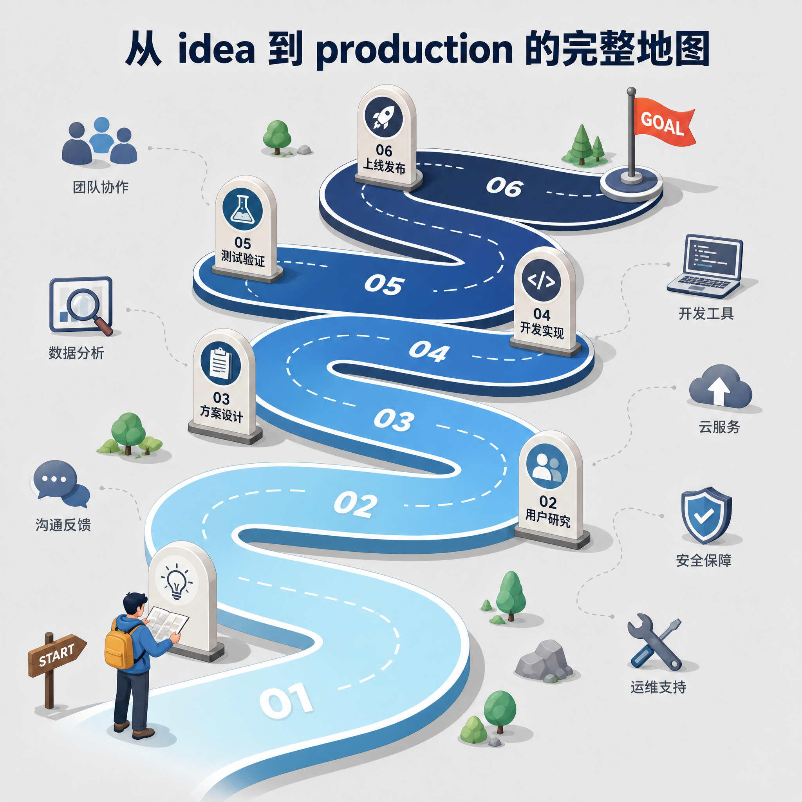
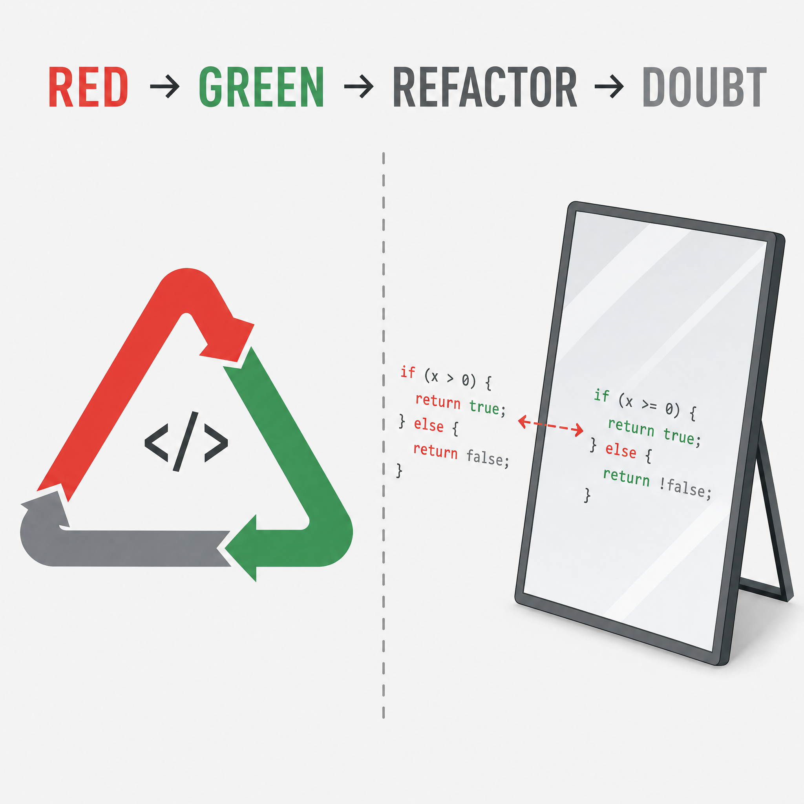
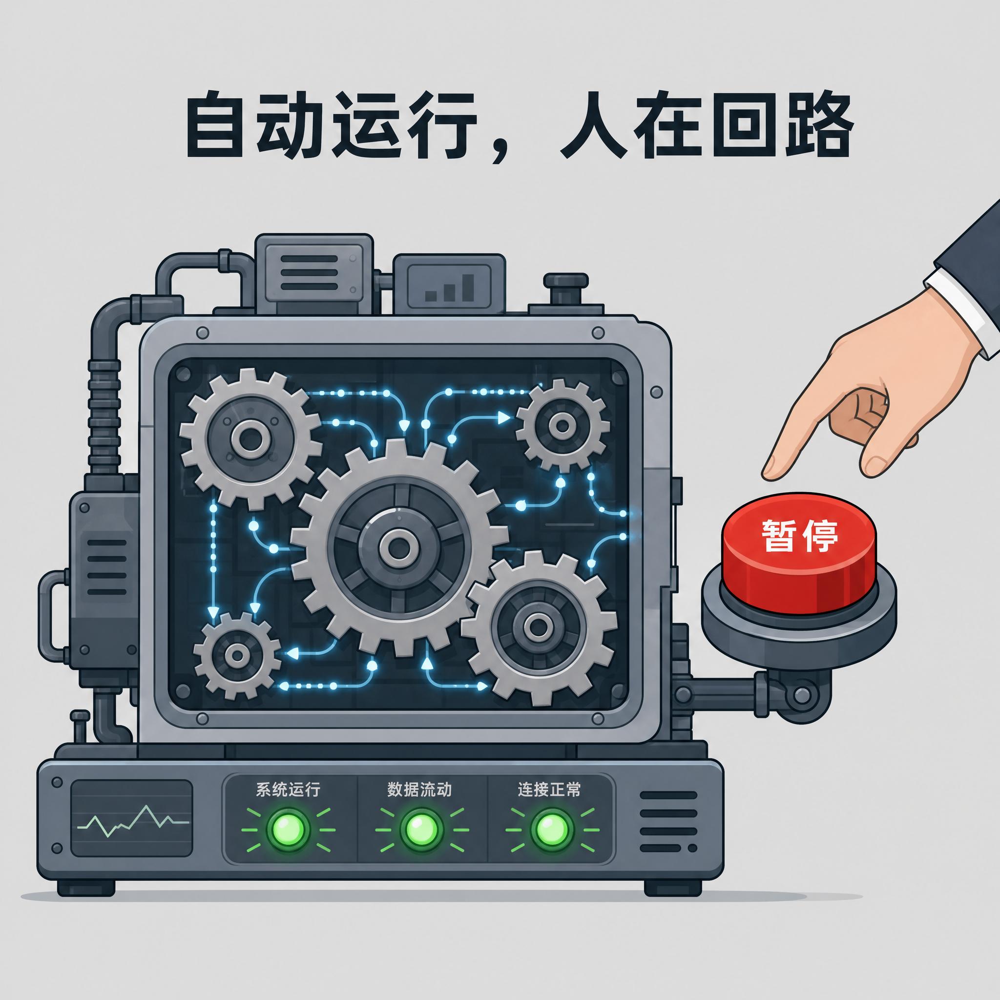
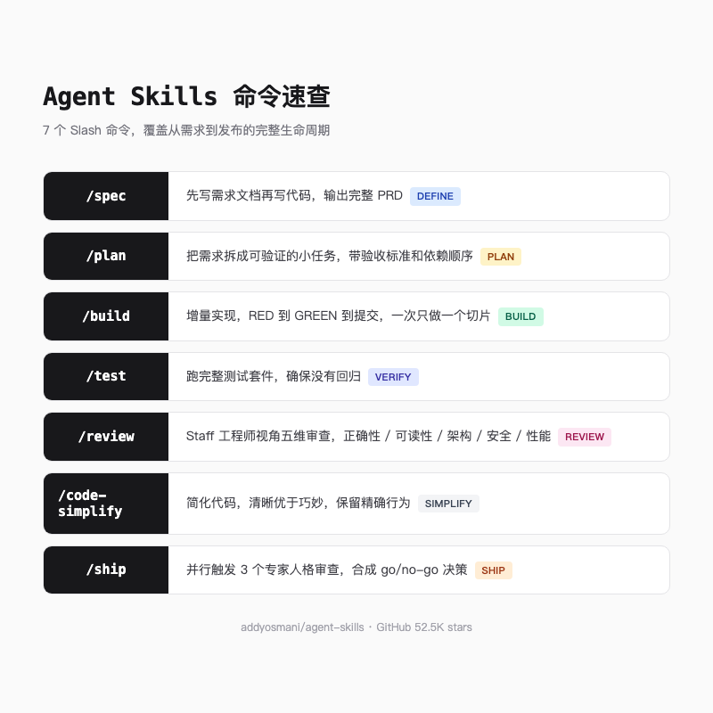

# Google 工程师的 Skills 技能包，让 AI 编程不再偷工减料

> 你让 Claude Code 写个登录功能，它 30 秒交差。你一看，没写测试，没做输入验证，密码明文存。你问它怎么没做安全审查，它说「这个后面再加」。你追问，它又说「代码看起来是对的」。

> 这不是某个 AI 的 bug。这是所有 AI 编程助手的通病。


---

## 一句话总结

agent-skills 用 7 个命令 + 24 个技能 + 4 个专家人格，把 Google 资深工程师的生产纪律编码成 AI 可直接执行的结构化工作流。

---

## AI 编程的「坑」

我让 AI 写代码已经有一年多了。从最开始的惊艳，到后来的麻木，中间隔着无数次「看起来对了，其实没对」的翻车经历。

最典型的一次，我让 Claude Code 写一个用户注册接口。它很快就交了一个能跑的版本。接口能调通，数据能入库，Swagger 文档也生成了。我正准备夸它，顺手翻了下代码，密码是明文存的，邮箱格式没校验，SQL 注入的口子大敞着。我问它怎么不做输入验证，它说「当前实现聚焦核心功能，安全增强可以在后续迭代中添加」。翻译成人话就是，「后面再加」。

后面从来不来。这是我和 AI 合作一年得出的最大教训。

AI 编程助手有一个根深蒂固的本能，走最短路径。你让它写功能，它跳过 spec、跳过测试、跳过安全审查，直接给你一个「能跑」的。代码能编译、接口能响应，在它眼里任务就完成了。

但生产级代码和 demo 代码之间的差距，恰好就在这被跳过的环节里。

更麻烦的是，AI 还会自我合理化。你问它怎么没写测试，它说手工验证就够了。你问密码为什么明文存，它说生产环境会用 bcrypt。单个借口听着都还行，合在一起就是一团没法上线的代码。

这个问题不是 Claude 独有的。Cursor、GitHub Copilot、Gemini CLI，我用过的所有 AI 编程工具都有同样的毛病。它们被训练来「完成任务」，而不是「按工程纪律完成任务」。

---

## 一套技能包，覆盖全生命周期

Addy Osmani 是 Google Chrome 团队的工程总监。如果你读过《Learning JavaScript Design Patterns》或者关注过 Chrome DevTools 的性能优化工具，那就是他的手笔。他最近开源了一个叫 agent-skills 的项目，GitHub 上拿到了 52.5K stars 和 5.8K forks。

一句话概括它做的事情，把资深工程师的工作流程编码成 AI 能直接执行的结构化技能包。它不是那种「给你几个 prompt 自己玩」的项目，而是从写需求到发上线，每一步都给 AI 定了规矩。



### 7 个 Slash 命令

agent-skills 给 AI 定义了 7 个入口命令，对应软件开发的 7 个关键节点。

`/spec` 的意思是，别急着写代码，先把需求文档写清楚。`/build` 则是让你一次只做一件事，做完一块再切下一块。听起来很慢？但 AI 不会「做着做着就飘了」。`/ship` 比较狠，它会同时召唤几个专家人格来审查你的代码，然后给出一个 go/no-go 的决定。

还有 `/plan`、`/test`、`/review`、`/code-simplify`，每个命令背后都自动激活对应的技能集。你不需要记住要做什么，只需要说「/build」，AI 就知道要按增量实现的流程走，要跑测试，要验证，要提交。

### 24 个技能

命令是入口，技能是内核。24 个技能分布在 Define → Plan → Build → Verify → Review → Ship 六个阶段里。

Define 阶段有个技能叫 interview-me，特别有意思。它不是直接写代码，而是一次只问你一个问题，像产品经理面试用户那样，把你真正想要的东西「审」出来。直到它觉得把握有 95% 了，才开始动笔。

Build 阶段技能最多。incremental-implementation 要求用「薄垂直切片」的方式开发，实现一个功能、测试通过、提交，然后再做下一个。context-engineering 则是教 AI 在合适的时机加载合适的信息，别一上来就把整个代码库塞进去，token 烧不起。

还有 doubt-driven-development，这个我后面单独说。其他的技能覆盖了测试、调试、代码审查、安全加固、性能优化、Git 工作流、CI/CD、文档、发布上线等各个环节。基本上你能想到的生产步骤，这里都有对应的技能。

### 4 个专家人格

除了技能，agent-skills 还预置了 4 个专业 Agent 人格。

code-reviewer 就是雇了一个 Staff 工程师帮你盯代码。security-auditor 专门找安全漏洞，你知道的，AI 写代码的时候安全总是「后面再加」。test-engineer 负责测试策略和覆盖率，web-performance-auditor 盯着 Core Web Vitals。

它们在 /ship 命令里会并行运行，各自从自己的专业角度审查代码，最后合成一份综合报告。

---

## 最亮的设计，反偷懒机制

如果让我用一个词概括 agent-skills 最独特的地方，我会选 Anti-rationalization，反合理化机制。

每个技能文件里都有一个专门的章节，叫 Common Rationalizations。它的格式很简单，一张两列表格，左边是 AI 常用的借口，右边是反驳。


比如在 test-driven-development 技能里，表格左边是 AI 常用的借口，右边是反驳。

「测试后面再加」，反驳是，后面从不来，而且事后写的测试只能验证已实现的行为，不是真正的 TDD。「这个功能太简单了，不需要测试」，反驳是，简单的代码也会被修改，测试是行为文档。「测试拖慢开发速度」，反驳是，测试现在拖慢你，但每次修改代码时都会加速你。「我手工测过了」，反驳是，手工测试不会持久，明天的改动可能破坏它而无人知晓。

这不是讲道理。这是把反驳写进 AI 的指令里，让它在面对自己的偷懒冲动时，有一个预设好的「刹车」。

更狠的是 verification 门槛。每个技能结尾都有一个 checklist，明确列出完成标准。不是「看起来对了」，而是「所有测试通过」「构建成功」「覆盖率没有下降」「没有 Critical 级别的安全问题」。AI 必须拿出证据，不能凭感觉。

三层架构的分工其实挺清楚的。Skill 管「怎么做」，Persona 管「谁来做」，Command 管「什么时候触发」。编排规则也很有意思，禁止无意义的元编排，避免了「AI 指挥 AI 指挥 AI」的套娃问题。/ship 命令同时跑 review + security + test 三个专家，就是并行 fan-out 的典型用法。

---

## 两个值得细说的技能

24 个技能里，我想单独聊聊两个最让我印象深刻的。

### Test-Driven Development

TDD 技能不是泛泛地说「要写测试」。它给出了完整的 RED→GREEN→REFACTOR 循环，每一步都有具体标准。



RED 阶段的要求特别反直觉，先写一个会失败的测试。如果测试一上来就能通过，说明测试本身有问题。我第一次看到这条规定的时候愣了一下，但仔细想想确实如此，一个从一开始就能通过的测试，测的可能是空气。

GREEN 阶段写最少量的代码让测试通过，不要过度工程化。REFACTOR 阶段在测试通过的前提下优化代码，每次重构后都要跑测试确认没有破坏行为。

它还内置了测试金字塔，80% 单元测试、15% 集成测试、5% E2E 测试。Beyonce Rule 更有意思，如果你喜欢这段代码，就该给它加上测试。基础设施变更、重构、迁移不是你的测试该抓的 bug，是你的测试该防止的 bug。如果一个改动破坏了你的代码而你没有对应的测试，那是你的责任。

这些不是口号。它们被写进 AI 的每一步指令里，AI 在写代码时会自动遵循。

### Doubt-Driven Development

这是 agent-skills 里最「硬核」的一个技能。它的核心思想是，一个自信的答案不等于正确的答案。

它的流程是 CLAIM→EXTRACT→DOUBT→RECONCILE→STOP。

假设 AI 写了一个缓存层。CLAIM 就是明确说「这个缓存在读多写少场景下是线程安全的」。EXTRACT 把这句话和对应的代码剥离出来，只给 reviewer 看代码和契约，不给推理过程。DOUBT 阶段换一个 fresh-context 的 reviewer，用对抗性 prompt 逼它找漏洞。RECONCILE 是对 reviewer 的发现进行分类，是合同误读、有效问题、合理权衡还是噪音。STOP 是设定停止条件，最多 3 轮循环，超过就升级给用户。

最狠的是它还支持 cross-model escalation。单模型 reviewer 可能和原作者有同样的盲点，所以它在交互式会话中会主动问用户，要不要换另一个模型（比如 Gemini CLI 或 Codex CLI）来第二轮审查。用户决定要不要花这个成本，但选择必须被显式提供。

这个技能的设计让我感受到一种真正的工程严谨。它不是让 AI 「更小心」，而是建立了一套可复现的审查机制。

---

## /build auto，人机协作的 sweet spot



agent-skills 里有一个特别实用的设计，/build auto。

正常情况下，你用 /build 时，AI 会逐个任务执行，每完成一个就停下来等你确认。这很安全，但也很慢。/build auto 允许你只批准一次计划，然后 AI 自动按依赖顺序逐个执行，RED→GREEN→回归测试→构建→提交，一条龙跑完。

但它在三种情况下会停下来问人。测试崩了、需求模糊了，这些它搞不定。还有就是碰到高风险操作，改权限、动支付逻辑、删数据、部署上线，这些它不敢自己拍板。

这个设计的妙处在于，它把「人该做什么」和「AI 该做什么」分得很清楚。重复性的、可验证的机械工作交给 AI，判断性的、高风险的决策留给人。不是全自动，也不是全手动，而是各做各擅长的事。

---

## Google 工程文化的注入

agent-skills 里处处能看到 Google 工程文化的痕迹。

API 设计技能里塞了 Hyrum's Law，提醒 AI 用户会依赖每一个可观察行为。TDD 技能里塞了 Beyonce Rule，测试覆盖率不是可选项。代码简化技能里塞了 Chesterton's Fence，拆除前先理解为什么存在。Git 工作流用的是 Trunk-based Development，CI/CD 里贯彻 Shift Left。这些原则不是贴在墙上的标语，而是直接写进了 AI 的每一步指令里。AI 执行的时候自然就按这个来，不用你反复提醒。

---

## 全部命令速查

7 个命令记不住？一张图帮你理清。



---

## 怎么用，一个最小 demo

agent-skills 的安装很简单。如果你用 Claude Code，直接在 marketplace 里装

```
/plugin marketplace add addyosmani/agent-skills
/plugin install agent-skills@addy-agent-skills
```

也支持 Cursor、Gemini CLI、Windsurf、GitHub Copilot 等，每个平台有对应的 setup 指南。

装好之后，工作流程大致是这样的。

你先用 /spec 描述想做什么，AI 会按 spec-driven-development 的流程先写一份 PRD，包括目标、用户故事、技术方案、边界条件、风险点。你审阅并确认这份 spec，而不是直接看代码。

然后 /plan 把 spec 拆成可执行的任务列表，每个任务有验收标准和依赖关系。

接着 /build 或 /build auto 按任务列表增量实现。每个任务完成后跑测试、验证、提交。/build auto 模式下你批一次计划，AI 自动跑完全程，只在出错或遇到高风险操作时停下来。

最后 /ship 会并行触发 code-reviewer、security-auditor 和 test-engineer 三个专家人格，合成一份 go/no-go 报告。如果通过，AI 执行发布 checklist。

这就是从 idea 到 production 的完整闭环。

---

## 总结

agent-skills 没法让 AI 变得更聪明，但它能让 AI 守规矩。

AI 编程工具的智商在快速提升，但工程纪律不会自动长出来。一个能写代码的 AI 和一个能写生产级代码的 AI 之间的差距，恰恰是那些「后面再加」的步骤。

52.5K stars 说明，不止我一个人觉得这是个真问题。下次你的 AI 助手再说「这个后面再加」，你可以把 agent-skills 甩给它。后面从不来，现在就要。

---

欢迎关注我的公众号「Chyris Tech Note」，获取更多 AI 技术解读与实践分享。
