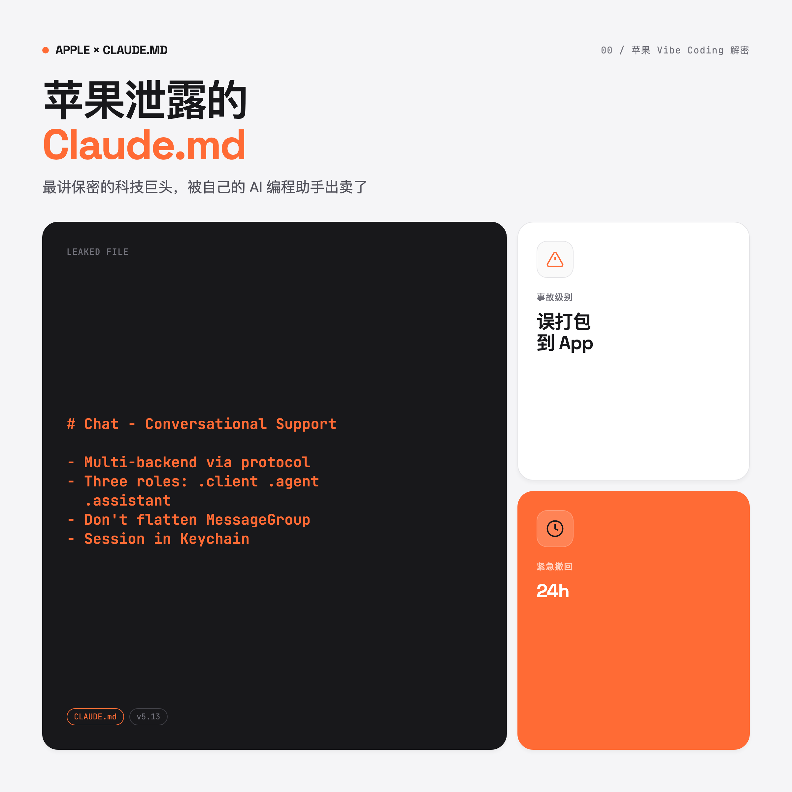
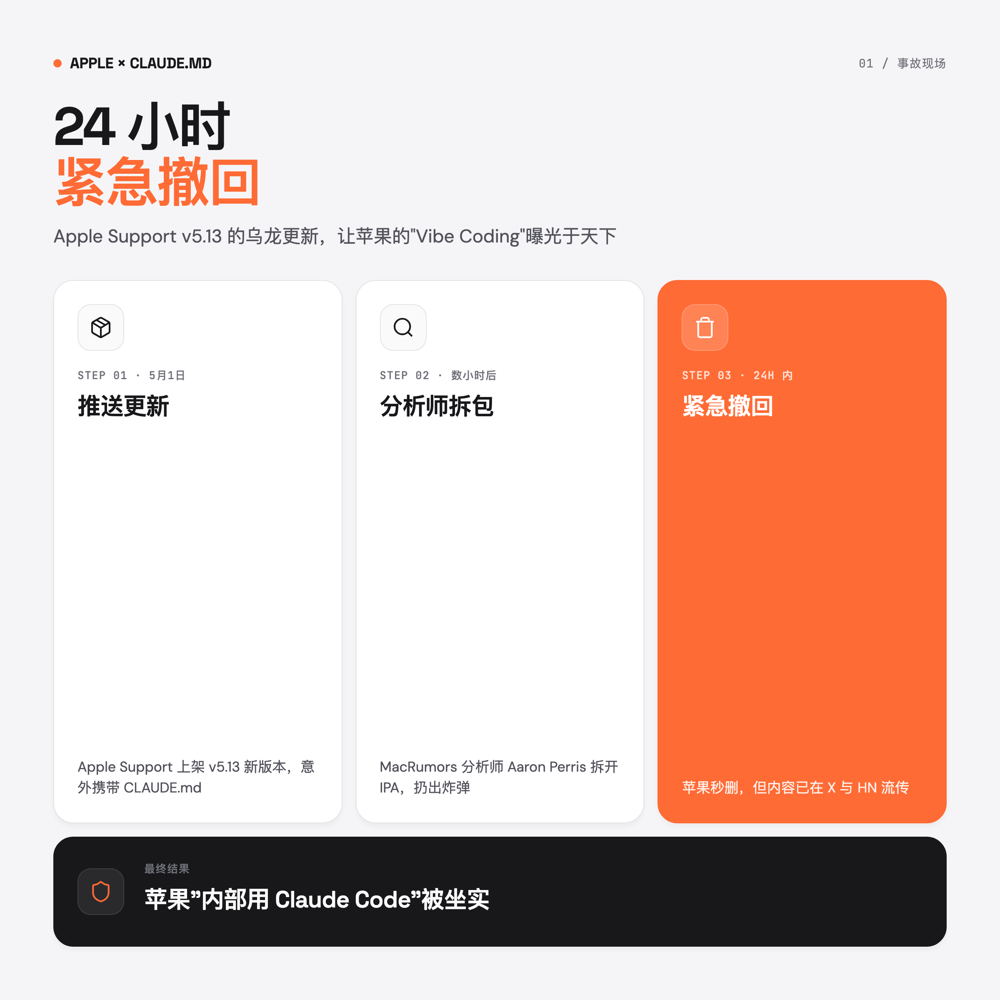
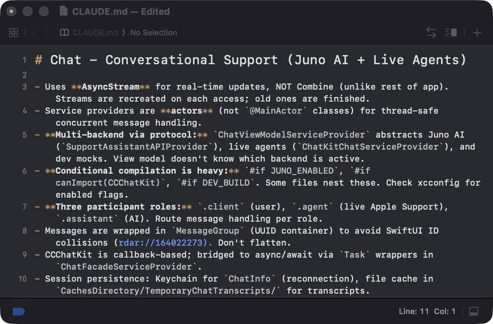
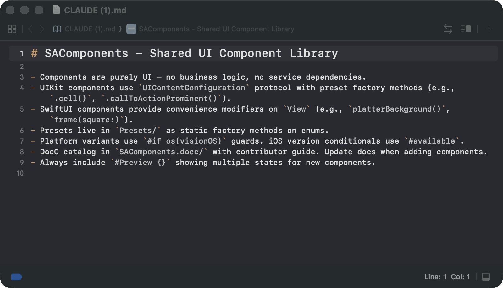
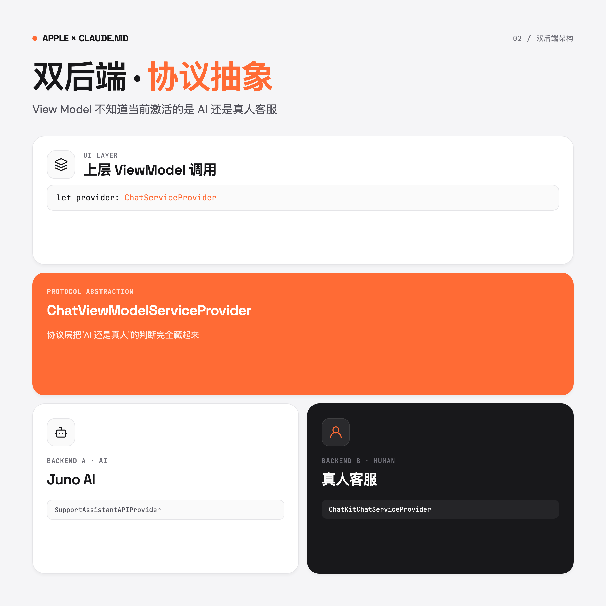
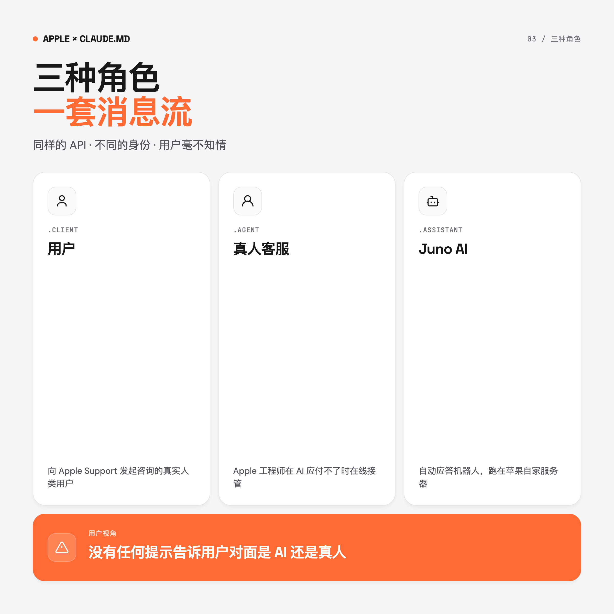
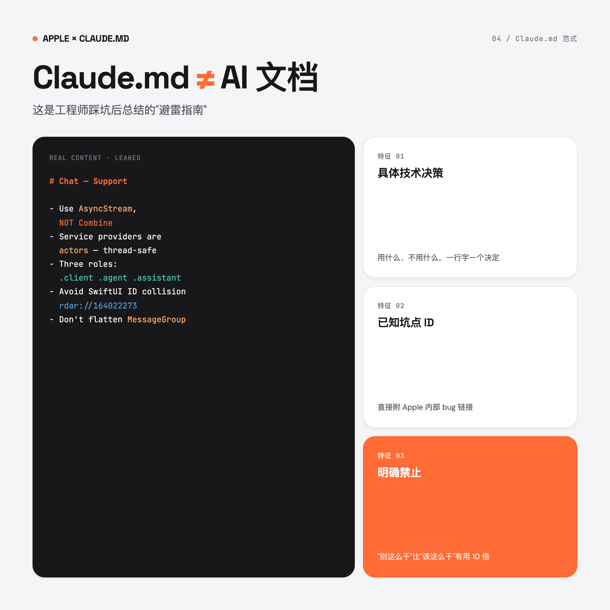
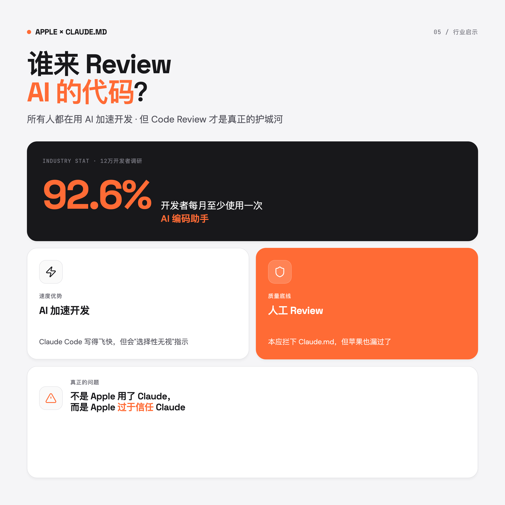

> 苹果在 Apple Support App 里误打包了一份给 Claude Code 看的内部说明书。
> 24 小时紧急撤回，但内容已经传开了。



---

## 一句话总结

Apple Support 客服 App 的核心模块是用 Claude Code 写的。泄露的 `Claude.md` 展示了一个 AI 与真人无缝切换的双后端架构。苹果的企业级业务系统，已经在全面 Vibe Coding。

---

## 一、事故现场：24 小时紧急撤回

5 月 1 日，Apple Support App 推送了 v5.13 更新。

不到 24 小时后，MacRumors 分析师 Aaron Perris 在 X 上发了一条消息：苹果把自己用的 `CLAUDE.md` 打包进了官方 App。

苹果反应很快，立刻撤回重新发版。但互联网有记忆，文件内容已经在 X 和 Hacker News 上传开。



> `Claude.md` 是 Claude Code 的项目级说明书，告诉 AI 这个项目是什么、怎么构建、要遵循哪些规范、避免哪些雷区。这种文件不应该进入生产构建包。

这事和上次 Claude Code 自己源码泄露（把 source map 打包进发布版）的剧本几乎一样。

> 两次事故的凶手，可能都是 Claude Code 本人。

---

## 二、泄露的两份 Claude.md，到底说了啥？

苹果这次泄露了两份文件。

### 文件一：Chat 模块



完整翻译如下：

> **Chat - 对话式客服系统 (Juno AI + 真人客服)**
>
> - 用 `AsyncStream` 做实时更新，不用 `Combine`（和 App 其他部分不同）
> - Service providers 用 `actors`（不是 `@MainActor` 类），用于线程安全的并发消息处理
> - 通过 Protocol 实现多后端：`ChatViewModelServiceProvider` 抽象了 Juno AI、真人客服和开发用 mocks。View Model 不知道当前激活的是哪个后端。
> - 三种参与者角色：`.client`（用户）、`.agent`（真人客服）、`.assistant`（AI）
> - 消息封装在 `MessageGroup`（UUID 容器）里，不要扁平化
> - 会话持久化：Keychain 存重连信息，文件缓存存聊天记录

10 行内容，浓缩了一个企业级客服对话系统的完整工程边界。

### 文件二：SAComponents



纯 UI 组件库，没有业务逻辑、没有服务依赖，带 DocC 文档。没什么猛料，但证明了一件事：苹果把 AI 编码用在了从底层 UI 组件到上层业务逻辑的整条工程链上。

---

## 三、架构解读：AI 与真人怎么无缝切换

### 双后端 · Protocol 抽象

苹果把客服后端做成了协议抽象。上层只调一个 `ChatViewModelServiceProvider` 协议，背后到底是 AI 还是真人，View Model 完全不知道。



| 后端 | 角色 | 类名 |
|------|------|------|
| **Juno AI** | 自动应答 | `SupportAssistantAPIProvider` |
| **真人客服** | 工程师接管 | `ChatKitChatServiceProvider` |
| **Dev Mocks** | 开发调试 | (开发版) |

好处很明显：AI 应付不了的复杂问题，直接转给真人，UI 不用改。

> 苹果最擅长的一手：把"换大脑"的复杂度藏在协议层后面，上面看起来什么都没变。

### 三角色消息系统

聊天消息流里有三种身份：



```swift
enum MessageRole {
    case client      // 用户
    case agent       // 真人 Apple Support 客服
    case assistant   // Juno AI
}
```

所有消息走同一套处理流程，没有任何标识告诉用户对面是 AI 还是真人。

Hacker News 上有人争论：用户有没有权利知道自己在和谁说话？但这不是重点。重点是苹果在用 Claude Code 写一个会隐藏 AI 身份的客服系统。

### 最小 Demo

如果你想用 Claude Code 写类似的客服系统，参考这个骨架：

```swift
// 协议层：上层只认它
protocol ChatServiceProvider {
    func send(_ message: String) async throws
    var messages: AsyncStream<Message> { get }
}

// 实现 1：AI 后端
final class AIBackend: ChatServiceProvider { ... }

// 实现 2：真人后端
final class HumanBackend: ChatServiceProvider { ... }

// 上层 ViewModel：不知道用的是哪个
final class ChatViewModel {
    let provider: ChatServiceProvider  // ← 关键就这一行
}
```

"AI 还是真人"的判断被封装在 `provider` 的初始化阶段。升级、回退、A/B 测试都不影响 UI 层。

---

## 四、好的 Claude.md 长什么样？

很多人写 `Claude.md` 写得像 README，最后 Claude Code 该犯的错一个不少。看看苹果怎么写的：



苹果的 `Claude.md` 有几个鲜明的工程师味道：

**1. 不写废话，只写决策**

❌ 普通文档："这个模块负责处理聊天消息"
✅ 苹果版：「用 `AsyncStream`，不用 `Combine`（和 App 其他部分不同）」

直接告诉 AI 做什么、不做什么、为什么。一个决策一行字。

**2. 把已知的坑点列出来**

```text
- 消息要包在 MessageGroup（UUID 容器）里，避免 SwiftUI ID 冲突 (rdar://164022273)
- 不要扁平化
```

`rdar://164022273` 是苹果内部 bug 系统的链接。他们直接把踩过的坑做成 ID 写进文档。

**3. 明确禁止行为**

```text
- Service providers 用 actors，不是 @MainActor 类
- 不要用 Combine
- 不要扁平化 MessageGroup
```

> 好的 `Claude.md` 不是项目说明书，而是工程师踩坑后总结的避雷指南。直接写"别这么干"，比写"应该这么干"有用 10 倍。

### Claude.md 模板

```markdown
# 模块名 - 一句话定位

## 架构关键点
- 用什么、不用什么（带原因）
- 与 App 其他部分的差异

## 已知坑点
- 具体 bug ID
- 临时 workaround

## 禁止事项
- 不要 X
- 不要 Y
```

---

## 五、苹果离不开 Anthropic 了

这事不让人意外。

三个月前，彭博社记者 Mark Gurman 就说过：**"Apple runs on Anthropic at this point."**

| 用途 | 苹果用什么 |
|------|-----------|
| 内部代码生成 | 定制版 Claude（跑在自家服务器） |
| 旧版 Siri 替换 | Gemini（Google 合作） |
| 系统级 AI（端侧） | 自研 Apple Intelligence |

内部开发工具选 Claude，对外产品选 Gemini。Anthropic 的销售团队要过年了。

> 苹果一贯的逻辑：用 AI 可以，数据不能出去。内部代码、文档、token 全在苹果基础设施里跑。

也有前苹果员工在 HN 出来降温：苹果内部有数百个隔离团队，某些团队用 Claude，不代表全公司都在 Vibe Coding。

但 12 万开发者的调研数据更能说明问题——

---

## 六、AI 时代，谁来 Review AI 的代码？



**92.6% 的开发者每月至少用一次 AI 编码助手。**

苹果用 Claude 写代码，只是行业缩影。问题不是用不用 AI，而是——

> 连苹果都会把不该提交的文件推到生产环境，这意味着什么？

Hacker News 上一条高赞评论：

> 真正的问题不是 Apple 用了 Claude，而是 Apple 对 Claude 过于信任。所有人都在用 AI 加速开发，但这件事本应被代码审查拦下来。

Claude Code 的"性格"也不太省心。它经常选择性无视指示，你说多少遍"别提交 X 文件"，它该提交还是提交。

### Vibe Coding 团队的提醒

| 阶段 | 容易翻车的点 | 应对 |
|------|------------|------|
| 写代码 | AI 选择性无视指示 | 在 `.gitignore` 里硬性兜底 |
| 提交 | AI 把内部文档一并 push | 加 pre-commit hook 拦截 |
| 打包 | 内部文件进入 build artifact | 构建脚本白名单 + CI 校验 |
| Code Review | 节奏快，肉眼漏看 | 专门 review AI 代码的 reviewer |

---

## 总结

苹果这次翻车，对整个行业都是清醒剂：

- AI 写企业级代码不是未来时，是现在进行时。连 Apple Support 都在跑。
- 好的 `Claude.md` 不是 README，是踩坑总结。具体决策 + 已知坑点 + 明确禁止。
- 协议抽象 + 多后端是 AI 与真人无缝切换的工程范式，值得抄。
- AI 越快，Code Review 越要严。AI 不会替你担责任。

苹果的某位工程师正在经历职业生涯最糟糕的一天。Anthropic 的销售团队正在经历最好的一天。而我们这些围观群众，刚刚白嫖了一份苹果工程师的内部开发手册。

---

你的项目里有 `Claude.md` 吗？写得是不是也像 README 一样空洞？

试着按苹果的范式重写一下——只写决策、坑点、禁令，看看 Claude Code 会不会"乖"很多。

---

**参考链接：**
- [Aaron Perris 原推](https://x.com/aaronp613/status/2049986504617820551)
- [Hacker News 讨论](https://news.ycombinator.com/item?id=47973378)
