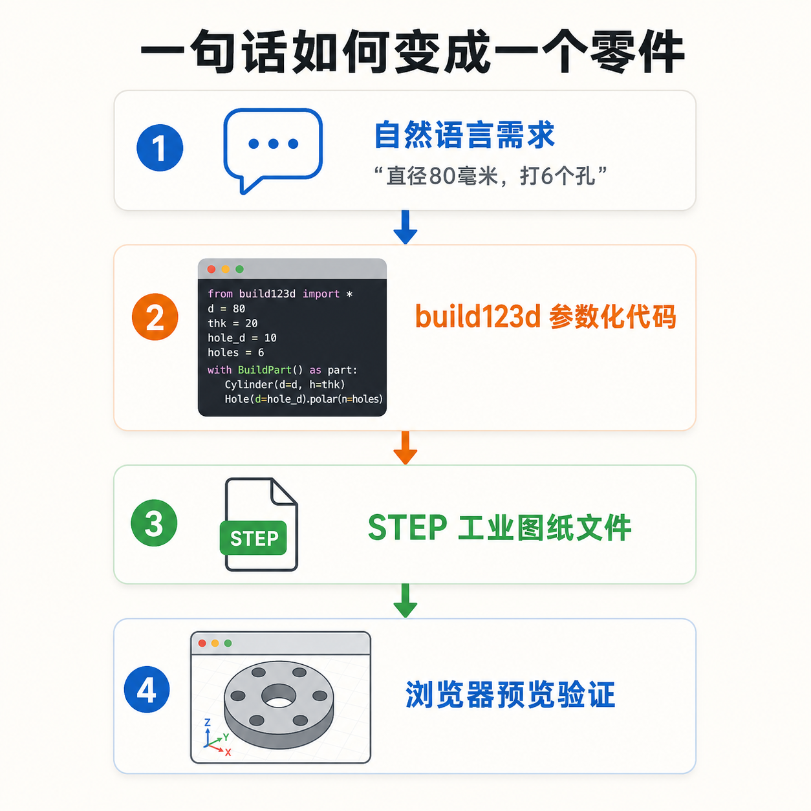
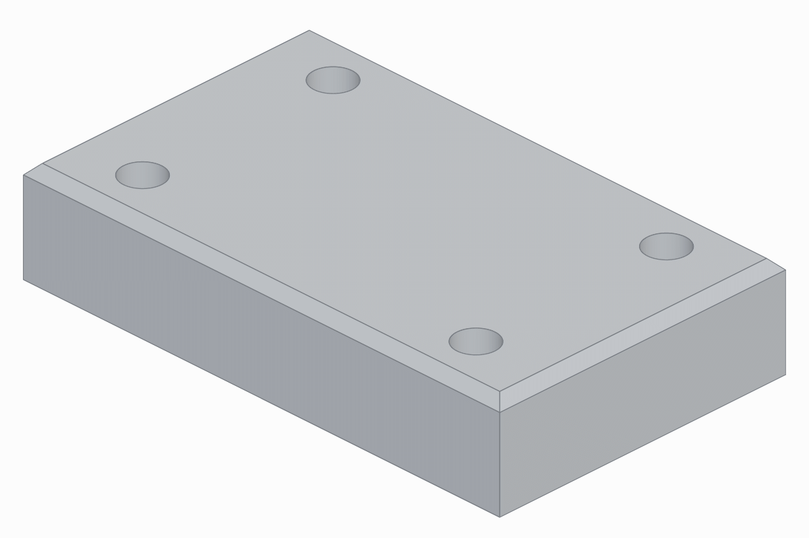
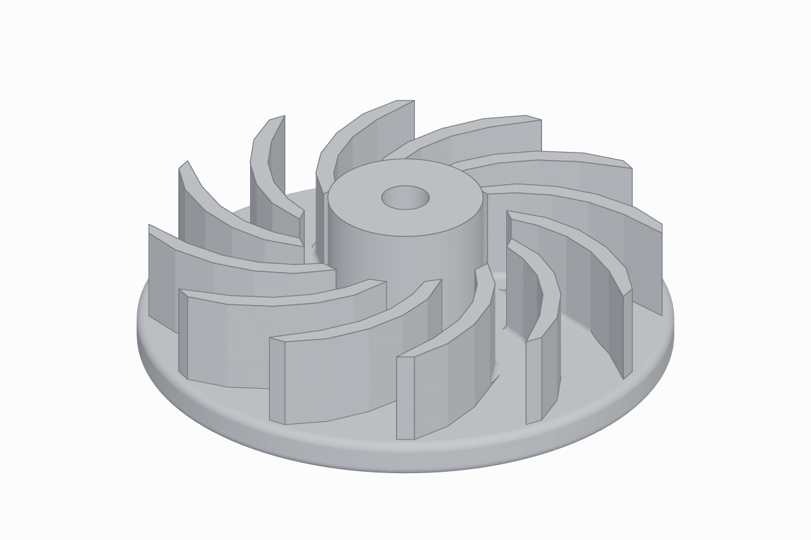
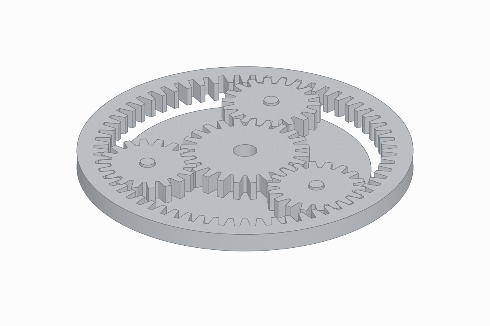
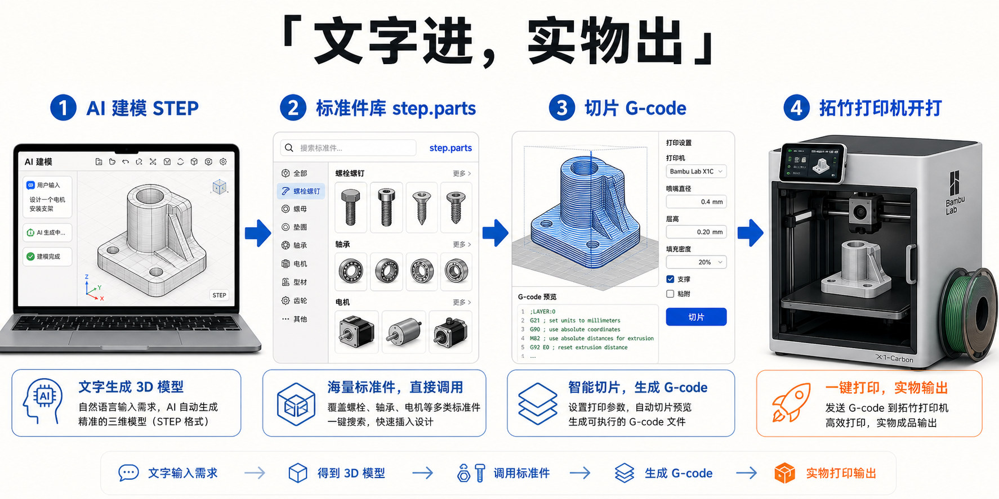

# 从一句话到一个零件，10K Star 的 CAD Skills 把 AI 编程变成了 AI 造物


---

## 一句话总结

GitHub 上 10K Star 的 text-to-cad 项目，给 Claude Code 装上了一套机械设计 Skills。你用自然语言描述想要的零件，它写出参数化建模代码，生成工业标准的 STEP 文件，还能一路切片、推到 3D 打印机开打。**AI 编程的边界，从数字世界伸进了物理世界。**

---

## 3D 打印机为什么都在吃灰

家里有台 3D 打印机的人，大多经历过三个阶段。

第一阶段，机器到手，连夜打印小船。那条小船叫 Benchy，3D 打印界的 Hello World，几乎每个人的打印机处女作都是它。

第二阶段，泡在 MakerWorld 和 Thingiverse 上，别人设计什么，我打印什么。手机支架、花盆、小恐龙，家里很快堆满了一堆好看但没什么用的东西。

第三阶段，吃灰。

卡住的从来不是机器，是建模。想给显示器打个增高架，想给桌角打个理线器，尺寸就摆在那里，网上就是找不到现成的。打开 Fusion 360，对着空白画布发了半小时呆，默默关掉，继续回去下载别人的小恐龙。

**3D 打印的最后一公里，不是打印，是设计。** 机器几百块就能买到，CAD 建模的学习成本却按年算。

上周我在 GitHub 上刷到一个项目，把这件事反了过来。你只需要说一句话，「帮我做一个 100×60×20 毫米的方块，打四个 8 毫米的孔，顶面倒个角」，Claude Code 就会真的交给你一个可以拿去打印的零件文件。

这个项目叫 text-to-cad，三个月拿了 10.5K Star。

---

## 它是什么，一套给 Agent 的机械工具箱

text-to-cad 在 GitHub 上的正式名称叫 CAD Skills，作者 earthtojake，今年 4 月开源，MIT 协议，随便用。

它的定位很清晰，**给 AI Agent 用的机械设计技能库**。安装之后，Claude Code 或者 Codex 会获得 11 个 Skills，我按用途把它们分成四组。

第一组，核心建模。`cad` 负责把自然语言变成 STEP 文件，`cad-viewer` 在浏览器里实时预览生成的模型，转一转，看一看，确认长什么样。

第二组，找零件。`step-parts` 连接一个真实的标准件库，螺丝、轴承、电机、舵机，搜得到真实型号就直接下载官方 STEP 文件来装配，不让 AI 自己瞎画一个假的。

第三组，机器人三件套。`urdf`、`srdf`、`sdf` 分别负责机器人结构描述、运动规划配置和仿真世界建模，给玩机械臂和机器人仿真的人准备的。

第四组，落地制造。`dxf` 出 2D 激光切割图，`sendcutsend` 对接板材切割服务做上传前检查，`gcode` 调用真实切片器把模型切成打印机指令，`bambu-labs` 直接推给拓竹打印机开打。

看出来了，这不是一个工具，是一整条流水线。从一句话，到建模，到找标准件，到切片，到打印机开始出料。

另外还有一个实验性的 `implicit-cad`，用数学场函数直接在浏览器里建模，属于作者的炫技环节，先按下不表。

---

## 它怎么工作，不画网格，写代码

这套 Skills 最聪明的地方，是绕开了一个大坑。

让 AI 直接生成 3D 模型，目前的主流做法是生成网格，一大堆三角形拼出来的表面。这条路走了好几年，效果始终差点意思，面片破洞、尺寸随缘、改一个参数等于重做。AI 生图的那种运气成分，放在工程领域是要命的。

text-to-cad 换了个思路，**它不让 AI 画模型，它让 AI 写代码**。

Agent 会把你的自然语言需求翻译成 build123d 代码。build123d 是一个 Python 参数化建模库，用代码描述几何，拉伸一块板，旋转一个轴，在什么坐标打什么直径的孔，倒几毫米的角。代码写完，编译输出 STEP 文件。

拿文章开头那个方块举例，build123d 写出来大概长这样，每个尺寸都是参数，四个孔用一行网格定位批量打出来，再做布尔差集挖通。

```python
from build123d import BuildPart, Box, Cylinder, GridLocations, Mode

with BuildPart() as part:
    Box(100, 60, 20)                          # 100×60×20 方块
    with GridLocations(70, 40, 2, 2):         # 四个孔位，X±35、Y±20
        Cylinder(4, 25, mode=Mode.SUBTRACT)   # 直径 8 通孔，差集挖掉
```

看得出来，这和写一个普通函数没有本质区别，改尺寸就是改数字，加特征就是加几行。对大模型来说，这种活比写自由文本还规矩。

这个选择妙在两个地方。

其一，**写代码恰恰是现在大模型最擅长的事**。生成一段「直径 80、厚度 10、中心孔 30、六个螺栓孔均布在 60 毫米节圆上」的 Python，对 Claude 来说比写一篇小作文还容易，精确到 0.1 毫米，没有运气成分。

其二，**参数化意味着可修改**。孔径从 8 毫米改成 10 毫米，传统网格模型基本等于重做，参数化代码改一个变量重新编译就好。这是工程师的工作方式，不是画家的。

打个比方，Agent 学的不是捏粘土，是写配方。配方精确到克，谁照着做都是一个结果。

输出格式也有讲究。STEP 是工业界的通用图纸语言，SolidWorks、Fusion 360、FreeCAD 全都认。它不是 STL 那种只有表面信息的「照片」，而是带完整几何定义的「图纸」，可以直接送去机加工。



---

## 交作业之前，先自己检查一遍

用过 AI 编程工具的人都知道，AI 最危险的时刻，是它信心满满交差的那一刻。

text-to-cad 在流程里强制加了一道质检。模型生成之后，Agent 必须运行检查工具，核对包围盒尺寸、孔的数量、孔径、孔位、轴线方向，全部和原始需求对一遍。

更有意思的是，规则里白纸黑字写着，**截图自查是强制步骤**。Agent 必须给生成的模型拍快照，自己看一眼，确认没有长出什么奇怪的东西，才能交差。确定性检查全部通过，也不许跳过这一步。

这个细节很工程。它不信任模型的自觉，用流程把验证焊死在流水线上。

官方考题也是同样的思路。第一题校准块的要求细到「倒角只许出现在顶面外轮廓，孔不许倒角，不许多出任何装饰性结构」。

防的就是 AI 自由发挥。

---

## 它能做到什么程度，从方块到行星齿轮

光说不练假把式，作者在项目里放了 10 道公开考题，难度逐级上升。

第 1 题，入门。一个 100×60×20 毫米的校准块，四个 8 毫米通孔，顶面 2 毫米倒角。机械专业金工实习的第一课。



中间几题开始上强度。带加强筋的 L 型支架、带键槽的阶梯轴、开顶电子外壳。第 7 题是星形发动机气缸，12 片散热鳍片，外加一个 35 度倾斜的火花塞凸台。第 8 题是离心叶轮，12 片后弯叶片，从叶根到叶尖扫掠约 45 度。



压轴的第 10 题，一套简化的行星齿轮组。太阳轮 24 齿，三个行星轮各 18 齿，120 度均布，外面套一个 60 齿的内齿圈，底下还有保持架和销轴，全部作为独立零件装配在一起。



这套题目放在机械工程师的资格考试里也不违和。它标出的能力边界很清楚，**规则几何、参数明确的零件，AI 已经可以端到端完成**。真正的渐开线齿形、复杂受力优化，目前超出范围，作者也诚实地把第 10 题标注为简化梯形齿。

---

## 不止建模，文字进，实物出

如果只是生成模型，这个项目大概值 1K Star。把它推上 10K 的，是后面那条完整的制造链路。

装配体需要标准件，`step-parts` 先去真实零件库搜。搜得到就用官方模型，搜不到才用简化占位体，并且明确记录在案，不装蒜。

板材件走另一条路，`dxf` 生成 2D 切割图，`sendcutsend` 在上传到板材加工服务之前先帮你检查文件有没有问题。

要 3D 打印，`gcode` 调用你本机真实安装的切片器生成 G-code，不是模拟一个切片结果糊弄你。然后 `bambu-labs` 通过局域网把文件推给拓竹打印机。

最后这一步的安全设计我很喜欢。**默认只预演，不真实执行**。想让打印机真正开打，必须同时加上 `--execute` 和 `--confirm-start-print` 两个参数。AI 可以把一切准备好，但按下开始键的动作，刻意留给了人。



一句话进去，一个零件出来。这条链路今年是真的通了。

---

## 上手，一行命令的事

安装是我见过的开源项目里最省事的一档。

```bash
npx skills install earthtojake/text-to-cad
```

Claude Code 用户也可以走插件市场。

```bash
claude plugin marketplace add earthtojake/text-to-cad
claude plugin install cad@text-to-cad
```

装完之后，直接对 Claude Code 说一句人话就行。比如官方考题第 2 题，「创建一个直径 80 毫米、厚度 10 毫米的圆形法兰，中心通孔 30 毫米，六个 6 毫米的螺栓孔均匀分布在 60 毫米的节圆上，外圆边缘倒圆角」。

跑完你会得到一个 STEP 文件，外加一个浏览器预览链接，可以 360 度转着看。不想安装的话，也可以先去官方演示站 demo.cadskills.xyz 过个眼瘾。

---

## 总结

回到开头那台吃灰的打印机。

那堵墙没有消失，CAD 依然是门硬功夫。但墙上被开了一扇门，门后站着 Claude Code。你不需要学会建模，只需要学会把需求说清楚，多大、多厚、几个孔、孔在哪，这些你本来就知道。

往大了说一点。去年我们还在讨论 Agent 会不会用电脑，今年 Agent 已经开始设计物理世界的东西了。**Skills 正在变成 AI 从数字世界伸进物理世界的接口**，先是代码，然后是文档，现在是零件。

如果你的打印机也在吃灰，现在是时候给它找点正经活干了。

欢迎关注我的公众号「Chyris Tech Note」，获取更多 AI 技术解读与实践分享。

