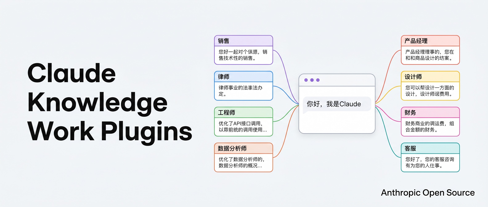
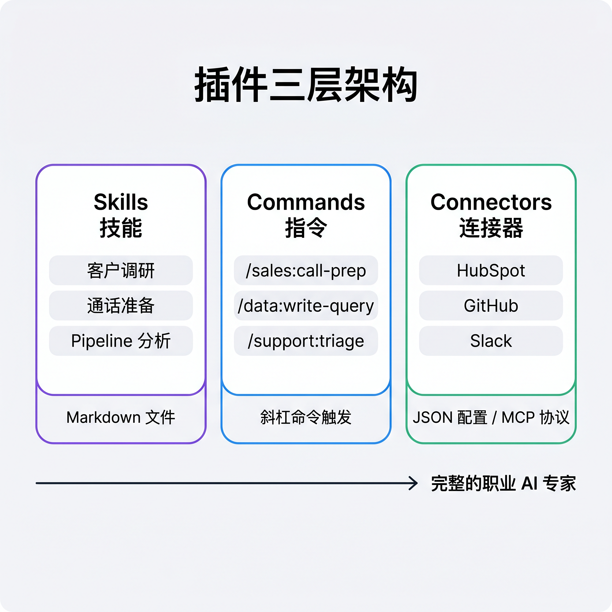
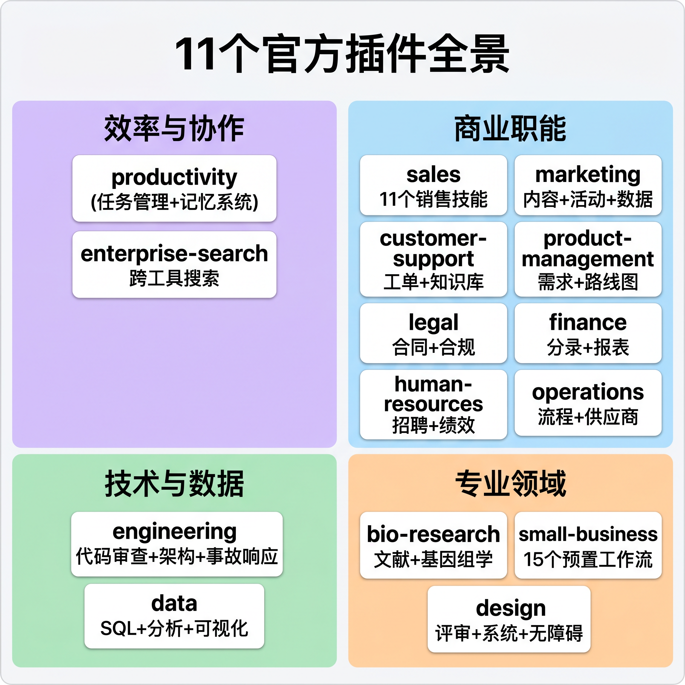
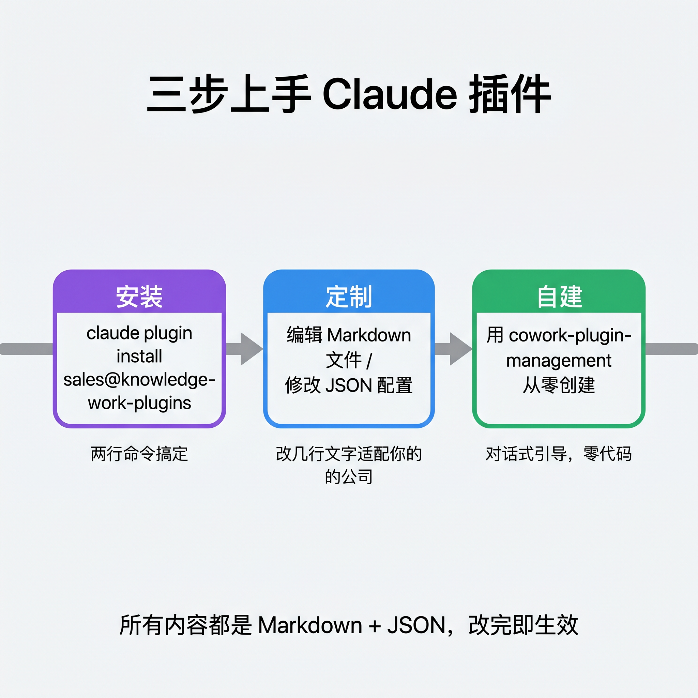

# Anthropic 开源了 11 个 Claude 插件，让 AI 从通才变专家

> 一个仓库，11 个职业角色，纯 Markdown 零代码，装上就能用



---

假设你做销售，每天的工作是调研客户、准备通话、跟 pipeline、写跟进邮件。你有一个 Claude 账号，偶尔让它帮你写写邮件草稿，但大部分销售工作它帮不上忙，因为它不懂你的 CRM，不知道你的客户是谁，竞争对手在做什么也不清楚。

Anthropic 前阵子在 GitHub 上开源了一个叫 **knowledge-work-plugins** 的仓库。里面装了 11 个现成的 Claude 插件，覆盖了销售、法务、数据分析等常见职场角色。不管你干哪行，大概率能找到一个对应的。装上之后 Claude 就不一样了，它知道你用什么工具、走什么流程、说什么行话，从一个万能陪聊变成了真正能搭把手的搭档。

别把它当成什么 demo 或者 prompt 集合，这是真装真用真跑的东西。

---

## 一个 AI 为什么要「分身」

先说一个很多人都有过的体验。

你让 Claude 帮你写一封销售邮件，它写得不错，措辞得体。但你拿到手一看发现，它不知道你的客户公司叫什么，不了解你上次通话聊了什么，更不知道你们的产品和竞品的差异点在哪。你得手动把这些信息喂给它，喂完之后邮件确实好了一些，但下一次你还得重新喂。

通用 AI 的问题不是能力不够，是缺上下文。它不知道你是谁，不知道你用什么工具，工作流长什么样也不清楚。每次对话都像第一天上班的实习生，聪明，但什么都得从头教。

Anthropic 的思路是，与其让一个 AI 暴力全能，不如给它分身。销售有销售的技能包，律师有律师的，连的工具、走的工作流都不一样。这就是插件干的事。

每个插件包含三层东西。我看完觉得最巧妙的是，这三层用纯文件就搞定了：

- **Skills**（技能）是领域知识，写在 Markdown 里。销售插件装了客户调研、通话准备、pipeline 分析等技能，Claude 根据对话自动调用，不需要你手动触发
- **Commands**（指令）是快捷操作，也是 Markdown。输入 `/sales:call-prep`，Claude 就知道你要准备一场销售通话，自动拉取客户信息、组织议程
- **Connectors**（连接器）是 JSON 配置，把 Claude 接入你实际使用的工具。销售插件能连 HubSpot、ZoomInfo、Slack、Fireflies，让 Claude 直接读写你的真实数据



说白了就是 Markdown 加 JSON，没有代码，没有构建步骤，没有基础设施。改几行文字就能定制一个插件，后面会展开说。

---

## 11 个插件里有什么

Anthropic 官方出了 11 个插件，覆盖了从研发到销售、从法务到财务的常见职能。还有 5 个合作伙伴做的插件。逐一展开太长，挑几个有意思的聊。

### productivity（效率管理）

这个插件解决的是「每天到底要干啥」的问题。

它有一个任务管理系统，用 `TASKS.md` 文件记录所有待办。你输入 `/start` 初始化系统，Claude 会整理出一个任务清单和可视化的 dashboard。用 `/update --comprehensive` 可以深扫描日历、邮件和聊天，把埋在各处的待办都捞出来，过期的任务会自动提醒。

我最喜欢的是它的两级记忆系统。第一级是 `CLAUDE.md`，存你的基本信息和偏好。第二级是 `memory/` 目录，存更细的上下文，比如某个项目的进展、某次会议的结论。每次开始新对话，Claude 都会先读这些文件，相当于养成了一个「上班先看笔记」的习惯。

### sales（销售）

如果你做销售，这个插件可能是整个仓库里最实用的。

9 个技能覆盖了销售的完整工作流。通话前，用 account-research 快速了解目标公司的业务和组织结构，call-prep 基于客户信息和产品卖点自动生成议程。

通话结束之后也有对应的工具。call-summary 从笔记里提取关键信息和下一步行动，pipeline-review 分析你在跟进的所有商机，告诉你哪些该优先、哪些可能要放弃。还有一个 competitive-intelligence 技能，帮你建竞品对比卡，这个在打单的时候特别有用。

连接器也丰富，HubSpot、Close、Clay、ZoomInfo、Slack、Fireflies 都能接。接上之后 Claude 可以直接从 CRM 里拉客户信息，从通话录音里提取要点，自动生成跟进邮件。

### engineering（工程）

程序员也别急，有专门的 engineering 插件。

10 个技能覆盖了开发日常的主要场景。code-review 帮你看 PR，architecture 帮你写 ADR（Architecture Decision Record），incident-response 从分诊到事后复盘全流程覆盖。比较有意思的是 standup 技能，它从你最近的 Git 提交、PR 和任务追踪工具里拉活动记录，自动生成站会汇报。再也不用每天早上对着屏幕想「我昨天到底干了啥」。

连接器包括 GitHub、Linear、PagerDuty、Datadog 等开发工具。

### small-business（小企业）

这个是给没有专职 IT 团队的小公司准备的。一个插件覆盖财务、合同、营销、客服多个领域，15 个预置工作流开箱即用。

合同审查帮你扫风险条款，周一简报自动生成上周业绩加本周重点的单页摘要。它能连 QuickBooks、Stripe、PayPal 管钱，HubSpot、Canva 搞营销。小公司老板一个人干好几个岗位的活，这个插件算是比较贴心的设计。

### 其他插件

剩下的几个简单过一下。**product-management** 帮产品经理写需求文档、规划路线图，连着 Linear、Figma、Amplitude 一堆工具，产品经理应该会喜欢。**data** 帮分析师写 SQL、验证数据，支持 BigQuery、Snowflake，这个配合数据仓库用起来很顺。

其余几个各管各的专业领域。**legal** 审查合同、处理 NDA，**finance** 准备分录、对账，**customer-support** 分诊工单、生成知识库文章，**design** 做评审和 UX 文案，**marketing** 管内容和活动。**enterprise-search** 我觉得是所有插件里最通用的，一句话就能在 Slack、邮件、文档、Wiki 里搜东西。**bio-research** 最垂直，面向生物制药早期研发。

对了，README 里列了 11 个，但仓库实际还多了 design、small-business、human-resources、operations、pdf-viewer 这几个。加上 5 个合作伙伴插件（Apollo、Brand Voice、Common Room、Slack、Zoom），生态比看上去更丰富。



---

## 怎么装、怎么改、怎么造

### 两行命令装上

如果你用 Claude Code，安装只需要两步：

```bash
# 先添加插件市场
claude plugin marketplace add anthropics/knowledge-work-plugins

# 然后安装你需要的插件
claude plugin install sales@knowledge-work-plugins
```

如果你用的是 Claude Cowork（Anthropic 的协作平台），直接在 claude.com/plugins 页面点安装就行。

装完之后，插件会自动激活。Claude 会根据你的对话内容自动匹配相关的技能，你不需要手动切换。Slash 命令也会出现在你的会话里，比如 `/sales:call-prep`、`/data:write-query`。

### 改几行 Markdown 就能定制

官方说得很直白，这些插件是「generic starting points」，通用起点。真正有用的是你根据自己公司的情况定制。

定制方式很简单。想换连接的工具，改 `.mcp.json`，把 HubSpot 换成 Salesforce，几行 JSON 的事。术语不合适？往 skill 文件里加几段 Markdown 就行。工作流对不上你团队的实际情况，直接编辑 skill 里的步骤说明。

整个插件就是一个目录，里面全是 Markdown 和 JSON。没有编译，没有构建，改完即生效。

### 从零造一个新插件

如果你需要的角色官方没覆盖，可以用 `cowork-plugin-management` 插件自己造。它的 create-cowork-plugin 技能会通过对话引导你一步步创建：先确认插件要解决什么问题，然后生成目录结构、技能文件、连接器配置，最后输出一个完整的插件包。

整个流程也是纯对话式的，不需要写代码。



---

## 为什么这件事值得关注

回到开头那个销售的例子。

装上 sales 插件之后，Claude 能从 HubSpot 拉你的客户数据，从 Fireflies 读上一次通话记录，自动帮你准备下一次通话的议程。开头那个「手动喂上下文」的问题，插件直接解决了。

说实话现在还有不少限制。这些插件是通用的起点，得根据自己情况定制。连接器要实际配置对应的 MCP 服务才能用，部分插件面向非常垂直的场景，一般人用不上。但门槛已经在这里了，定义一个 AI 专家，写几段 Markdown 就够了。11 个官方插件加上仓库里额外的几个和社区贡献，Claude 在慢慢变成一个覆盖各个职能的专家网络。

欢迎关注我的公众号「Chyris Tech Note」，获取更多 AI 技术解读与实践分享。
