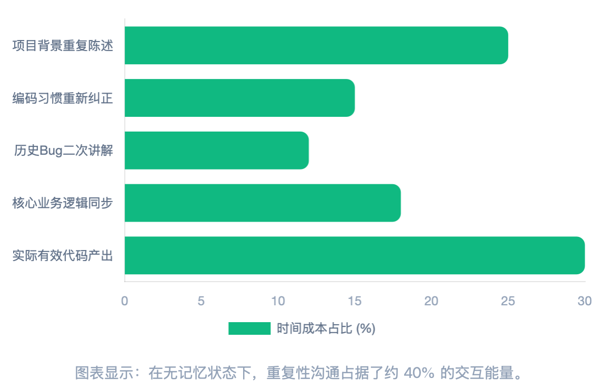
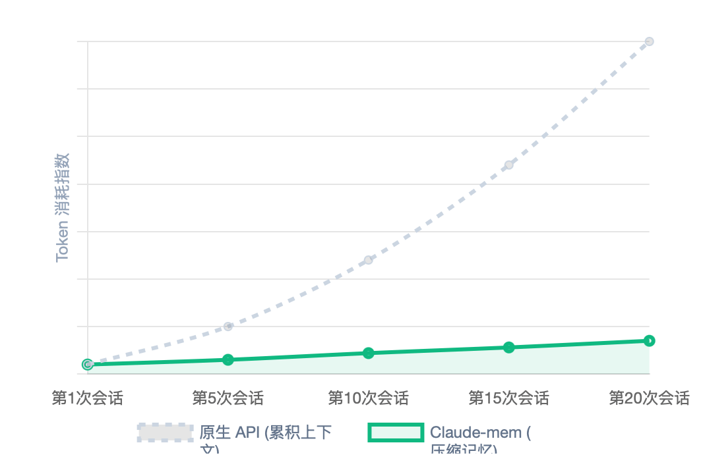

**thedotmack/claude-mem**，一个专为 Claude Code 设计的记忆插件，已经狂揽 **5.4 万 star**，仅今天一天就涨了 **3175 star**。这在开发者工具赛道里，算得上实打实的现象级爆品。

它解决了一个看似细小、实则极其致命的问题：

> 每次打开新会话，AI 都会把你忘得一干二净。

claude-mem 的出现，第一次让 AI 编程助手拥有了"长期记忆"。这意味着，你不再需要像面对一个新同事一样，每次都要重新自我介绍一遍项目背景、技术栈和最近的改动。

它是怎么做到的？这篇文章带你一次性看懂。

---

## 一、痛点：为什么 AI 每次都要"重新自我介绍"？

如果你经常用 Claude Code、Cursor 或者类似的 AI 编程工具，一定经历过这种崩溃时刻：

你花了两小时，跟 AI 一起理清了一个复杂 Bug 的根因，确认了修复方案，改好了代码。第二天你打开一个新窗口，想让它继续优化相关模块，结果它一脸茫然：

"这是什么项目？用的是什么框架？昨天的 Bug 修了什么？"

你被迫把昨天的对话从头到尾再讲一遍。项目名称、组件库偏好、编码规范、历史 Bug 逻辑......全都要重新同步。



这不是你的错觉。数据显示，在无记忆状态下，重复性沟通大约占据了你与 AI **40% 的交互能量**。你真正花在写代码上的有效时间，被大量地浪费在了"上下文重建"上。

更深层的问题还有三个：

1. **上下文腐烂**：窗口里塞满了低价值的历史信息，AI 推理质量下降，甚至出现幻觉。
2. **Token 烧钱**：每次启动都要重新注入数万 Token 的项目文档，API 成本飙升。
3. **重新读取税**：AI 反复扫描同一个文件来回答同一个问题，I/O 和延迟都在白白消耗。

Claude Code 官方也并非没有尝试过解决方案。`CLAUDE.md` 文件、Auto Memory、Auto Dream......但这些方案要么需要人工维护容易过时，要么索引容量只有 200 行，要么只能清理几天前的杂乱信息，无法跨越月度级别的项目周期。

**核心矛盾一直没有解决：AI 没有真正的长期记忆。**

---

## 二、解决方案：claude-mem 的记忆管道

claude-mem 的设计理念非常直接：在用户和 Claude 之间，插入一个动态的"长期记忆层"。

它就像一个隐形的记录员，静默地在后台工作，把整个编程过程转化为 AI 可以理解和检索的结构化记忆。

整个工作流可以概括为三步：


### 1. 监控与提取

claude-mem 深度集成了 Claude Code 的五个关键生命周期钩子：

- **SessionStart**：会话启动时，自动检索最近 10 次会话的摘要。
- **UserPromptSubmit**：记录你的每一个原始请求，建立全文检索索引。
- **PostToolUse**：每当 Claude 读文件、写代码或执行命令，输出结果被实时捕获。
- **Stop**：单次问答结束时，生成语义摘要。
- **SessionEnd**：完成数据写入，触发后台清理或向量索引更新。

你完全不需要手动操作，一切都是无感知的。

### 2. 语义压缩

原始的工具输出可能长达数万 Token。claude-mem 不会直接存这些"噪音"，而是启动一个轻量级子智能体（通常用 Claude Haiku），把冗长日志压缩成高信息密度的"事实块"。

这些事实块被称为"观察"（Observation），并被分类打上标签：

- **Decision**：架构决策，比如"为什么用 JWT 而不是 Session"。
- **Bugfix**：特定 Bug 的根因和修复方法。
- **Feature**：新功能的实现逻辑。
- **Discovery**：对代码库的研究结果（占比高达 61%）。
- **Refactor**：代码结构变动及背后考量。

### 3. 自动注入

下一次你打开新会话时，claude-mem 会自动把最相关的记忆内容填入系统提示词。AI 一上来就知道你项目的技术栈、最近的改动和未完成的待办事项。

**"重新自我介绍"的时代，结束了。**

---

## 三、技术亮点：20:1 压缩比与三层检索

claude-mem 不是简单的"聊天记录保存器"。它的核心竞争力，来自对 Claude Agent-SDK 的深度运用。

### 20:1 的语义压缩魔术

一个 `grep` 或 `ls -R` 的命令输出可能有几千行，但真正有价值的信息可能只有几句话。claude-mem 会启动子智能体做三件事：

1. **事实提取**：把执行日志转化为离散的原子事实。
2. **叙述重建**：用极简语言描述操作动机和结果。
3. **元数据映射**：识别受影响文件路径和核心技术概念。

通过这种方式，原本 10,000 Token 的原始数据，可以被压缩成约 500 Token 的结构化观察。这意味着未来的检索成本也同步降低了 20 倍。

### 线性增长的 Token 消耗

如果没有记忆系统，随着项目推进，每次会话需要注入的上下文会指数级膨胀。而 claude-mem 通过持续压缩和去重，把 Token 增长控制在了近乎线性的水平。



更关键的是"相关性检索"：系统不会无脑把所有记忆都塞进去，而是只在需要时注入相关的记忆片段。

### 渐进式披露的三层检索

claude-mem 设计了一套名为 `__IMPORTANT` 的强制工作流，要求 Claude 遵循三层检索模式：

| 层级 | 动作 | 信息密度 | 目的 |
|---|---|---|---|
| 第一层 | search | 标题、ID、类型、时间戳 | 让 AI "感知"历史中存在什么 |
| 第二层 | timeline | 前后事件的因果逻辑 | 理解"为何产生此结果" |
| 第三层 | get_observations | 完整叙述和事实细节 | 获取高保真信息以执行具体修改 |

这种设计使得 AI 在 80% 的时间里，只需维持约 1100 Token 的内存索引，把绝大部分上下文窗口留给真正的代码编写任务。

### 混合排名与记忆衰减

记忆的排序也不是简单的关键词匹配。claude-mem 采用了一个混合评分公式：

```
评分 = 关键词相关性 + 语义相似度 + 时间衰减权重
```

最近的决策会自动获得更高优先级，避免被过时的历史信息淹没。比如"昨天刚把 API 迁移到 v2"，一定比三个月前的旧文档更靠前。

---

## 四、未来方向：从 RAG 到 RAD

claude-mem 的野心，远不止于做一个 Claude Code 插件。它的创始人 Alex Newman 提出了一个非常有前瞻性的概念：**RAD（Real-Time Agent Data，实时智能体数据标准）**。

如果说 RAG 解决的是"AI 知道什么"（外部知识），那么 RAD 解决的是"AI 正在做什么"（自身经验）。

RAD 把智能体的运行轨迹视为一种"产品"：每一次工具调用、每一个决策路径、每一次失败反馈，都被实时捕获和压缩。这让 AI 具备了"元认知"能力——它不仅能生成代码，还能从自己的错误中学习。

而在 claude-mem 的 Beta 分支里，"无尽模式"正在模仿人类大脑的巩固过程：

1. **即时缓冲**：最近操作保存在高速缓存。
2. **睡眠巩固**：系统闲置时，后台智能体自动审查记录，合并相似事实，解决冲突逻辑。
3. **遗忘曲线**：自动删除错误尝试或已完成的过时任务，保持认知空间清爽。

更进一步，当 claude-mem 与团队网关集成时，"联邦记忆"将成为可能。整个团队的开发历史会形成一个统一的"工程大脑"，初级工程师的 AI 可以直接引用高级工程师上周的会话经验。


知识图谱化、多端实时同步、更细粒度的隐私边界控制——这三个方向，很可能定义下一代 AI 开发环境的形态。

---

## 五、结语

claude-mem 的爆火不是偶然。

它击中了一个所有 AI 编程用户都感同身受的痛点：**上下文失忆**。然后通过一套精妙的"监控-压缩-注入"管道，把这个痛点彻底瓦解。

更深层地看，它代表了一场范式转移：AI 编程助手正在从"用完即弃的工具"，进化为"拥有完整项目记忆的数字同事"。

或许在不久的将来，我们与 AI 的对话将不再是从零开始，而是像与一个合作多年的老搭档一样，彼此知根知底，开门见山。

那时候回头再看，claude-mem 可能就是点燃这场变革的第一颗火种。

---

**参考项目**：thedotmack/claude-mem