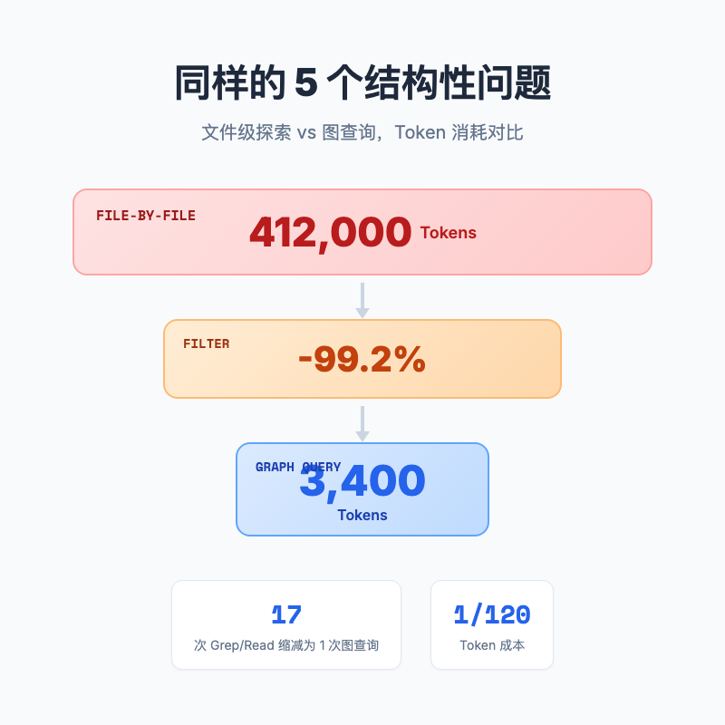
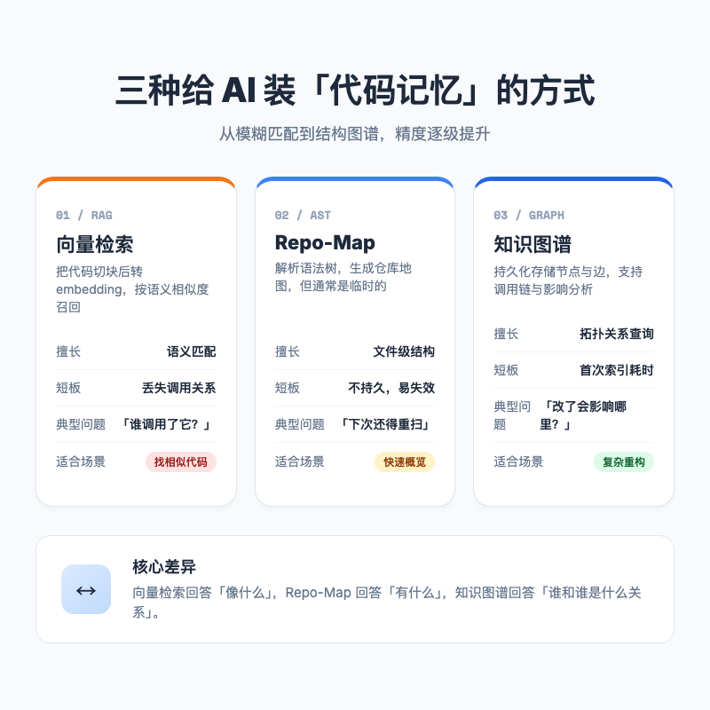
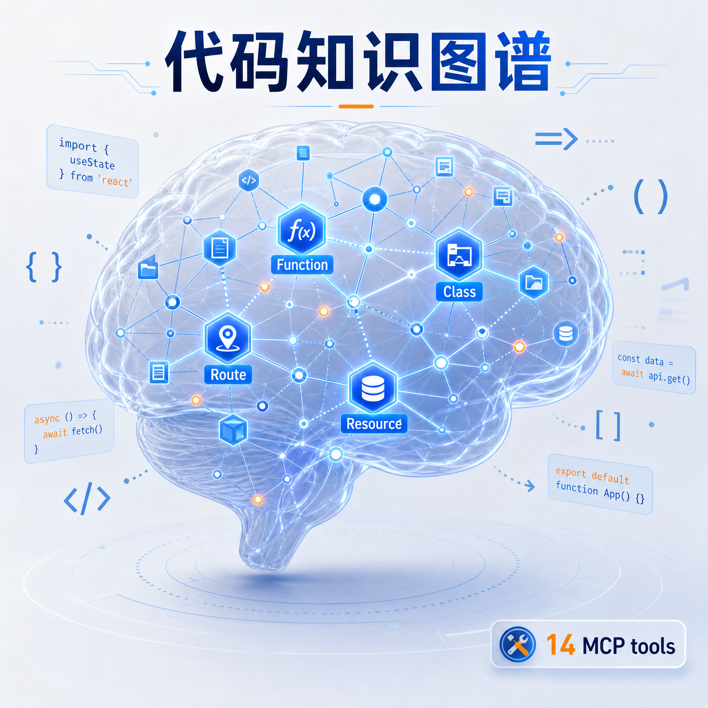
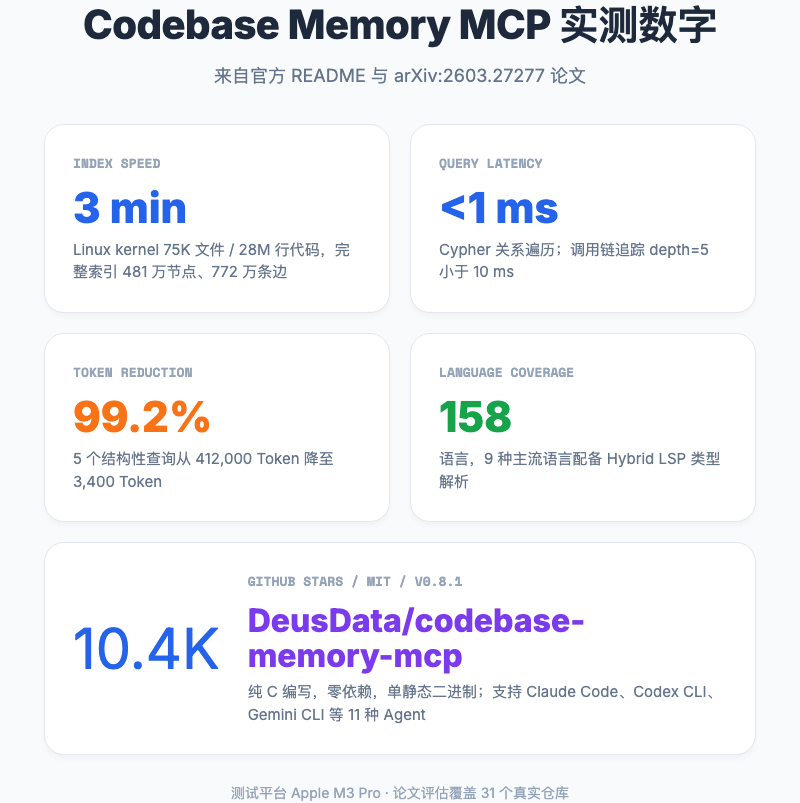
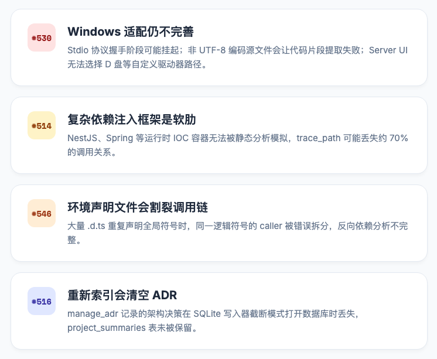

# 向量检索 vs 仓图 vs 知识图谱，AI 代码助手的记忆该怎么存？

> 想象一下，你让 Claude Code 改一个三个月没碰的后端接口。它花了 5 分钟读了十几个文件，又 grep 了二十多次，最后问你「这个 `processOrder` 函数到底被谁调用了？」


---

## 一句话总结

**Codebase Memory MCP 给 AI 编程智能体做了一个本地代码记忆系统。它让 Agent 查代码时，不用每次都把整本书翻一遍。**

---

## 你的 AI 为什么总在代码库里瞎逛

上面这个场景不是特例。几乎每个用 Claude Code、Cursor 或 Gemini CLI 的人都遇到过。

你说，「给订单模块加一个退款状态校验」。它说好的。然后屏幕右上角的时间轴开始疯狂滚动。`Read` 了 `order.service.ts`，`Read` 了 `payment.gateway.ts`，`Grep` 了 `'refund'`，`Grep` 了 `'status'`，又 `Read` 了一个看起来毫不相干的 `utils.js`。

三分钟后，它礼貌地问，「`processOrder` 这个函数在哪里被调用？」

你叹了口气。这个问题，它刚才读过的某个文件里明明有答案。

这就是当前大多数 AI 编程智能体的真实工作状态。它们没有记忆，或者说，它们的记忆只有当前对话窗口里那几十万 Token。面对一个陌生的代码库，它们只能像刚进图书馆的新生一样，靠书名和关键词一本一本地翻。**我给这个行为起了个不太体面的名字，叫 Token Maxxing，意思是为了搞清楚一个简单问题，把上下文窗口里的 Token 吃到上限。**

README 里有个数字很刺眼。用传统方式回答一个结构性问题，Agent 可能要读几十万 Token 的文件内容。而通过结构化的图查询，只需要三千多个 Token。

不是模型变聪明了，是它终于拿到了地图。



---

## 三种给 AI 装记忆的方式

想让 AI 不瞎逛，本质上要解决一个问题，怎么把代码库的结构，以低成本、高保真的方式喂给模型。

目前市面上大致有三条路。

### 第一条路，向量检索 / RAG

这是最直觉的做法。把代码文件切块，转成向量，存进向量数据库。用户问问题的时候，先搜最相关的几个代码片段，再拼进提示词。

优点是快、通用、语义匹配能力强。你问「处理退款的逻辑在哪」，它能找到一段注释里有 refund 的函数。

但问题是，**它分不清「谁调用了谁」**。你问「`processOrder` 被哪些模块依赖」，向量检索只能告诉你「这段代码像不像你要找的」，没法告诉你调用链。函数名、类继承、模块依赖这些硬关系，被切成了散落的文本块，关系就丢了。

### 第二条路，Repo-map / AST

这条路更工程化。不再把代码当文本，而是当语法树来解析，提取出类、函数、变量、导入关系，生成一张轻量级的仓库地图。

Aider 这类工具早期都走这个方向。它能让 Agent 知道「这个文件定义了什么」。但地图通常是临时生成的，**对话一结束就消失**。下次打开新项目，Agent 又得重新扫描一遍。而且 AST 只能告诉你语法结构，跨文件的类型推导、多态调用、依赖注入这些语义层面的关系，它照样摸不着头脑。

### 第三条路，持久化知识图谱

Codebase Memory MCP 选的是这条路。它把代码库解析成一个**持久化的知识图谱**，节点是函数、类、文件、包、路由、K8s 资源，边是调用、导入、继承、配置关系。图谱存在本地 SQLite 里，对话结束后还在，团队之间还能通过压缩快照共享。

这张图不是文本的替代品，而是文本的索引。

你想知道「谁调用了 `processOrder`」，直接走 `trace_path` 工具，毫秒级返回调用链。你想知道「改这个字段会影响哪些地方」，用 `detect_changes` 把 Git diff 和图谱做一次碰撞检测。

向量检索只能回答「这段代码像什么」，Repo-map 能回答「这个文件有什么」，知识图谱能回答「改这里，那三个地方会炸」。三种方案没有绝对优劣，但在复杂代码库的结构性问题上，知识图谱明显更接近工程师的真实思维方式。



---

## Codebase Memory MCP 是什么

三种方案里，知识图谱听起来最理想，但也最难做好。它需要解析得快、存得稳、查得准，还要让 AI 智能体愿意用。

最近 GitHub 上出现了一个叫 **Codebase Memory MCP** 的项目，让我感觉这件事终于有人认真做了。仓库是 `DeusData/codebase-memory-mcp`，MIT 协议，最新版本 v0.8.1，目前在 GitHub 上拿到 10.4K Star。

它最狠的地方在哪？**用纯 C 写了一个本地代码知识图谱引擎，然后通过 MCP 协议甩给 AI 14 个结构化查询工具。**

### 14 个工具怎么用

别被「14 个」吓到。真正常用的，其实就几条调用链。

假设你又要改那个 `processOrder`，但怕影响其他模块。你可以让 Claude 先跑 `trace_path(function_name='processOrder', direction='inbound')`，一秒钟拿到所有调用方；再跑 `detect_changes`，把当前未提交的 diff 和图谱撞一下，算出影响面；最后用 `get_code_snippet` 把相关代码精确拉进上下文，而不是把整个文件塞进去。

**光这一步，就能省掉大量 Token。** 因为它不按文件读，而是按符号读。你问一个函数，它只返回那个函数对应的十几行代码。

其他工具也各有场景。`search_graph` 是按标签和正则找符号；`query_graph` 支持类 Cypher 的图查询；`get_architecture` 能一键拿到项目的包结构、热点和模块边界；`manage_adr` 用来记录架构决策，和图谱一起跟着项目走。

### 没有内置 LLM，恰恰是最聪明的设计

很多代码图谱工具会内置一个小模型，负责把自然语言问题翻译成图查询语句。但这意味着你要多配一个 API key，多付一份钱，多维护一个模型。

Codebase Memory MCP 把这个翻译工作交给了开发者正在对话的 Agent。**你已经在和 Claude Code、Gemini CLI、Cursor 聊天了，它本身就是最好的翻译器。** MCP 协议只是给了这些 Agent 一套标准的工具接口。

于是架构变得异常干净。

```
你：谁调用了 processOrder？
Claude Code：调用 trace_path(function_name='processOrder', direction='inbound')
Codebase Memory MCP：在 SQLite 图谱里跑 BFS，返回调用链
Claude Code：把结果翻译成你能听懂的话
```

### 为什么是纯 C

2026 年了谁还用 C 写新项目？这个项目团队的理由很直接：零运行时依赖，编译完就是一个单静态二进制文件，下载、运行、完事。对于需要解析 75K 个文件的 Linux 内核这种量级的项目来说，C 语言带来的性能和控制力是实实在在的。

### 158 种语言与 Hybrid LSP

项目官方标称支持 158 种语言，底层用的是内置的 tree-sitter 语法解析器。

我第一次看到这个数字也觉得虚，但看了实现发现他们是真的把语法解析器编译进了二进制。更离谱的是，对于 Python、TypeScript、JavaScript/JSX/TSX、PHP、C#、Go、C、C++、Java、Kotlin、Rust 这 9 种语言，他们还手搓了一个叫 **Hybrid LSP** 的类型解析层。在没有真实语言服务器的情况下，用 C 实现了一套兼容 tsserver、pyright、gopls、Roslyn 等行为的轻量推导引擎。

这让它能处理 Java 重载、Kotlin 扩展函数、Rust Trait 关联方法、Python TypedDict 收窄这些 AST 单独搞不定的事情。



---

## 数字说话

直接列数字最容易被挑刺，所以我只放官方 README 和论文里公开的数据。

最让我吃惊的是 Token 效率。README 里有一个非常具体的对比：五个结构性查询通过 Codebase Memory MCP 只消耗约 3,400 Token，同样的需求用文件级探索要吃掉约 412,000 Token，降幅约 99.2%。论文里的表述更保守，31 个真实仓库评估结果是 83% 的回答质量，Token 消耗减少 10 倍，工具调用减少 2.1 倍。

这个差距怎么理解？文件级探索就像让 AI 去图书馆把相关书架上的书全部搬过来，再一本本翻。图查询则是直接给它一张索引卡，告诉它第几页第几行。

索引速度也很夸张。Linux 内核约 28M 行代码、75K 个文件，在 Apple M3 Pro 上完整索引只要 3 分钟，生成 481 万个节点、772 万条边。我第一反应是吹牛，但看了实现方式之后，这个数字变得可信。它采用 RAM-first 管线，所有解析在内存里跑，中间用 LZ4 压缩，最后一次性落盘。

查询速度我没法亲身体会，但官方数据是 Cypher 关系查询小于 1 毫秒，调用链追踪 depth=5 小于 10 毫秒。这意味着你问「谁调用了 `processOrder`」，响应速度和你刷新一个网页差不多。



---

## 它不是万能药

数据看起来很漂亮。但作为一个写过几年代码的人，我知道漂亮的数据背后往往藏着「仅在实验室成立」的脚注。所以我翻了翻它的 GitHub Issues。

**Windows 适配还在进行中**。Issue #530 是一个 bug 合集，其中提到 Windows 下 Stdio 协议握手可能挂起，非 UTF-8 编码的源文件会让 `get_code_snippet` 出问题。Issue #548 则说 Server Web UI 没法选择 D 盘这类自定义驱动器路径。如果你的主力开发环境是 Windows，建议先观望。

**复杂依赖注入框架是它的软肋**。Issue #514 指出，面对 NestJS 这类依赖注入模式，`trace_path` 可能丢失约 70% 的调用关系。这我完全能理解。静态分析没有运行时 IOC 容器的上下文，很难凭空猜出哪个服务注入了哪里。Spring 同理。

还有两个相对隐蔽的问题。Issue #546 提到，当项目里有大量 `.d.ts` 文件重复声明全局符号时，同一个逻辑符号的调用方会被错误地拆成几份，导致反向依赖分析不完整。Issue #516 则是一个数据丢失 bug，`manage_adr` 记录的架构决策在重新索引时会被清空。

这些限制说明它目前最舒服的战场是：**代码结构清晰、语言主流、规模中大型、运行在 macOS/Linux 的项目**。如果你的代码库重度依赖运行时依赖注入，可能需要再等等。



---

## 总结

向量检索、Repo-map、知识图谱，本质上是三种不同精度的「代码记忆」。前两者一个是模糊的照片墙，一个是临时的平面图；知识图谱更像带坐标的工程图纸，你拿铅笔圈一下，工程师能告诉你这面墙能不能砸。

Codebase Memory MCP 没有让 AI 变成无所不能的编程之神。它更像是给 AI 配了一副老花镜，让它从「反复翻书的图书馆新生」变成了「拿着索引卡的研究员」。它仍然可能答错问题，但它不会再把 Token 浪费在已经读过十遍的文件上。

说到底，它不会让你的 AI 写出更聪明的代码，但会让它少做很多蠢事。而少做蠢事，在这个按 Token 计费的时代，本身就是一件很值钱的事。

它不是万能药。但在「让 AI 拥有一个像样的代码记忆」这件事上，它可能是目前最值得试的一个开源方案。

欢迎关注我的公众号「Chyris Tech Note」，获取更多 AI 技术解读与实践分享。
