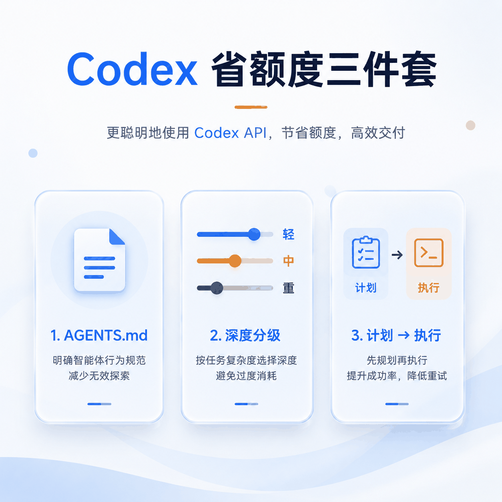
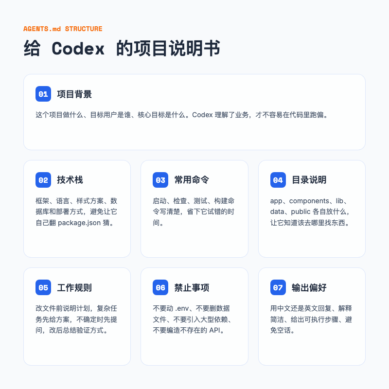
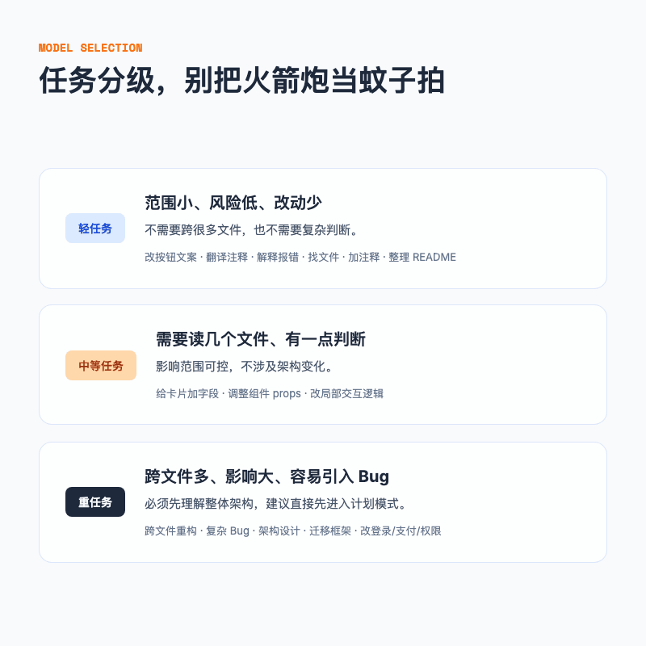
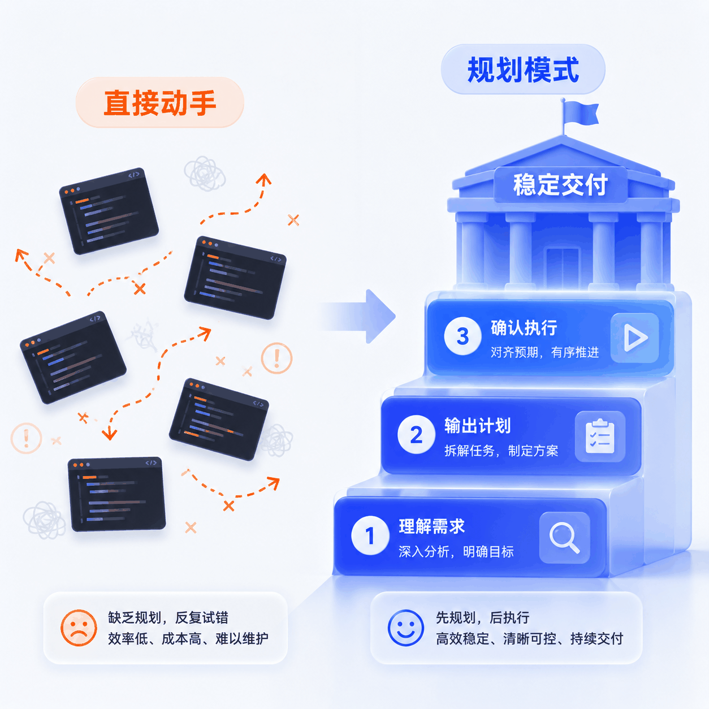
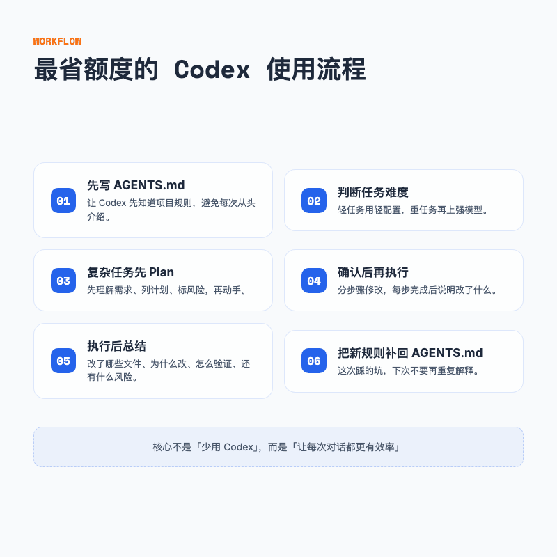

# AGENTS.md + 模型分级 + 计划模式，Codex 省额度三件套

> 我刚开始用 Codex 的第一个月，额度消耗速度大概是现在的三倍。不是因为任务多，而是每次对话都在重复解释项目背景，每次简单改动都被当成架构重构来处理。



---

## 一句话总结

说白了，Codex 省额度靠的不是少问，而是少重复解释、少返工。三件事做好，同样的额度能干的事情会多很多。

---

## 01 额度为什么总是不够用

先说说我自己踩过的坑。

那时候我刚把 Codex 接进一个 Next.js 项目，每天就是这几句话来回发。

帮我改一下首页。

这句报错是什么意思。

帮我优化一下这段代码。

看起来都在干正事，但每一轮都在烧钱。后来复盘才发现，问题不在任务本身，而在三个习惯性的浪费。

**第一，每次都要重新介绍项目。**

Codex 第一次打开项目时，它并不知道这个仓库是做什么的，也不知道技术栈、启动命令、哪些文件不能动。你不写清楚，它就只能猜。猜错一次，浪费一次额度。

**第二，轻任务也上最高配置。**

改个按钮文案、翻译一段注释、找某个文件，这些本来几秒钟就能解决的事，我却开着最强的模型和最高的推理强度。相当于用火箭炮打蚊子。

**第三，复杂任务直接动手。**

最典型的一次，我说「帮我重构一下登录逻辑」。它二话不说开始改，改到一半我才发现它把密码校验逻辑也一起动了，差点回滚。那次返工，至少烧掉了半天的额度。

其实 Codex 够聪明，问题是我每次都没把规矩讲明白，它只能猜。猜一次，烧一次额度。


---

## 02 第一件事，写好 AGENTS.md

如果你刚装好 Codex，只做一件事，我建议先写 AGENTS.md。

你可以把它理解成给 Codex 看的项目说明书。把你每次都要重复解释的话，提前写进项目里。Codex 打开项目时通常会读这个文件，相当于先上了一节入职培训。



### AGENTS.md 里应该写什么

我自己的版本会固定包含六个部分。

项目背景。这个项目是做什么的，目标用户是谁，核心目标是什么。Codex 理解了业务，才不容易在代码里跑偏。

技术栈。Next.js、TypeScript、Tailwind CSS、shadcn/ui 这些要列清楚。不要让它自己翻 package.json 猜。

常用命令。怎么启动、怎么检查、怎么测试、怎么构建。比如 `npm run dev`、`npm run lint`、`npm run build`。省下它试错的时间。

目录说明。`app/` 是路由，`components/` 是通用组件，`lib/` 是工具函数，`data/` 是静态数据。让它知道该去哪里找东西。

工作规则。修改文件前先说明准备改哪些；复杂任务先给计划，不要直接动手；不确定时先提问，不要脑补；修改后说明改动点和验证方式。

禁止事项。不要动 `.env`；不要删数据文件；不要引入大型依赖；不要编造不存在的 API 或配置。把这些红线画出来，能避免很多低级错误。

### 一个可以直接用的模板

下面是我常用的基础模板，你可以复制之后按自己项目改。

```markdown
# AGENTS.md

你是我的项目协作助手，请严格按照本文件规则工作。

## 项目背景

这是一个 [项目类型]。
目标用户是 [用户描述]。
项目目标是 [核心目标]。

## 技术栈

- 前端：[框架和库]
- 后端：[框架和库]
- 数据库：[数据库]
- 样式：[CSS 方案]
- 部署：[部署方式]

## 常用命令

- 启动项目：[命令]
- 代码检查：[命令]
- 运行测试：[命令]
- 构建项目：[命令]

## 目录说明

- src/：[说明]
- app/：[说明]
- components/：[说明]
- lib/：[说明]
- data/：[说明]
- public/：[说明]

## 工作规则

1. 复杂任务先给计划，不要直接修改文件
2. 修改文件前，先说明准备修改哪些文件
3. 每次只做和任务相关的最小改动
4. 不确定时先问我，不要自行脑补
5. 修改完成后，总结改动点和验证方式

## 禁止事项

1. 不要删除文件，除非我明确确认
2. 不要修改环境变量文件
3. 不要随意引入新依赖
4. 不要改无关模块
5. 不要编造不存在的接口、路径或配置

## 输出偏好

- 默认用中文回复
- 解释要简洁
- 给出可执行步骤
- 不要写太多空话
```

这份模板不一定通用，但先用起来，跑几次之后再根据踩过的坑慢慢补。我第一次写的时候生怕漏掉什么，恨不得把 package.json 的每个依赖都写进去。后来发现 Codex 真正需要的其实就这几类：背景、技术栈、命令、目录、规则、红线。写太多它反而找不到重点。

AGENTS.md 不是写一次就完事的文件，而是会随着项目一起生长的规则库。

### 一个更通用的全局版本

项目级 AGENTS.md 解决的是「这个项目该怎么做」。如果你想让 Codex 在所有项目里都保持同一个做事风格，可以再补一层通用规则。

我参考的是 Andrej Karpathy 写的一份 LLM 编码行为指南。它最打动我的地方不是具体规则，而是四个字：别替我决定。

**Think Before Coding。** 不要假设，不要隐藏困惑，把权衡摆在台面上。实现前先明确假设；有多种理解时列出选项，不要默默替我决定；如果有更简单的方法，直接说出来；不清楚就停下来问。

**Simplicity First。** 最少代码解决问题，不做 speculative 的抽象。不要加未被要求的功能；不要为只用一次的代码造抽象；不要写 200 行能 50 行搞定的事。抽象越少，Codex 改错和返工的机会也越少。

**Surgical Changes。** 只动必须动的地方，只清理自己制造的混乱。不改无关代码、不重构没坏的东西、不修改相邻文件的格式；如果改出了孤儿代码，自己删掉，但别顺手删掉原本就存在的死代码。

**Goal-Driven Execution。** 把任务变成可验证的目标。比如「加验证」变成「先写非法输入测试，再让它们通过」；多步骤任务里，每一步后面跟一个验证点。强目标让你能独立推进，弱目标只会让人反复确认。

如果你用的是 Codex CLI，可以把这份通用规则放进 `~/.codex/AGENTS.md`。Codex CLI 启动时会同时读取全局配置和项目级配置，当两者冲突时，项目级规则优先。

如果你用的是 Codex 桌面客户端，比如 Mac App，它通常有自己的设置面板，不直接读取 `~/.codex/AGENTS.md`，而是读取应用沙盒目录下的配置。但你可以把 AGENTS.md 内容手动复制到 Codex App 的 Global Custom Instructions 里，效果类似。

---

## 03 第二件事，简单任务别全上最高配置

Codex 的额度消耗跟模型强度、推理深度、上下文长度都有关系。不是所有任务都值得开最高配置。

我现在的习惯是，先判断任务有多重，再决定让 Codex 用多大力气。其实基本只分两类就够了。



### 轻任务，别浪费重炮

下面这些任务范围小、风险低、改动少，通常不需要跨很多文件，也不需要复杂判断。

- 改按钮文案
- 把英文注释翻译成中文
- 解释一段报错
- 找某个文件

我早期最蠢的一次，是改一句文案也开着最强模型。后来才明白，这种任务交给轻模型就够了，省下来的额度留给真正需要动脑子的任务。

### 重任务，不要省

下面这些任务跨文件多、影响范围大、容易引入 Bug，必须先理解整体架构。

- 跨文件重构
- 复杂 Bug 排查
- 改登录、支付、权限
- 接入第三方服务
- 生产环境问题分析

比如把整个登录系统从本地状态改成 Supabase Auth，这种就不要想着省额度。直接让它先计划，再用最强模型处理。

中间还有一些不上不下的任务，比如给工具卡片增加一个字段并在首页展示。这种用中等配置，或者先用轻模型试试，发现不够再升级。

### 一个判断标准

你可以用三个问题快速判断。

这个任务会改几个文件？改动会触发其他模块吗？失败后回滚成本高吗？

如果答案都是「不多、不会、不高」，那就用轻配置。只要有一个答案是「会」，就值得升级配置或者先进入计划模式。

---

## 04 第三件事，复杂任务先开计划模式

新手最容易犯的错误，就是一上来就让 Codex 开始任务。

比如「帮我重构一下这个项目」。这句话非常危险。Codex 不知道你想重构哪里，也不知道哪些地方不能动。它只能凭着模糊理解开始改，改到一半你才发现方向不对。

更稳的方法是，先开计划模式，再动手。

除了用提示词让 Codex 进入计划模式，Codex CLI 也支持直接用 `/plan` 命令进入官方计划模式，效果类似。

### 计划模式怎么开

你可以直接这样发。

```markdown
请先进入计划模式，不要修改任何文件。

我的目标是：[描述目标]

请先输出：
1. 你理解的需求
2. 需要查看哪些文件
3. 准备修改哪些文件
4. 每一步要做什么
5. 可能的风险
6. 最小实现方案
7. 需要我确认的问题
```

等它输出计划，你看懂之后，再确认执行。

```markdown
我确认按这个计划执行。

请分步骤修改，每一步完成后说明改了什么。
```



### 这样做为什么更省

计划模式看起来多聊了一轮，但我省下的更多是返工。至少它不会再把我没让动的文件顺手重构一遍，也不会因为理解偏差而跑回滚。

### 强烈建议先 Plan 的任务

不是所有任务都要开计划模式。但新增功能、代码重构、修复杂 Bug、接入第三方服务、改登录/支付/权限、批量修改文件这些，我基本都会先 Plan。

越涉及钱、权限、数据、生产环境，越不能让 Codex 直接动手。

### 一个更完整的 Plan Prompt

任务越复杂，prompt 越不能省。下面这个 Stripe 的例子，我会把边界和风险一次性写清楚。

```markdown
请先进入计划模式，不要修改文件。

我想给这个 SaaS 项目接入 Stripe 订阅支付。

请先分析：
1. 当前项目支付相关文件
2. 需要新增哪些环境变量
3. 前端需要哪些页面
4. 后端需要哪些接口
5. Webhook 怎么处理
6. 哪些地方需要我提供密钥
7. 哪些步骤不能自动执行
8. 最小可行接入方案
```

把边界和风险先摆到台面上，比事后救火便宜得多。

---

## 05 一套最省额度的 Codex 使用流程

把上面三件事串起来，我现在形成了一个固定流程。

先写 AGENTS.md，把项目规则一次性讲清楚，省得每次对话都从头介绍。

任务前先判断难度。改文案、翻译注释这种小事，别浪费重炮；跨文件重构、改登录支付，再上最强模型。

复杂任务先 Plan，让它理解需求、列计划、标风险。方案看懂了再确认，别让它直接大改。改完还要让它总结改了什么、怎么验证，方便我 review。

如果这次踩了新坑，比如某个文件不能动、某个命令要先跑，就把规则补回 AGENTS.md。下次就不用再解释一遍。



这个流程的核心不是「少用 Codex」，而是「让每次对话都更有效率」。

---

## 06 总结

Codex 的额度不是无限的，但很多人的额度也不是被「用得多」消耗掉的，而是被「浪费掉」的。

三件事做好，同样的额度能干的事情真的会多很多。

**写好 AGENTS.md**，让 Codex 少问废话、少乱猜、少跑偏。

**简单任务切合适模型**，不要把重型推理浪费在改文案、翻译注释这种事上。

**复杂任务先开计划模式**，先看方案再确认执行，减少返工和回滚。

说到底，额度管理就是沟通。规则讲清楚，任务分清楚，风险提前讲，Codex 就不会在错的方向上闷头跑。

Codex 还是那个 Codex。用法变了，结果也会跟着变。

---

欢迎关注我的公众号「Chyris Tech Note」，获取更多 AI 技术解读与实践分享。
