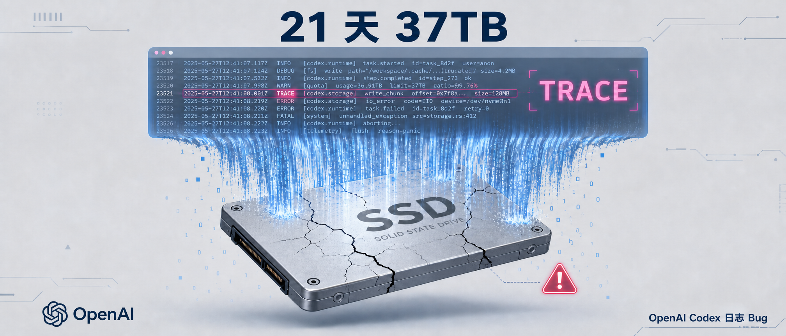
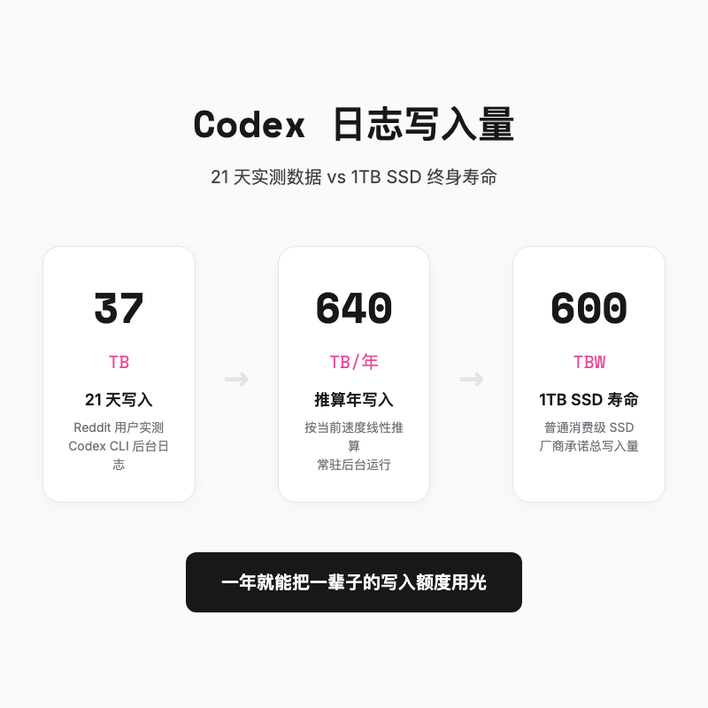
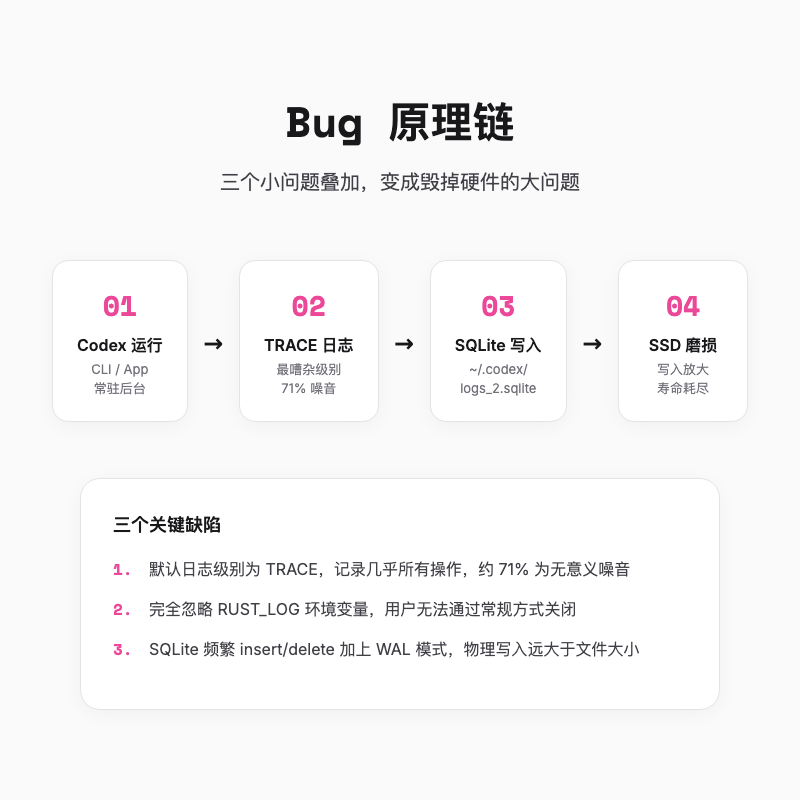
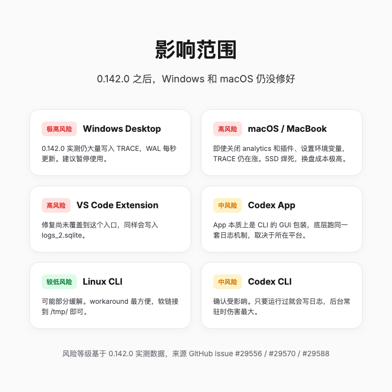
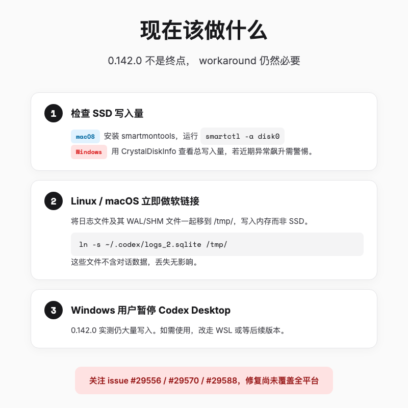
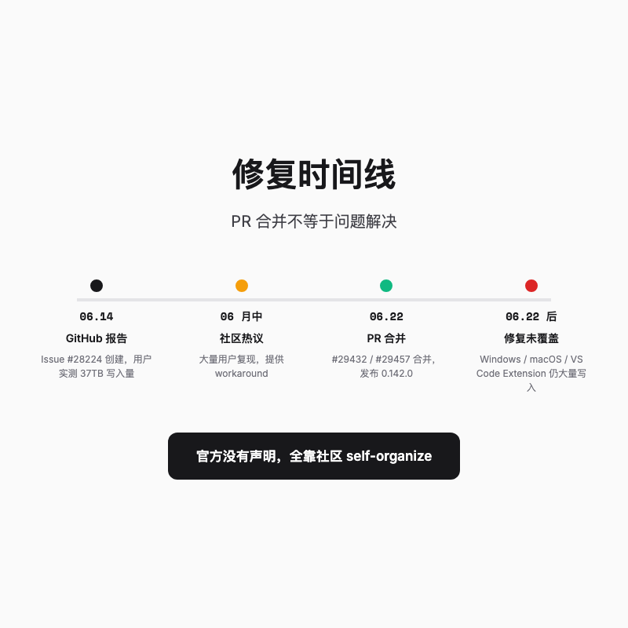

# OpenAI Codex 21 天写爆 37TB，你的 SSD 可能正在慢性死亡

> 一个编码工具的 debug 日志，能让你的 SSD 在一年内报废。这不是假设，而是 Reddit 用户用 21 天实测出来的结果。



---

## 一句话总结

OpenAI Codex 默认把 TRACE 日志写进本地 SQLite，21 天实测写入 37TB。6 月 22 日的 0.142.0 版本虽然合并了两个修复 PR，但 Windows 和 macOS 实测仍在大量写入，问题远没有结束。

---

## 一、先上结论，数字不会骗人

我昨天半夜刷 Reddit，被一条标题吓得坐了起来，「OpenAI Codex has a bug that could kill your SSD」。

发帖人 ILikeBubblyWater 不是危言耸听，他贴了自己的实测数据。

| 指标 | 数值 |
|------|------|
| 21 天写入量 | 约 37 TB |
| 推算年写入量 | 约 640 TB |
| 普通 1TB SSD 寿命 | 约 600 TBW |

37TB 什么概念？普通 1TB SSD 的终身寿命也就 600 TBW，厂商承诺这块硬盘一辈子能承受的总写入量。Codex 在后台跑 21 天，你的硬盘就折寿了 6% 左右。常年挂着，一年之内把一辈子额度用光，并不是危言耸听。

本来我对这种「官方出品」的工具有种默认的放心，看到数据后愣了一下。一个帮你写代码的工具，回头先把你的硬盘写报废，这算哪门子服务。



---

## 二、问题其实挺蠢的

Bug 本身并不复杂，甚至可以说是低级。

Codex CLI 会把运行日志写进 `~/.codex/logs_2.sqlite`。这个文件本身没问题，但默认配置有两个槽点。

日志级别默认是 TRACE。TRACE 是 Rust 日志里最吵的一档，函数进出、变量值、WebSocket 通信内容、文件访问记录，全给你记下来。打个比方，就像你请了个秘书，你每敲一行代码，她就把你屏幕上的所有字抄一遍，连鼠标划过的位置都不放过。Codex 默认请了这么个秘书，还让她 24 小时不休息。

这些 TRACE 日志里到底有什么？根据 issue 里的拆解，大部分是 inotify 文件系统事件、WebSocket 内部心跳、Telemetry 上报这类对普通用户毫无价值的内容。issue 里有人统计过，约七成都是这种低价值噪音，但 Codex 照写不误。你的硬盘大部分时间都在为一堆你永远不会看的信息擦除和重写闪存颗粒。

我看到这里的时候真的有点无语。写日志是为了调试，不是为了把用户硬盘当草稿纸。七成的内容 nobody cares，你的 SSD 却要在那里反复擦写。这就好比餐厅服务员每上一道菜，就把整本菜单重新抄写一遍，还让你买单。

更糟的是，它完全忽略 `RUST_LOG` 环境变量。正常情况下，你可以用 `RUST_LOG=warn` 来让日志安静点，但 Codex 用了自己的日志配置，你设环境变量也没用。普通用户根本没办法关掉这个行为。

SQLite 的写入方式还在火上浇油。它不是简单往文件末尾追加，而是数据库里频繁 insert 和 delete。加上预写日志和 SSD 的块擦除机制，实际物理写入比文件大小大得多。这就好比你往一个抽屉里塞东西，每塞一次都要把抽屉整个抽出来重新整理一遍，折腾的是硬盘本身。



---

## 三、没人能幸免

很多人会想，「我用的是 Codex App，不是 CLI，应该没事吧」。

可惜，答案是肯定的。App 本质上就是 CLI 套了个图形壳，VS Code Extension 也跑同一套东西，日志都会往 `logs_2.sqlite` 里灌。我往下刷评论，越看越慌，Linux 用户还好，有个 workaround；Windows 和 macOS 就惨了，特别是 Mac，SSD 焊死在主板上，磨坏了等于换机。



更让人捏把汗的是，有人已经把能关的都关了，RUST_LOG、RUST_TRACE、CODEX_LOG 全设上，analytics 关掉，插件全禁用，结果 TRACE 日志还在涨。Windows Desktop 的情况更糟，0.142.0 实测 WAL 文件每秒都在更新，写入放大根本没停。

还有用户 pisv93 反馈，自己的 SSD 分区突然损坏，数据全丢，只能重装系统。虽然不能完全确定是 Codex 导致，但时间线上高度吻合。这种事故最烦人的不是换硬盘的钱，而是重装系统、恢复环境、找回数据的那几天。

---

## 四、你现在该做什么，分平台处理

如果你正在用 Codex，我的建议是按下面几步走。

先检查你的 SSD 写入量。macOS 用户可以安装 smartmontools，然后运行。

```bash
smartctl -a disk0
```

找到里面的 Total Data Written 或者类似字段。Windows 用户打开 CrystalDiskInfo，主界面就能看到总写入量。如果这个数字最近几个月异常飙升，就要警惕。

Linux 和 macOS 用户，可以立刻执行一个 workaround。把 Codex 的日志文件软链接到 /tmp/，这样日志会写入内存而不是 SSD，重启后自动清空。

```bash
ln -s ~/.codex/logs_2.sqlite /tmp/
```

注意，Codex 使用 SQLite WAL 模式，运行期间可能会出现 `logs_2.sqlite-wal` 和 `logs_2.sqlite-shm` 文件。稳妥的做法是把这三个文件一起移到 /tmp/，或者直接在 /tmp/ 里创建同名文件后再做软链接。这些文件不包含任何对话数据，丢了也无所谓。

Windows 用户目前最安全的做法是**暂停使用 Codex Desktop**。0.142.0 实测仍大量写入，WAL 文件每秒都在更新。如果必须用，可以考虑用 WSL 运行 Codex CLI，然后在 WSL 里执行软链接方案。我知道这对 Windows 用户不公平，一个官方工具出了问题，最后居然是让用户别用，听起来很荒诞，但目前来看这是最稳妥的选择。



---

## 五、OpenAI 修了，但没修好

这个问题引发热议后，OpenAI 在代码层面确实动了手，但离彻底解决还差得远。

6 月 22 日，OpenAI 员工 jif-oai 合并了两个 PR。一个停掉了每个成功 WebSocket 响应事件的日志记录，另一个尝试过滤 log、codex_otel.log_only、codex_otel.trace_safe 这几个噪音目标。同一天发布的 Codex 0.142.0 理论上包含了这两个修复。



但社区很快发现，修是修了，但没修全。Windows Desktop 和 macOS 实测仍在大量写入，VS Code Extension 也仍然受影响。GitHub issue #29556、#29570、#29588 目前都还是 open 状态。

为什么修了但没修好？看 issue 里大家的讨论，我猜测是不同平台、不同入口的日志处理逻辑没统一，PR 只修了其中一部分。也有人猜 OpenAI 内部主要测 Linux CLI，对 Desktop 和 Extension 关注不够。不管原因是哪个，结果都一样，0.142.0 没让所有人安全。

说实话，我最受不了的不是 Bug 本身。软件有 Bug 很正常，但 OpenAI 事后一声不吭，没发声明，没解释修复范围，版本说明里也没写清楚哪些平台已经安全。用户只能自己实测、排查、找 workaround。代码丢出来，责任交给社区，这种态度比 Bug 本身更让人心寒。

---

## 六、写在最后

我现在每次听到「OpenAI 出品，必属精品」这种话，都会下意识多留个心眼。

这件事让我对所有跑在后台的 AI 工具都多了个心眼。它们默认自己越详细越好，默认你不会在意后台那几 TB 的写入。但你的硬盘在意，你的数据也在意。至于重装系统时浪费掉的那个周末，它最在意。

说白了，就是默认日志开得太吵，你又关不掉，再加上 SQLite 那种折腾硬盘的写法，三件事凑一块，硬盘就遭罪。这次 Codex 推了两个 PR，看起来像在止血，但事后没发声明、没写公告、版本说明里也没提到底修了什么。

我现在每次装新工具，都会先去看一眼它的日志文件在哪、多大。以前觉得这是强迫症，现在觉得这是保命。

我这篇文章发出去，估计会有朋友说「你大惊小怪」。但等你真的因为 SSD 挂了重装系统、丢数据的时候，你就不会觉得这是小题大做了。

---

欢迎关注我的公众号「Chyris Tech Note」，获取更多 AI 技术解读与实践分享。
