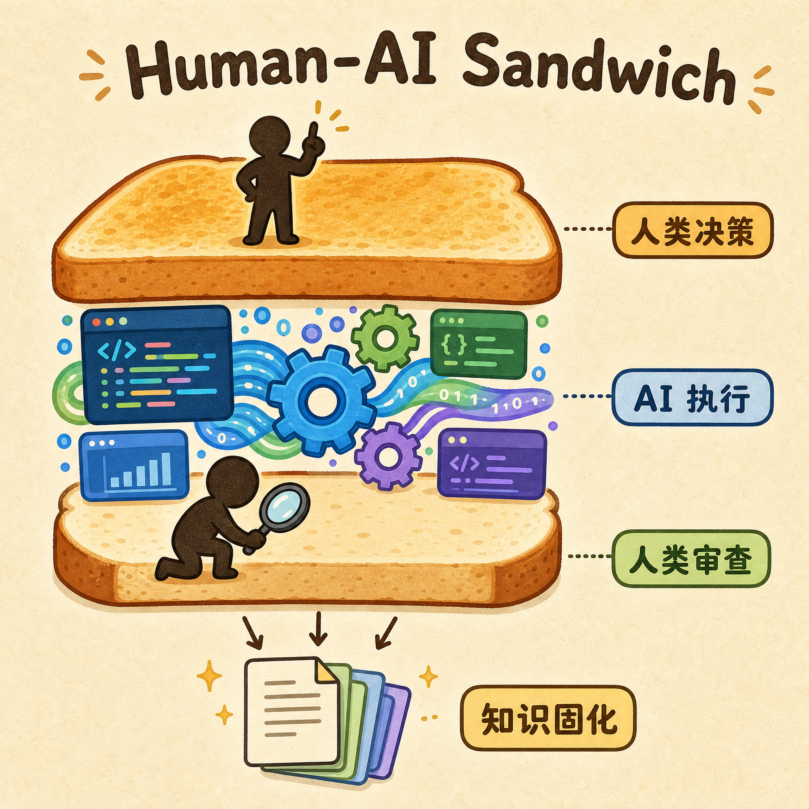
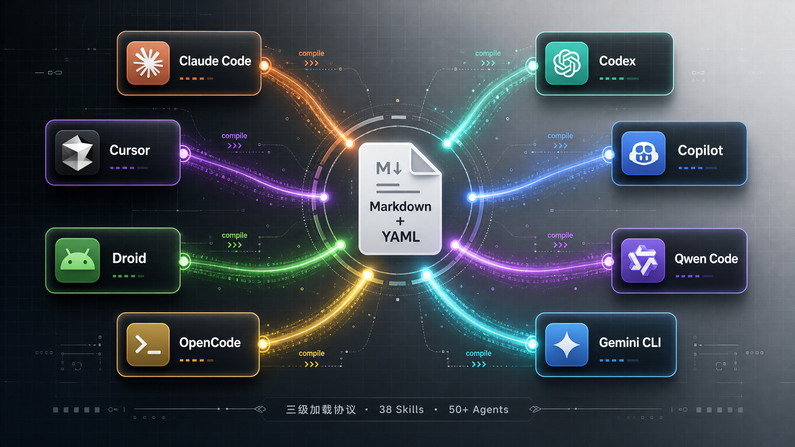

# GitHub 17K Star！这个插件让 AI 编程的教训不再「阅后即焚」

> 每次关掉终端，AI 就把教训全忘了。下次打开，又是从零开始。


---

用 Claude Code 写代码有一阵子了。有一个场景反复出现，让我特别沮丧。

我让 AI 修一个 bug，它给出了方案，我花了半小时审查代码，发现它在某个边界条件下会出问题。我告诉它问题在哪，它修好了，测试通过，提交，收工。

第二天，类似的需求来了。它又犯了同一个错误。

不是同一个 bug，是同一类错误。上次明明已经教过它了，但那次会话的上下文已经不在了。它从零开始，我也从零开始。

试过自定义 system prompt，试过在 CLAUDE.md 里写规约，有用，但不够系统。后来碰到一个开源项目叫 Compound Engineering，它用了一个我没想过的思路来解决这个问题。

---

## 复利思维，用在写代码上

Compound Engineering 在 GitHub 上已经超过 17K Star。背后是一家叫 Every 的公司，他们同时运营着 Cora、Lex 等 6 款 AI 产品，人少活多，开发方法论不打磨不行。

他们的核心主张很简单，每一次开发都应该让下一次开发更容易。反直觉，但想想确实应该这样。

传统软件开发的复杂度曲线是一条上升的直线。每加一个功能，代码库更庞大，回归测试更复杂，开发者需要记住的上下文更多。像借钱还利息，越滚越多。

Compound Engineering 提出了「复利开发」模式。每完成一个功能，代码交付了，踩过的坑和发现的最佳实践也固化下来了。下一次开发时，AI 能自动检索这些知识。功能迭代带来的复杂度增长，被知识库的积累持续对冲。

他们的工程团队总结出一个 80/20 法则，80% 的精力投入规划和审查，20% 用于编码执行。好的规划让编码量缩减，好的审查抓住模式而不只是修一个 bug。一条好的知识卡片意味着下一个 Agent 不用从零学起。

---

## 人类 AI 三明治



这套方法论里有一个很形象的模型，叫「人类 AI 三明治」。人类在两头，AI 在中间。

**顶层是人在做判断**，决定「做什么」。理解用户痛点、判断业务边界、处理那些文档里永远不会写的边缘情况。这是 AI 做不了的事。

中间是 AI 在做执行。读取上下文、生成代码、跑测试、写 PR 描述。快、稳定、不怕重复劳动。

底层又是人回来把关。审查代码质量、微调交互细节、确认功能是不是真的解决了用户的问题。

但三明治模型最关键的一步不在「面包」也不在「夹心」，是在最后面。触发「复利固化」，把这次会话里被推翻的方案、踩过的坑、新发现的库 API 写成结构化文档存入项目。下次 AI 启动，自动检索。

传统开发像一个独自干活的工匠，设计到施工到验收全包。三明治模型像一个建筑项目，业主画图纸、验收成果，施工队负责中间的建造。业主不需要亲手砌每一块砖，但必须决定要什么样的房子。

---

## 七个阶段，一个环路


说完了框架，看看具体怎么跑。

Compound Engineering 把开发流程拆成七个阶段，构成一个可以无限循环的环路。先说一个上游锚点，`/ce-strategy`，它维护一个叫 `STRATEGY.md` 的文件，记录产品的目标用户、核心指标和路线图。它不属于七阶段环路本身，但所有后续步骤都会参考它。

环路的第一步是**构想**（`/ce-ideate`），这是一个可选步骤。当你没有明确方向时，让 Agent 扫描代码库，发现隐藏的设计问题，输出高潜力的优化方向。

第二步**脑暴**（`/ce-brainstorm`）是我用得最多的。假设我要给 Web 应用加一个后台任务重试的安全机制，运行 `/ce-brainstorm "make background job retries safer"`，它通过交互式问答帮你梳理需求边界。什么情况需要重试？最大重试次数多少？要不要指数退避？最终输出一份需求文档。这一步我建议用 Claude 4.5 Haiku 这类快速模型，核心目标是快速梳理，不需要深度推理。

第三步**规划**（`/ce-plan`）是整个流程里最重的一步，占 70% 的心智负担。建议用推理能力最强的模型。Planner 会自动检索 Strategy 文档，分析现有技术架构，检查历史解决方案，输出一份包含文件变动矩阵和影响分析的详细计划。如果需求复杂，开启 Deepen 模式，系统调度最多 80 个子 Agent 并行验证，每个针对特定模块做专项研究。这种验证密度靠人根本做不到。

后面三步相对直觉。**开发**（`/ce-work`）读取计划书执行编码，自动创建 Git 分支，遇到不确定的地方会主动提问。**审查**（`/ce-code-review`）调动安全、性能、可维护性等多个视角的 Agent 并行审查，缺陷标注 P1 到 P3。**打磨**是人类回来做最终把关，UI 交互细节、文案措辞、功能完整度。

最后一步**复利固化**（`/ce-compound`）是整个环路里我最喜欢的一步。系统抓取当前会话中被推翻的方案、踩过的坑、新发现的库规范，生成 Markdown 文档存入 `docs/solutions/`。下次运行 `/ce-plan`，Planner 自动检索这些文档。

每一次开发的教训都不会蒸发，变成可检索的知识。这就是「复利」二字的具体含义。

整个流程串联起来是这样：

```text
/ce-brainstorm "make background job retries safer"
/ce-plan docs/brainstorms/background-job-retry-safety-requirements.md
/ce-work
/ce-code-review
/ce-compound
```

五个命令，从需求到知识固化。

---

## 一套技能，装进所有 IDE



Compound Engineering 内置 38 个技能和 50 多个 Agent，用 Markdown + YAML 编写，通过 Bun CLI 编译转换到不同的 AI 编程平台。

目前覆盖了 Claude Code、Codex、Cursor、Copilot、OpenCode、Gemini CLI、Kiro、Qwen Code、Factory Droid、Pi 等 10 个主流平台。在 Claude Code 里两行命令安装：

```text
/plugin marketplace add EveryInc/compound-engineering-plugin
/plugin install compound-engineering
```

其他平台大同小异，Cursor 里在聊天窗口输入 `/add-plugin`，Codex 多一步 Bun CLI 安装 Agent 配置。

跨平台发布有一个工程难题。38 个技能全量加载会消耗数万 Token，启动时直接把上下文窗口撑爆。项目用了一个「三级渐进式加载」来解决这个问题：启动时只读每个技能的名字和简介，约 100 个 Token 一个；用户 Prompt 命中某个技能时才加载完整内容；大型参考文档按需加载。启动轻，按需重。

还有一条有意思的硬性规则。每个技能禁止引用其他技能的文件，需要共享的配置必须在各自目录下分别存一份副本。这保证了每个技能自包含，编译到任何平台都不会因为路径问题崩溃。

---

## 诚实地说，它也不是银弹

Will Larson 是软件工程领域比较有影响力的技术管理者，他专门测过这套插件在企业级 Monorepo 中的适配情况。结论是基础配置加全套工作规约，一个工程师花了一小时搞定。

他举了个例子。Imprint 团队在适配时，主要工作就是把默认的规划文件路径改成 `.claude/plan-*.md`，融入团队现有的 `.gitignore` 规则。核心工作流几乎不用动。

Larson 评价说，这个插件最大的价值在于把团队里那些只存在于资深员工脑海中的「不成文的最佳实践」，变成了由 Agent 主动引导并强制执行的工程 SOP。优先制定计划、事后总结避坑卡片、审查要抓模式，这些道理资深工程师都懂，但靠人自觉执行总会打折扣。

但我用了几个月，也感受到了几个真实的局限。

**知识卡片需要自律维护。** 复利机制要求每次功能完成后主动执行 `/ce-compound`。如果偷懒跳过，或者写得敷衍，知识库就会变成低质量的噪音库，下次检索反而增加干扰。好的知识管理需要好的纪律，这条绕不过去。

Token 开销也不能忽视。随着固化的方案越来越多，频繁触发多级加载会让上下文窗口收缩。推理变慢，Token 账单也在涨。对小项目可能无所谓，大项目得精打细算。

社区里也有人提到，太多规则约束可能让 AI 在简单任务上过度合规，反而降低敏捷性。杀鸡用牛刀。

所以这套方法论更适合有一定复杂度、长期迭代的项目。写个一次性脚本或者小团队还没形成共识的最佳实践，上这套流程反而是负担。

---

## 写在最后

回到开头那个场景。AI 编程助手每次都从零开始，归根到底是我们没给它一个记忆系统。人会成长，因为踩过的坑会记在心里。AI 没有记忆，但可以给它一个结构化的知识库。

Compound Engineering 做的就是这件事。一套让 AI 编程从「一次性消费」变成「复利投资」的工程方法论。

用了一段时间后，我最大的感触是，AI 编程真正缺的从来不是更聪明的模型。而是让每一次开发都让下一次更容易的那种机制。Compound Engineering 把这件事做出来了。

欢迎关注我的公众号「Chyris Tech Note」，获取更多 AI 技术解读与实践分享。
