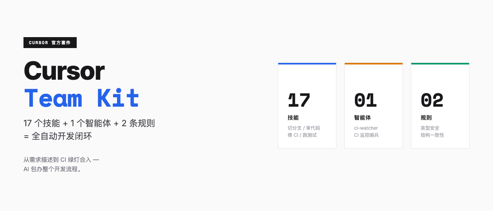
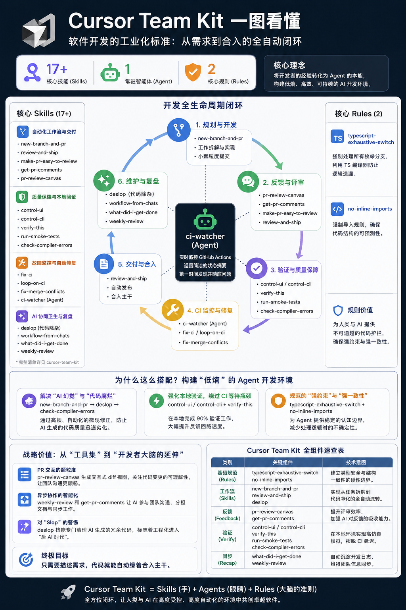
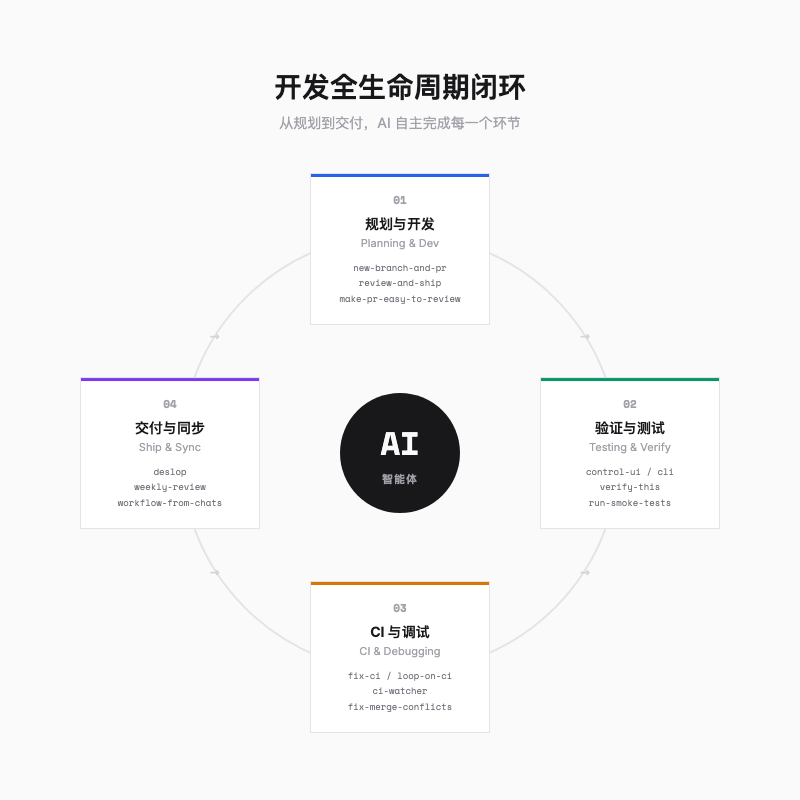
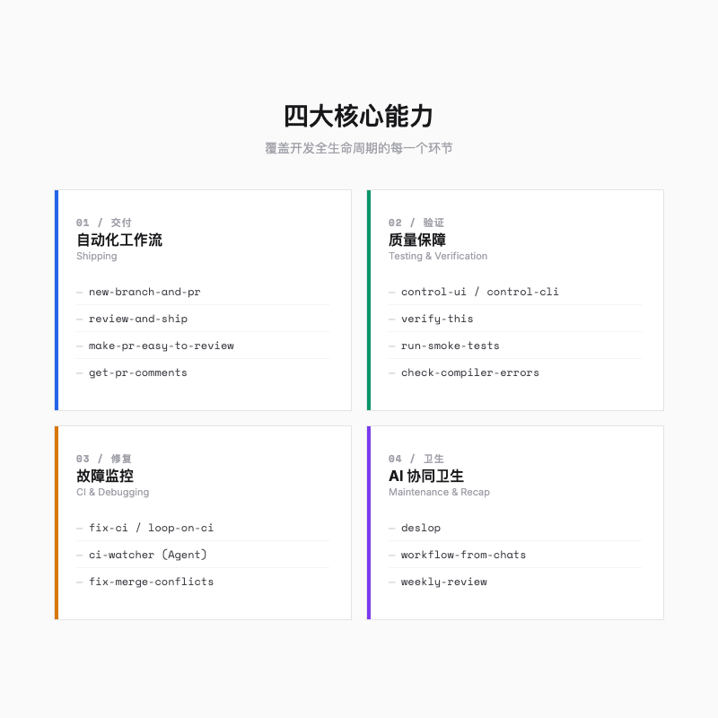
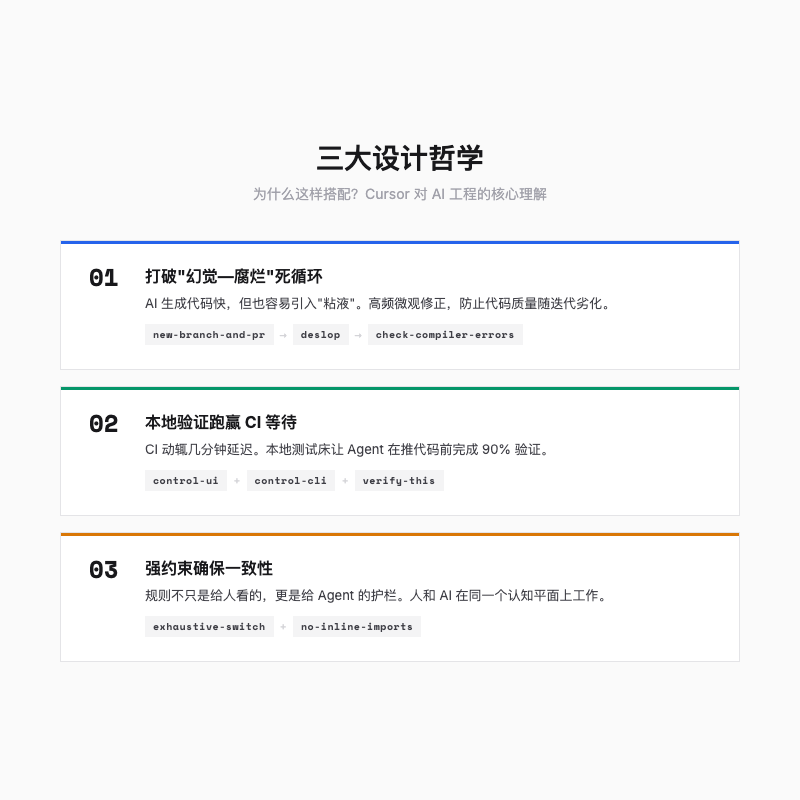
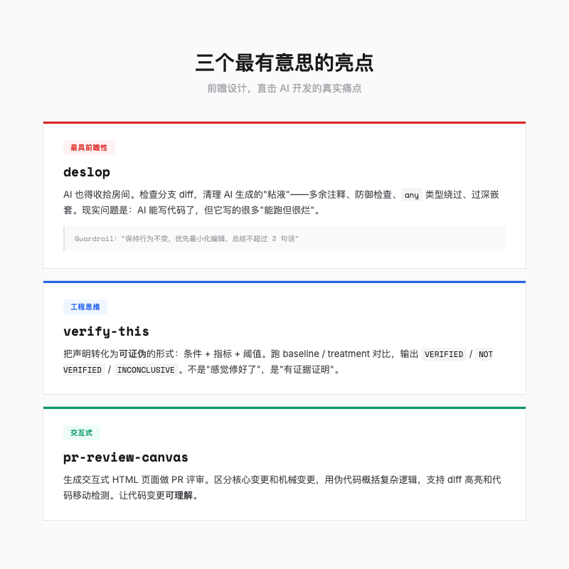
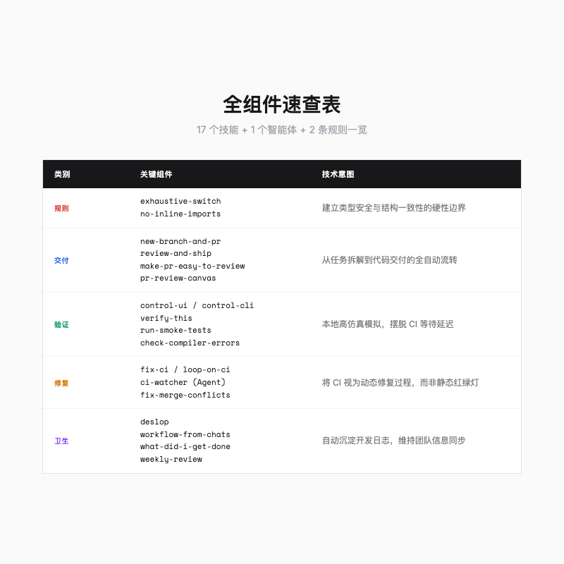

> AI 写代码已经不算新鲜事了。但让 AI 像老程序员一样——切分支、审 PR、修 CI、写周报——Cursor Team Kit 做的就是这件事。它是 Cursor 团队给自己搭的一套"AI 工业流水线"。

---

## 一句话总结

Cursor Team Kit 的核心思路挺简单：给 AI 配齐 17 个干活技能、1 个盯梢智能体、2 条硬性规则，让它从"只会写代码"进化到能独立走完需求→开发→验证→交付全流程。

---

## 什么是 Cursor Team Kit？

2026 年初，Cursor 把内部用的开发套件 `cursor-team-kit` 开源了。它不是什么 IDE 插件，就是一堆 Prompt 模板——告诉 AI 什么时候该干什么、怎么干、哪些红线不能碰。

它的核心组成很清晰：

| 组件 | 数量 | 作用 |
|------|------|------|
| **Skills**（技能） | 17 个 | 教会 AI 如何执行具体任务：切分支、审代码、修 CI、跑测试…… |
| **Agents**（智能体） | 1 个 | `ci-watcher`——一个常驻后台的 CI 监控哨兵 |
| **Rules**（规则） | 2 条 | 编码层面的硬性约束，让人类和 AI 在同一个认知平面上工作 |

每一个 Skill 其实就是一份 Prompt 模板：什么情况下触发、分几步走、输出什么格式、哪些事不能做。简单说，就是"把老程序员的工作习惯，写成 AI 能看懂的 SOP"。

---

## 四大核心能力：覆盖开发全生命周期

这 17 个技能不是瞎凑的，而是围绕四个关键环节搭起来的。

### 1. 自动化工作流与交付（Shipping）

Git 和评审流程自动化：

- **`new-branch-and-pr`**：自动化"切分支 → 写代码 → 提 PR"的标准操作。要求分支范围聚焦、提交信息清晰。
- **`review-and-ship`**：独立的评审关卡。AI 先自己审一遍代码，通过后再提交并发布。
- **`make-pr-easy-to-review`**：清理杂乱的提交历史，自动生成 PR 描述，甚至给评审者加引导说明——省得人看得头大。
- **`get-pr-comments`**：自动抓取活跃 PR 中的评论并汇总，让 AI 能针对性地迭代修改。

> **一句话**：以前 PR 是人审 AI 写的代码，现在 AI 先自己审一遍、整理一遍，人只需要看重点。

### 2. 质量保障与本地验证（Testing & Verification）

Cursor 团队的想法是：能本地验证就别等云端。所以给了 AI 很强的本地控制能力：

- **`control-ui` / `control-cli`**：通过 CDP（Chrome DevTools 协议）驱动 Web/Electron 界面，或在本地剖析交互式 CLI。这对于 IDE 这种复杂客户端的稳定性测试至关重要。
- **`verify-this`**：这是一个非常有意思的技能——它要求把任何声明都转化为**可证伪的形式**，通过 baseline/treatment 对比得出 `VERIFIED` / `NOT VERIFIED` / `INCONCLUSIVE` 三种结论。**不是"感觉修好了"，而是"有证据地证明修好了"**。
- **`run-smoke-tests`**：基于 Playwright 跑冒烟测试，自动分诊（Triage）失败原因。
- **`check-compiler-errors`**：修改后立即跑编译和类型检查，快速拦截静态错误。

### 3. 故障监控与自动修复（CI & Debugging）

CI 挂了不是终点，而是修复的起点：

- **`fix-ci` / `loop-on-ci`**：发现 CI 失败后，深入日志分析原因，应用修复补丁并重复迭代，直到 CI 变绿。`loop-on-ci` 尤其狠——它会持续盯着 CI，失败了就修，修完再跑，直到通过为止。
- **`ci-watcher`**（Agent）：常驻后台的智能体，实时盯着 GitHub Actions，第一时间返回简洁的状态摘要。
- **`fix-merge-conflicts`**：非交互式解决合并冲突，解决后自动运行构建和测试，确保冲突解决后的代码依然可用。

### 4. AI 协同卫生与复盘（Maintenance & Recap）

AI 开发的一些特殊问题，也得有人管：

- **`deslop`（代码除杂）**：我个人最喜欢的技能。专门清理 AI 生成的冗余代码——多余的防御检查、无关注释、`any` 类型绕过、过深嵌套。说实话，这反应了一个挺现实的问题：AI 写代码没问题了，但它会写一堆"能跑但很烂"的代码，得有人（或 AI）来收拾。
- **`workflow-from-chats`**：从历史聊天记录中提取习惯和偏好，转化为持久的技能或规则。越用越顺手。
- **`what-did-i-get-done` / `weekly-review`**：自动汇总代码提交，生成工作报告或周报，让团队在极速迭代中保持同步。

---

## 三个设计哲学：为什么这样搭配？

这些技能搭配起来看着复杂，其实 Cursor 想表达的东西挺清晰的。

### 哲学一：解决"AI 幻觉"与"代码腐烂"的死循环

AI 生成代码快，但也容易引入"粘液（Slop）"。搭配逻辑是：

`new-branch-and-pr`（小颗粒度提交）→ `deslop`（立即除杂）→ `check-compiler-errors`（拦截语法错误）

小步快跑，出问题立刻修，代码质量才不会越写越烂。

### 哲学二：强化本地验证，绕过 CI 等待瓶颈

CI 环境通常有几分钟延迟。`control-ui` / `control-cli` 让 AI 在本地就能进行接近真实的黑盒测试。

等推代码到 GitHub 的时候，其实 Agent 已经把该测的都测过了。反馈快得多。

### 哲学三：规则的"强约束"确保一致性

`typescript-exhaustive-switch`（强制处理所有枚举分支）和 `no-inline-imports`（禁止行内导入）这两条规则，不仅是给人看的，更是给 Agent 的"代码护栏"。

它们让 AI 少点发挥空间，人和 AI 至少在看同一份说明书。

---

## 三个最有意思的亮点

### 1. `deslop`：AI 也需要"收拾房间"

这个技能的定义很直白：检查当前分支相对 main 的 diff，移除 AI 引入的"Slop"——多余注释、异常防御检查、`any` 类型绕过、过深嵌套。

> 它的 Guardrail 也很克制：**"保持行为不变，优先最小化编辑，总结不超过 1-3 句话"**。

### 2. `verify-this`：可证伪的工程思维

这个技能要求你把声明转化为**可证伪的形式**：条件 + 指标 + 阈值。然后跑 baseline（修改前）和 treatment（修改后）的对比，输出三种结论之一。

举个例子，不是说"这个 bug 修好了"，而是"在 1000 次请求中，崩溃率从 5% 降到 0%，VERIFIED"。

### 3. `pr-review-canvas`：交互式 PR 评审

生成一个交互式 HTML 页面来展示 PR 评审。它会分类核心文件和机械变更，用伪代码概括复杂逻辑，支持 diff 高亮、代码移动检测，甚至内置了 Mermaid 图表和流程图。

AI 看代码是字符串，人看代码是逻辑流。这个技能就是在两者之间搭一座桥。

---

## 我们能怎么用它？

这套东西开箱就能用，不用接什么外部服务：

1. **直接安装**：在 Cursor 中运行 `/add-plugin cursor-team-kit`
2. **按需取用**：不需要全部 17 个技能，挑你团队最需要的几个——比如先做 `new-branch-and-pr` + `deslop` + `check-compiler-errors` 的三件套
3. **参考思路**：即使不用 Cursor，这套"技能化"的设计思路也值得借鉴——把团队的最佳实践写成结构化的 Agent 指令

---

## 总结

Cursor Team Kit 最实用的点就是"闭环"—— Skills 干活、Agents 盯梢、Rules 定规矩，三者凑一块，AI 就不容易跑偏。

当然，这套东西也不是银弹。它的前提是你在用 Cursor，且项目本身有一定的自动化基础。如果你的团队还在手动部署、没有 CI，那先别急着上这个，先把基本功补上。

但如果你已经在用 AI 写代码了，这套工具值得看看。至少 `deslop` 这个技能，我觉得每个 AI 辅助的项目都该有一个。

---

**附录：Cursor Team Kit 全组件速查表**

_内容基于 `cursor-team-kit` 开源项目整理。_
