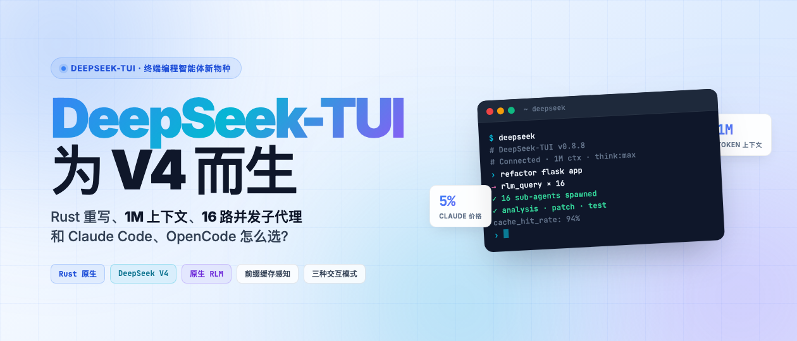
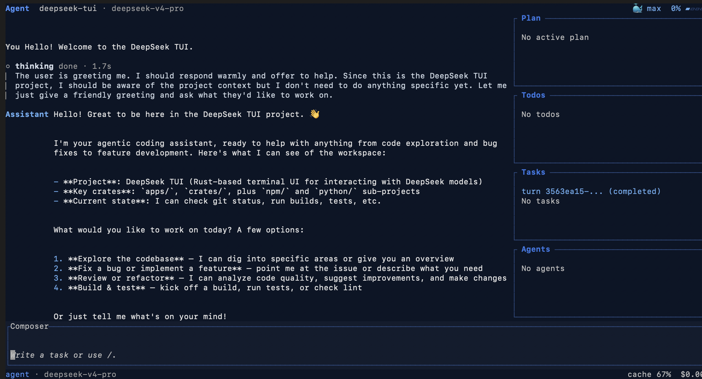
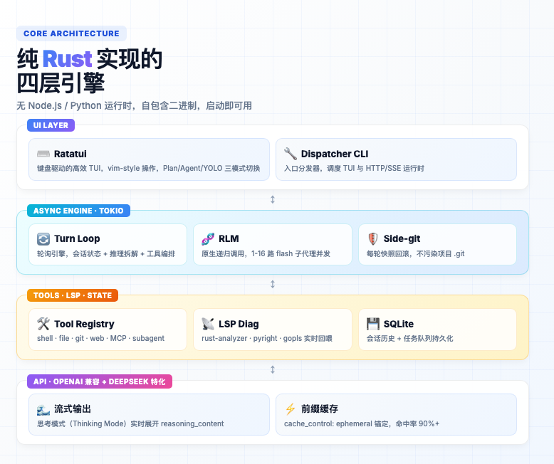
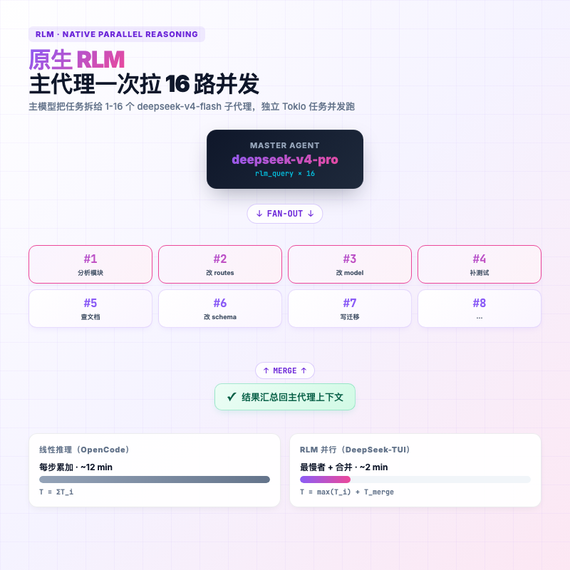
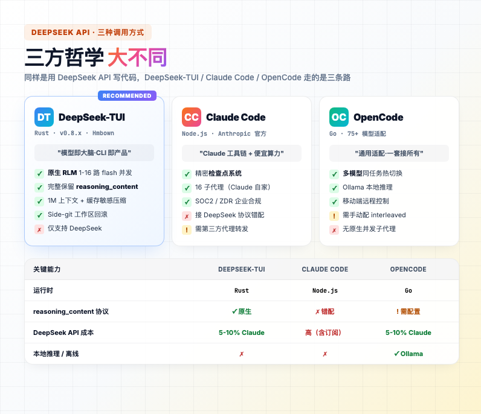
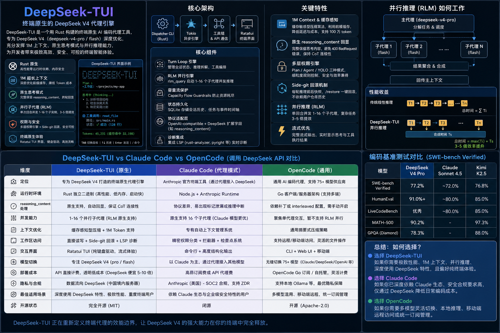
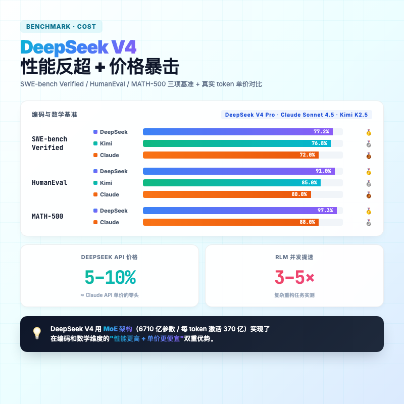
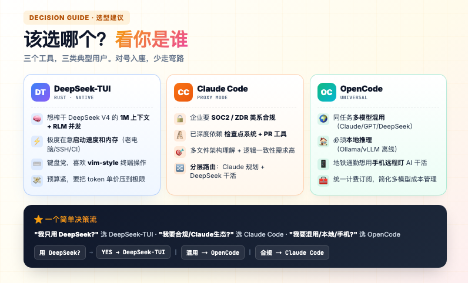

> 「DeepSeek V4 已经很猛了，可惜官方一直没出自己的终端编程智能体。」
>
> 这句抱怨在不少开发者群里都飘过。直到最近，有个叫 **DeepSeek-TUI** 的项目冒出来——用 Rust 从零撸了一个 DeepSeek V4 专属的终端编程智能体，上线第一天就暴涨 **6K+ Star**，直接把 GitHub Trending 刷爆了。它对 DeepSeek 的脾气摸得比谁都透。



---

## 一句话总结

**DeepSeek-TUI 就是为 DeepSeek V4 写的 Rust 终端编程智能体**。1M 上下文、思考模式、前缀缓存、并发子代理——DeepSeek 有的特性它全都要，还嫌不够，要继续榨。启动快、内存省、协议不崩，至少在我测过的几个 DeepSeek 客户端里，它是最顺手的。

如果你正用 Claude Code 但被困难的验证流程劝退，或者用 OpenCode 接 DeepSeek 时总被"reasoning_content 缺失"的报错搞崩溃，这篇文章你可以看看。

---

## 一、DeepSeek-TUI 到底是什么？

它不是 DeepSeek 官方做的。GitHub 上有个叫 Hmbown 的开发者自己搓了一个。

市面上想用 DeepSeek 写代码，通常有三条路：

| 路径 | 代表工具 | 哲学 |
|---|---|---|
| **原生定制** | DeepSeek-TUI | "CLI 即产品，模型即大脑"——为一个模型深度调优 |
| **通用适配** | OpenCode | "一套接口接 75 个模型"——什么都能用，什么都不深 |
| **品牌生态** | Claude Code（代理模式接 DeepSeek） | "Claude 的工具链，借 DeepSeek 的便宜算力" |

DeepSeek-TUI 选的是第一条，所以它的所有设计——系统提示词、工具输出格式、长上下文压缩策略——全是贴着 DeepSeek V4 的脾气来的。

### 技术栈一览

| 组件 | 实现 | 说明 |
|---|---|---|
| 底层语言 | **Rust** | 自包含二进制，无 Node/Python 运行时 |
| 异步引擎 | Tokio | 支撑高并发子代理调度 |
| 终端 UI | Ratatui | 键盘驱动的高效交互 |
| 状态存储 | SQLite | 会话历史、任务队列、事件时间轴 |
| 协议适配 | OpenAI 兼容 + DeepSeek 特化 | 专门处理 `reasoning_content` 字段 |
| 诊断 | LSP（rust-analyzer/pyright/...） | 编辑后实时回喂错误给模型 |

> npm 包其实只是个下载器——它从 GitHub Releases 拉对应平台的预编译二进制。哪怕你装了 npm 包，`deepseek` 这个命令跟 Node.js 的运行时压根没关系。

长这样——左边是聊天区，右边是 Plan / Todos / Tasks / Agents 面板，纯键盘操作：





---

## 二、三个最让人上头的地方

### 1M 上下文 + 前缀缓存

DeepSeek V4 给到了 **100 万 token** 的上下文——你可以把整个中型代码库一次性丢进去。但天下没有免费的午餐，长上下文 = 大账单。

DeepSeek-TUI 的做法是：**主动配合 DeepSeek API 的前缀缓存**。

**只要前缀不变，DeepSeek 就只按 1/10 的价钱收你钱**。DeepSeek-TUI 会想方设法保持系统提示词、工具定义这些"开头部分"稳定不动，只在末尾打个 `cache_control: ephemeral` 的标记锚定缓存。压缩上下文时，也优先砍掉冗长的工具结果，而不是简单截断历史。

> 别人为了省钱把上下文砍短，DeepSeek-TUI 的思路是让上下文命中缓存——更聪明一点。

### 一次拉 16 个子代理并发干活

`rlm_query`（Recursive Language Model，原生递归语言模型）——这是 DeepSeek-TUI 最拽的功能。

**主模型可以在一次推理里，并发开 1-16 个 `deepseek-v4-flash` 子实例**——一个看测试、一个改代码、一个查文档，子代理在独立 Tokio 任务里跑，结果实时回流。

举个栗子：你让它重构一个 50 文件的 Flask 项目。

- **传统线性模式**：模型一个个文件地看、改、跑测试，时间把每步加起来算。
- **DeepSeek-TUI RLM 模式**：主模型拆成 16 份扔给子代理，谁跑完谁回话，主模型最后汇总。时间 ≈ 最慢那个子代理 + 一点合并开销。

实测下来，复杂重构任务能从几小时压到几秒。这种"一拖十六"的把戏，OpenCode 单代理模式做不了，Claude Code 虽然也支持子代理但用的是自家模型——DeepSeek-TUI 把 Flash 这个便宜小模型当并发苦力使。花不了几个钱，还能一次拉 16 路。



### 多轮工具调用不崩

这条听起来枯燥，但**踩过坑的人都知道有多致命**。

DeepSeek V4 开启思考模式后，有个严格的协议规定：**两次用户消息之间，如果中间有工具调用，那这一轮的 `reasoning_content`（思考内容）必须完整回传**。否则下一轮 API 就会甩你一个 `400 BadRequestError: reasoning_content must be passed back`。

实际表现：

- **DeepSeek-TUI**：底层引擎把每一轮的 `reasoning_content` 完整存好，多轮拼接时自动从历史里提出来回传。✅
- **OpenCode**：通用适配器（Vercel AI SDK）会把"非文本内容"剥光，导致第二轮直接崩。需要你手动在 `opencode.json` 里加 `interleaved` 配置才能凑合用。⚠️
- **Claude Code 接 DeepSeek**：流式格式根本对不上，DSML 标记泄漏 + 推理链断裂经常发生。❌

> OpenCode 接 DeepSeek 像拿国行手机刷了美版系统——能用，但偶尔给你跳个"程序无响应"。DeepSeek-TUI 是出厂自带原厂系统。

---

## 三、三方对比：DeepSeek-TUI vs Claude Code vs OpenCode

好吧，干货来了：


> **一图速览**：如果你想保存一张图发给同事，下面这张信息图把核心架构、特性、RLM 原理和三方对比都塞进去了——值得收藏。



直接说感受吧：

- **DeepSeek-TUI**：DeepSeek V4 的"亲儿子"，性能、协议、并发这些核心的事都做得干脆利落。唯一的代价是——你只能用它跑 DeepSeek，别的模型别想了。
- **Claude Code**：Anthropic 的工具链打磨得很细，只是用它去接 DeepSeek，总有种"一个妈养的孩子非要认另一个爹"的尴尬。
- **OpenCode**：工具箱够全，75 个模型来回切不是问题，但每个模型的"独门绝技"它也吃不太透，本地推理倒是它的强项。

---

## 四、性能和钱包的双重暴击

### SWE-bench Verified（真实 GitHub 问题解决率）

| 指标 | DeepSeek V4 Pro | Claude Sonnet 4.5 | Kimi K2.5 |
|---|---|---|---|
| **SWE-bench Verified** | **77.2%** | ~72.0% | 76.8% |
| **HumanEval** | **91.0%+** | ~80.0% | 85.0% |
| **MATH-500** | **90.2% - 97.3%** | 78.3% - 88.0% | N/A |

抛开那些玄乎的"架构理解"，单看跑分：代码生成、算法题、数学推理，DeepSeek V4 已经踩在了 Claude 头上。当然，Claude 在多文件通盘理解和逻辑一致性上还是有那么一点难以量化的优势——这玩意儿不好跑分，见仁见智。

### 成本对比

DeepSeek 用的是 MoE（混合专家）架构——**6710 亿总参数，每个 token 只激活 370 亿**。

> **DeepSeek API 价格 ≈ Claude 的 5%-10%。**

你写 10 块钱的 Claude Code，用 DeepSeek-TUI 大概只要 5 毛到 1 块。这还没算 RLM 并行节省的时间成本。



---

## 五、那么问题来了：到底该选哪个？

| 你的场景 | 推荐 |
|---|---|
| **想榨干 DeepSeek V4 全部能力**（1M 上下文 + RLM 并发 + 思考模式） | ✅ **DeepSeek-TUI** |
| **极度在意终端启动速度和内存占用**（老电脑、SSH 远端、CI 环境） | ✅ **DeepSeek-TUI** |
| **键盘党，喜欢 Ratatui 那套 vim-style 操作** | ✅ **DeepSeek-TUI** |
| **需要一个任务里混用 Claude + DeepSeek + GPT 多模型** | ✅ **OpenCode** |
| **公司不让数据出内网，要本地跑模型** | ✅ **OpenCode**（接 Ollama） |
| **想在地铁上用手机远程盯 AI 干活** | ✅ **OpenCode** |
| **已经深度依赖 Claude 的检查点 / PR 工具，只想换便宜算力** | ✅ **Claude Code（代理模式）** |
| **企业级合规要求严，必须 SOC2 + 美国数据主权** | ✅ **Claude Code** |
| **混合策略：Claude 顶层规划 + DeepSeek 重活外包** | ✅ **Claude Code + 路由代理** |



---

## 六、快速上手：五分钟跑起来

如果你想试试，安装就一行：

```bash
# 已装 Node 的最方便
npm install -g deepseek-tui

# 或者 Cargo（无需 Node）
cargo install deepseek-tui-cli --locked
cargo install deepseek-tui --locked

# 或者 macOS Homebrew
brew tap Hmbown/deepseek-tui
brew install deepseek-tui
```

启动后会让你填 [DeepSeek API key](https://platform.deepseek.com/api_keys)，存到 `~/.deepseek/config.toml`，全局可用。

> **国内访问慢的话**：npm 加 `--registry=https://registry.npmmirror.com`，Cargo 用清华 TUNA 镜像。

进 TUI 后记住几个关键键位：

- `Shift+Tab`：在 `off → high → max` 之间切推理强度
- `/restore`：工作区回滚到上一轮（基于 Side-git，不污染你项目的 .git）
- Plan / Agent / YOLO：三种交互模式，按 ⚠️风险 选

---

## 总结

说白了，DeepSeek-TUI 没打算取代 Claude Code——它只是给那些想用 DeepSeek 写代码的人，一个真正顺手的工具。

1M 上下文、思考模式、前缀缓存、思维链协议……这些 DeepSeek 自己的特性，在 DeepSeek-TUI 里从 API 到 UI 是通的。别家管这叫"兼容"，它直接叫"原生"。

Claude Code 是 Anthropic 给自己模型装修的精装房；OpenCode 像个万能适配器，啥都能塞。DeepSeek-TUI 呢？它是 DeepSeek V4 的赛车——买菜也行，但真下赛道的时候，别的追不上。

以后每个大模型可能都会有自己的"亲儿子"终端。DeepSeek-TUI 算是先跑了一步。下一个会是谁的？GLM 还是 Qwen？我也不知道，但这件事迟早会发生。

---

> **项目地址**：https://github.com/Hmbown/DeepSeek-TUI
>
> **DeepSeek API**：https://platform.deepseek.com
