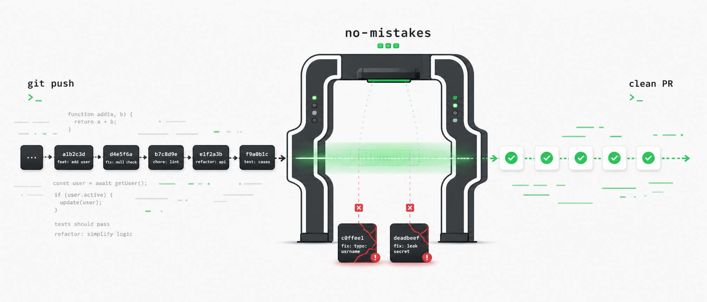
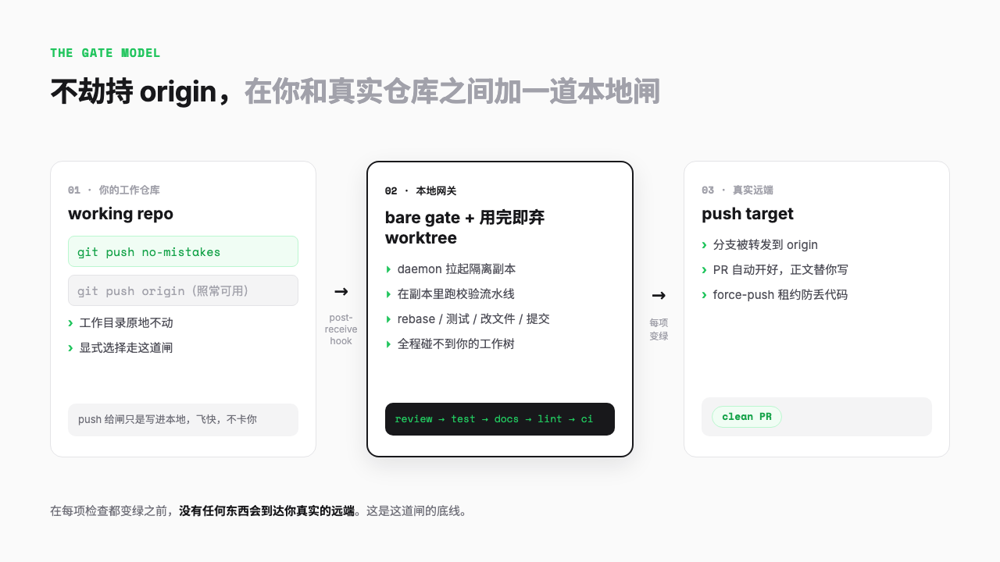
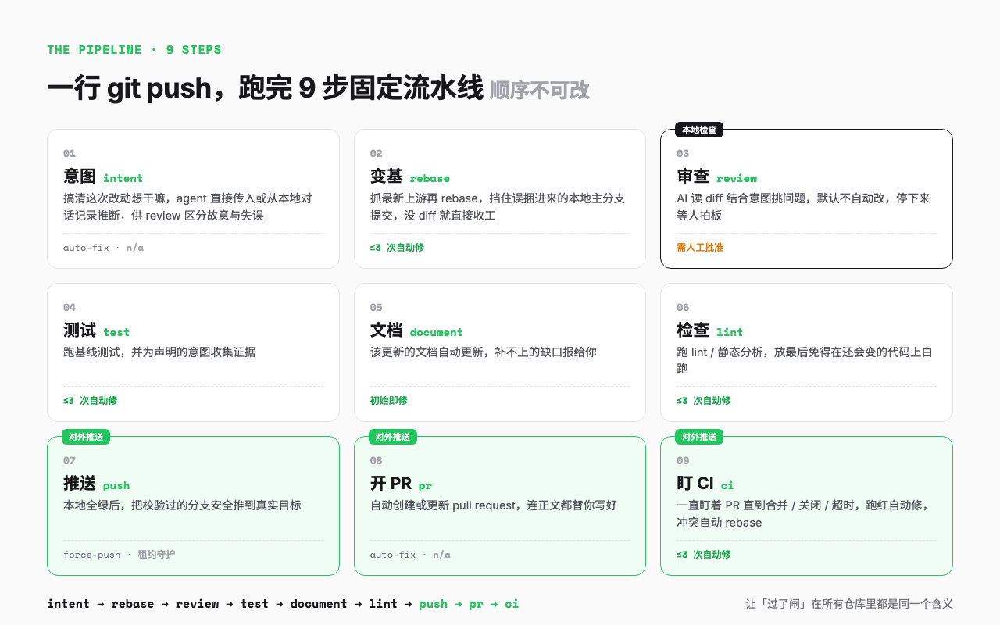

# 一行 git push，9 步流水线把 AI 代码自动审到能合并

> 你让 Claude Code 改一个空指针检查，它顺手重构了三个文件，push 上去 PR 一片红。这次介绍的 no-mistakes，想在你的 git push 和真实仓库之间，加一道闸。



---

## 一句话总结

no-mistakes 是一个本地 git 网关，把分支推给它而不是 origin，它会在一个用完即弃的副本里跑完 review、测试、文档、lint、PR、CI 这一整条 AI 驱动的校验流水线，全部变绿之后才把代码转发到真实远端，并替你开好一个干净的 PR。

说白了，给 AI 写的代码加一道质量闸。

---

## 先说那个让人头疼的场景

现在写代码的节奏变了。

以前是自己一行行敲，敲完心里大概有数。现在更多时候是给 Claude Code 或者 Codex 派个活，它哗哗改一通，你扫一眼觉得差不多，`git commit`、`git push`，收工。

问题出在那一眼。

AI 改得快，但它也快得离谱地越界。你让它加一个空指针检查，它觉得旁边那段逻辑也能顺手优化一下，于是动了三个文件。你让它修一个 bug，它引用了一个并不存在的函数，因为它觉得这个函数听起来应该存在。测试它没跑，文档它没更新，但代码看起来特别像样。缩进工整，命名规范，注释齐全，样样都像人写的，唯独不像人审过的。

这种东西有个专门的词，叫 slop。

slop 指的是 AI 生成的那种看起来很对、实际上经不起推敲的内容。放到代码里，就是那些能编译、粗粗一看挑不出毛病、但藏着 bug、幻觉引用、没测试覆盖的提交。它不会在你 push 的那一刻报错，它会在队友 review 你 PR 的时候、在 CI 跑红的时候、在线上出问题的时候，一点点把账单寄给你。

把关这件事的成本，被悄悄从写代码的人，转嫁到了 review 代码的人和 CI 身上。

no-mistakes 这个项目，想解决的就是这件事。它的作者把口号写得很直白，Kill all the slop. Raise clean PR，干掉所有 slop，开出干净的 PR。

---

## 它的思路，不去劫持你的 origin

很多质量工具的做法是往 git 里塞 hook，pre-commit 卡一道、pre-push 卡一道，你每次操作都得等它跑完。慢，而且容易被 `--no-verify` 一键绕过。

no-mistakes 换了个位置。

它在你真实的远端前面，放了一个本地的 bare git 仓库，这个仓库就是那道闸。你运行 `no-mistakes init`，它会在 `~/.no-mistakes/` 下面建好这个网关仓库，然后给你的工作仓库加一个名叫 no-mistakes 的 remote，指向这道闸。

之后你想过闸，就把 push 的目标从 origin 换成 no-mistakes。

```sh
git push no-mistakes my-branch
```

注意这里的关键设计，它没有碰你的 origin。`git push origin` 还是老样子，该怎么用怎么用。你是有意识地、显式地把代码推给 no-mistakes，而不是被一个偷偷改写了 git 行为的工具劫持。作者反复强调这一点，这是一道你主动选择走的闸，不是一个暗门。

push 给闸的那一刻，Git 只是把数据写进了本地那个 bare 仓库，所以这一步飞快，不会卡你。真正的活，交给后台一个常驻的 daemon 去干。它会拉起一个 detached 的 worktree，一个用完即弃的工作副本，在那个副本里跑流水线。

这是另一个我很喜欢的细节，你手头的工作目录原地不动。流水线在隔离的副本里 rebase、跑测试、让 agent 改文件、提交修复，全程不碰你正在编辑的那棵工作树。你 push 完可以继续干别的，不用守着它。



---

## 9 步流水线，每一步都可能停下来问你

push 进闸之后，跑的是一条固定顺序的流水线。顺序不可调，这是作者刻意的设计，他想让「过了闸」这件事，在所有仓库里都是同一个含义。

整条线是这样的。

```
intent → rebase → review → test → document → lint → push → pr → ci
```

九步，但你不用全记住。它其实就三段。

前两步是热身。intent 先搞清楚你这次到底想干嘛，要么 agent 直接告诉它，要么它自己去翻你本地最近的 agent 对话记录猜。这个意图后面有大用，review 全靠它来分辨「这是你故意这么写的」还是「这是个失误」。接着 rebase 把你的分支拉到最新上游上，顺手干一件保命的事，如果你的分支不小心捆进了一堆从没推到 `origin/main` 的本地主分支提交，它会停下来问你，而不是闷声把这些东西塞进 PR。要是 rebase 完发现压根没 diff，后面直接收工。

中间四步是体检。review 让 AI 读你的 diff，结合那个意图挑问题，这一步默认不自动改，审出来的东西都停下来等你拍板。test 跑基线测试，document 该补的文档补上、补不上的报给你，lint 放在所有本地检查的最后，免得在还会变的代码上白跑一遍。这四步能机械解决的它自己解决，解决不了的才打扰你。

后三步是出门。push 把校验过的分支安全推到真实目标，pr 自动开好 pull request 连正文都替你写，ci 则一直盯着这个 PR 直到它被合并、被关闭或者超时。CI 跑红了它能自动修，遇到 merge 冲突它能自动 rebase，等于把你平时盯 CI、改、重推那一套也接管了。



每一步要么自己悄悄通过，要么停下来甩给你一条 finding。这就是这个工具最关键的地方。

---

## 自动的归自动，要拍板的归你

每条 finding 都标了两样东西，有多严重，以及该怎么办。严重的它会停，机械的它自己修，模棱两可的它问你。

格式不对、import 没排序、文档缺了一段，这种安全的小毛病归 auto-fix，流水线自己就改了，每步还设了次数上限免得它反复折腾。但凡牵涉到你意图的，比如这段逻辑到底要不要这么写、这个改动是不是越界了，归 ask-user，它不敢自作主张，停在那里把决定权还给你，你可以 approve 放行、fix 让它按你的意思改、或者 skip 跳过。

review 这一步有个我很认同的设置。它默认把自动修复次数设成 0，也就是 AI 审出来的问题，它绝不自己偷偷改掉，一定停下来等你这个人决定。道理很简单，审查结果要是能自动修，等于让 AI 既当运动员又当裁判。

在每项检查都变绿之前，没有任何东西会到达你真实的远端。这是这道闸的底线。


---

## 三种姿势触发同一条闸

同一条流水线，作者给了三个入口，对应三种工作方式。

**第一种，git push no-mistakes。** 最显式的 Git 路径，把已经提交的分支推给闸的 remote。适合你已经 commit 好、就想走个 Git 命令的场景。

**第二种，直接敲 no-mistakes。** 这会打开一个 TUI，终端里的交互界面。你改完代码甚至不用先 commit，一个向导会带你建分支、提交、推过闸，然后挂到这次运行上。`no-mistakes -y` 能把这一串全自动做完。在 TUI 里你逐条处理 finding，看着流水线一步步往前走。

**第三种，也是我觉得最有意思的，/no-mistakes。** 这是装给编码 agent 用的 skill，`no-mistakes init` 的时候顺手就给 Claude Code 这类 agent 配好了。

两种玩法。`/no-mistakes <任务>` 让 agent 先把活干完再自动过闸；裸一个 `/no-mistakes` 直接给已经提交的工作过闸。agent 跑完整条流水线，能自动修的修掉，剩下要人拍板的，停下来问你。底层走的是 `no-mistakes axi` 这个接口，让 agent 也能无人值守地把你手动会走的那一套走完。

它还不挑 agent，claude、codex、rovodev、opencode、pi、copilot 都行，甚至能通过 acpx 接更多。你用哪个，它配合哪个。

---

## 两个我觉得作者偏执到可爱的细节

中度拆解到这里本可以收尾。但有两处设计我想单独说说，因为它们暴露了作者特别轴的一条原则，不能丢用户的代码。

第一处是 force-push 的数据保护。流水线最后要把分支推到真实远端，rebase 过有时得 force-push。这是出了名的危险操作，手一抖就把别人推上去的提交覆盖没了。no-mistakes 在每个 force-push 的点都加了一道租约检查，推之前重新读一遍远端当前状态，只有确认这次不会丢掉任何它没见过的提交，才放行。万一发现有人趁它不注意往这个分支推了东西，它宁可拒绝、甩给你一条 finding，也绝不冒险覆盖。

作者在项目的开发文档里写了一句话，这个工具唯一的工作就是不丢掉人们的代码。所以在数据安全这条线上，它一律选宁可失败，没有任何看起来聪明的自动恢复。

第二处藏得更深。流水线要跑测试和 lint，就得执行仓库里 `.no-mistakes.yaml` 配置的命令。要是这些命令从你推上来的分支读，一个恶意 PR 就能让闸去跑任意代码。no-mistakes 把这些会执行代码的配置项锁死，只从可信的默认分支读，绝不碰你推上来的提交。贡献者没法靠推一个分支给自己偷偷开权限。

这两处你平时用根本看不见。但真出事那天，它们就是一个工具值不值得托付的全部区别。

---

## 最小上手

说归说，用起来没那么复杂。

安装，一条 curl。

```sh
curl -fsSL https://raw.githubusercontent.com/kunchenguid/no-mistakes/main/docs/install.sh | sh
```

在你的仓库里初始化这道闸。

```sh
no-mistakes init
```

它会告诉你网关建在哪、remote 加好了、`/no-mistakes` skill 也给 agent 装上了。

然后切到你的分支，干点活，提交，把 push 目标换成 no-mistakes。

```sh
git checkout my-branch
# 改代码、commit ...
git push no-mistakes
```

终端会提示流水线已经启动。这时候敲一下 no-mistakes，打开 TUI，看它跑，逐条处理它甩给你的 finding。

```sh
no-mistakes
```

全绿之后，它把分支转发到真实远端，PR 替你开好。你不用再手动 `git push origin`，也不用手写 PR 正文。

项目自己录了一段完整演示，从 push 进闸，到 review 停下来等你按 f 修复，再到流水线一路绿到底。看它停在那一下等你拍板，有点像旁边坐了个较真儿的搭档，平时不吭声，但绝不让你把烂活推出去。


---

## 最后

我越来越觉得，AI 写代码这件事，瓶颈早就不在写，而在审。

它一秒钟能甩给你三个文件的改动，可人一眼扫过去，根本接不住这个速度。slop 就是从这个速度差里漏出来的，你来不及看的地方，它就替你做主了。no-mistakes 没想让你少用 AI，也没打算把你送回一行行手敲的日子。它只是把那道你本来该把、却越来越把不住的关，挪进一个用完即弃的副本里，让机器先替你过一遍，过不去的才喊你。

Kill all the slop，这话说得是有点狠。但你要是最近也被 AI 顺手生出来的烂活坑过，大概会懂作者那股劲。

把关这件事，本来也不该只靠你那一眼。

---

欢迎关注我的公众号「Chyris Tech Note」，获取更多 AI 技术解读与实践分享。
