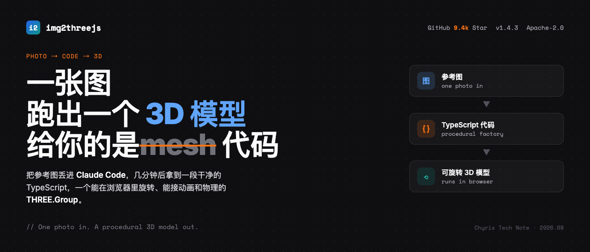
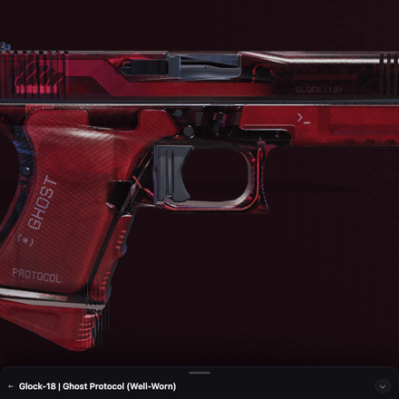
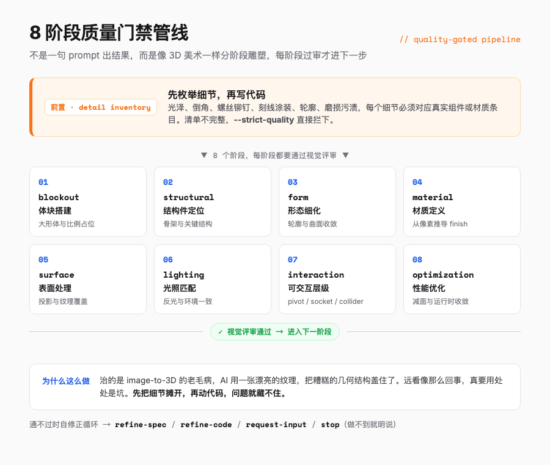
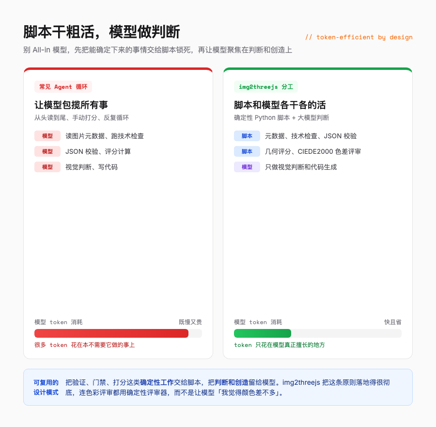
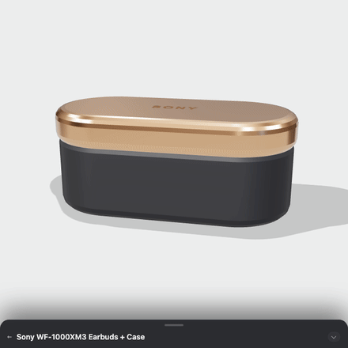
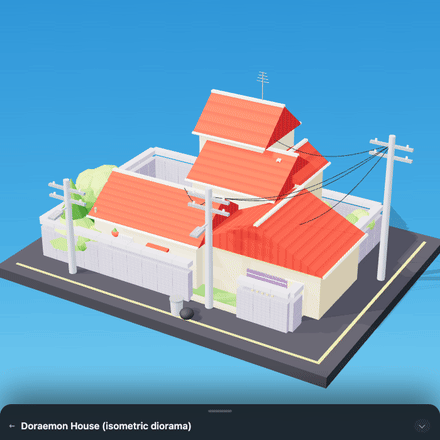
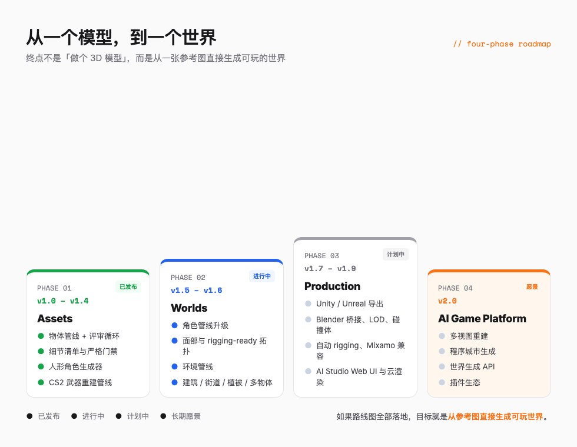

# 一张图丢给 Claude Code，它回了我一个能在浏览器里转的 3D 模型

> 别人交付一个 .glb 文件就完事了，它交付的是 TypeScript，能转、能改、能塞进项目里接着写。



---

## 一句话总结

img2threejs 不生成 3D 模型文件，它生成的是会长出 3D 模型的 TypeScript 代码。

---

## 老板要一个 3D 展示页

老板发来一张产品图，说做个 3D 展示页，要那种鼠标拖拽就能旋转的。

懂行的都知道这道题磨人。找 3D 美术建模、展 UV、烘焙贴图、导出 glTF、再写一坨 Three.js 加载代码，顺利的话半天，不顺利就是几天。中间哪一环卡住，整条链都得等。

img2threejs 给了第三种答案。把这张图丢进 Claude Code，等几分钟，拿到的是一段干净的 TypeScript，里面是一个完整的 `THREE.Group`，复制进项目就能跑，还能转。

它的 slogan 直白得不像技术项目，就一句话。

> One photo in. A procedural 3D model out.

GitHub 上 9.4k Star，710 Fork，主分支 20 小时前还有提交，迭代得很快。


---

## 它到底哪里不一样

先说一个反直觉的事，市面上的 image-to-3D 工具，不管是 Tripo、Meshy 还是 Trellis，大多给你一个静态产物，一个 mesh 文件，或者一段绕着模型转的视频。

img2threejs 走了另一条路，输出的是 Three.js 工厂代码。

```typescript
// 你拿到的不是模型文件，而是一个会生成模型的函数
createObjectModel(spec, options) -> THREE.Group
```

这个 `THREE.Group` 里装着什么，才是关键。真实的几何体、程序化材质和 shader、运行时层级，包括 pivots（枢轴）、sockets（挂载点）、colliders（碰撞体），还有一个 `userData.tick` 接口，直接就能接 idle 动画。

换句话说，你拿到的是一个能被程序驱动的 3D 对象，不只是摆着看的「3D 照片」。把它扔进游戏、塞进 Web 展示页、接进动画系统，都不用重新拆包。



---

## 一条很重的 8 阶段管线

img2threejs 没有走「一句 prompt 直接出结果」的捷径。它设计了一条类似 3D 美术工作流的 8 阶段管线。

> blockout → structural → form → material → surface → lighting → interaction → optimization

从搭体块开始，到结构件定位、形态细化、材质定义、表面处理、光照匹配，再到可交互层级，最后是性能优化。每一阶段都得通过视觉评审，才能进入下一阶段。通不过怎么办，它会从五件事里选一件，通过当前阶段、修正规格、修正代码、请求更多输入，或者干脆告诉你这张图它做不了。

这套机制叫 quality-gated pipeline，质量门禁管线。



其中最关键的一步是前置的 detail inventory，细节清单。

在写第一行 Three.js 代码之前，系统会强制先枚举参考图里所有「身份决定性」的小细节，光泽、倒角、螺丝和铆钉、刻线或涂装、轮廓、磨损和污渍。每一个细节都必须对应到真实的组件或材质条目。清单不完整，`--strict-quality` 模式直接拦着不让往下走。

这一步治的是 image-to-3D 的一个老毛病，AI 用一张漂亮的纹理，把糟糕的几何结构盖住了。远看像那么回事，真要拿去用，处处是坑。先把细节摊开，再动代码，问题就藏不住。

---

## 脚本干粗活，模型做判断

这条管线还有一个设计很聪明，尽量不把大模型的 token 浪费在机械劳动上。

技术检查、JSON 校验、几何与色差评分这些确定性的活儿，全部交给 Python 脚本。视觉判断和代码生成，才轮到大模型上场。脚本跑确定的事，模型只花 token 在它真正擅长的地方。



这和很多 Agent 项目「让模型从头读到尾、手动打分、反复循环」的做法形成对比。那些循环里，模型很大一部分 token 花在了本不需要它做的事情上，既慢又贵。

对做 Agent 工作流的人来说，这个分工本身就值得抄。别把宝全押在模型上，先把能确定下来的事情交给脚本锁死，再让模型聚焦在判断和创造上。img2threejs 把这条原则落地得很彻底，连色彩评审都用上了 CIEDE2000 色差公式和确定性评审器，而不是让模型靠「我觉得颜色差不多」过关。

---

## 三个专业分支，专啃硬骨头

img2threejs 没有用一个通用模板硬套所有物体，针对不同物体分了三个专业方向。

**硬表面物体**是它最强的领域。自行车、耳机、枪械、刀具、载具，这类东西结构清晰、材质明确，管线表现最稳。

**人形角色**走的是另一条管线，解剖学感知，有头部比例系统、面部特征放置、比例锁定和特征位置门禁。官方也很坦白，目前是风格化重建，不是照片级的 likeness。这点后面单独说。

**CS2 武器**是 v1.4 这个大版本的重点。针对 Glock-18、M9 刺刀这些武器家族，有专门的组件契约、投影优先的表面处理、单独的结构评审门禁。

CS2 武器之所以值得单独做一条管线，是因为这类物体细节密集、结构标准化，而玩家对准确性的要求近乎苛刻，皮肤有一点偏色都会被骂。能把这件事做好，说明管线确实够硬。



---

## 看看实际效果

展示页上放了 10 个 live demo，全部在浏览器里实时运行，没有一个下载模型包。挑几个最有代表性的。

**Sony WF-1000XM3 耳机加充电盒**，最贴近日常的消费品。这种物件最能让普通读者感觉到「这东西真能用」，盒身的磨砂质感、耳塞上的反光，都是从参考图像素推导出来的材质。

**Doraemon House**，等距视角的场景模型，走可爱路线，和前面的硬表面武器风格反差很大，但一样是纯代码生成的。

展示页里还有 Glock-18、M9 刺刀这些 CS2 武器，复杂金属磨损和高饱和渐变涂装的材质处理水准很高，前面分支那节聊过，这里就不展开了。

每个 demo 都能在页面里旋转查看，还能点开读生成它的 TypeScript 源码。官方那句介绍挺到位，每个模型都是生成的 TypeScript，你能转动它，也能翻开它的源代码看看。



---

## 怎么用

目前 img2threejs 主要作为 Claude Code、Codex、OpenCode 的 skill 使用。环境只要 Python 3.10 以上，不装额外依赖。

```bash
# 把 skill 克隆到本地目录
git clone https://github.com/img2threejs/img2threejs.git ~/.claude/skills/img2threejs
```

然后在 Claude Code 里贴上一张物体图片，输入一行调用。

```
/img2threejs Rebuild this object as a Three.js model, keep the proportions, angles, and colours.
```

剩下的，分类物体、跑细节清单、8 阶段门禁、生成代码、并排评审，skill 自己会走完。你只用在关键节点拍板。

对结果有更高要求，可以加几条约束。

```
Fidelity   Hold proportions and silhouette to the reference.
Materials  Derive finish class and gradient stops from pixels.
Runtime    Expose pivots and sockets, plus userData.tick.
Gates      Run --strict-quality, report per-region confidence.
```

这几行分别管保真度、材质、运行时接口和质量门禁，核心就一句，盯住比例和轮廓，从像素推导材质。

---

## 它做不到的事，官方先说了

这个项目最打动我的一点，是 README 里专门有一节叫 Honesty about limits，对局限的诚实。

它明说几件事。单张图没法展示隐藏侧面，也就没法保证精确几何。对不可见区域，它选择镜像推断，而不是假装自己知道。角色是风格化重建，不是照片级 likeness。还有一句，「从这张图无法达到要求的保真度」是合法且预期的结果，不是 bug。

在 image-to-3D 这类工具普遍过度承诺的当下，愿意主动说「我做不到」的项目，反而更值得信任。你可以放心把它的输出当作高质量原型，而不是拿去当最终交付件糊弄客户。

---

## 从一个模型，到一个世界

img2threejs 的路线图野心很大，分四个阶段。

> Assets → Worlds → Production → AI game-asset platform

从资产生成，到世界构建，到生产管线，最后是一个 AI 游戏资产平台。已经发布的版本一路做到了 v1.4 的 CS2 武器管线，后面几步更值得期待。

v1.5 到 v1.9 是把角色、环境、动画、云渲染一个个补齐。真正值得等的是两步，v1.7 的游戏管线，能让生成的模型直接导出进 Unity 和 Unreal，带 Blender 桥接、LOD 和碰撞体；v2.0 更远，目标是程序世界生成，从多视图重建到一整座城市，再加 API 和插件生态。

这张路线图真要走完，它的野心就是让你从一张参考图，直接生成一个能玩的世界。



---

## 另一种可能

开头那道题，老板要一个能旋转的 3D 展示页，传统流程是半天起步的流水线，img2threejs 给的第三种答案是几分钟出一套能跑的代码。

它让我看到 image-to-3D 的另一种可能。不是让 AI 输出一个「看起来差不多」的模型，而是让 AI 输出一套能被工程系统继续消费的代码资产。这个差别，做 Agent 工作流的人第一眼会注意到它脚本和模型的分工，做前端的，大概会对「能直接塞进项目接着写」更有感觉。

感兴趣的可以去展示页转转那些 live demo，模型都是浏览器里实时跑的代码。项目仓库在 `github.com/img2threejs/img2threejs`，展示页在 `img2threejs.github.io/img2threejs-showcase`。

**你最想拿什么图让它重建？** 评论区聊聊。

---

> 数据采集时间 2026 年 8 月 4 日，GitHub 9.4k Star。文中的技术细节基于项目 README、ARCHITECTURE 文档和 ROADMAP 整理，demo 效果以官方展示页为准。

---

欢迎关注我的公众号「Chyris Tech Note」，获取更多 AI 技术解读与实践分享。
