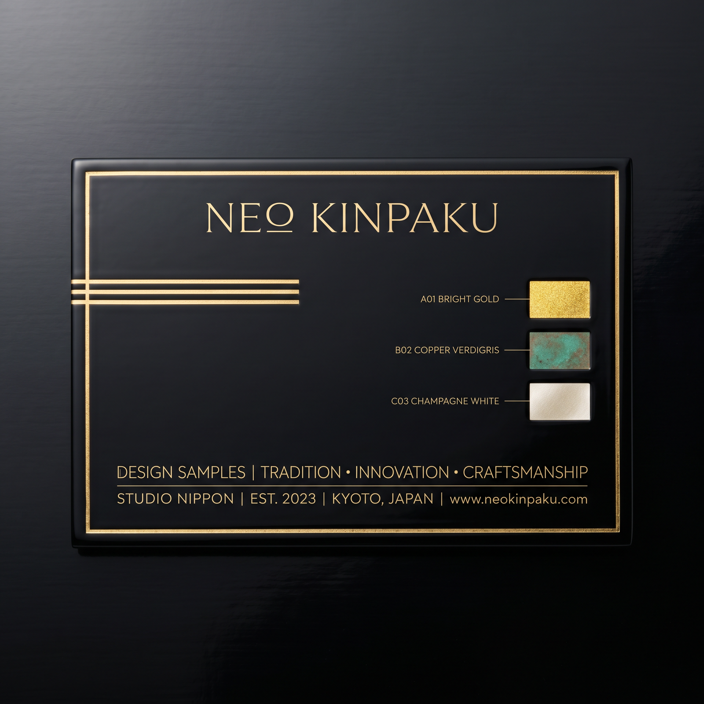

# 23 个命令、27 条规则，这个开源 Skill 正在解决 AI 生成 UI 的廉价感

> 你让 AI 写了一个 landing page。它交出来的东西看起来很完整，排版整齐，配色和谐，甚至还有动画。你兴冲冲把链接发给做设计的朋友，对方只回了一句，「这明显是 AI 生成的。」


---

## AI 生成的页面，为什么总像同一个模板


这不是你的错觉。

每一个被训练来生成前端代码的大模型，都啃过同一批互联网素材。SaaS landing page 的模板、Tailwind UI 的组件库、各种 boilerplate 的配色方案，这些数据构成了模型的「审美肌肉记忆」。

结果就是，当你让 AI 写一个网站时，它不自觉地复现了这些训练数据里最常见的模式。

紫色的渐变背景。Inter 字体铺满整个页面。圆角方块图标整齐地叠在标题上方。卡片里面再套一层卡片。标题前面加上一个圆角长条的小标签，写着「Features」或者「Why Us」。滚动时所有区块以同样的淡入动画登场。

单独看，每一个选择都没问题。组合在一起，设计师管这叫 **AI slop**，那些暴露「这段代码是 AI 写的」的廉价信号。

Paul Bakaus 在项目文档里列了不少 AI slop 信号。比如这几条。

侧边一条彩色粗边框的卡片，是最经典的 AI 标志。紫色或青色的渐变背景，几乎成了 AI 生成 UI 的默认皮肤。圆角方块图标容器叠在标题上面，是每一个 feature section 的标准配方。全大写的微型标签字母拉得很开，坐在 hero 标题正上方。还有那个三段式对比的文案节奏，「Not a tool. A platform.」，出现一次是风格，出现三次以上就是 AI 的语法指纹。

更隐蔽的是字体选择。Inter 本身是一款优秀字体，但当它被用在每一个新生成的页面上时，就成了审美疲劳的源头。模型对「安全选择」的偏好，把所有页面拉向了同一个平均值。

> 问题不是 AI 不会设计。问题是 AI 被训练去模仿那些已经被过度模仿的东西。

---

## Impeccable 是什么


[Impeccable](https://impeccable.style) 的定位很直接，给 AI 一个共享的设计词汇表。

它的核心思路不难理解。AI 编程工具本身很聪明，但它缺少设计的「常识」。你说「把这个按钮做得好看一点」，AI 不知道什么是「好看」，只能回到训练数据里找最常见的答案。最常见的答案，往往就是最平庸的答案。

Impeccable 的解法是给 AI 一套结构化的设计 reference，把模糊的「好看一点」变成精确的指令。

它管的东西挺细的。排版、颜色、空间、动效、交互、响应式、UX 写作，一共 7 个领域。但最狠的几条不在数量，而在态度。

比如字体，它直接 ban 了 Inter、Roboto、Geist、Plus Jakarta Sans，不是因为这些字体差，而是因为它们被用烂了。比如颜色，它不用 HEX，用 OKLCH，一个大部分前端听都没听过的色彩空间。再比如布局，卡片嵌套卡片永远是错的，用间距和排版层级代替容器嵌套。动效方面，弹跳和弹性缓动被禁止，要求用指数衰减曲线。

这些规则被写进 Skill 的 reference 文件里，AI 在每次生成代码前都会读取。以后你说「把这个按钮做得好看一点」，AI 不再回到训练数据里找最常见的答案，而是先看一遍这套规则再动手。

---

## 23 个命令，覆盖从构思到交付的完整工作流


Impeccable 的 23 个命令覆盖了从构思到交付的完整流程。我不打算全部列出来，挑几个有意思的讲。

`/impeccable craft` 是最完整的流程，从构思到构建到迭代，一步到位。`/impeccable shape` 在写代码之前先规划 UX 和 UI，相当于让 AI 先画蓝图再动手。`/impeccable init` 用于新项目的初始设置，自动收集设计上下文并生成 PRODUCT.md 和 DESIGN.md。

评估类的两个命令分工很明确。`/impeccable audit` 跑技术质量检查，包括无障碍访问、性能、响应式，生成带 P0-P3 severity 评级的报告，一个看「代码对不对」。`/impeccable critique` 做设计层面的评审，看层级、清晰度、情感共鸣，一个看「设计好不好」。

`/impeccable polish` 是交付前的最终检查，对齐设计系统、修复细节。`/impeccable distill` 则是做减法，把过度设计的东西剥回本质。这两个的对比很有意思，一个做加法一个做减法。

还有十几个命令管配色、字体、布局、动效、边缘情况处理，不一一列举了。其中最有特色的一个值得单独提，`/impeccable live`。你在浏览器里选中一个元素，告诉 AI 要做什么改动，AI 生成几个变体，你选一个满意的直接应用。不需要反复切换 IDE 和浏览器预览。

每个命令都可以带一个目标参数聚焦到具体区域。比如 `/impeccable audit blog` 只审查博客页面，`/impeccable polish the checkout form` 只打磨结账表单。常用的还可以固定成快捷指令，`/impeccable pin audit` 之后直接打 `/audit` 就行。

---

## 27 条反模式检测，不需要 API Key


Impeccable 最硬核的部分，是它的反模式检测引擎。

它内置了 27 条核心反模式规则，分成两大类。**slop** 类抓那些「一看就是 AI 生成的」信号，**quality** 类抓真实的设计和可访问性问题。

检测引擎是纯规则驱动的，不调用 LLM，不需要 API key。一条命令就能扫任何代码库或网页。

```bash
npx impeccable detect src/
npx impeccable detect index.html
npx impeccable detect https://example.com
```

扫描目录、扫描单个 HTML、甚至抓取线上 URL 用 Puppeteer 分析都可以。加 `--fast --json` 还能只做正则匹配，输出结构化 JSON。

Slop 类规则覆盖了最显眼的 AI 痕迹。彩色侧边边框、紫色渐变、Inter 字体泛滥、卡片嵌套、弹跳缓动、暗色发光、圆角图标叠标题、斜体衬线大标题、hero 上方药丸标签、破折号过度使用、营销套话。这些信号单看无害，组合在一起就是 AI 的指纹。

Quality 类则抓真实的设计问题。低对比度、动画布局属性、灰色文字在彩色背景上、破损图片、过长文本行、拥挤 padding、跳过标题层级，等等。

每条规则都有修复建议。检测到弹跳缓动，建议改用 ease-out-quart 或 ease-out-expo。检测到卡片嵌套，建议用间距和排版层级代替。

> 最有意思的是，这个检测引擎不是只给 AI 用的。你可以用它扫描自己的手写代码，或者扫描竞争对手的网站。它本质上是一个设计 quality 的静态分析工具。

---

## 一个很有意思的设计哲学



Impeccable 的官网 impeccable.style 本身就是一个产品演示。


它的设计系统叫 **Neo Kinpaku**，灵感来自日本金箔工艺。黑漆底色，金箔点缀，铜绿氧化作为辅助色。没有紫色渐变，没有霓虹光效，没有玻璃拟态。整个网站的气质是克制的、精确的、昂贵的。

这背后的品牌哲学挺有意思。最重要的一条叫 Practice what you preach，官网必须通过它自己的反模式检测，如果 impeccable.style 上出现了紫色渐变或者卡片嵌套，整个产品的可信度就崩塌了。所以它不是在说教，是在打赌。

另一条是 Show, don't tell。不要写很多文字解释设计质量有多好，直接用网站的执行来证明。官网上每一行代码、每一个色块、每一个字间距，都是产品 demo 的一部分。

最后一条是我个人最喜欢的，Expert confidence。不说「也许可以考虑换一种字体」，而是直接说「不要用 Inter」。有主见的、不摇摆的、敢得罪人的。这种语气在开源项目里不多见。

颜色系统完全基于 OKLCH，连 token 命名都很讲究，Kinpaku Gold、Verdigris Patina、Lacquer Black、Champagne、Graphite。字体搭配也经过精心设计，显示标题用 Alumni Sans Pinstripe，正文用 Albert Sans，小标签用等宽字体。

这个项目甚至还有一个专门的 prose validator，在构建时扫描所有用户可见的文案，禁止一整个 AI 味词汇表。比如 seamless、robust、delve、elevate、empower、underscore、pivotal、tapestry 这些词，出现在构建时就会报错。

---

## 怎么用

说了这么多，上手其实就一行命令。

```bash
npx impeccable skills install
```

这条命令会自动检测你用的 AI 编程工具，把编译好的 Skill 文件写到正确的位置。支持的工具清单很长，Claude Code、Cursor、Gemini CLI、Codex CLI、VS Code Copilot、OpenCode、Pi、Kiro、Trae、Rovo Dev、Qoder，基本覆盖了市面上所有主流选择。

Claude Code 用户还可以直接从插件市场装，`/plugin marketplace add pbakaus/impeccable`。如果你用多个工具，`npx skills add pbakaus/impeccable` 也行，不过它装的是通用版本，不如 `skills install` 针对你的工具编译的版本来得精准。

装完之后记得重启工具。有些工具需要额外配置，Cursor 要切到 Nightly channel 并在设置里启用 Agent Skills，Gemini CLI 要装 preview 版并在 `/settings` 里打开 Skills 开关。Codex 用户注意，Impeccable 走的是 skills 路径，不是 `/prompts:` 命令，打 `$impeccable` 或者在 `/skills` 里找。

重启后在 AI 对话里直接打 `/impeccable` 就能调出完整命令列表。大部分命令可以带一个目标参数聚焦到具体区域。

```bash
/impeccable audit                    # 全面审查
/impeccable audit the header         # 只审查 header
/impeccable polish                   # 整体打磨
/impeccable polish the checkout form # 只打磨结账表单
/impeccable critique                 # 设计评审
/impeccable critique landing         # 只评审 landing page
```

如果你常用某个命令，可以把它固定成快捷指令。

```bash
/impeccable pin audit
```

之后直接打 `/audit` 就行，不需要每次都走 `/impeccable` 前缀。

不想装 Skill 的场景，CLI 可以独立使用，不需要 API key。

```bash
npx impeccable detect src/                # 扫描整个目录
npx impeccable detect index.html          # 扫描单个 HTML 文件
npx impeccable detect https://example.com # 扫描线上 URL
npx impeccable detect --fast --json .     # 只跑正则，输出 JSON
```

`--fast` 跳过 Puppeteer 和复杂的样式计算，纯正则匹配，速度更快。`--json` 输出结构化结果，方便接入 CI 或者写脚本处理。

团队使用的话，可以用 Git submodule 把 Impeccable 作为 vendored 依赖管理。

```bash
git submodule add https://github.com/pbakaus/impeccable .impeccable
npx impeccable skills link --source=.impeccable --providers=claude,cursor
```

后续更新只需要两条命令。

```bash
git submodule update --remote .impeccable
npx impeccable skills link --source=.impeccable --providers=claude,cursor
```

---

## 总结

AI 写前端已经没什么门槛了。真正难的是让 AI 写的东西看起来不像 AI 写的。Impeccable 要解决的就是这个问题。

它没有给 AI 更复杂的 prompt，而是给了一套设计词汇表和一套质量检测机制。23 个命令覆盖从构思到交付的完整流程，27 条反模式规则在代码层面捕捉廉价的 AI 信号。整套系统纯规则驱动，不需要 API key，开箱即用。

对于每天在用 Claude Code、Cursor 这些工具写前端的开发者来说，Impeccable 的价值其实很简单。好的设计不是 prompt 的艺术，而是约束的艺术。你给 AI 的约束越具体，它输出的东西就越有辨识度。

> Paul Bakaus 的原话更直接，Every model trained on the same SaaS templates. Skip the guidance and you get the same handful of tells on every project. 所有模型都啃过同一批模板。不给它设计指引，它就会把同一批廉价信号复制到每一个项目上。

Impeccable 想做的，就是打断这个循环。

---

欢迎关注我的公众号「Chyris Tech Note」，获取更多 AI 技术解读与实践分享。
