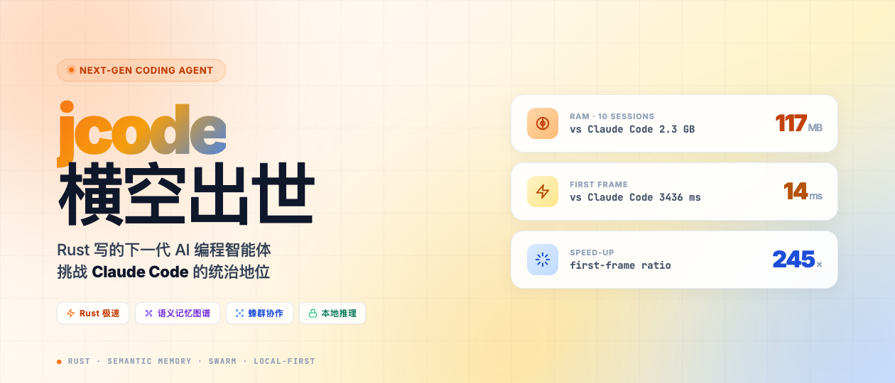
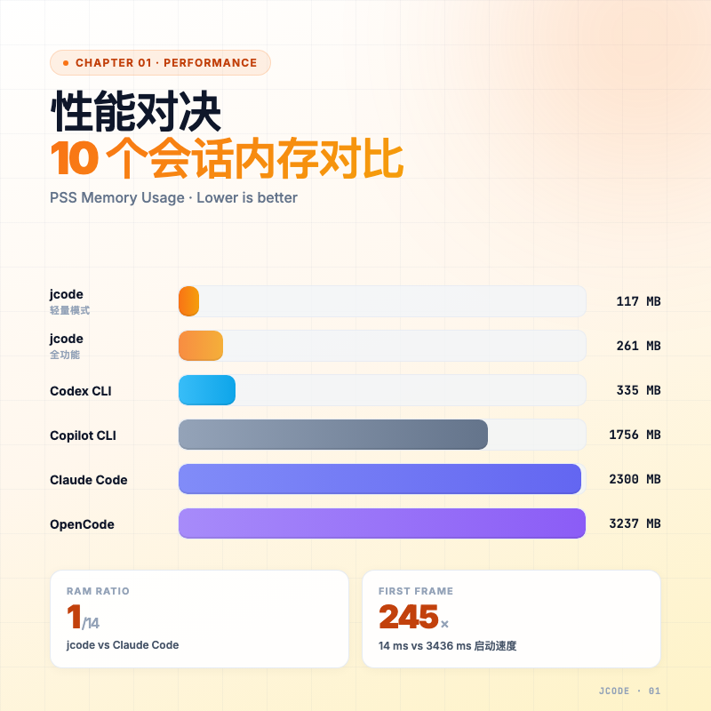
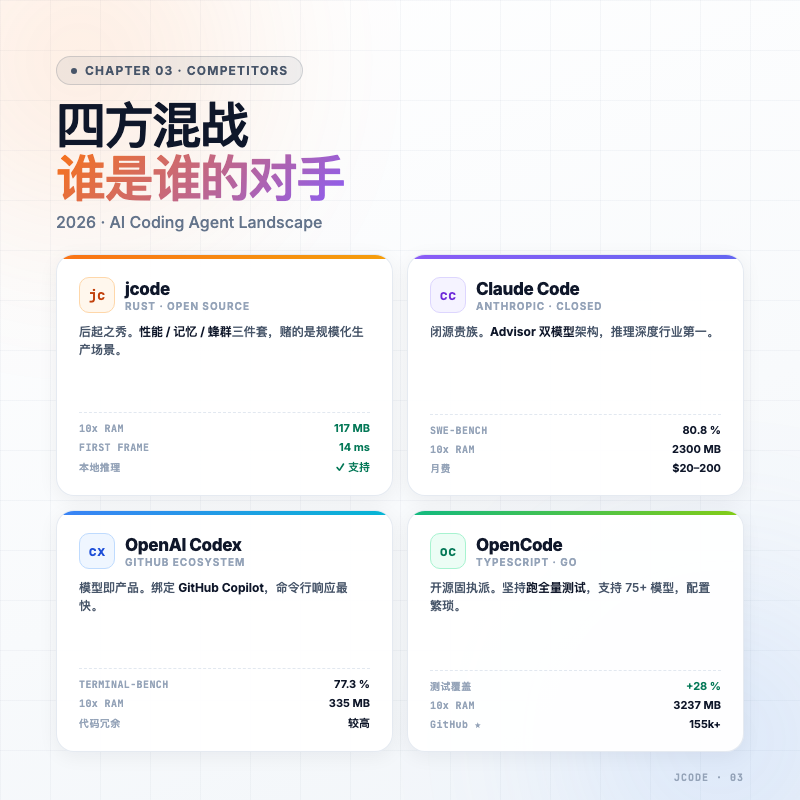
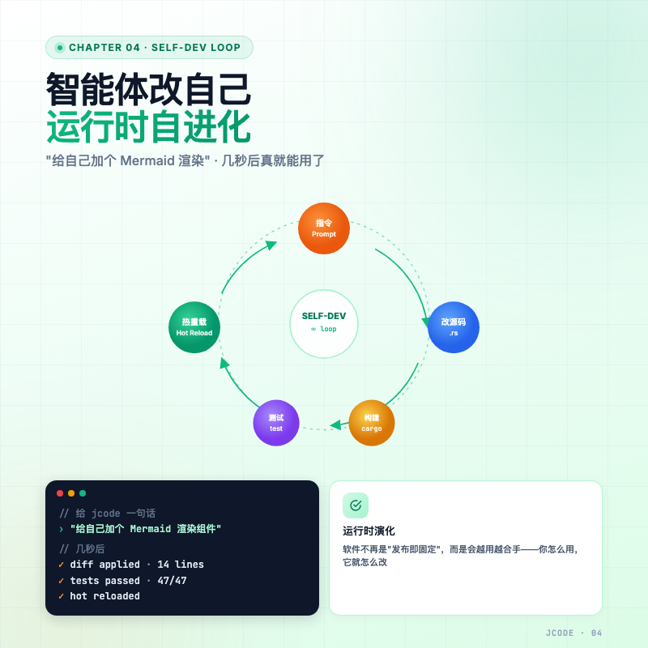
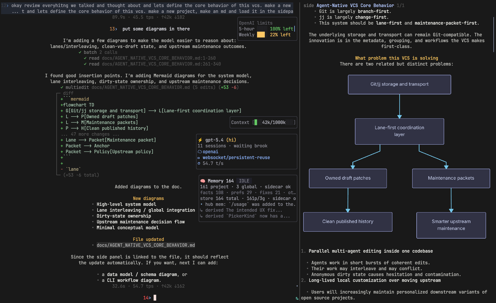
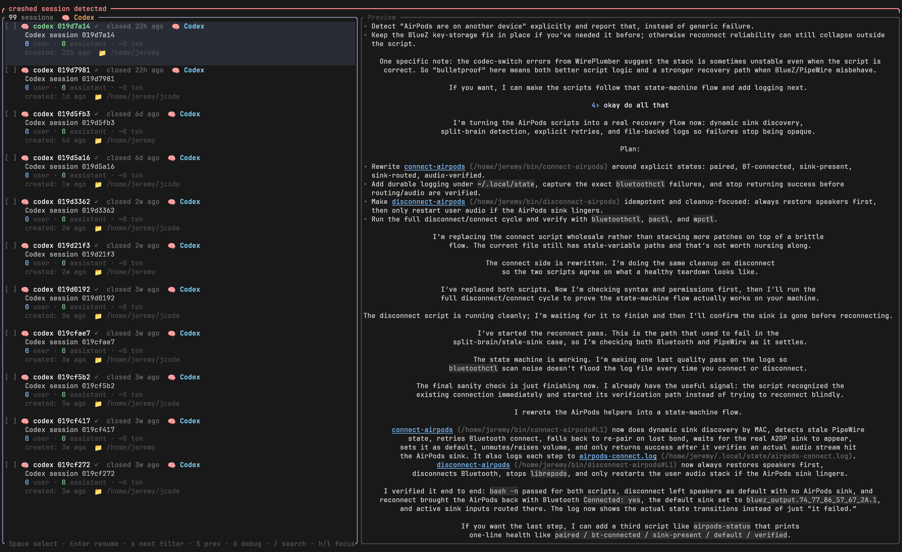

> 想同时开 5 个 Claude Code 窗口做并行任务？我的 Mac 32G 内存条已经在哭了。
> 直到我装上一个叫 jcode 的新工具，开 10 个会话还没占到 200MB。



---

## 一句话总结

jcode 是用 Rust 重写的 AI 编程智能体（Coding Agent）。两个卖点：一是内存只要 Claude Code 的 1/14、首帧速度快 245 倍，二是给智能体装了一套语义记忆图谱，AI 真的能记住你项目里的东西。

> Claude Code 是大排量越野车，jcode 是 F1 赛车。

---

## 一、性能对决：内存只要 1/14，启动快 245 倍

先看一组数据。这是几个主流 AI 编程智能体在同一台机器上的内存占用（PSS）和首帧响应时间：

| 工具 | 单会话内存 | 10 会话内存 | 首帧响应 |
|------|-----------|------------|----------|
| **jcode（轻量模式）** | **27.8 MB** | **117.0 MB** | **14.0 ms** |
| jcode（全功能模式） | 167.1 MB | 260.8 MB | — |
| Claude Code | 386.6 MB | 2300.6 MB | 3436.9 ms |
| OpenCode | 371.5 MB | 3237.2 MB | 1035.9 ms |
| Codex CLI | 140.0 MB | 334.8 MB | 882.8 ms |
| GitHub Copilot CLI | 333.3 MB | 1756.5 MB | 1518.6 ms |

几个关键对比：开 10 个会话，jcode 占 117MB，Claude Code 要 2.3GB，差 19 倍。每加一个会话，jcode 多 9.9MB，Claude Code 多 212.7MB，差 21 倍。首帧响应 14ms vs 3436ms，差 245 倍。



这背后是技术栈的根本差异。Claude Code 是 Node.js 跑出来的，启动得先把 V8 引擎、TS 编译、各种 npm 依赖一股脑装进来；jcode 直接编译成静态二进制，开机即用。

> 这其实是一个"能不能并行多任务"的分水岭。同时开一个会话写新功能、一个跑测试、一个查文档——前者你需要一台 Mac Studio，后者一台 MacBook Air 就够。

---

## 二、它真的"记得住"：语义记忆图谱

性能只是入场券。jcode 真正让我意外的是它的记忆系统。

传统 LLM 怎么记忆？塞上下文窗口。每一轮对话都把整个历史拼回去，长了就忘前面，还烧 token。

jcode 走了另一条路：每一轮对话结束后，把这一轮的语义内容做向量嵌入，存到一张图里。下一次需要时，用余弦相似度找出相关历史节点：

$$S_C = \frac{\vec{v} \cdot \vec{m}_i}{\|\vec{v}\| \|\vec{m}_i\|}$$

光有相似度还不够。它还会做**级联检索**——找到一个相关节点之后，沿着图的边再找二阶、三阶相关节点，模仿人脑的"联想"。

再来是**置信度衰减**机制。一段记忆放久了会"褪色"：

$$C = C_0 \cdot e^{-age\_days / half\_life} \cdot (1 + 0.1 \cdot \log(access\_count + 1)) \cdot trust\_weight$$

公式看着唬人，意思就一句话：老的代码事实会自动过期，常被引用的会保鲜，可信来源权重更高。


类比一下你就懂了：

- 传统 LLM：每次见你都从头自我介绍一遍，然后翻一本厚厚的笔记本找之前聊过什么
- jcode：脑子里有张关系图谱，你提到一个东西它就联想出一连串相关的事，旧的事会慢慢淡忘，重要的事记得最牢

这件事对长项目维护尤其重要。Claude Code 在一个项目用三个月，可能还在反复纠正你"那个变量已经改名了"。jcode 的图谱会自动把过时事实降权。

---

## 三、四方混战：jcode / Claude Code / Codex / OpenCode 各是什么"性格"

接下来看 2026 年这场 AI 编程智能体大战。四家工具走的路完全不一样：

| 工具 | 核心定位 | 一句话总结 |
|------|---------|-----------|
| **Claude Code** | 垂直集成 + 深度推理 | 闭源贵族，推理最强，只跟 Anthropic 模型玩 |
| **OpenAI Codex** | 模型即产品 + GitHub 生态 | 速度快，深度绑定 GitHub Copilot |
| **OpenCode** | 开源 + 供应商无关 | 极致灵活，支持 75+ 模型，但配置繁琐 |
| **jcode** | 性能 + 记忆 + 蜂群 | 后起之秀，赌的是规模化生产场景 |



### Claude Code 的杀手锏：Advisor 策略

Claude Code 推理最强（SWE-bench 得分 80.8%），靠的是"导师 + 学徒"双模型架构。Opus 4.7 当导师做规划，Sonnet 当学徒做执行。代价是订阅 + API 双重计费，月费 20-200 刀。

### Codex 的强项：终端理解

Terminal-Bench 2.0 拿 77.3 分，命令行操作快，但被吐槽"代码表面正确、深处冗余"。

### OpenCode 的特点：固执的工程严谨

社区开源版的 Claude Code，TypeScript + Go 写的。它跟 Claude Code 跑同一个任务时会**坚持跑全量测试**，不像 Claude Code 偷懒只跑受影响的那部分。代价是慢——4 个任务对比，Claude Code 9 分钟，OpenCode 16 分钟，但生成的测试用例多了 28%。

| 评估维度 | Claude Code (Opus 4.5) | OpenCode (GLM-4.7) |
|---------|----------------------|-------------------|
| 任务完成时间 (4个任务) | 9 分 9 秒 | 16 分 20 秒 |
| 测试覆盖率 | 73 个用例 | 94 个用例 |
| 重构一致性 | 倾向引入冗余库 | 维持既有架构模式 |
| 技术债风险 | 较高 | 较低（但 Diff 噪声多）|

### jcode 的位置

不跟你比"谁更聪明"，比"谁能 7×24 跑得稳，开 10 个窗口不爆内存，三个月后还记得你项目的风格"。

---

## 四、智能体可以"自己改自己"：Self-Dev 模式

这是 jcode 最科幻的一点。

它内置了一个叫 **Self-Dev**（自开发）的模式：智能体可以直接修改 jcode 自己的 Rust 源代码，后台自动构建、跑测试、热重载二进制。

举个真实场景：你跟它说"给自己加个 Mermaid 渲染组件吧"。然后它真就给自己提了个 PR、跑了构建，几秒钟之后 jcode 已经能渲染 Mermaid 图了。



> 软件不再是"发布即固定"的东西，会越用越合手——你怎么用，它就怎么改自己。

这功能也意味着你必须信任它的测试覆盖、信任它不会把自己改崩。所以默认是关闭的，得手动启用。

---

## 五、蜂群协作：多智能体并行 + 代码漂移检测

Self-Dev 是单个智能体进化，蜂群模式（Swarm）是多个智能体协作。

jcode 支持在同一个仓库里启动多个互联的智能体会话，背后有个协调中心：所有活跃智能体的状态汇报到中心；A 改了 `auth.rs` 之后，B 还在基于旧版本推导逻辑，服务器立刻给 B 发警报"代码漂移了，重新读一下"；主智能体（Coordinator）还可以自己拉出几个专门的 Worker，比如分一个写测试、一个跑性能分析，自己负责汇总。


这套机制在大型迁移上效果挺明显：原本两周才能搞定的 Scala→Java 手动迁移，蜂群协作四天搞定。

类比一下：以前 AI 编程像一个全栈工程师单打独斗。蜂群模式像你雇了个项目经理 + 几个专业小组，并行干活、不撞车。

---

## 六、隐私 + 移动端：本地推理 + Tailscale 隧道

2026 年监管环境变了。NJDPL（新泽西数据隐私法）这类法案一出，企业越来越不敢把代码传到云端。

jcode 的方案有两层。

本地推理这块，可以通过 API 桥接到本地的 vLLM 或 Ollama 集群，核心代码从不出内网。OpenCode 也支持，但它在小模型上工具调用稳定性一般，jcode 这块工程更扎实些。

移动端的方案是 jcode 计划发布的 iOS 应用 Native OpenClaw。手机和工作站之间走 Tailscale 加密隧道，绕开公网暴露；手机不只是终端模拟器，可以实时渲染 Mermaid 拓扑图、看 Diff；智能体要执行敏感 shell 命令时，会直接锁屏推送 Approve 按钮让你确认。



还有个我挺喜欢的小功能——跨工具会话恢复。你在 Claude Code 里跑了一半的任务，可以切到 jcode 用一句 `/Resume` 接管，它会自动解析 Claude 的本地日志，把"思考状态"还原回来。这点对经常切工具的人很友好。



---

## 七、最小 Demo：装一个试试

```bash
# macOS / Linux 一行装好
curl -fsSL https://raw.githubusercontent.com/1jehuang/jcode/master/scripts/install.sh | bash
```

装完两个常用命令：

```bash
# 启动一个会话
jcode

# 接管 Claude Code 已有项目的会话
jcode /Resume
```

想用本地模型？配一个 `~/.jcode/config.toml` 指到你的 Ollama 端口就行，全程不出内网。

---

## 八、谁该用 jcode，谁继续用 Claude Code？

我个人的判断：

| 你的画像 | 选什么 |
|---------|-------|
| 单兵作战，要的就是最强推理 | **Claude Code**（Opus 4.7 还是天花板）|
| 深度依赖 GitHub 全家桶 | **Codex / Copilot**（生态最顺）|
| 极致追求开源 + 多模型自由 | **OpenCode**（折腾党的最爱）|
| 大型 monorepo + 多窗口并发 + 隐私敏感 | **jcode**（性能/记忆/蜂群/本地推理一站式）|

不是说 jcode 比 Claude Code "更好"。它解决的是 Claude Code 在规模化生产里没解决的事：内存吃不消、记忆失忆症、不能开太多窗口、代码不让出内网。

> 一个工具的迁移，往往不是因为它突然变强了，而是有人重新写了一遍底层。
> Rust + 语义图谱 + 蜂群——jcode 想干的事，是把"AI 编程"从对话工具升级成生产基座。

值不值得装一个试试？我的建议是先 `curl` 一下那条安装命令，反正占不了 30MB。

---

## 总结

Rust 重写让内存只要 Claude Code 的 1/14、启动快 245 倍。语义记忆图谱让旧事实自动衰减、相关记忆自动联想，AI 真的开始能"记住"项目。Self-Dev 让智能体改自己源码、热重载，Swarm 让多智能体并行 + 代码漂移检测。本地推理 + Tailscale 移动端把企业隐私合规也兜住了。

一句话选型：单人极致推理选 Claude Code，规模化生产选 jcode。

> AI 编程的下一战，比的不再是"谁更聪明"，而是"谁能稳定 7×24 跑下去、记得住、不爆内存"。
