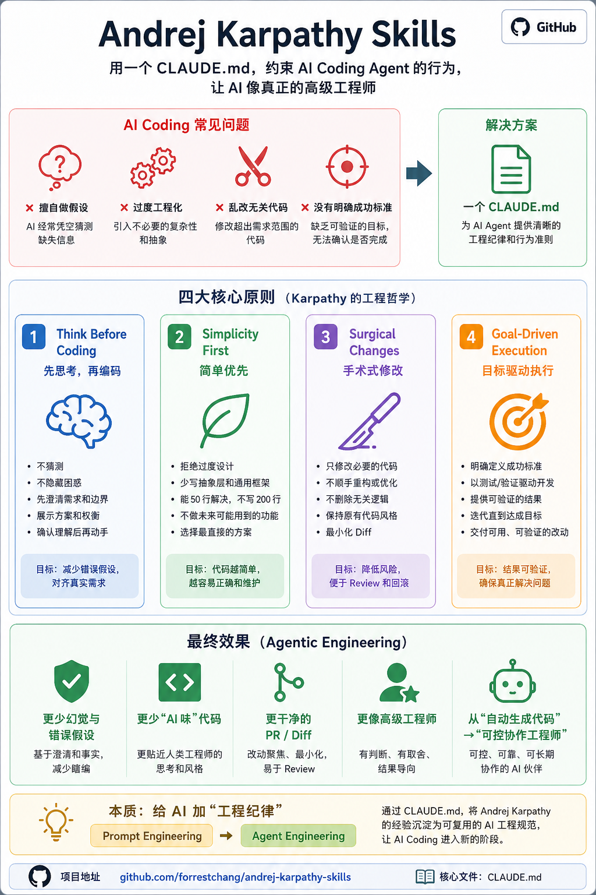
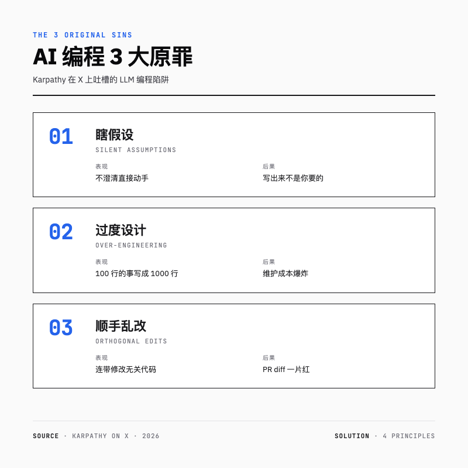
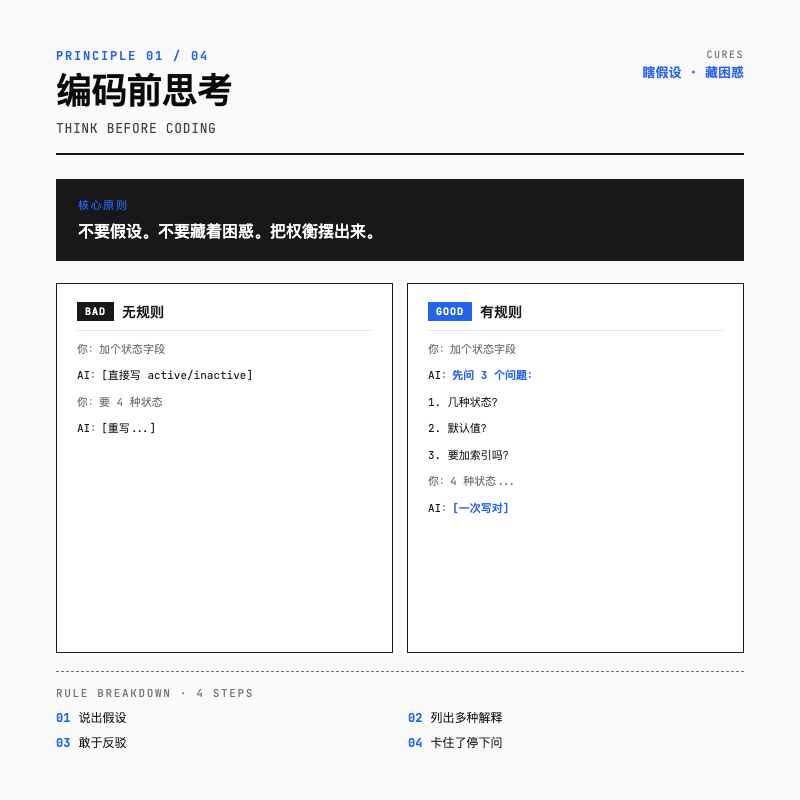
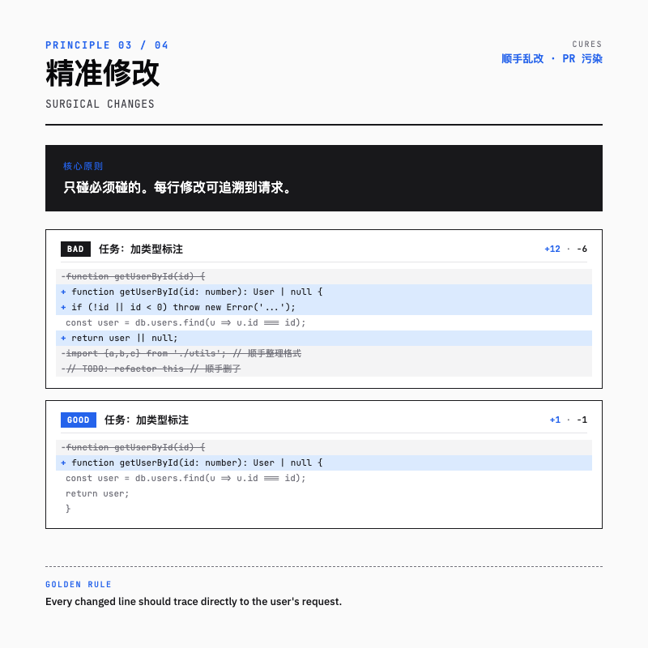
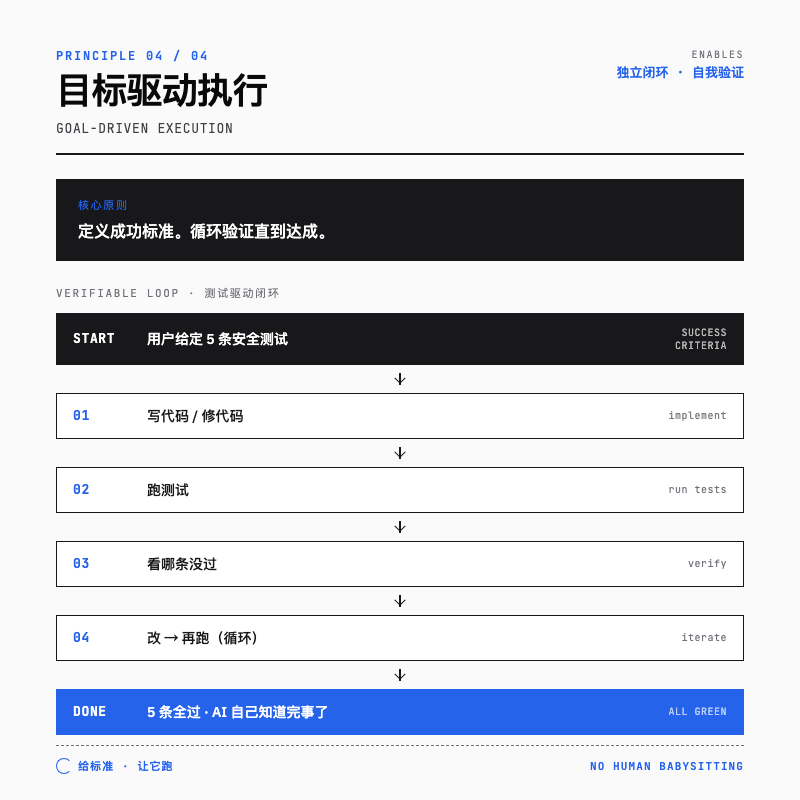
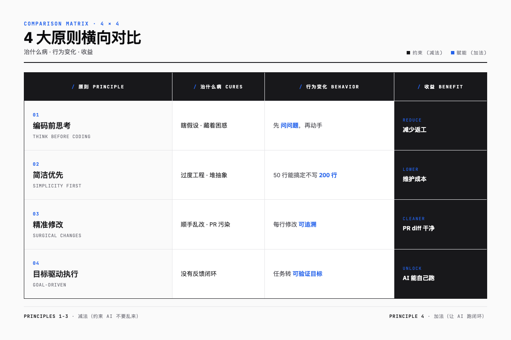
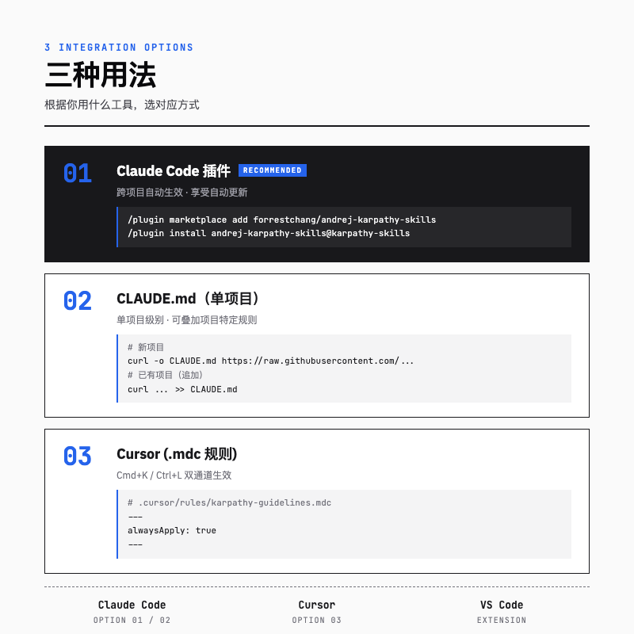

> 让 AI 帮你写代码这事儿，听上去很爽，干起来很气：你让它修个 bug，它顺手把隔壁三个文件的注释删了；你让它加个字段，它给你重构了整个数据层。一个叫 `andrej-karpathy-skills` 的 GitHub 项目最近爆火，**短短几周冲到 12 万星**，靠的就是一个 CLAUDE.md 文件，把这种"AI 自由发挥"的毛病按住了。


---

## 一句话总结

**4 条规则 + 1 个 CLAUDE.md 文件 = 让 Claude Code / Cursor 像资深工程师一样干活，而不是像刚入职的实习生瞎搞。**

这 4 条规则最早是 Andrej Karpathy 在 X 上发的吐槽，后来开发者 forrestchang 整理成了这份 CLAUDE.md，直接扔进项目根目录就能生效。Karpathy 是谁就不用多说了，前特斯拉 AI 总监、OpenAI 创始团队成员。他说"软件 3.0 时代来了"那会儿，整个圈子都在抄笔记。



> 中文版一图速览。

---

## 为什么这玩意能爆火 12 万星

Karpathy 自己在原推里吐槽得够狠：

> 模型会代你做错误假设，然后不假思索地执行。它们不管理自身的困惑，不寻求澄清，不呈现矛盾，不展示权衡，在应该提出异议时也不反驳。

> 它们真的很喜欢把代码和 API 搞复杂，堆砌抽象概念，不清理死代码……明明 100 行能搞定的事情，非要实现成 1000 行的臃肿架构。

> 它们有时仍会改动或删除自己理解不足的代码和注释，即使这些内容与任务本身无关。

翻译成大白话就是 AI 编程的 3 大原罪：


Karpathy 自己在 2026 年初观察到：他的编程工作流，**从 80% 手写代码 一路滑到 80% 智能体驱动**。问题来了。AI 能干 80% 的活儿，但前提是它别瞎搞。这套规则就是来按住"瞎搞"的。

---

## 原则一：Think Before Coding —— 编码前思考



核心：不要假设。不要藏着困惑。把权衡摆出来。

LLM 的默认模式是"看到任务马上动手"。但需求模糊的时候，它会偷偷选一种解释直接干，结果往往跟你想要的差出十万八千里。

**反例（无规则）：**

```
你：给用户表加个状态字段。
AI：好的！[直接写代码，加了个 ENUM('active','inactive')]

你：……我要的是 0/1/2/3 四种状态。
AI：好的！[重写]
```

**正例（有规则）：**

```
你：给用户表加个状态字段。
AI：在动手前我有几个问题：
    1. 状态有几种？是布尔 (active/inactive) 还是枚举（如 active/pending/banned/deleted）？
    2. 历史数据怎么处理？默认值给什么？
    3. 这个字段会在哪些查询里用到？需要加索引吗？
你：4 种状态，默认 active，需要索引。
AI：[一次写对]
```

具体规则文本就一段：

> Before implementing:
> - State your assumptions explicitly. If uncertain, ask.
> - If multiple interpretations exist, present them — don't pick silently.
> - If a simpler approach exists, say so. Push back when warranted.
> - If something is unclear, stop. Name what's confusing. Ask.

简单说就四条：说出假设，列出多种解释，敢于反驳，卡住了就停下问。

---

## 原则二：Simplicity First —— 简洁优先


核心：用最少的代码解决问题。不要过度推测。

LLM 训练数据里塞满了开源项目，里面什么花哨的设计模式都有。所以它默认就喜欢秀，给你来个"工厂方法 + 策略模式 + 依赖注入 + 配置文件"的全家桶。可你只是想写个一次性脚本啊。

**反例（无规则）：**

```python
你：写个脚本读 CSV 然后打印总和。

AI 给你来这个：
class CSVReader:
    def __init__(self, config: ReaderConfig): ...
class SummationStrategy(ABC): ...
class StandardSum(SummationStrategy): ...
class Pipeline:
    def __init__(self, reader, strategy): ...
# 200 行后，main 函数终于出现
```

**正例（有规则）：**

```python
import csv
total = sum(float(row['amount']) for row in csv.DictReader(open('data.csv')))
print(total)
```

3 行搞定。

规则原文里有一条特别狠：

> If you write 200 lines and it could be 50, rewrite it.

**写了 200 行能压到 50 行？重写。** 检验标准很简单：

> Would a senior engineer say this is overcomplicated? If yes, simplify.

资深工程师会觉得这写得太啰嗦吗？会的话就简化。这条规则等于把"成本敏感性"硬塞进 AI 脑子里。**人类工程师懂"每多一行代码都是未来的负债"，但 AI 默认不背这个锅，得人为给它装上**。

---

## 原则三：Surgical Changes —— 精准修改



核心：只碰必须碰的。只清理自己造成的混乱。

这条规则是给"顺手党"立的规矩。AI 修代码时经常发挥"额外价值"，你让它修 bug，它顺手把这文件里所有的双引号改成单引号，注释也"优化"了，import 顺序也调了。然后 git diff 一打开，1 行的修复变成 50 行的"重构"，code review 的人想骂街。

**反例（无规则）：**

```diff
- function getUserById(id) {
+ function getUserById(id: number): User | null {
+   // Validate input
+   if (!id || id < 0) throw new Error('Invalid ID');
    const user = db.users.find(u => u.id === id);
-   return user;
+   return user || null;
  }

- import {a,b,c} from './utils';
+ import { a, b, c } from './utils';   // 顺便整理格式
- // TODO: refactor this
+ // 这一行也被顺手删了
```

任务是"加类型标注"，结果代码风格、错误处理、import 格式、注释全被动了。

**正例（有规则）：**

```diff
- function getUserById(id) {
+ function getUserById(id: number): User | null {
    const user = db.users.find(u => u.id === id);
    return user;
  }
```

只改类型，其他原样。

规则里有句话特别精辟：

> Every changed line should trace directly to the user's request.

**每一行修改都要能直接追溯到用户的请求。** 看到无关的死代码，提一句就好，别动手删。注释写得烂？记下来告诉用户，让他自己决定。

这条规则对团队协作的意义在于，干净的 PR diff 能让 code review 速度快不少。

---

## 原则四：Goal-Driven Execution —— 目标驱动执行



核心：定义成功标准。循环验证直到达成。

前 3 条都在约束 AI 不要乱来，第 4 条反过来，**让 AI 自己跑闭环**。

Karpathy 在原推里有句金句：

> LLMs are exceptionally good at looping until they meet specific goals... Don't tell it what to do, give it success criteria and watch it go.

LLM 极其擅长在明确成功标准下迭代。**别告诉它怎么做，给它成功标准，然后看着它干。**

做法就是把指令式任务转化为可验证目标。

| 不要这样说 | 改成这样说 |
|-----------|-----------|
| "添加验证" | "为无效输入写测试，让它们通过" |
| "修复这个 bug" | "写一个能复现 bug 的测试，让它通过" |
| "重构 X" | "确保重构前后所有测试都能通过" |

举个例子：

**反例（弱目标）：**

```
你：让登录功能更安全一点。
AI：[加了一堆 if-else 校验，但没法验证有没有效果]
你：……怎么知道安全了？
AI：[继续猜]
```

**正例（强目标）：**

```
你：让登录功能通过这 5 个安全测试：
    - 拒绝空密码
    - 防 SQL 注入（payload: ' OR 1=1 --）
    - 限制 5 次失败后锁定 15 分钟
    - 密码必须哈希存储
    - 会话 token 有效期 ≤ 24 小时
AI：[写代码 → 跑测试 → 看哪条没过 → 改 → 再跑 → 全过]
```

强成功标准让 LLM 能自己跑完。弱标准（"让它工作"）就得人一直盯着。

多步任务最好先写个计划：

```
1. [步骤] → 验证: [检查]
2. [步骤] → 验证: [检查]
3. [步骤] → 验证: [检查]
```

每一步都有明确的"验证条件"，AI 就能自己知道做完没。

---

## 4 条原则横向对比



把 4 条原则放一起看：

| 原则 | 治什么病 | 行为变化 | 收益 |
|------|---------|---------|------|
| **Think Before Coding** | 瞎假设、藏着困惑 | 先问问题，再动手 | 减少返工 |
| **Simplicity First** | 过度工程、堆抽象 | 50 行能搞定就别写 200 行 | 降低维护成本 |
| **Surgical Changes** | 顺手乱改、PR 污染 | 每行修改都能追溯到请求 | PR diff 干净 |
| **Goal-Driven Execution** | 没有反馈闭环 | 把任务转成可验证目标 | AI 能自己跑 |

前 3 条是"减法"，别做不该做的。最后 1 条是"加法"，把任务定义好，让 AI 自己跑。

---

## 这套"咒语"为什么有效

有人把这些规则叫"咒语"（Spells），其实原理不复杂。

LLM 生成本质是从概率分布里采样。没有任何约束的话，它会倾向选训练数据里最高频的模式。可惜这个分布里塞了太多过度设计、低质量代码（毕竟开源项目啥水平的都有）。

这些规则做的事很简单：**把模型从"开源代码的平均质量"硬拉到"资深工程师的经验质量"**。比如 "Don't assume" 这条，会让 AI 在动手前先检查自己的假设是否合理。

说白了：

> LLM 不知道"每多一行代码都是未来的负债"。它只管写，写完就跑。这套规则人为地给它装上了"成本意识"。

---

## 三种用法



看你用什么工具：

### 方式 1：Claude Code 插件（推荐）

Anthropic 官方 Claude Code CLI 用户，跨项目自动生效：

```bash
# 添加插件市场
/plugin marketplace add forrestchang/andrej-karpathy-skills

# 安装插件
/plugin install andrej-karpathy-skills@karpathy-skills
```

装完后，Claude Code 处理任务时会自动引用这些原则，Think Before Coding 触发时还会打印提示。

### 方式 2：CLAUDE.md（单项目）

不想装插件，或者只想给单个项目配规则：

```bash
# 新项目
curl -o CLAUDE.md https://raw.githubusercontent.com/forrestchang/andrej-karpathy-skills/main/CLAUDE.md

# 已有项目（追加）
echo "" >> CLAUDE.md
curl https://raw.githubusercontent.com/forrestchang/andrej-karpathy-skills/main/CLAUDE.md >> CLAUDE.md
```

放到项目根目录就行。还能在文件里追加项目特定规则，比如：

```markdown
## 项目特定指南

- 使用 TypeScript 严格模式
- 所有 API 端点必须有测试
- 遵循 src/utils/errors.ts 中的错误处理模式
```

通用准则 + 私有规范，混合加载。

### 方式 3：Cursor（.mdc 规则文件）

Cursor 用户用 `.cursor/rules/karpathy-guidelines.mdc`，文件 frontmatter 里设 `alwaysApply: true`：

```yaml
---
alwaysApply: true
---
```

这样不管你用 Cmd+K 行内修改还是 Ctrl+L 侧边栏对话，规则都会生效。

---

## 附：CLAUDE.md 完整中文版

下面是可直接复制粘贴进项目根目录的完整中文版。上面的 4 条原则详解就是基于这份文件展开的。

```markdown
# CLAUDE.md

减少常见 LLM 编码错误的行为准则。可按需与项目特定指令合并。

**权衡：** 这些准则倾向于谨慎而非速度。对于琐碎任务，请自行判断。

## 1. 编码前思考

**不要假设。不要隐藏困惑。呈现权衡。**

编码前：
- 明确说明假设。如果不确定，询问。
- 如果存在多种解释，呈现出来——不要默默选择。
- 如果存在更简单的方法，说出来。在合理时提出异议。
- 如果不清楚，停下来。指出不清楚的地方。问。

## 2. 简洁优先

**用最少的代码解决问题。不要过度推测。**

- 不要添加要求之外的功能。
- 不要为一次性代码创建抽象。
- 不要添加未要求的"灵活性"或"可配置性"。
- 不要为不可能发生的场景做错误处理。
- 如果 200 行代码可以写成 50 行，重写它。

问问自己："资深工程师会觉得这过于复杂吗？"如果是，简化。

## 3. 精准修改

**只碰必须碰的。只清理自己造成的混乱。**

编辑现有代码时：
- 不要"改进"相邻的代码、注释或格式。
- 不要重构没坏的东西。
- 匹配现有风格，即使你更倾向于不同的写法。
- 如果注意到无关的死代码，提一下——不要删除它。

当你的改动产生孤儿代码时：
- 删除因你的改动而变得无用的导入/变量/函数。
- 不要删除预先存在的死代码，除非被要求。

检验标准：每一行修改都应该能直接追溯到用户的请求。

## 4. 目标驱动执行

**定义成功标准。循环验证直到达成。**

将指令式任务转化为可验证的目标：
- "添加验证" → "为无效输入编写测试，然后让它们通过"
- "修复 bug" → "编写重现 bug 的测试，然后让它通过"
- "重构 X" → "确保重构前后测试都能通过"

对于多步骤任务，说明一个简短的计划：

```
1. [步骤] → 验证: [检查]
2. [步骤] → 验证: [检查]
3. [步骤] → 验证: [检查]
```

强有力的成功标准让 LLM 能够独立循环执行。弱标准（"让它工作"）需要不断澄清。

---

**如果这些准则正在发挥作用，你会看到：** diff 中不必要的改动更少，因过度复杂而导致的重写更少，澄清问题在实现之前提出而不是在犯错之后。
```

> 直接复制上面的内容，保存为 `CLAUDE.md` 放到项目根目录即可生效。

---

## 总结

AI 编程不是放手不管，是给它立规矩。

Karpathy 这 4 条原则，就是把资深工程师的"职业素养"用大白话写给 AI 看。

- 不要瞎假设（**Think Before Coding**）
- 不要过度设计（**Simplicity First**）
- 不要乱改东西（**Surgical Changes**）
- 给我可验证的目标（**Goal-Driven Execution**）

这种素养在人类工程师身上是隐性知识，干个十年自然就有了。AI 没这"经验"，得用文字硬塞进去。GitHub 12 万星能火，不是因为 Karpathy 说的都对，而是因为太多人遇到了同一个问题：AI 写代码越来越能干了，但写出来的东西老是不对味。

如果你也在用 Claude Code 或 Cursor，直接把上面那份 CLAUDE.md 拷进项目，再追加几条你自己的规则。一个文件，几分钟，AI 乱改代码的情况能少很多。

> 项目地址：[github.com/forrestchang/andrej-karpathy-skills](https://github.com/forrestchang/andrej-karpathy-skills)
> Karpathy 原推：[x.com/karpathy/status/2015883857489522876](https://x.com/karpathy/status/2015883857489522876)
