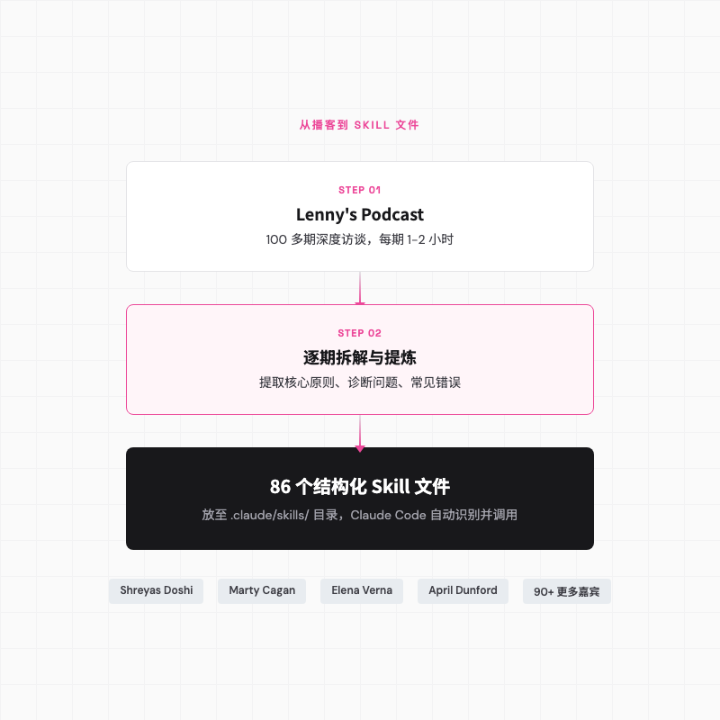
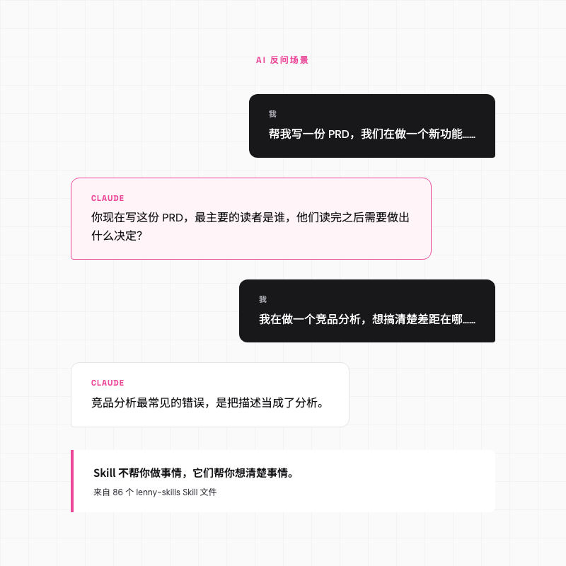
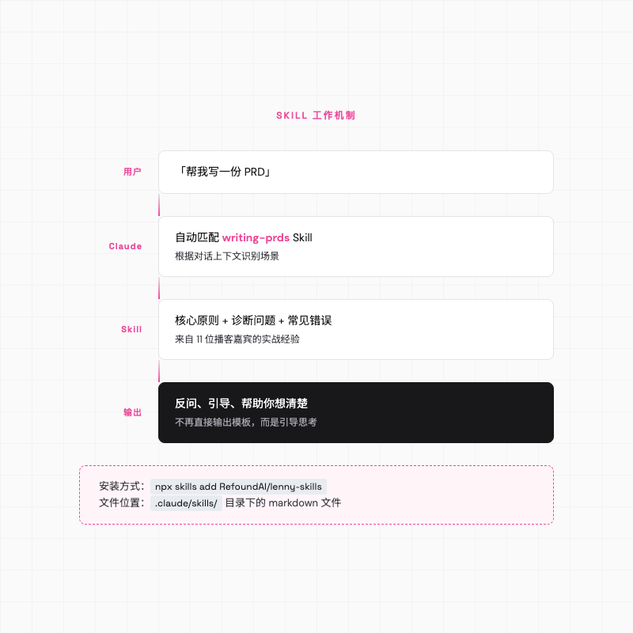
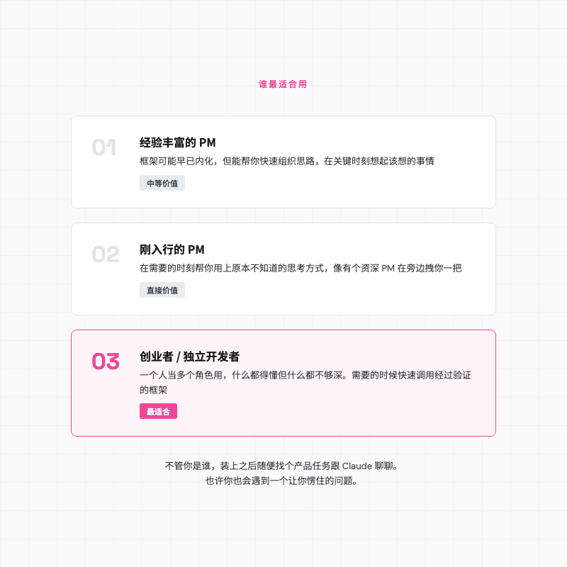
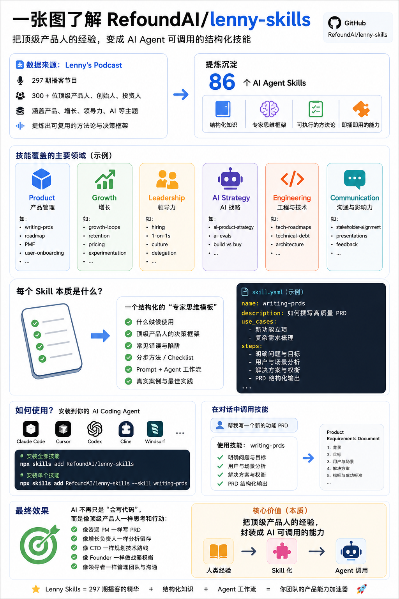

# 产品经理的开源神器 lenny-skills，86 个顶级 PM 框架装进 Claude Code

> 我让 Claude Code 帮我写一份 PRD，它没有动笔，而是反问我一个问题。那个问题让我愣了几秒钟。


---

## 一句话总结

lenny-skills 把 Lenny's Podcast 100 多期播客里世界级产品领袖的经验，蒸馏成了 86 个 Claude Code 可以直接调用的 Skill 文件。装上它，Claude 就不再只是帮你干活，它会开始帮你「想事情」。

---

## 从一个反问开始

前段时间我在做一个新功能，方向大致确定了，该写 PRD 了。以前这种时候我会打开文档，列背景、列需求、列排期，然后一边写一边觉得哪里不太对，但说不清楚。

那天我装了一个叫 lenny-skills 的东西，装完之后重新跟 Claude Code 聊这个功能。

我说，我在做什么、目标用户是谁、想解决什么问题。

Claude 没有开始写。它问了我一个问题。

> 你现在写这份 PRD，最主要的读者是谁，他们读完之后需要做出什么决定？

我愣了一下。因为说实话，我没想过这个问题。

这份 PRD 是写给工程师看的、还是给 stakeholder 看的、还是给自己理清思路用的。给工程师的要精确到边界条件和验收标准，给老板的要论证 ROI 和优先级，给自己的可能就是一堆 bullet point。写法完全不一样。

**一个 PRD 的写法，取决于它的读者需要做什么决策。**

这个观察不新鲜。但问题在于，在动手写的那一刻，我并没有主动去想这件事。Claude 通过一个提问，把这个被我跳过的前置思考给捞了回来。

这就是 lenny-skills 的价值。

---

## 这个东西从哪来

要讲清楚 lenny-skills，得先提一下它背后的播客。

我自己断断续续听了几十期 Lenny's Podcast，每一期都能捡到一两个可以马上用的框架。这个播客在英文产品圈里算是顶流了，主持人 Lenny Rachitsky 之前在 Airbnb 做产品，后来全职做播客。每一期请一位产品领域的嘉宾聊一两个小时，Shreyas Doshi、Marty Cagan、Elena Verna 这些响当当的名字都上过节目。

问题是，播客这种形式很难被「调用」。你知道某个嘉宾聊过竞品分析的方法论，但你不可能每次做竞品分析的时候去翻一两个小时的音频。



后来我才知道，有个叫 Refound AI 的团队把 100 多期播客拆解成了 86 个结构化的 Skill 文件，每个场景都带着嘉宾的原话引用。

整个项目开源在 GitHub 上，MIT 协议，任何人都可以免费用。

---

## 它到底能干什么

lenny-skills 的 86 个 Skill 覆盖了产品工作的方方面面，从写 PRD、做竞品分析到设定 OKR、做定价策略，几乎涵盖了一个产品团队会遇到的所有场景。

但它的核心价值其实是帮你「问」，不是帮你「做」。

### 写 PRD 的时候

装了 writing-prds 这个 Skill 之后，Claude 不会直接帮你填模板。它会先引导你想清楚几件事。

比如它会追问，这个问题为什么值得现在解决，还是说只是「看起来该做了」。再比如它会让你想清楚怎么定义成功，你有没有能力去衡量它。甚至它会反过来问你，有没有考虑过不做什么而不是做什么。

这些问题不是凭空编的。播客嘉宾 Maggie Crowley 在节目里说过，PRD 最重要的部分是开头那一段，背景、上下文、为什么要做、为什么是现在。Claude 拿这些来自一线 PM 的经验来引导你，而不是用通用模板来填充你。

Aparna Chennapragada 在访谈里还提过一个让我印象很深的观点，prompt sets are the new PRDs。对于 AI 产品来说，一组可执行的测试 prompt 比一页纸的需求描述更能说明问题。

### 做竞品分析的时候

再说一个我试过的场景。有一次我在研究一个竞品，想搞清楚我们跟它的差距在哪。用了 competitive-analysis 这个 Skill 之后，Claude 先问了我一个问题。

> 你现在做这个竞品分析，是要做出什么决定，还是要说服谁？

我说，是给团队做方向判断用的。

然后 Claude 说了一句话，我印象很深。

> **竞品分析最常见的错误，是把描述当成了分析。**

列出对方有什么功能，那是描述。能说清楚对方为什么这么做、这么做意味着什么、我们应该怎么回应，才算分析。

这个区分听着简单，但说实话很多人做竞品分析的时候确实是在罗列功能对比表。April Dunford 在播客里说过一个让我吃惊的数据，B2B 领域大约 40% 的交易输给了「不做决定」。也就是说你真正的竞争对手不是另一家公司，而是客户继续用 Excel 或者手动流程的现状。



### 其他场景

86 个 Skill 我当然没有全试过，但翻了一圈下来，有几个光看内容就觉得很值得提。

problem-definition 这个 Skill 帮你在动手解决问题之前先把问题定义清楚。里面引用了 Bob Moesta 的一个概念叫「挣扎时刻（struggling moment）」，需求不是产品创造的，而是用户在某个具体场景下遇到了困难才产生的。研究用户的挣扎时刻，比研究用户的需求列表更有用。

这个视角对我帮助很大，以前做需求分析的时候总是从「用户要什么」出发，现在会先问「用户在什么场景下卡住了」。

如果你在做 AI 产品，building-with-llms 这个 Skill 收录了 60 位从业者的实战经验。里面有一条我觉得特别反直觉，来自 Anthropic 的 Benjamin Mann，他说如果一个 prompt 失败了，不要急着改方案，先试着重跑一次同样的 prompt。因为大语言模型有随机性，重试的成功率比你想象的高。

还有 vibe-coding，给那些用 AI 写代码但自己不是工程师的人。Elena Verna 说她现在会在简历里写上 vibe coding 作为一项技能。Kevin Weil（OpenAI 首席产品官）的观点更有意思，他认为团队不应该在 Figma 里展示静态设计稿，而是应该花 30 分钟 vibe coding 出一个可交互的原型。

---

## 背后是怎么工作的

lenny-skills 的原理其实不复杂。它利用了 Claude Code 的 Skill 机制。

Claude Code 是 Anthropic 出的命令行 AI 编程工具。它支持一种叫 Skill 的扩展方式。你在项目的 `.claude/skills/` 目录下放一个 markdown 文件，Claude Code 就能识别到它。当你的对话内容匹配到某个 Skill 描述的场景时，Claude Code 会自动加载这个 Skill 的内容，然后用里面的框架和经验来引导你。

拿 writing-prds 举个例子。我装完之后好奇打开看了一下，发现它的结构比我想象的更有条理。开头是一个 frontmatter 声明名字和适用场景，然后是一组引导步骤，接着是来自 11 位播客嘉宾的核心洞察，尾部是诊断性问题和常见错误提醒。



整个文件结构清晰，信息密度很高。

当你对 Claude Code 说「帮我写 PRD」的时候，Claude Code 会自动匹配到这个 Skill，然后在回答中融入里面的框架、提问和注意事项。你不需要手动指定用哪个 Skill，它根据上下文自动判断。

安装也很简单。如果你有 Node.js 环境，一行命令就行。

```bash
npx skills add RefoundAI/lenny-skills
```

也可以选择只装某几个你需要的 Skill。

```bash
npx skills add RefoundAI/lenny-skills --skill writing-prds competitive-analysis
```

当然你也可以直接把整个仓库克隆到本地，然后复制到 `.claude/skills/` 目录下。整个项目是 MIT 协议，可以随意修改。

---

## 适合谁，不适合谁

说了一堆好处，也得说说它的局限。

如果你已经带了几年团队、做过完整的产品 0 到 1，这些 Skill 里的大部分框架你可能早就内化了。writing-prds 里「先想清楚读者是谁」这种建议，对你来说可能像是在提醒你吃饭要用筷子。

不过对我来说它有个意外的用处，就是快速组织思路。很多时候你不是不知道怎么做，只是在那个具体时刻没想起来。Skill 文件这个时候就像一个结构化的 checklist，帮你过一遍该想的事情。

刚入行的 PM 或者产品经验不深但经常需要做产品决策的人，lenny-skills 的价值会更直接。它不会让你跳过学习的过程，但它会在你需要的那个具体时刻，帮你用上一些你原本不知道的思考方式。就像有一个资深 PM 在旁边，不是替你做决定，而是在你快要跳过某个关键思考的时候拽你一把。

不过我觉得最适合的可能是另一群人。小团队的创业者或独立开发者，一个人既要做产品、又要写文案、又要想增长，什么都得懂一点但什么都不够深。这种情况下，能在需要的时候快速调用一个经过验证的框架，是很实际的帮助。比如你从来没做过定价策略，但明天要给产品定价，打开 pricing-strategy 这个 Skill，至少能让你避开最明显的坑。

---

## 一个更大的图景

lenny-skills 让我想起一件更大的事。

过去我们跟 AI 的互动方式基本是单向的，你给指令，它输出结果。这种模式有用，但它有一个上限，就是你的提问水平。

**如果你问了一个模糊的问题，你得到的会是一个模糊的答案。**

lenny-skills 的思路不一样。它让 AI 更会「问」问题。领域专家的经验被注入到 AI 的对话逻辑里之后，它开始追问、质疑、引导你思考，而不只是执行指令。

这种「把结构化的专业知识蒸馏成可调用的模块」的思路，理论上可以迁移到其他领域。我甚至想过，如果有人把 YC 创业课或者 Ray Dalio 的《原则》蒸馏成 Skill 文件，是不是也能有类似的效果。

当然，lenny-skills 本身还是个很早期的项目。86 个 Skill 的质量参差不齐，有些框架比较通用，有些可能不够深。它依赖 Lenny's Podcast 这一个信源，视角不可避免地偏硅谷、偏互联网。而且它目前只能在 Claude Code 里用，还不是一个通用的知识注入方案。

但我觉得它展示了一种有意思的可能性。



---

## 怎么开始

感兴趣的话直接去 GitHub 搜 RefoundAI/lenny-skills，项目主页有完整的安装指南和 86 个 Skill 的清单。



没有 Claude Code 也没关系，单纯把这些 Skill 文件当作学习材料来读也很有收获。每个文件的核心原则、诊断问题、常见错误，读一遍大概 5 分钟，里面浓缩的是好几期高质量播客的精华。

如果你有 Claude Code，装上之后随便找个你正在做的产品任务，试着跟 Claude 聊一聊。不用刻意去找匹配的 Skill，正常对话就行，Claude Code 会自动匹配。

也许你也会遇到一个让你愣住的问题。

---

欢迎关注我的公众号「Chyris Tech Note」，获取更多 AI 技术解读与实践分享。
