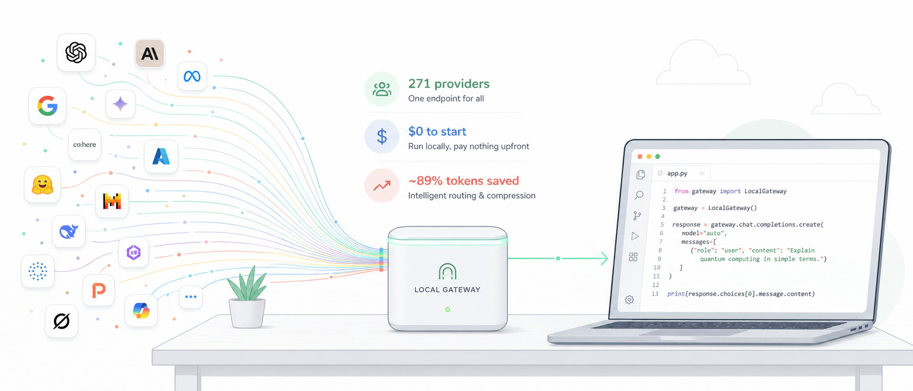
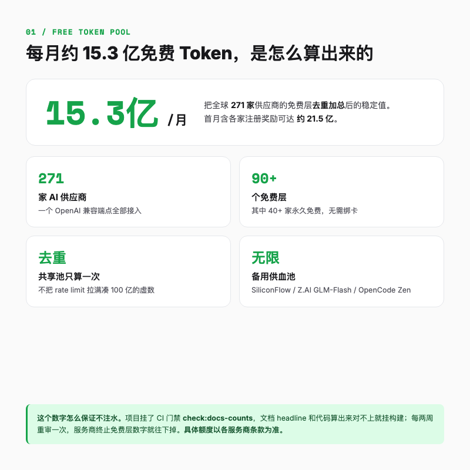
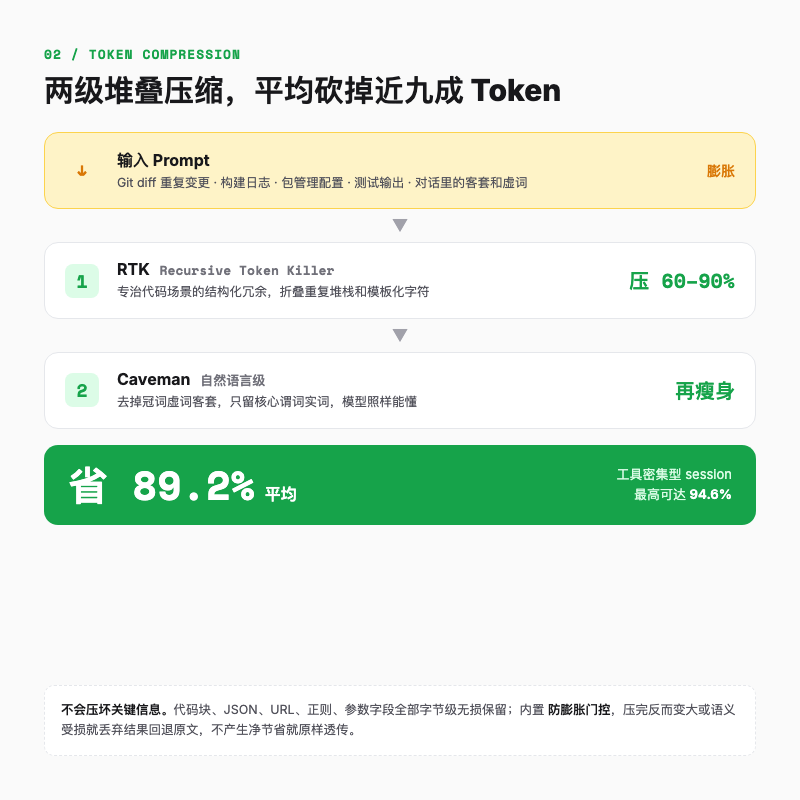
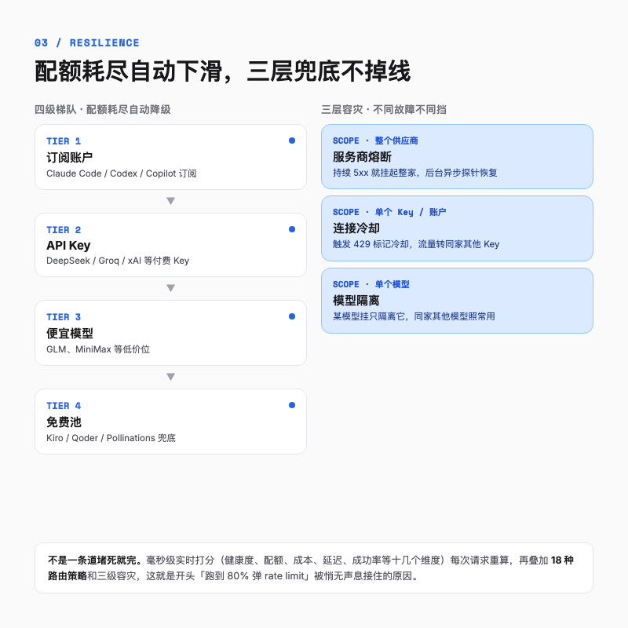
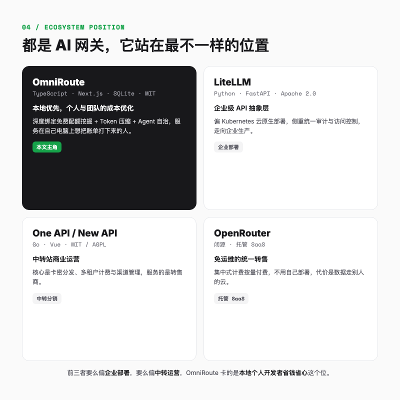

# 271 家 AI 供应商串成一个免费池，这个开源网关把账单打到了 0



## 一句话总结

OmniRoute，GitHub 上 23.6k Star 的开源本地 AI 网关，MIT 协议。它用一个端口把全球 271 家 AI 供应商接到一起，你的编程工具只连一个地址，它自动路由到最便宜、最通畅的模型，顺便把 Token 用量压掉将近九成。

---

凌晨一点，Claude Code 正在帮你重构一个三百多文件的老项目，跑到百分之八十，屏幕弹出一行红字，rate limit。你换了把 API Key，上下文丢了，它只能从头开始读代码。第二天打开用量页，这个月的账单已经滚到 200 多美元（约合人民币 1430 元）。

这差不多是 2026 年写代码的人的共同日常。是不是很熟。编程利器越用越顺手，可订阅费、按量计费、限流、Key 轮换也在轮番折磨人，手上十几个 AI 工具，每个都要单独配一套 Key 和 Base URL，谁家的额度什么时候重置全靠脑子记。

我在 GitHub 上翻到一个不到半年就攒到 23.6k Star 的项目，叫 OmniRoute。它不生产模型，它是帮你管模型的水电总闸。

---

## 它到底是什么

OmniRoute 跑在你本地，代码托管在 diegosouzapw/OmniRoute。装起来之后它会起一个 OpenAI 兼容的端点，地址是 `http://localhost:20128/v1`。

这一来，你不用再去记一堆乱七八糟的 Key 和地址。把 Cursor、Claude Code、Codex、Cline、Copilot、Antigravity 这些工具的 Base URL 统一指向上面那个本地地址，模型名填一个 `auto`，剩下的它全包。配额见底、服务商抽风、账单要爆，它都会自动滑到下一个能用的模型上。

一句话定位，它是一个免费的本地「AI 收费站」。所有车（你的编程工具）都从这一个闸口进出，它负责看你这趟活儿适合走哪条道、哪条道现在最便宜最通畅，然后把你导过去。

到这里你大概会问两个问题。第一，免费从哪来。第二，凭什么能省 Token。先把这两张最值钱的牌摊开，后面还有两张更野的，一张管不掉线，一张让网关自己动起来。

---

## 第一张牌，免费池到底有多大

先看数字。OmniRoute 接入了 271 家 AI 供应商，其中 90 多家提供免费层，40 多家是永久免费。把这些免费额度去重加总，每月稳定有约 15.3 亿（1.53B）个免费 Token，首月算上各家注册奖励能到约 21.5 亿。

这个数字容易让人觉得是吹的，所以值得一拆。

OmniRoute 没有把每个服务商的 rate limit 乘上 24 小时那种理论最大值来凑数。README 写得很清楚，这是去重后的真实数字，每个共享的底层池子只算一次（真要拉满折算能算出 100 亿，但项目方没把它放进标题）。

这个数字怎么保证不掺水。他们挂了个 CI 门禁 `check:docs-counts`，文档标题数字和代码算出来对不上就构建失败，每两周重审一次，免费层有服务商退出数字就往下掉。

底层还配了几个无 Token 上限的永久免费备用池，比如 SiliconFlow、Z.AI 的 GLM-Flash、OpenCode Zen，这是 OmniRoute 能稳定供血的底气。

但该泼的冷水也要泼。免费额度会浮动，具体能白嫖多少以各服务商当时的条款为准，像 Kiro 这类有月度封顶。OmniRoute 的价值不在于「承诺给你多少免费 Token」，而在于「一家挂了或者收紧了，它自动把你导到下一家」。把它当成一个会自动换道的聚合层就好，能不能上生产，讲代价的时候再说。



---

## 第二张牌，凭什么砍掉近九成 Token

光有免费池还不够。编程场景真正吃 Token 的，是那些又长又啰嗦的上下文。

跑一次构建失败，终端能甩出三千行日志，真正有用的就两三行；Git diff 里大半是重复的变更块。再加上对话历史里那些「请问」「非常感谢」的客套和虚词。这些东西塞进上下文窗口，Token 烧得飞快。

OmniRoute 在请求发出去之前，先过一道两级堆叠的压缩管道，叫 RTK 加 Caveman。

第一级 RTK（Recursive Token Killer）专治代码场景的结构化冗余。Git diff 里那些重复的变更块它一眼能挑出来，构建日志和测试输出也是同样的套路，剥掉的都是没信息的模板字符。这一级在工具输出密集的场景能压掉 60% 到 90%。

第二级 Caveman 干的是自然语言的活。它把对话和 Prompt 里的冠词、虚词、客套话、冗余连接词去掉，只留核心谓词和实词。听起来像原始人说话，但大模型靠的是语义而不是语法完整性来理解，这种精简文本它照样能懂，回出来的答案质量不打折。

举个小例子。一段报错日志里，同一个依赖找不到的堆栈信息重复出现七八次，RTK 会把它折叠成一次。一句「请问你能帮我看看这个报错是什么原因吗，非常感谢」，Caveman 会把它瘦身成「看这个报错原因」。意思没动，Token 少了一大截。README 里给的官方例子更直观，一段 10000 Token 的内容压到 1080 左右，省了将近 95%，模型照样正常回答。

两级叠加之后，总的 Token 留存率是两者相乘。在真实的编程 session 里，平均能省 89.2%，工具调用密集时最高能到 94.6%。



当然，压缩这种事最怕的就是压坏了关键信息。OmniRoute 在这里留了几道保险。代码块、JSON 结构、URL、正则表达式、明确定义的参数字段，全部字节级无损保留，不参与压缩。

另一道保险叫防膨胀门控（Inflation Guard）。如果算完发现压缩后的内容反而变大了，或者语义被破坏了，系统直接丢掉压缩结果，回退发原文；请求本身已经很精简、压不出油水，就原样透传。社区里有开发者反馈过「开了压缩却看不到节省记录」，根因就在这里，只有产生净节省时统计面板才会写入数据。

---

## 第三张牌，跑到一半不会断

传统网关的路由逻辑通常很简单，要么轮询，要么主备切换。OmniRoute 把这件事做厚了，一共 18 种路由策略，外加一个叫 auto 的智能评分引擎。

你只要把模型填成 `auto`，剩下的交给它。它默认是均衡策略，会粘在上一次成功的节点上（官方叫 LKGP）。想更省心可以选 `auto/smart`，它在质量优先之外还会拨 10% 的流量去探索新模型，等于让网关自己帮你发现更好的节点。另外还有 `auto/coding`、`auto/cheap`、`auto/fast`、`auto/offline` 几个按场景命名的变体，看名字就知道干嘛的。

它怎么知道哪个节点该选，靠的是一套 12 个维度的实时打分，健康度、配额余量、历史成功率这几项是你最关心的，剩下的成本、延迟、模型时效之类的它自己算，每条请求毫秒级过一遍。

不想用 auto、想自己搭链路的话，18 种策略里有几个挺有意思。最野的是 `fusion`，把同一个问题同时扇出给一组模型，再让一个裁判模型把答案合成一个，要的是质量不是省钱；`context-relay` 则在上下文超限时把摘要接力到下一个节点，长对话靠它续命。



光会选还不够，关键得会兜底。你大概率被 429 限流坑过，某个账户一触发限流，OmniRoute 就把它标记成冷却中，流量无缝转给同家的其他 Key，这是最常触发的中间一档。往上它还能管整个供应商，某家持续报 5xx 就整家挂起、后台探针试恢复；往下精确到单个模型，某个供应商的某个模型挂了，只隔离它一个，同家的其他模型照常能用。三层兜底，粒度从粗到细，总有一档能接住。

再往上还有一个四级梯队在做整体兜底，订阅账户 → API Key → 便宜模型 → 免费池。配额耗尽或者预算撞线，就自动往下一级滑。开头那个跑到 80% 弹 rate limit 的场景，到这里就被接住了。

---

## 第四张牌，网关还能被 Agent 自己指挥

这一张是它跟传统网关最不一样的地方。

传统网关是静态的，你配好规则，它老老实实转发。OmniRoute 内置了一个完整的 MCP 服务器，对外暴露 104 个工具。

这件事的真正意思是，网关不再是一根死的水管，Agent 能回头拧阀门。Claude Code 这类 Agent 在跑任务的时候，能直接问网关一句「我现在还剩多少配额」，自己决定要不要开高倍率压缩，要不要把路由切到 `auto/smart`。它还支持 A2A（Agent-to-Agent）协议和记忆库，能在多轮对话里保持上下文。

这块玩法另开一篇细讲。

---

## 它在生态里站在哪

开源 AI 网关这个赛道已经站了三个熟面孔，LiteLLM 偏企业级云原生部署，One API 和 New API 做中转分销生意，OpenRouter 是闭源的托管 SaaS。OmniRoute 没去挤它们任何一块。

它是**本地优先**，定位个人和团队的成本优化，把免费配额挖掘、Token 压缩、Agent 自治这三件事深度绑在一起，服务的是那个在自己电脑上、想把编程工具账单打下来的人。



---

## 最小 demo，三步跑起来

说了这么多，上手其实就三步。先装，需要 Node.js 22 或以上。

```bash
# 全局安装
npm install -g omniroute

# 启动，默认开在本机 20128 端口
omniroute
```

启动后打开 `http://localhost:20128` 进 dashboard，连上你想用的几家免费供应商，复制 Endpoints 页里的 API Key。然后把编程工具的 Base URL 改成 `http://localhost:20128/v1`，模型填 `auto`，完事。想验证连通性，可以 curl 一下。

```bash
curl http://localhost:20128/v1/models -H "Authorization: Bearer YOUR_KEY"
```

能看到已连接的模型列表，就说明通了。不想装 Node 也可以用 Docker，README 里有完整的 compose 配置。

顺带一提，dashboard 上你能实时看到每个模型的用量、剩余配额、这次请求到底省了多少 Token，以及 p95 延迟。省钱这件事第一次变得肉眼可见，而不是月底对着一张账单发懵，不知道钱花哪了。

说句实话，它不是那种小白一键的工具，需要你能摸命令行、有 Node 环境。但门槛也就到这里，三步的事。

---

## 适合谁，不适合谁

适合的，是 Claude Code、Cursor、Copilot 的重度用户，独立开发者和三五人的小团队，被 API 账单困扰的人，以及想白嫖的学生党。

但如果你完全不碰命令行，或者有严苛的合规要求、不能接受开源工具的波动性，这工具暂时不是给你的。

---

## 该说的代价

好处说完了，代价也得摆出来。

免费额度会浮动，服务商可能随时终止免费层。OmniRoute 的强项是「一家挂了自动换」，但别拿免费池去顶你核心业务的 SLA，生产环境里核心链路还是该用稳定的付费 API。

频繁的动态压缩会改变输入前缀，可能轻微影响上游服务商的 KV Cache（前缀缓存）命中率，对首包延迟有一点点影响。再加上实时打分和 TLS 指纹伪装（它用 wreq-js 做 JA3/JA4 指纹混淆，用来绕过针对自动化代理的防爬防火墙），本地会吃掉一点 CPU。

真正算得上独家优势的是隐私。OmniRoute 本地优先运行，Key 用 AES-256-GCM 在本地加密，零遥测，数据不离开你的机器。在「什么都想往云端送」的当下，这一点对很多人比省钱更重要。

---

## 写在最后

回到开头那个凌晨一点的场景。rate limit、账单、十几个 Key，这些烦恼的根子其实只有一个，你在一堆孤立的服务商之间手动调度，而这件事本该由一个聪明的中间层来做。

OmniRoute 没有把免费午餐变成无限自助餐，天下没有这种好事。它做的事情更实在，在 271 家店里，它总能帮你找到一张还空着的桌子，顺手把你点的菜里那些不值钱的配菜撤掉一些。对于每天和 AI 编程工具打交道的人来说，光是这两件事，就够把那个滚到 200 多美元的账单，打回一个好看得多的数字。

---

欢迎关注我的公众号「Chyris Tech Note」，获取更多 AI 技术解读与实践分享。
