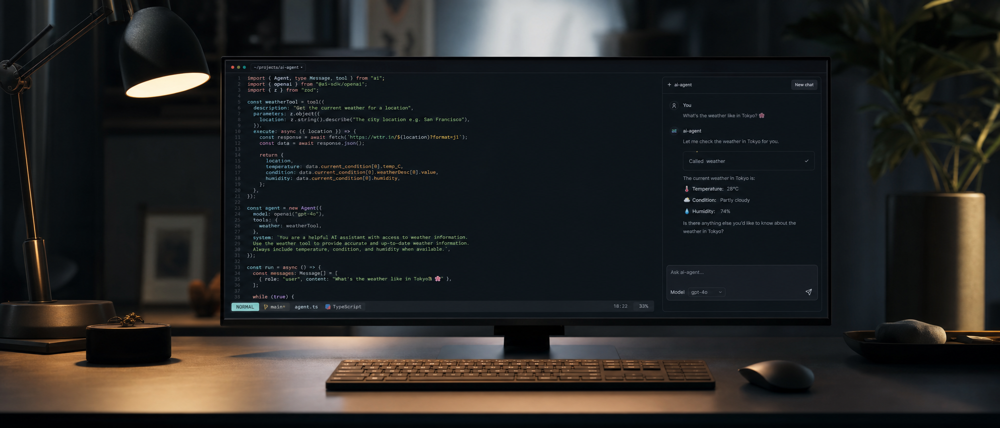
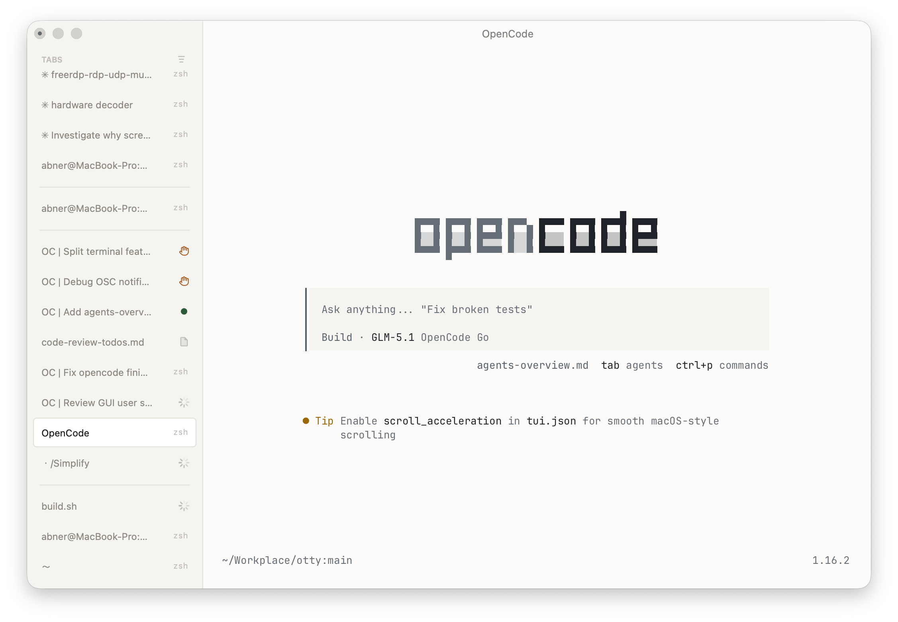
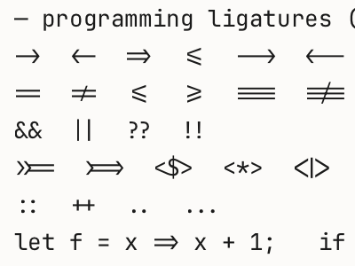
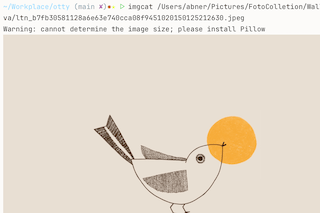
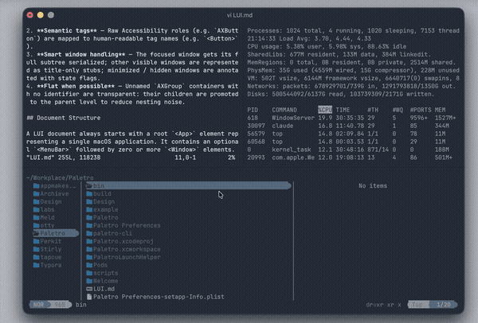
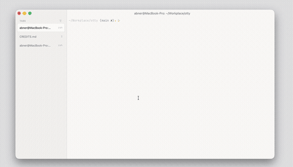
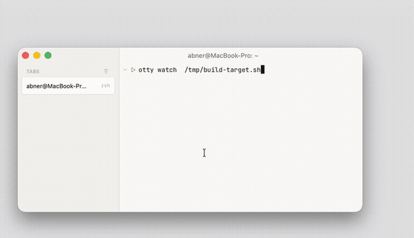
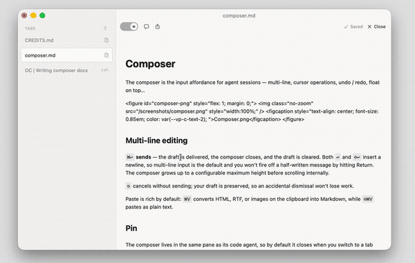
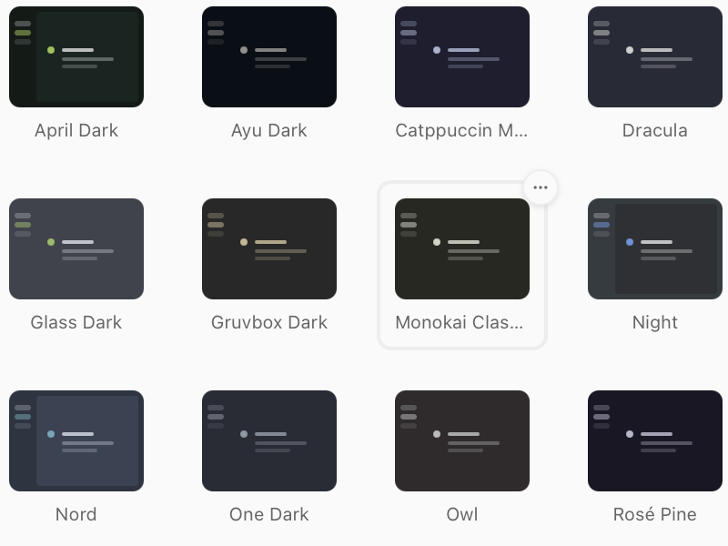
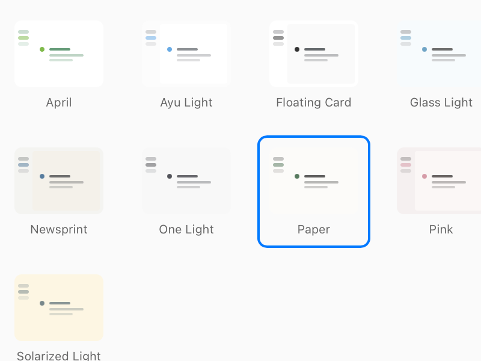

# 你的终端还在用 90 年代的交互逻辑？Otty 把 Claude Code 装进了原生终端

> 当我第 100 次把 Claude Code 的输出从终端复制到浏览器，我突然意识到，iTerm2 可能真的是上个时代的遗物了。

---

## 一、用了八年 iTerm2，为什么还是动了换终端的念头

八年前我从原生 Terminal 换到 iTerm2，是因为分屏和搜索更好用。

八年后的今天，我的日常工作流已经完全变了。大部分时间泡在终端里，剩下的时间在 Claude Code、Cursor 或 Codex 里 review 代码、看 Agent 跑 benchmark 的进度。

但我的终端，还是八年前那个终端。

它不会告诉我后台的 `npm run build` 什么时候跑完。Claude Code 改完代码后，我要手动复制 diff 到浏览器里看。跑多个 Agent 任务时，我能在屏幕上看到的只有一坨混在一起的黑底白字。

有一天我跑一个代码审查 Agent，它在终端里输出了一堆修改建议。我选中、复制、打开 Claude 网页、粘贴、再补上下文。五个动作之后，我愣住了。我盯着屏幕，感觉自己像个传话的小工。

**我在给 AI 当复制粘贴的搬运工。**

这不对。所以当我看到 Otty 的时候，第一反应是，终于有人想通了。

---

## 二、Otty 到底是什么

Otty 是一款为 2026 年重新设计的原生终端。官网在 https://otty.sh，由 appmakes.io 开发。

它的定位，说白了就是在传统终端和现代 IDE 之间找一个刚刚好的位置。保留终端的纯粹手感，加上 IDE 那部分真正有用的智能工作流，但去掉那些臃肿的按钮和面板。

它不是要取代 tmux，也不是要变成 VS Code。它想回答一个问题，当 AI Agent 成为开发工作流的一部分，终端应该长什么样？

---

## 三、传统终端、IDE 和 Otty，差别在哪

传统终端启动快、干扰低、键盘手感好，但 AI 集成基本为零，分屏要依赖 tmux。现代 IDE 功能全，但启动慢、面板多、容易让人分心。Otty 想偷个巧，快，但不笨。

| 对比项 | 传统终端 | Otty |
|------|---------|------|
| 启动速度 | 毫秒级 | 毫秒级 |
| 界面干扰 | 极低 | 低 |
| AI 集成 | 无 | 原生级 |
| 键盘手感 | 优秀 | 优秀 |
| 分屏体验 | 依赖 tmux | 拖拽即用 |

传统终端像一把瑞士军刀，纯粹、快、不会分心。问题是，AI 时代它少了几把新刀片。我想在终端里直接看 Agent 进度，想一键把报错发给 AI，它做不到。

IDE 全都能做，但它像一间装备齐全的厨房。你只是想泡碗面，却要先学会用六个灶眼和一台商用烤箱。

Otty 想保留瑞士军刀的便携，同时给你装上 AI 时代需要的那几把刀片。

---

## 四、AI 不是外挂，是原生功能

这是 Otty 最不一样的地方。

其他终端跑 AI，像是在自行车上装火箭推进器。能飞，但你总担心它什么时候散架。

Otty 的 AI 集成是从架构层设计的。它不是一个悬浮窗插件，而是把工作区、会话、Agent 任务直接打通。

我同时开了三个 Agent，一个在跑 benchmark，一个在审查代码，还有一个在生成测试用例。以前这三个任务在终端里混在一起，我只能不断上下滚动，像在玩打地鼠。Otty 的侧边栏把每个任务拆成独立卡片，进度条实时更新。哪个在跑、哪个报错、哪个已经跑完，一眼就能看见。

选中一段报错或输出，可以直接发到 AI 对话里，上下文自动带上。不是复制粘贴，是终端和 Agent 之间真的通了。

Agent 改完代码、跑完测试，所有输出都留在侧边栏里，可以回看，不用翻终端历史。

> 左侧是会话列表，中间是终端输出，右侧是 Agent 实时反馈。三栏一体，不用切窗口。

这个布局不是简单的三个窗口拼在一起。在 AI 协作里，终端、代码和 Agent 反馈本就该在同一个上下文里。

为了实现这一点，Otty 还推动了一个叫 OSC 26 的终端协议，让 Agent 可以向终端报告自己的状态和任务进度。换句话说，它不是在某个应用里偷偷实现，而是试图让终端和 Agent 之间有一个通用语言。

这件事的意义在于，未来可能不止 Claude Code 或 Codex，任何遵循这个协议的 Agent 都能和 Otty 原生协作。

---

## 五、这些早该有的现代化细节

除了 AI，Otty 把传统终端欠了 30 年的债也补上了一部分。

我等了三四年的代码符号连字，Otty 终于做了。`=>`、`!=`、`=>=` 这些符号能正确渲染成一个整体，而不是两个字符硬挤在一起。Emoji 和 Unicode 也不再是乱码或方块。我 `ls` 一张图片时，缩略图会直接出现在终端滚动历史里。URL、文件路径都能一键跳转。文本选择做到了编辑器级别，单词跳转、自然选择，不再靠鼠标一点点拖拽。长日志滚动因为有 GPU 加速，也终于不卡顿了。

连字这个iTerm2 始终没做。技术上有难度吗？我觉得没有，就是优先级不够高。Otty 做了，说明它的产品经理真的在写代码。

---

## 六、分屏，终于可以不用背快捷键了

我对 tmux 的感情很复杂。它很强大，但配置和学习成本也高。每次想调一个分屏布局，都要在脑子里过一遍快捷键。`Ctrl+b %` 是左右分屏，再加一个键是上下分屏，然后还要记怎么切换、怎么调整大小、怎么保存布局。用了三年，我依然要时不时查一下 cheat sheet。

Otty 的分屏是拖拽式的，拖动窗口边缘就能左右或上下分屏，每个标签带实时状态徽章。不用背 tmux 快捷键。

> 拖拽分屏，所见即所得。

---

## 七、几个用了就回不去的小东西

### 手滑关了窗口怎么办

手滑关了终端窗口？不慌。Otty 会记住工作目录、环境变量，甚至运行中的进程。重新打开后一键恢复。

### `npm run build` 跑完谁告诉我

`npm run build` 跑五分钟，不用再守着终端。任务完成后 Otty 主动通知你。

### 看到报错还要复制粘贴吗

看到报错信息，选中后可以直接发送到 AI 对话，上下文自动带上。

这三个功能看起来互不相关，但用久了就会发现一个共同点，它们都在帮你省一件事，复制粘贴。

---

## 八、主题与美学

Otty 内置了多套主题，深色浅色都有。配色不是随便凑的，是为长时间编码调过的色彩系统。

我以前用 iTerm2 时，主题基本靠社区插件，找到一个顺眼的要试半天。Otty 的内置主题完成度很高，开箱就能用，这点对不想折腾的人来说很友好。

---

## 九、用了一周后，我印象最深的三件事

第一，我的窗口切换次数明显变少了。以前终端、浏览器、Claude 网页三个窗口来回切，现在大部分操作能在 Otty 里完成。

第二，我不再担心手滑关终端。以前误关窗口意味着重新 `cd` 到项目目录、重新开服务、重新设置环境变量。现在重新打开 Otty，一切都还在。

第三，也是最意外的，我开始更频繁地用 Agent 了。不是因为 Agent 本身变强了，而是因为调用它的摩擦变小了。选中、发送、看结果，整个过程很顺。

---

## 十、它现在能在哪用，以及它适合谁

目前 macOS Apple Silicon 已发布，Windows、Linux、Intel Mac 和 iOS 还在等待公开发布。

官网在 https://otty.sh，文档在 https://docs.otty.sh/。

如果你符合下面任何一条，Otty 值得你花 10 分钟试试。

- 每天泡在终端里，同时用 Claude Code 或 Cursor 写代码
- 试过 tmux，但记不住快捷键，想要拖拽就能分屏
- 对字体渲染、滚动流畅度有执念，iTerm2 的卡顿让你抓狂

当然，它现在也有明显限制。如果你用 Windows 或 Linux，还得等。如果你只是偶尔打开终端跑几条命令，那 iTerm2 或系统自带终端完全够用，没必要折腾。

昨天我下意识又打开了 iTerm2，看了两秒，关掉了。不是 iTerm2 不好，是我已经知道终端可以长什么样了。

---

欢迎关注我的公众号「Chyris Tech Note」，获取更多 AI 技术解读与实践分享。
