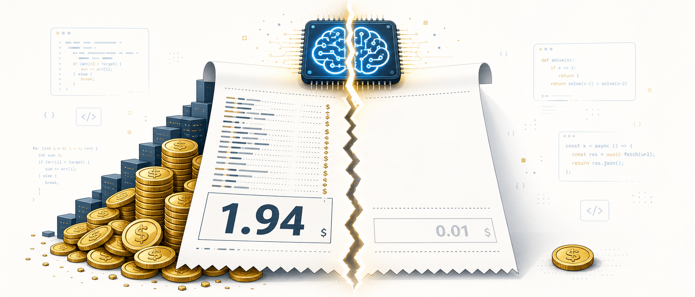
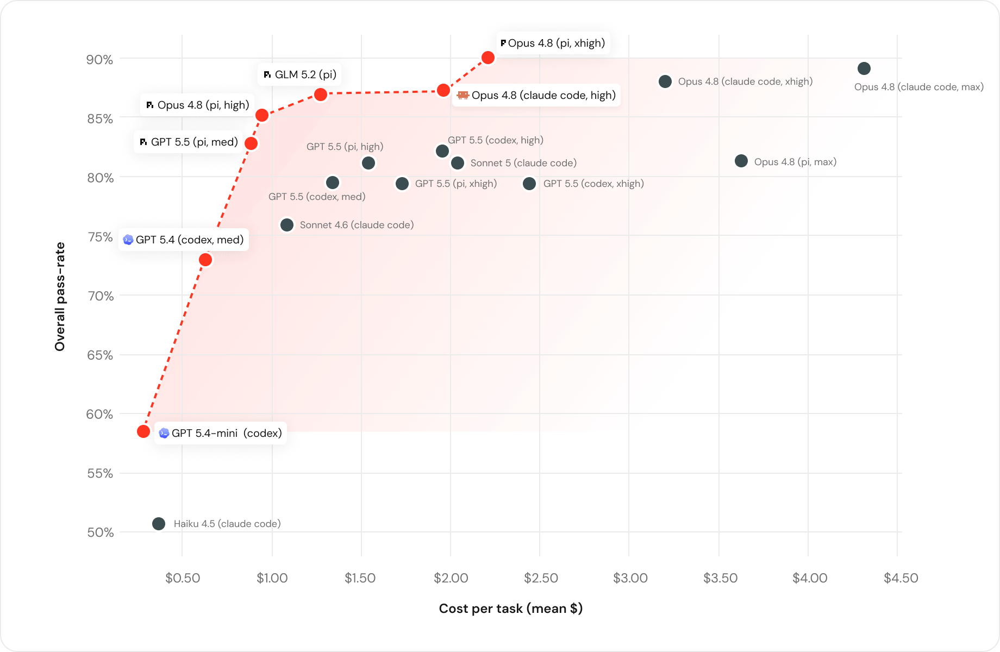
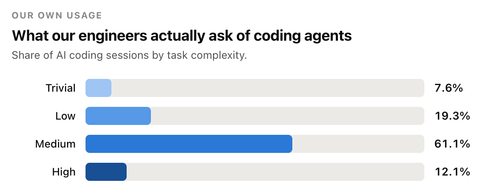
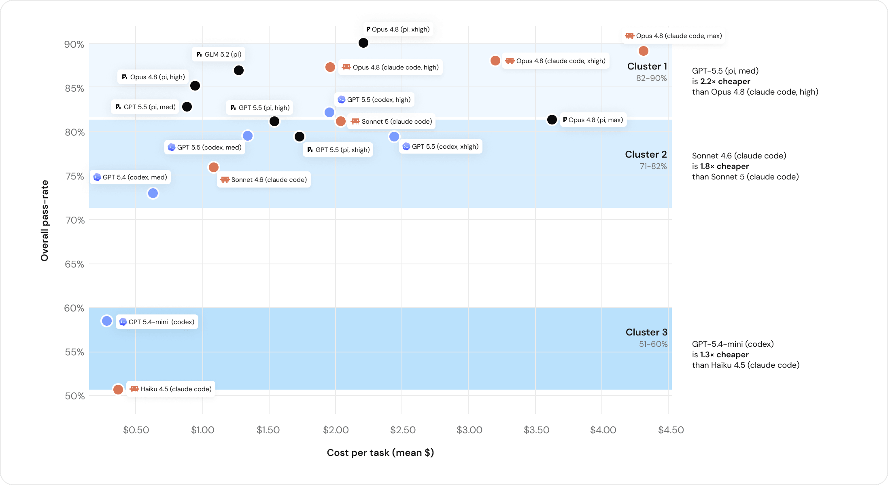
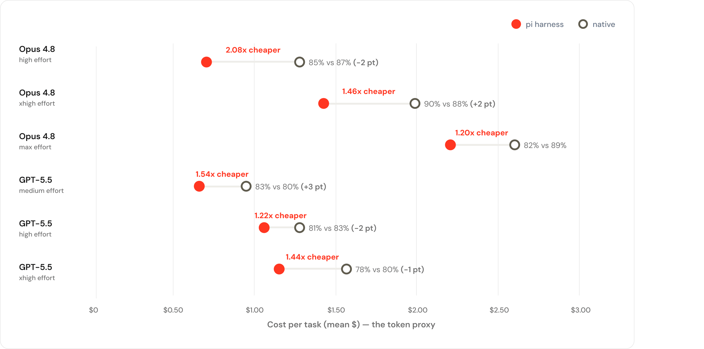
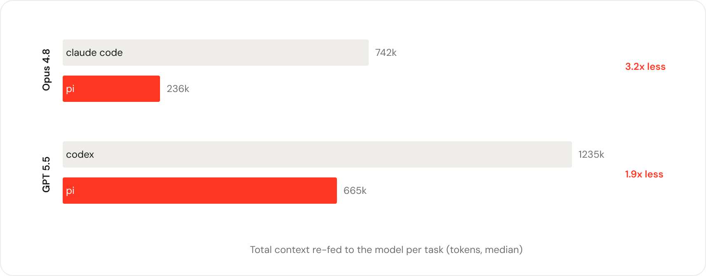
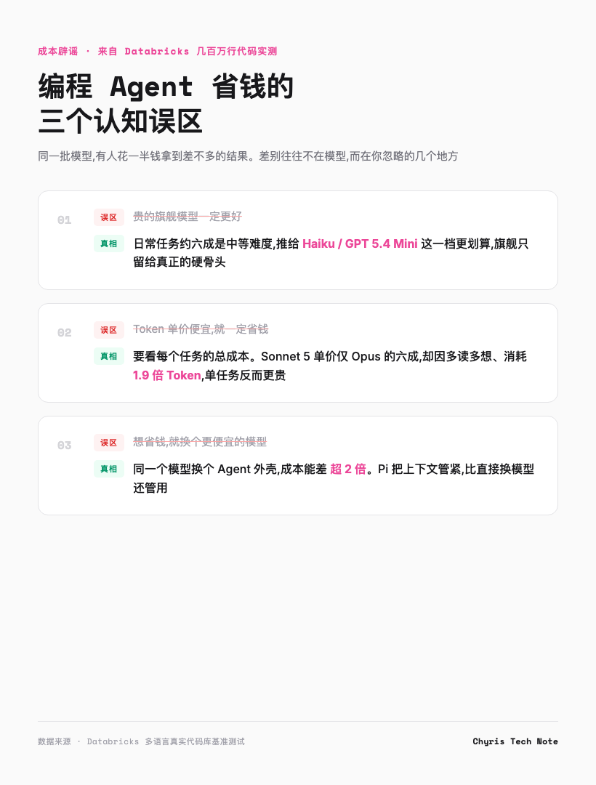

# Pi vs Claude Code，这个开源 Agent 成本只要一半



用 AI 写代码的人，大概都被这两件事烦过。

一个是限速。Cursor 写到一半弹窗告诉你额度见底，Claude Code 每个月几十刀的订阅，换来的偶尔是一句「请稍后再试」。

另一个是涨价。API 账单逐月走高，你换了个据说更强的模型，效果好像好了一点，却说不出具体好在哪，月底对账，数字倒是实打实翻了番。

这些工具背后，跑的大多是同一批模型，GPT、Claude、Gemini，还有一批迅速崛起的开源模型。所以很多人默认了一个朴素道理，贵就是好，便宜就是差。

Databricks 刚做的一件事，把这个默认认知打了个对折。

他们拿自家几百万行真实代码，把主流模型配上主流的 AI 编程工具，挨个跑了一遍。结论里最扎心的一条是，同一个模型，你换个工具外壳，账单能差一半以上，改出来的代码却分不出高下。

这意味着，你每个月多花掉的钱，有一部分压根没进模型的口袋，都被你选的那个壳子吃掉了。

---

## 别只盯着模型那个下拉框

先说结论。

**选编程 Agent，别只盯着模型那个下拉框，工具外壳同样是决定你花多少钱的命门。**

Databricks 把测试结果画成了一张散点图，横轴是每个任务的平均花费，纵轴是任务通过率。谁越靠近左上角，谁就越是那种又便宜又能干的「别人家的孩子」。



图上有一条线，是经济学里的帕累托前沿，可以理解成性价比天花板。在这条线上，每多花一分钱，都得换来实打实的分数提升，没有一个是靠烧钱硬凑上去的。

Databricks 自己的总结是，这条性价比天花板上，OpenAI、Anthropic 和开源模型三家谁也没能把对方挤下去，任何一家单独都拿不下最优解。线上反复出现的一个名字，是一个很多人没听过的开源工具，叫 Pi。

---

## 他们怎么测的，凭啥比公开榜单靠谱

先说清楚一件事，这套测试凭什么靠谱。

市面上公开的代码测试榜单，SWE-Bench、TerminalBench 这些，有一个绕不开的毛病。题目是公开的，答案会慢慢渗进模型的训练数据。这就像考前把试卷贴在了教室门口，谁刷得勤谁分高，跟真本事没多大关系。

Databricks 的做法有点反着来，他们不公开题目，因为题目就是自家工程师每天合并的真实代码改动。

具体做法是，从每天几千次代码合并里，挑出那些有人写、有人审、还自带高质量测试的提交，作为一道道考题。代码库横跨 Scala、Go、Rust、Java、Python、TypeScript 等十几种语言，外加 Bazel 构建配置和 Protobuf 协议定义，是真正的多语言怪兽级工程。



而且他们还顺手统计了一下，工程师丢给 AI 的活儿到底有多难。结果有点出乎意料，大约四分之一是翻个开关、改个配置这种低复杂度的活，六成左右是中等难度，真正硬核的任务其实没那么多。

这个发现本身就值回票价。既然大部分活儿不难，那默认全用最贵的旗舰模型，就是实打实的浪费。Databricks 后来也确实调整了策略，把更多日常任务推给了 Haiku、GPT 5.4 Mini 这一档轻量模型。

最让我觉得有意思的是他们的防作弊设计。早期测试里，有几个模型的分数高得离谱，工程师去翻了模型的操作日志，发现了一个尴尬的事实。每道题都来自一次真实的代码合并，于是那个被测的 agent，居然学会了用 shell 命令往前翻 git 历史，直接把标准答案翻了出来。

为了堵这个漏洞，他们干脆把每次测试的工作目录跟整个代码库的 git 历史彻底切断，agent 再也翻不到答案。

评分环节他们也够狠。不用 LLM 当裁判，因为 LLM 裁判会奖励那些「听起来对」的答案，而不是「真的对」的答案。他们用的标准是题目自带的测试用例能不能通过，跑通就算赢，跑不通就是输。每一道题还都经过人工逐条审过。

所以这套测试有两个公开榜单给不了的好处，模型没见过这些题，评分标准也基本不讲情面。

---

## 四个发现，个个反直觉

### 模型分三个梯队，但价差能吓人一跳

第一张图把所有模型和工具按表现聚成了三档。



最上面那一档，是各家的旗舰，GPT 5.5、Anthropic 的 Opus 4.8，还有开源的 GLM 5.2。它们什么题都能啃，但也最贵。中间和下面两档的模型，在常见任务上其实一样能打，价钱却便宜一大截。

这里有个反直觉的点。旗舰模型什么都会，但工程师日常的活，大部分用不上它的全部本事。就像开着卡车去楼下取个快递，能送到，油钱和停车费却不太值当。

### 开源 GLM 5.2，打平 Opus 还更便宜

这是我觉得国内读者最该看的一条。

在这套真实代码库上，智谱开源的 GLM 5.2 和 Anthropic 最强的 Opus 4.8，在质量上统计打平，坐在了同一梯队。但每个任务的成本，**GLM 5.2 是 1.28 美元，Opus 4.8 是 1.94 美元**。

也就是说，一个能免费拿到的开源模型，在几百万行真实代码上，跟要花钱订阅的顶级闭源模型打了个平手，成本还只要它的三分之二。

Databricks 给出的判断很直接，GLM 5.2 已经够格当主力编程模型日常用了，他们也认为到了可以把它铺开的时候。一家美国头部 AI 公司，公开承认一个中国开源模型能当主力，这个信号本身就值得琢磨。

### Token 单价便宜，不等于总账便宜

这一条，可能直接颠覆你看模型定价的习惯。

很多人比价，看的是每百万 Token 多少钱。Databricks 发现，这个数字是个坑。Token 单价便宜，不代表一个任务最后花的钱少。

他们拿 Anthropic 自家的两个模型做了对照。Sonnet 5 的 Token 单价，大约只有 Opus 4.8 的六成，看着便宜不少。但真跑起任务来，**Sonnet 5 每个任务花了 2.09 美元，反而比 Opus 的 1.94 美元还贵，分数还低了 6 个百分点**。

原因藏在一个容易被忽略的地方。Sonnet 5 干活时更啰嗦，读得多、绕的弯子多，一个任务消耗的 Token 是 Opus 的 1.9 倍。单价是便宜了，架不住用得多。

这就像超市里那袋「特价」大米，单价确实低，但你不知不觉买了三大袋，结账时反而比买一袋贵的还贵。

所以真正该算的账，是「每个任务花多少钱」，而不是「每个 Token 多少钱」。

### 同一个模型换个壳，成本差超两倍

这一条，是整次测试里最颠覆认知的发现。

Databricks 做了一组对照实验，完全相同的模型，完全相同的推理强度，分别接两种不同的工具外壳，一种是 Claude Code 或 Codex 这种厂商自家的工具，另一种是那个开源的 Pi。

结果是这样的。



同一个模型，换一个外壳，**每个任务的成本差距，在很多情况下超过了 2 倍，而任务通过率几乎纹丝不动**。

换句话说，你为同一个模型、同一个结果，可能多付了一倍的钱。多付的那部分没换来更高的正确率，速度也没见涨，基本都搭在了工具调度模型这件事上。

原因也被找到了。差距出在每个工具每轮塞给模型的上下文量。Pi 每轮喂给模型的上下文，大约只有其他工具的三分之一。它把模型的「工作台」收拾得更干净，只摆当下要用的东西，于是用更少的轮次、更少的 Token 把活干完。



Databricks 特意提醒，这个结论不是要贬低厂商自家的工具。它的真正意思是，模型只是拼图的一块，装在哪个壳子里跑，差别可能比换个模型还大。

---

## Pi 到底是什么来头

既然 Pi 反复出现在性价比天花板上，就有必要交代一下它是什么。

Pi 是一个开源的 AI 编程工具，代码托管在 GitHub 的 earendil-works/pi，MIT 协议，官网在 pi.dev。它不是哪个大厂的产品，是一个独立的开源项目。

拆开看，Pi 其实是三件套的组合。pi-ai 是一层统一的模型接口，把 OpenAI、Anthropic、Google 这些厂商的 API 收拢成一套调用方式，你换模型不用改代码。pi-agent-core 是 agent 的运行时，管工具调用和状态。最上面是 pi-coding-agent，一个交互式的命令行编程助手，你平时用的形态大概长这样。

为什么它能便宜那么多，前面已经说了，核心是它管上下文的方式更狠，每轮塞给模型的料少，任务就用更少的轮次跑完。对按 Token 计费的模型来说，少喂料，就是少花钱。

这里还有个有意思的呼应。Databricks 这次测试的核心理念，是用真实代码任务代替刷榜的 toy benchmark。而 Pi 这个项目自己也在吆喝同一件事，他们鼓励开发者公开分享自己真实的编程会话数据，理由是，玩具题训不出靠谱的 agent，得拿工程师每天真实跑出来的会话、调用，还有那些翻车的现场来喂。

两边算是想到一块儿去了，都不信那套 toy benchmark，只是较真的地方不同，Databricks 在评测，Pi 在训练。

也得说一句 Pi 的脾气。它在安全上走的是极简路线，本身不带权限系统，默认拿启动它的那个用户的所有权限跑。好处是简单利落，坏处是你得自己想办法给它圈个笼子，比如丢进 Docker 容器里隔离。对一个想省钱、愿意动手的极客来说这不算事，对要上生产环境的企业来说，就是个必须正视的问题。

想自己上手试试的话，Pi 的编程助手是个 npm 包，一行命令全局装上就能在本地终端跑起来。

```
npm i -g @earendil-works/pi-coding-agent
```

装好后填上你手头各家模型的 key，就能在 Claude、GPT、Gemini 之间来回切，具体用法以 pi.dev 的文档为准。

---

## 四条能直接抄的选型建议

先看一眼这次测试戳破的三个认知坑。



把 Databricks 这轮测试消化成对开发者有用的东西，大概有这么几条。

**别只看模型名气。** GPT 5.5、Opus 4.8、GLM 5.2 都是第一梯队，但成本和效率差出一大截。旗舰不是不能用，是该用在该用的地方。

**重新认识 Token 成本。** 算总账，别只算单价。想知道一个工具到底烧不烧钱，有个土办法，拿同一个任务，分别在不同的工具和模型上跑，记下各自消耗的 Token 和最后是否通过。跑几次，谁贵谁便宜一目了然，比看价目表准多了。

**把 Agent 外壳当成一个独立的选型维度。** 以前选编程助手，问的是「用哪个模型」，以后这个问题得拆成两半，「用哪个模型」加「用哪个外壳」。同一个模型换个壳，省一半钱不是天方夜谭。

**给开源模型一个机会。** GLM 5.2 在真实代码库上不输 Opus，成本还更低。如果你对数据隐私有要求、或者想自部署，开源这条路的性价比已经立住了。

---

## 选模型，也选外壳

回到开头那个问题。你的 Claude Code 账单为什么这么贵。

答案可能比你想的更具体。你每个月的钱，一部分花在模型上，一部分花在那个默认的工具外壳上，而后者，你也许从来没认真打量过。

Databricks 这轮测下来，有一件事挺清楚，模型已经不是唯一的变量，装它的那个壳子，有时候比模型本身还值钱。

下次再觉得账单肉疼，不妨先别急着换更便宜的模型，先想想，你那个壳子，是不是有点费 Token。

你平时用的是 Claude Code、Codex、Cursor，还是已经换上了 Pi 或别的开源工具，每个月在 AI 编程上大概花多少。评论区聊聊，看看有没有更划算的配方。

---

欢迎关注我的公众号「Chyris Tech Note」，获取更多 AI 技术解读与实践分享。
