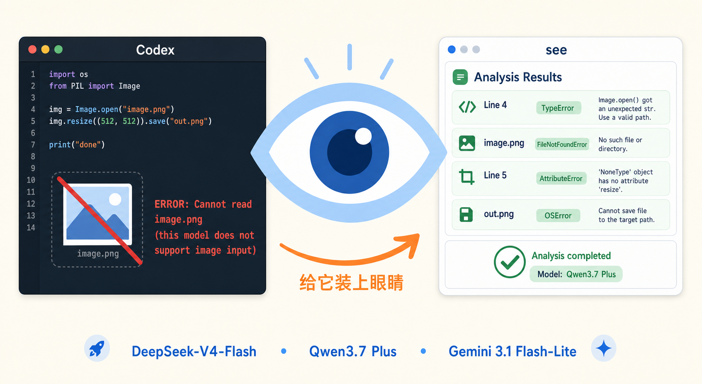
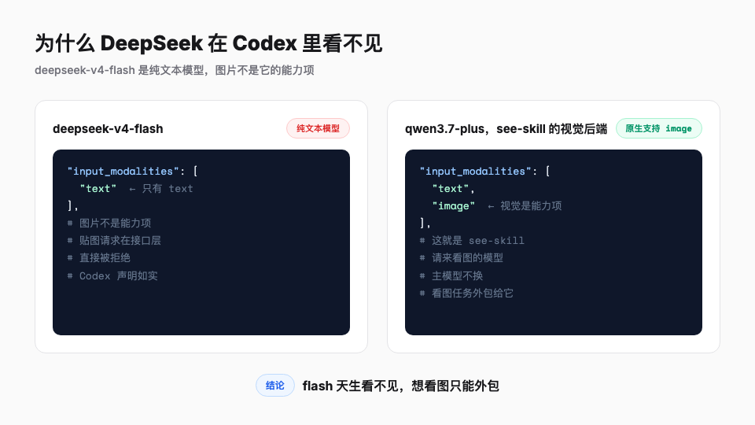
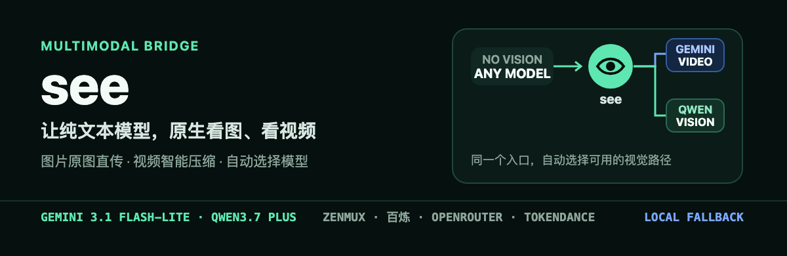
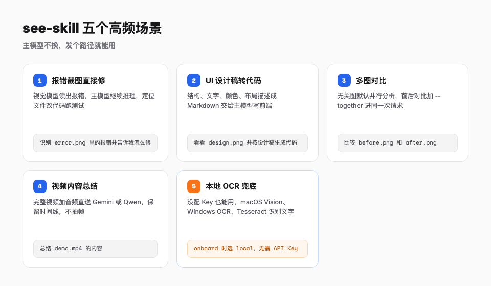
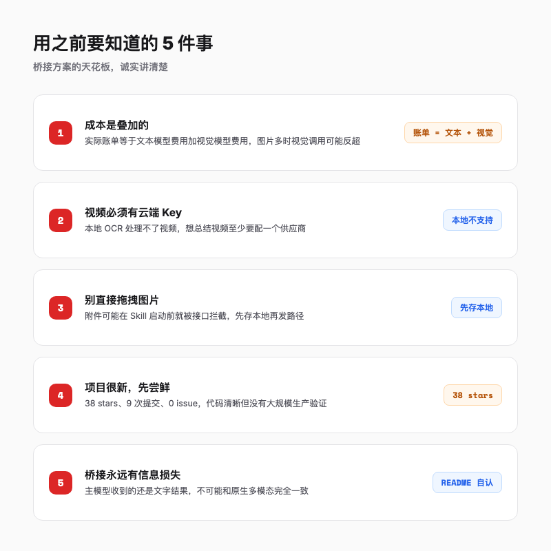

# Codex + DeepSeek 用起来很香，但它看不见图，一个 Skill 就解决了

> 把 DeepSeek-V4-Flash 塞进 Codex 之后，代码写得又快又便宜。但一遇到报错截图、UI 设计稿、视频演示，它就瞎了。今天这个项目，用一个 Skill 给纯文本模型装上了眼睛。


---

## 一句话总结

不换掉手里高性价比的文本模型，给 Codex 说一句话安装一个 Skill，它就能借视觉模型的眼睛看懂图片和视频，这是目前比较省事的接法。

---

## 一、先说说这个让人抓狂的场景

把 DeepSeek-V4-Flash 设成 Codex 的主力模型之后，前两周我是很开心的。

价格便宜到让人怀疑人生，输入 100 万 token 只要 0.14 美元，缓存命中的输入更是低到 0.0028 美元，输出 0.28 美元，比 Claude 4.6 家族便宜一个数量级。代码能力在 Terminal Bench、LiveCodeBench 这类偏工程的评测上，表现接近甚至超过一些更贵的模型。DeepSeek 官方还出了一键脚本，让 Codex CLI 可以直接切到 DeepSeek 后端。

直到我拖了一张截图进对话。

系统冷冰冰地弹出一行字，ERROR: Cannot read image.png (this model does not support image input)。我盯着屏幕愣了三秒，然后开始把截图里的堆栈错误一行行手打进去。中间还漏了半个堆栈，AI 只能凭我这份二手描述瞎猜，猜出来的修复方案自然也不对。

Reddit 和 OpenCode 社区里，报同样错误的人不少。看来被卡住的不止我一个。

---

## 二、为什么它在 Codex 里看不见图

先说结论，deepseek-v4-flash 本身就是一个纯文本模型，图片不是它的能力项。

DeepSeek 官方文档写得清楚，目前只有 deepseek-v4-flash 支持接入 Codex，v4-pro 预计 2026 年 8 月初才支持。Codex 的模型目录 models.json 会给每个模型声明支持的输入模态，V4-Flash 的声明是 text，没有 image，跟模型本身的能力一致。



这意味着你贴图的那一刻，请求在模型接口这一层就被拒绝了，AI 连看的机会都没有。**flash 天生就是纯文本模型，图片死在模型层**。协议层的声明只是如实记录，不是 Codex 故意卡你。

想等官方补能力，得看 DeepSeek 和 OpenAI 两边都动起来。不想等，就得自己想办法。

---

## 三、see-skill 的思路，把视觉外包出去

这个项目思路很聪明，也很老实。

它不让主模型自己长眼睛，而是让 Codex 在需要看图的时候，把媒体文件临时外包给一个真正的视觉模型，再把视觉模型返回的文字结果喂给主模型。

主模型还是 DeepSeek-V4-Flash，继续处理你的指令、代码、推理。但只要一发图片路径，see-skill 就会启动

1. 判断是图片还是视频；
2. 按配置顺序调用视觉后端，图片默认走 Qwen3.7 Plus，视频优先走 Gemini 3.1 Flash-Lite；
3. 如果云端供应商都失败，自动降级到本地 OCR；
4. 把视觉结果写成一份 Markdown 返回，主模型读这份 Markdown 继续工作。



项目 README 里有一句话，比任何宣传都诚实，「纯文本主模型最终仍然接收文字结果，因此不可能和同一个模型原生拥有视觉完全相同；但这是外接视觉模型时信息损失最少的方式」。

桥接方案永远不如原生多模态信息完整，但对编码、报错截图、UI 走查这些场景，通常够用。

---

## 四、安装只要一句话，我实测过了

Codex 的 Skill 就是一个带 SKILL.md 说明文件的文件夹，按需触发，只在匹配请求时才加载完整指令，把复杂流程封装成一句话调用。

see-skill 就是一个标准的 Codex Skill，所以安装非常轻量。

第一步，对 Codex 说这句话

```
安装 https://github.com/oil-oil/see-skill skill
```

第二步，安装完让它配置

```
帮我配置 see
```

Codex 会启动 onboard 脚本，让你选供应商

- ZenMux，qwen/qwen3.7-plus
- 百炼，阿里云，qwen3.7-plus
- OpenRouter，qwen/qwen3.7-plus
- TokenDance，qwen3.7-plus
- local，不需要 Key，只用本地 OCR

选完供应商，API Key 通过隐藏输入框填写，不会发在对话里，也不会写进 Skill 或项目仓库。它只保存在本地的 ~/.config/see/config.env（Windows 是 %APPDATA%\see\config.env），文件权限仅限当前用户。

我试了一下，从说第一句话到配置完成，一次成功，流程顺畅。视觉后端我配的是 Qwen3.7 Plus 那条线。装好之后我还没来得及拿真实报错图考它，但配置这一环确实没卡壳。

有个细节需要留意，安装完 Skill 后，Codex 右下角的主模型仍然显示 DeepSeek-V4-Flash，这是正常的。see 只在看图看视频时调用视觉后端，不会替换你的主模型。

---

## 五、装上之后，能做什么

装好之后到底能干什么？下面五类场景来自项目文档，我还没逐条实测，每类都标注了典型命令。

### 场景 1，报错截图直接修

前端或服务端报错，最折腾的不是修 Bug，而是描述 Bug。你要把错误信息、堆栈、复现步骤用文字写出来，中间往往漏掉关键细节。现在直接截图，发一句命令

```
识别 /path/to/error.png 里的报错，并告诉我怎么修
```

设计上，视觉模型读出报错，主模型再基于这份文字继续推理，定位文件、改代码、跑测试。

### 场景 2，UI 设计稿转代码

设计师发过来一张界面截图，你对着它写 CSS 和组件，反复猜间距、颜色、字体大小。现在可以这样做

```
看看 /path/to/design.png，按照这张设计稿生成对应的前端代码
```

see-skill 会把设计稿的结构、文字、颜色、布局描述成 Markdown，交给 DeepSeek 写代码。我还没实测这个场景，但看项目的示例输出，比我手动描述设计稿靠谱多了。

### 场景 3，多张图一起看

做 A/B 测试、前后改版、连续截图时，单张分析不够，需要看整体关系

```
并行查看 a.png b.png c.png
比较 before.png 和 after.png 的界面变化
```

多张无关图片默认并行分析，按输入顺序汇总结果。前后对比、连续截图这类需要整体理解的，加 --together 参数，所有原图进入同一次多模态请求，模型能看到完整上下文。



### 场景 4，视频也能直接总结

这是 see-skill 和大多数视频理解方案最不一样的地方。

很多桥接方案会把视频抽成几张关键帧，分别描述再拼接。这样做会丢失动作连续性、时间线和音频。see-skill 会把视频直接送进原生支持视频输入的模型。ZenMux 或 OpenRouter 上默认走 Gemini 3.1 Flash-Lite，百炼或 TokenDance 上走 Qwen3.7 Plus，视频和音频完整一起进去，**不抽帧**。

```
总结 /path/to/demo.mp4 的内容
```

演示视频、操作录屏、教程片段，都可以直接总结成文档。

### 场景 5，没有 Key 的穷玩法

如果连视觉模型的 Key 都不想配，onboard 时选 local，降级到本地 OCR

- macOS 直接调系统自带的 Vision OCR，不用装 Xcode 也不用配 Key，装了 Swift 的话还能多做场景分类、人脸、条码这些增强分析；
- Windows，系统 OCR，需要提前安装 OCR 语言包；
- Linux，Tesseract，需要自行安装 tesseract-ocr 和中文包 tesseract-ocr-chi-sim。

本地模式适合识别截图里的文字这类任务，但不能替代多模态模型的完整语义理解。复杂 UI 结构、图表、场景理解，还是需要云端 Key。

---

## 六、为什么它比同类方案更接近原生视觉

给文本模型装眼睛这件事，Codex 社区里已经有好几个项目在做，这几个我只看了 README，没有逐个跑过。codex-vision-proxy 靠拦截 Codex 内部请求、改写消息来桥接，codex-deepseek-vision 做多图并行视觉桥接，cc-vision-bridge 是 Claude Code 侧的桥接，observer 是 OpenCode 插件。

我翻了下，做这件事的人还真不少。see-skill 的差异化，我总结成四点

### 1. 视频原生理解，不抽帧

大多数方案只做图片，视频靠抽帧或 OCR 间接处理。see-skill 直接支持视频原生输入，保留音频和完整时间线，这是它最接近原生的地方。

### 2. 多供应商自动切换，本地 OCR 兜底

图片按配置顺序尝试供应商，全部失败才进入本地视觉分析。配一个 Key 能用，没配 Key 也能降级。视频则必须有至少一个云端 Key，本地 OCR 处理不了视频。

### 3. 输出透明，主模型知道有没有降级

每次运行成功，stdout 只输出一行

```
output_path=/absolute/path/result.md
```

生成的 Markdown 会记录实际后端、模型、单图并行还是联合模式，以及每次路由是否成功。主模型能据此判断结果可靠性，而不是盲目相信一份描述。

### 4. 不用改任何东西

不需要改 Codex 内部请求，不需要额外装 MCP，一个标准 Codex Skill，一句话安装，发路径就能用。

---

## 七、成本、边界和避坑

我不太喜欢只吹优点的推荐，下面几条是我用之前最想知道的。

### 1. 成本其实是叠加的

DeepSeek-V4-Flash 本身便宜，但看图时要额外调用 Qwen3.7 Plus 或 Gemini 3.1 Flash-Lite。实际账单等于文本模型费用加视觉模型费用。好消息是 Qwen3.7 Plus 和 Gemini 3.1 Flash-Lite 的视觉价格远低于 GPT-4o、Claude 4 这类原生视觉模型，中文 OCR 和文档理解能力也相当强。但具体费用要看供应商账单，别只看 DeepSeek 的低价就以为全程免费。

### 2. 视频必须有云端 Key

**本地模式不支持视频**。要总结视频，必须至少配一个供应商。

### 3. 不要直接拖拽图片

当前模型不支持图片时，直接拖拽或粘贴附件可能在 Skill 启动前就被主模型接口拦截。稳妥做法是先把图片保存到本地，再发路径。

```
使用 see 查看 /Users/me/Desktop/error.png
```

### 4. 项目很新，先尝鲜再评估

see-skill 目前 38 stars，2 forks，9 次提交，0 个 open issue。代码结构和文档都清晰，但还没有大规模生产验证。建议先在个人项目或低风险任务上试用，企业级使用需要自己评估稳定性、数据出境和供应商合规。

### 5. 桥接永远有信息损失

主模型收到的还是文字结果，不可能和原生多模态完全一致。这是 README 自己承认的天花板，也是所有桥接方案共有的边界。



---

## 八、适合你吗

| 人群 | 建议 |
| --- | --- |
| 已在用 Codex + DeepSeek-V4-Flash | 必试，这是目前最轻量的视觉补齐方案之一 |
| 用 Claude Code / Cursor | 有同类方案，但如果你是 Codex 用户，这个更对口 |
| 预算敏感的个人开发者 | 可以免费本地 OCR 起步，复杂任务仍需云端 Key |
| 企业用户 | 先评估数据出境、供应商合规和项目稳定性 |
| 完全不看图看视频 | 不需要装 |

---

## 总结

Codex + DeepSeek-V4-Flash 的组合已经很强，便宜、快、代码能力好。但视觉短板是真实存在的，而这是模型本身的能力边界，等官方补上得看两边节奏。

see-skill 没有试图把 Flash 改造成多模态模型，而是做了一个很务实的桥接，主模型继续思考，视觉任务外包给会看图的模型。一句话装好、发路径就能用，这个体验本身就值回票价。

它的边界我也讲过了，桥接有信息损失，视频要配 Key，项目也还很小。但对每天被报错截图卡住的人来说，在 DeepSeek 官方补上视觉之前，**这可能是最实用的过渡办法**。

如果你也被这个不支持图片输入的提示卡住，可以先装上尝个鲜。至少，不用再手打截图里的报错了。

> GitHub 地址 https://github.com/oil-oil/see-skill

欢迎关注我的公众号「Chyris Tech Note」，获取更多 AI 技术解读与实践分享。
