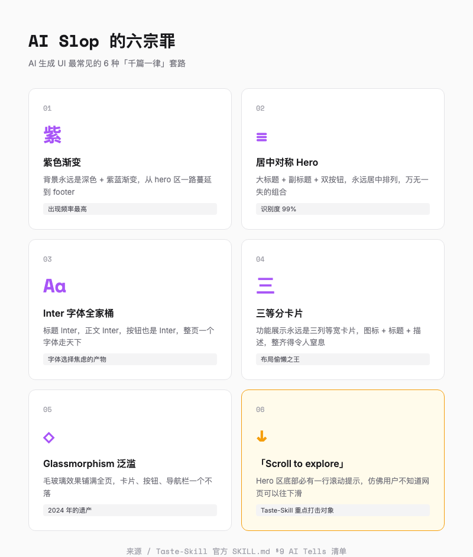
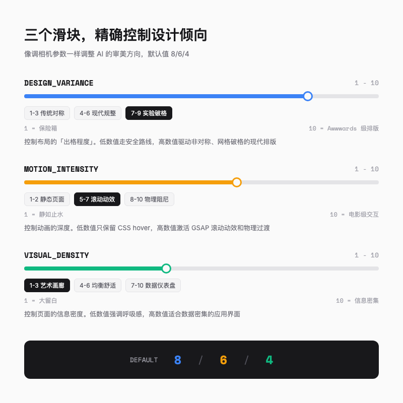
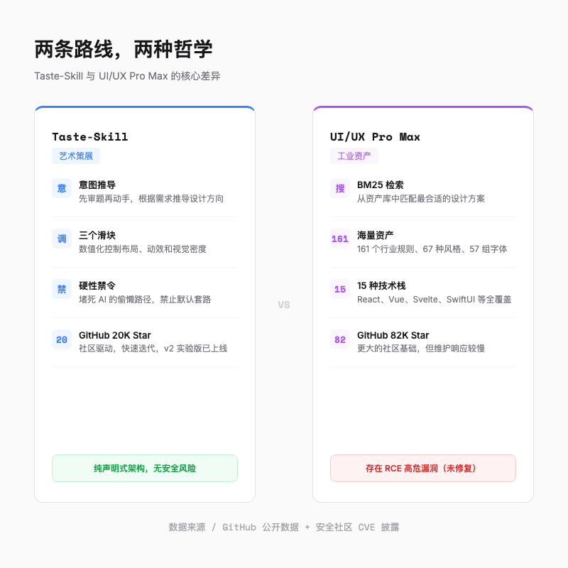

# AI 做的网页千篇一律？Taste-Skill 说我给 AI 装了个设计总监

> 用 Cursor 做个落地页，出来的永远是居中 Hero + 紫色渐变 + Inter 字体。换个需求再来一次，还是那味儿。问题出在哪？


---

如果你用过 Cursor、Claude Code 或者任何 AI 编码工具做过前端页面，大概率遇到过这个场面，你说「帮我做一个 SaaS 落地页」，AI 秒出一版代码，跑起来一看，居中的大标题，下面一行副标题，再下面一个紫色渐变按钮，背景是深色的 mesh 渐变，字体永远是 Inter。

你换个 prompt，「帮我做一个个人作品集」，出来的还是差不多的结构，只不过颜色从紫色换成了蓝紫色。

这不是巧合。AI 生成的 UI 有一个非常明确的「默认审美」，它像一条看不见的流水线，把所有需求都塑造成同一个模样。社区给这种现象起了个名字，叫 **AI Slop**，AI 的审美流水线产物。

---

## AI 的审美均值问题

你有没有想过为什么所有 AI 生成的页面都长一个样？AI 学的是「大多数人怎么做」，而不是「做得最好的怎么做」。而大多数人的品味，就是没品味。

具体来说，AI 默认的 UI 长这样：

- 居中对称的 Hero 区域，大标题 + 副标题 + 两个 CTA 按钮
- 深色背景 + 紫色/蓝色渐变
- Inter 字体，搭配 slate-900 灰色文字
- 三个等宽的功能卡片，图标 + 标题 + 描述
- 无处不在的 glassmorphism 毛玻璃效果
- Hero 区底部一行滚动提示「Scroll to explore ↓」



这套组合拳在 A/B 测试中可能是安全的，但绝对称不上有「品味」。更麻烦的是，无论你用 Cursor、Claude Code 还是 Windsurf，结果都差不多，因为底层的大模型在做同样的事情，选择同样的「安全解」。

AI 的审美困境不是能力问题，而是它缺少一个「品味指南」。

---

## Taste-Skill，给 AI 装上一个设计师的大脑

所以有人做了个东西来治这个病。Taste-Skill，GitHub 上 20K Star，基于 Agent Skills 开放标准（`SKILL.md` 规范）的便携式设计技能包，干的事情就是把 AI 从「自动拼装工」升级成「有审美的设计师」。

### 意图推导，先审题再动手

Taste-Skill v2 最让我觉得有意思的设计是「意图推导」引擎。AI 在写任何一行代码之前，必须先做一件事，根据你的需求推导出一个「设计解读」。

举个例子，你说「帮我做一个设计师作品集」。Taste-Skill 会让 AI 先读几个信号，页面类型是个人作品集、目标受众是招聘官和潜在客户、你提到了「Linear-style」或者「极简」这样的美学关键词。然后 AI 必须输出一行「Design Read」，比如「这是一个面向招聘官的设计师作品集，风格走编辑式动效排版，使用原生 CSS + 滚动驱动动画 + 自定义字体」。

说白了就是强制 AI 在动手之前先「想清楚」。就像一个认真的设计师接到需求后不会马上打开 Figma，而是先搞清楚客户到底要什么。如果信号不够清晰，AI 会问一个问题，比如「你想要更接近 Linear 的干净风格，还是更接近 Awwwards 的实验风格？」。注意，只问一个，不是像 ChatGPT 那样连抛五个问题。

### 三个滑块，精确控制设计倾向

审完题之后，Taste-Skill 会设定三个数值滑块，每个范围 1-10：

- **DESIGN_VARIANCE（布局实验度）**，低数值走传统对称网格，高数值驱动非对称、破格的现代排版
- **MOTION_INTENSITY（动效烈度）**，低数值只有基本 hover 效果，高数值激活 GSAP 滚动动效和物理阻尼过渡
- **VISUAL_DENSITY（视觉密度）**，低数值是大留白的品牌展示风格，高数值适合数据密集的仪表盘



这三个滑块就像摄影师拍照片时的三个参数，光圈控制景深，快门控制运动模糊，ISO 控制画面质感。Taste-Skill 让你像调相机参数一样调整 AI 的设计倾向，而不是每次都在全自动模式下拍摄。

全局默认值是 `8 / 6 / 4`，偏向现代、有适度动效、留白舒适的风格。如果你做的是 SaaS 营销页，项目文档里还提供了一个 7/6/4 的 SaaS 预设。创意工作室的作品集可以把 VARIANCE 拉到 9、MOTION 拉到 8。政府公共服务网站降到 3/2/5，走稳妥路线。

### 硬性禁令

除了引导 AI 做对的事，Taste-Skill 还有一套严苛的禁令来阻止 AI 做错的事。比如禁止用 Emoji 代替矢量图标、禁止 Hero 区底部出现「Scroll to explore」、禁止用 styled div 模拟假的产品截图。还有一条我很喜欢的规则，**「声称有动效就必须有动效」**，如果你把 MOTION_INTENSITY 设到 4 以上，页面上就必须真的有动画效果，光说不练不行，要么降回到 3 老老实实做静态页面。

---

## 不止一个技能，而是一整个生态

Taste-Skill 背后有一整个技能生态，按需选用就行。除了默认的 `design-taste-frontend`，还有几个值得单独提的：

- **minimalist-ui**，Notion/Linear 风格的社论式极简，暖色调、冷淡风 Bento 网格
- **industrial-brutalist-ui**，瑞士铅字排版 + 复古终端美学，适合想要「硬核感」的项目
- **full-output-enforcement**，专门治 AI 偷懒截断输出的毛病
- **brandkit**，生成品牌视觉看板（Logo 方向、色板、字体方案），不写代码，纯出参考图

装起来很简单，跑一行命令就行：

```bash
npx skills add Leonxlnx/taste-skill
```

如果只需要某一个子技能，加上 `--skill` 参数就行：

```bash
npx skills add Leonxlnx/taste-skill --skill "minimalist-ui"
```

安装之后不需要额外的操作，AI 编码助手会自动读取 `SKILL.md` 中的指令。打开 `SKILL.md` 文件，找到头部的三个滑块参数，根据项目类型调整数值：

- SaaS 营销页，7/6/4（均衡现代风）
- 创意工作室作品集，9/8/3（大胆布局，强动效）
- B2B 企业官网，5/3/5（保守布局，信息密度适中）
- 公共服务网站，3/2/5（极简布局，几乎无动效）

然后像平时一样描述需求就行。

---

## 和 UI/UX Pro Max 有什么不同？

市面上还有另一个流行的设计技能框架 UI/UX Pro Max（GitHub 82K Star）。两者的设计哲学完全不同。

**Taste-Skill 走「艺术策展」路线**，通过意图推导和审美矫正，引导 AI 做出有个性的设计。**UI/UX Pro Max 走「工业资产」路线**，它有一个庞大的数据库（161 个行业规则、67 种风格、161 套色板、57 组字体方案），通过 BM25 检索算法匹配最合适的设计资产。简单说，一个是帮你找到独特的设计方向，一个是帮你从海量素材库里检索最佳匹配。



Taste-Skill 在创意性、个性化和动效深度上更强，适合做有视觉冲击力的 C 端页面。UI/UX Pro Max 在工业覆盖面上更广，支持 15 种前端技术栈和跨平台移动端映射，适合大型 B 端项目。

顺便说一句，UI/UX Pro Max 跑本地 Python 脚本，之前爆过安全漏洞还没修（远程代码执行和 XSS），在意安全的团队注意一下。Taste-Skill 用的纯声明式架构，不跑本地脚本，没有这个问题。

---

试了一周 Taste-Skill 之后，最让我意外的是它对「默认」的厌恶程度。它不是在 AI 的输出上加一层滤镜，而是在 AI 动手之前就改了它的思考方式。打开 `SKILL.md` 看一眼那个 §9「AI Tells」清单，你会知道 AI 平时在用多少套路糊弄你。

给 AI 一份好的品味指南，它就能做得比你想象的好。

欢迎关注我的公众号「Chyris Tech Note」，获取更多 AI 技术解读与实践分享。
