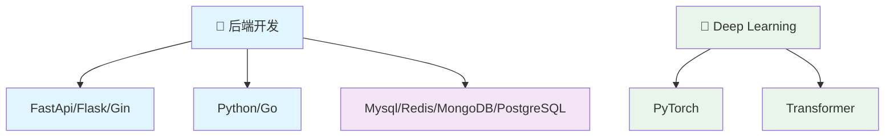
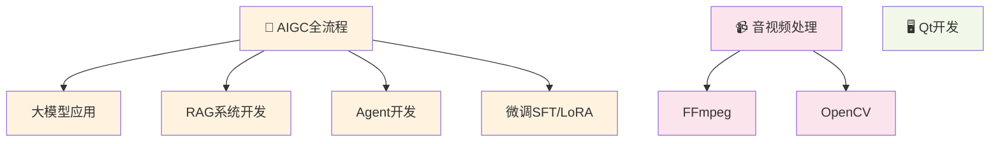

# 欢迎来到我的个人博客 👋

你好！我是 **LiuCH4NG**，一名热爱技术的软件工程师。这个博客记录了我的技术探索、学习心得和生活感悟。

---

## 🚀 关于我

!!! info "🌱 当前专注"
    目前正在深入学习 **心理健康及精神疾病相关知识** 和 **LLM**

!!! tip "💻 专业领域"  
    专注于 **智能医疗**、**后端开发**、**系统架构** 和 **性能优化**

!!! note "🎯 技术栈"
    LangGraph、Transformer、Python、Qt、Go

---

## 📝 最新文章

### 🛠️ 效率工具

!!! example "AI 赋能的现代开发工具链"
    [:material-robot-excited: **查看详情**](tech/AI_tools.md){ .md-button .md-button--primary }
    
    介绍如何利用AI工具和工具链，实现现代开发工具链

!!! example "优秀API设计准则"
    [:material-api: **查看详情**](tech/优秀API设计.md){ .md-button .md-button--primary }
    
    学习如何设计健壮、易用且面向未来的API

!!! example "UV教程：Python包管理的新选择"
    [:material-package-variant: **查看详情**](tech/uv_tutorial.md){ .md-button .md-button--primary }
    
    探索UV工具如何重新定义Python包管理体验

### 🤖 LLM 相关

!!! example "新一代代码大模型 Qwen3-Coder"
    [:material-code-braces: **查看详情**](llm/qwen3_coder_tutorial.md){ .md-button .md-button--primary }
    
    学习如何使用和集成强大的 Qwen3-Coder 代码智能体

!!! example "ComfyUI 使用 GGUF量化模型教程"
    [:material-image-auto-adjust: **查看详情**](llm/ComfyUI使用GGUF量化模型教程.md){ .md-button .md-button--primary }
    
    详细介绍如何在ComfyUI中使用GGUF量化模型进行AI绘画

---

## 🎯 技术领域

### 后端开发栈

### AIGC 全流程

---

!!! quote ""
    ❤️ **热爱技术，分享知识，持续学习，拥抱变化**

