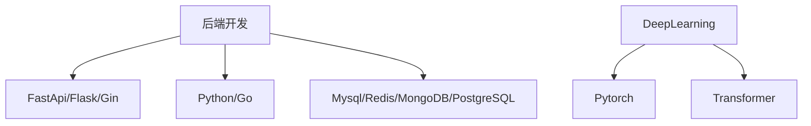
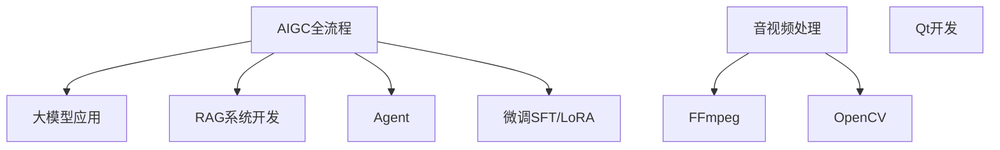

# 欢迎来到我的个人博客 👋

你好！我是LiuCH4NG，一名热爱技术的软件工程师。这个博客记录了我的技术探索、学习心得和生活感悟。

## 🚀 关于我

- 🌱 目前正在深入学习 **心理健康及精神疾病相关知识** 和 **LLM**
- 💻 专注于 **智能医疗**、**后端开发**、**系统架构** 和 **性能优化**
- 🎯 技术栈：LangGraph、Transformer、Python、Qt、Go

## 📝 最新文章

### 📚 技术教程
- [**AI 赋能的现代开发工具链**](tech/AI_tools.md) - 介绍如何利用AI工具和工具链，实现现代开发工具链
- [**UV教程：Python包管理的新选择**](tech/uv_tutorial.md) - 探索UV工具如何重新定义Python包管理体验

## 🎯 技术领域

<!-- ## 🏆 开源项目

| 项目名称 | 描述 | 状态 |
|---------|------|------|
| [项目1]() | 简短的项目描述 | 🚧 开发中 |
| [项目2]() | 简短的项目描述 | ✅ 稳定 | -->

## 🤝 联系方式

- 🐙 GitHub: [github.com/LiuCH4NG](https://github.com/LiuCH4NG)

---

> ❤️ **热爱技术，分享知识，持续学习，拥抱变化**