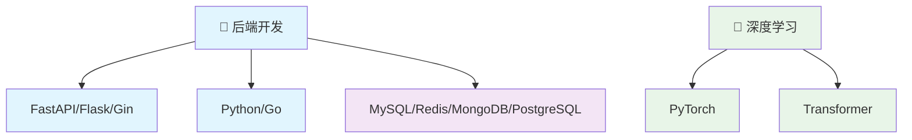
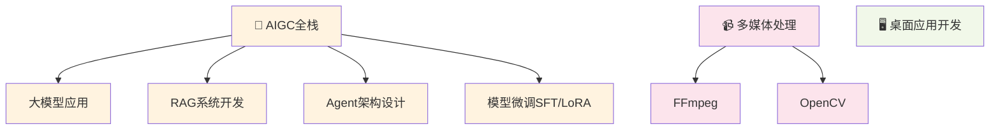

# 欢迎来到我的技术博客 👋

你好！我是 **LiuCH4NG**，一名专注于技术创新的软件工程师。

这里汇聚了我在技术探索路上的思考与实践，记录着从理论到应用的完整历程。

---

## 🚀 关于我

!!! info "🌱 当前专注"
    深入研究 **心理健康与精神疾病相关技术应用** 及 **大语言模型工程化**

!!! tip "💻 核心领域"  
    致力于 **智能医疗**、**后端架构**、**系统设计** 与 **性能工程**

!!! note "🎯 技术栈"
    LangGraph、Transformer、Python、Qt、Go

---

## 📝 技术文章

### 🛠️ 开发效率

!!! example "AI 赋能的现代开发工具链"
    [:material-robot-excited: **阅读全文**](tech/AI_tools.md){ .md-button .md-button--primary }
    
    深入探讨如何构建AI驱动的现代化开发工作流，提升团队协作效率

!!! example "优秀API设计准则"
    [:material-api: **阅读全文**](tech/优秀API设计.md){ .md-button .md-button--primary }
    
    系统性阐述API设计的最佳实践，构建健壮且面向未来的接口

!!! example "UV：Python包管理的革新"
    [:material-package-variant: **阅读全文**](tech/uv_tutorial.md){ .md-button .md-button--primary }
    
    全面解析UV工具的核心特性，重新定义Python依赖管理体验

### 🤖 人工智能

!!! example "Qwen3-Coder：新一代代码智能体"
    [:material-code-braces: **阅读全文**](llm/qwen3_coder_tutorial.md){ .md-button .md-button--primary }
    
    详解Qwen3-Coder的集成应用，打造高效的代码生成与优化方案

!!! example "ComfyUI量化模型实战指南"
    [:material-image-auto-adjust: **阅读全文**](llm/ComfyUI使用GGUF量化模型教程.md){ .md-button .md-button--primary }
    
    从理论到实践，掌握GGUF量化模型在AI绘画中的应用技巧

---

## 🎯 技术领域

### 后端技术栈

### AIGC全栈解决方案

---

!!! quote ""
     **热爱技术，分享知识，持续学习，拥抱变化**

