# 欢迎来到我的技术博客 👋

你好！我是 **LiuCH4NG**，一名专注于技术创新的软件工程师。

这里汇聚了我在技术探索路上的思考与实践，记录着从理论到应用的完整历程。

---

## 🚀 关于我

!!! info "🌱 当前专注"
    深入研究 **心理健康与精神疾病相关技术应用** 及 **大语言模型工程化**

!!! tip "💻 核心领域"  
    致力于 **智能医疗**、**后端架构**、**系统设计** 与 **性能工程**

!!! note "🎯 技术栈"
    LangGraph、Transformer、Python、Qt、Go

---

## 📝 技术文章

### 🛠️ 开发效率

!!! example "AI 赋能的现代开发工具链"
    [:material-robot-excited: **阅读全文**](tech/AI_tools.md){ .md-button .md-button--primary }
    
    深入探讨如何构建AI驱动的现代化开发工作流，提升团队协作效率

!!! example "优秀API设计准则"
    [:material-api: **阅读全文**](tech/优秀API设计.md){ .md-button .md-button--primary }
    
    系统性阐述API设计的最佳实践，构建健壮且面向未来的接口

!!! example "UV：Python包管理的革新"
    [:material-package-variant: **阅读全文**](tech/uv_tutorial.md){ .md-button .md-button--primary }
    
    全面解析UV工具的核心特性，重新定义Python依赖管理体验

### 🤖 人工智能

!!! example "Qwen3-Coder：新一代代码智能体"
    [:material-code-braces: **阅读全文**](llm/qwen3_coder_tutorial.md){ .md-button .md-button--primary }
    
    详解Qwen3-Coder的集成应用，打造高效的代码生成与优化方案

!!! example "ComfyUI量化模型实战指南"
    [:material-image-auto-adjust: **阅读全文**](llm/ComfyUI使用GGUF量化模型教程.md){ .md-button .md-button--primary }
    
    从理论到实践，掌握GGUF量化模型在AI绘画中的应用技巧

### :material-github: 开源项目

---

## 🎯 技术领域

### 后端技术栈

```mermaid
graph TD
    A[🔧 后端开发] --> B[FastAPI/Flask/Gin]
    A --> C[Python/Go]
    A --> D[MySQL/Redis/MongoDB/PostgreSQL]
    G[🧠 深度学习] --> H[PyTorch]
    G --> I[Transformer]
    
    classDef backend fill:#e1f5fe
    classDef db fill:#f3e5f5
    classDef dl fill:#e8f5e8
    
    class A,B,C backend
    class D db
    class G,H,I dl
```

### AIGC全栈解决方案

```mermaid
graph TD
    K[🎨 AIGC全栈] --> L[大模型应用]
    K --> M[RAG系统开发]
    K --> N[Agent架构设计]
    K --> TA[模型微调SFT/LoRA]
    O[📹 多媒体处理] --> P[FFmpeg]
    O --> Q[OpenCV]
    R[🖥️ 桌面应用开发]
    
    classDef aigc fill:#fff3e0
    classDef media fill:#fce4ec
    classDef desktop fill:#f1f8e9
    
    class K,L,M,N,TA aigc
    class O,P,Q media
    class R desktop
```

---

!!! quote ""
     **热爱技术，分享知识，持续学习，拥抱变化**

