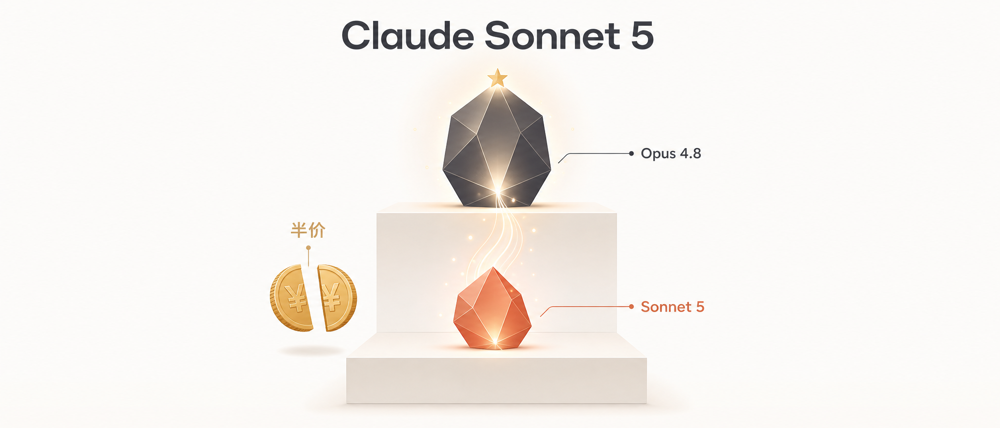
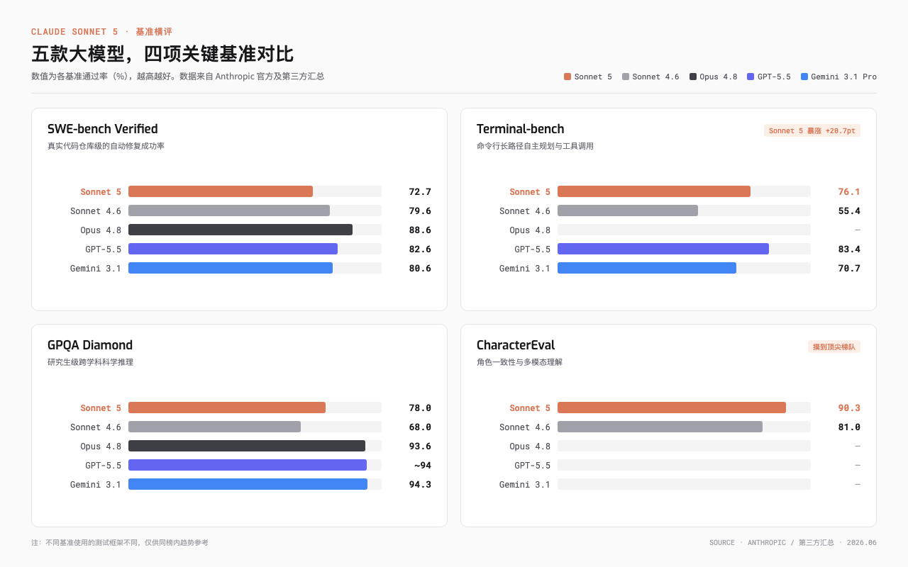
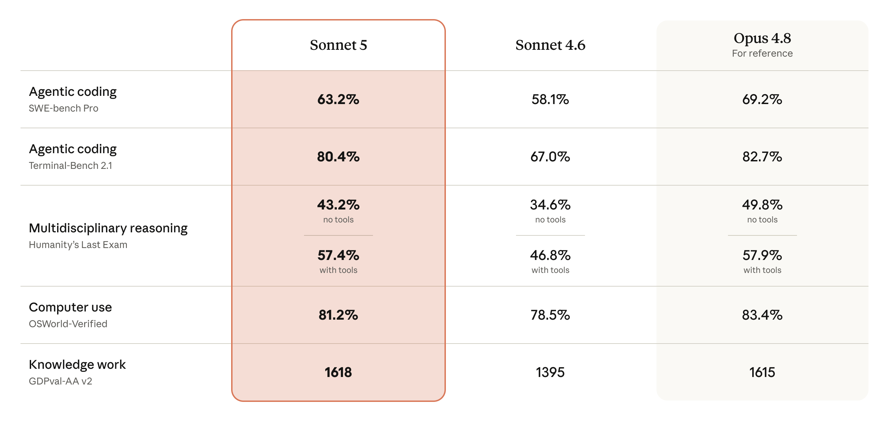
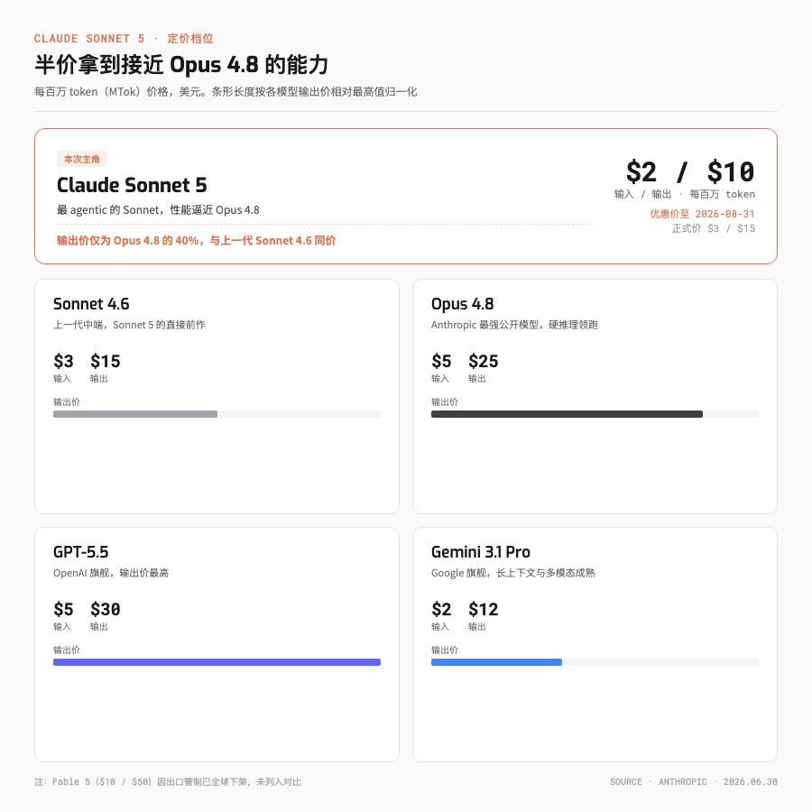
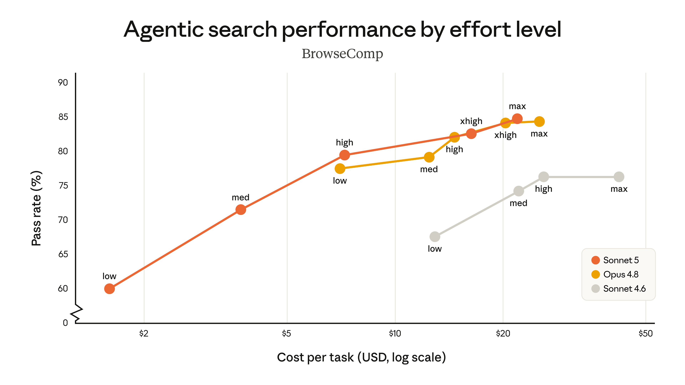
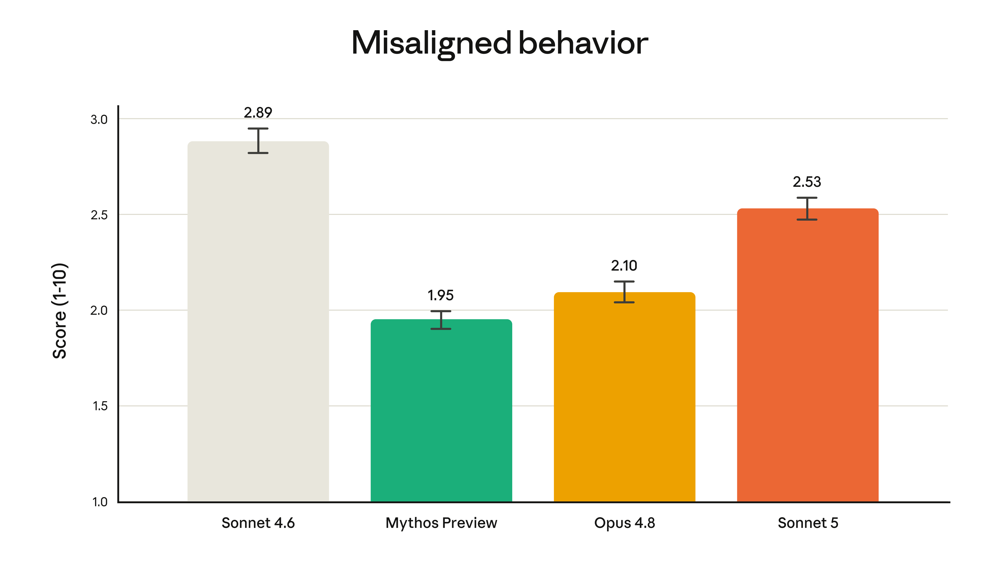
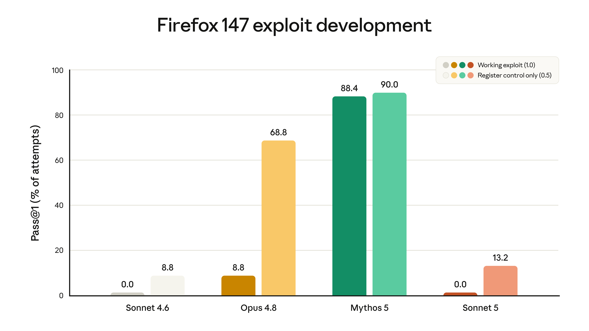
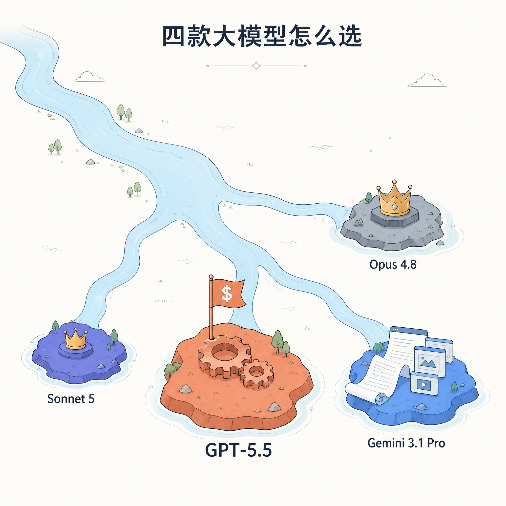

# 半价拿到接近 Opus 4.8 的能力，Claude Sonnet 5 发布

> 一个榜单倒退 7 个百分点，另一个榜单暴涨 20 个百分点，Sonnet 5 把力气使在了不一样的地方。

---

## 一句话总结

Sonnet 5 没打算抢 benchmark 王座。Anthropic 这次的动作，是把过去只有 Opus 才有的 agentic 能力下放到 Sonnet 的价格档，半价就能拿到接近 Opus 4.8 的日常体验。

---

## 一份看起来像翻车的成绩单

前几天 Anthropic 发了 Claude Sonnet 5，我第一时间去翻它的成绩单，结果在最显眼那一栏栽了个跟头。

SWE-bench Verified，这个几乎是代码圈「高考」的榜单上，Sonnet 5 的官方成绩是 72.7%。上一代 Sonnet 4.6 是 79.6%。**新模型比老模型还低 7 个百分点**，乍一看就是翻车现场。

但我往下翻了一行。Terminal-bench 这一栏，Sonnet 5 从 4.6 的 55.4% 直接跳到 76.1%，一口气涨了 20 多个百分点。

一个退、一个暴涨。这两个数字摆在一起，味道就不对了。它说明 Anthropic 这次压根没打算去卷那个最出名的分数，而是把力气使在了另一个地方。

---

## 最 agentic 的 Sonnet

那 Sonnet 5 到底想成为什么样的模型？Anthropic 自己给的定位是「有史以来最 agentic 的 Sonnet」。这句话得放回 Anthropic 的产品线里读。

所谓 agentic，通俗讲就是模型能自己拿主意、自己调工具、自己跑完一长串任务，而不是你问一句它答一句。让它去改个 bug，它会自己读代码、写测试、跑起来、看报错、再改，一直循环到通过，中间不用你盯着。

这条赛道其实是 Sonnet 系列打开的。官方博客特意提到，Claude Sonnet 3.5、3.6、3.7 是第一批在写代码和用工具上让人眼前一亮的模型，agentic 这条路算是它们蹚出来的。

但有意思的是，最近这一两年，agentic 能力的飞跃基本都发生在更贵的 Opus 级别上。Sonnet 系列反倒安静了一阵。

Sonnet 5 这次的活儿就一件，把 Opus 攒下的本事往下挪一格。**性能接近 Opus 4.8，价格只有它的一半**，这是 Anthropic 自己给的关键词。

---

## 把成绩单摊开

成绩单我摊在下面了，数字来自 Anthropic 官方和它引用的第三方。跨榜别直接比，同一榜单内看趋势就行。

### 代码和软件工程，真正秀的是 Terminal-bench

这块最值得说的不是 SWE-bench，是 Terminal-bench。

Terminal-bench 考的是模型在命令行环境里长路径自主规划、调工具、反复迭代测试的能力，是 agentic 的硬指标。Sonnet 5 在这上面涨了 20 多个百分点，几乎追平了旗舰 Opus 4.8，也把上一代 Sonnet 远远甩开。这才是它真正想秀的肌肉。

至于 SWE-bench Verified 那个偏低的 72.7%，先别急着下结论。同一榜单，第三方测评机构用标准化框架跑出来的 Sonnet 5 和 4.6 都在 80% 这个梯队，和 GPT-5.5、Gemini 3.1 Pro 挤在一起。官方这个偏低的数字，更可能是评分口径变了，不是模型变笨了。另外，4 月 1 日还流传过一阵「Sonnet 5 SWE-bench 92.4%」的消息，那是愚人节玩笑，别当真。

### 推理涨了，但顶尖还差一截

推理和知识这块，Sonnet 5 比 4.6 全面上涨。我看完第一反应是够用，但还到不了顶尖。拿我最在意的 GPQA Diamond 说，它从 68.0% 涨到 78.0%，MMMU、MathVista 也都是十来个百分点的涨幅。

但离顶尖也确实还差着一档。同样是 GPQA，Opus 4.8、GPT-5.5、Gemini 3.1 Pro 都在 93% 以上，Sonnet 5 还没够到。这是它和真正旗舰之间最明显的分界线。

### 多模态这边，倒是有惊喜

多模态和计算机操作是 Sonnet 5 的另一个亮点。CharacterEval 从 81.0% 涨到 90.3%，这是它少数能摸到顶尖梯队的榜单。模拟桌面和浏览器操作的 OSWorld 上，官方的成本性能曲线显示 Sonnet 5 是 4.6 的严格改进，具体绝对分数还没公布。

成绩单看到这，结论很清楚。**Sonnet 5 在 agentic 维度几乎追平了 Opus**，单题硬推理还差一截。

---

## 半价，和一道省钱的旋钮

价格是这次最直白的部分。

优惠期到 2026 年 8 月 31 日，每百万 token 输入 $2、输出 $10。之后回到正式价，输入 $3、输出 $15。

关键信息是这个，**和上一代 Sonnet 4.6 同价**。你原来用 4.6 花多少钱，换到 5 上还是那么多钱，但能力涨了一截。

对比一下旗舰。Opus 4.8 是输入 $5、输出 $25，GPT-5.5 是 $5、$30，Sonnet 5 的输入输出价都只有它们的零头。对重度调用的开发者和企业，这笔账很实在。

算笔最小 demo 的账。假设一天跑掉 100 万输入加 20 万输出 token，正式价下 Sonnet 5 是 $6，Opus 4.8 是 $10，GPT-5.5 是 $11。**唯一比 Sonnet 5 便宜的是 Gemini 3.1 Pro，$4.4，但 agentic 能力差一档**。要是吃优惠价，Sonnet 5 还能压到 $4，几乎就是这一档最划算的。

Anthropic 还给了一道省钱的旋钮，effort level，也就是「努力程度」。同一个任务，你可以让模型使劲想，拿最高精度，也可以让它别想了直接答，压低成本和延迟。官方那张成本性能曲线说得很清楚，在中等等级的 effort 下，Sonnet 5 的性价比优势最大；把 effort 推到最高一档（官方叫 xhigh），它在某些任务上能摸到 Opus 4.8 的水平。

**所以 Sonnet 5 和 Opus 4.8 之间，你能用 effort 这个滑块自己挑平衡点**，要省钱调低，要精度调高，不必非此即彼。

---

## 一张容易踩的隐藏账单

省钱的旋钮是好东西，但 Sonnet 5 这次还藏了一张账单，得提前说。

Sonnet 5 换了新的 tokenizer（分词器），和 Opus 4.7 是同款。带来的副作用是，同样一段文字喂进去，新模型切出来的 token 数会比老模型多，官方给的范围是 1.0 到 1.35 倍。也就是说，老模型算 1000 token 的一段话，新模型可能算到 1100 甚至 1350，账单跟着往上走。

token 变多，实际花费就往上走。Anthropic 也承认这一点，所以把优惠价定在了让迁移「大致成本中性」的位置，用降价来对冲 token 膨胀。

对中国用户来说可能有个隐性红利。实际用下来，中文文本的膨胀率往往低于英文和代码，同样的中文内容，token 涨幅通常靠近 1.0 那一头。不过 Anthropic 没公开按语种拆分的数据，这点建议拿自己的真实语料验证一下，别直接拍脑袋迁移。

如果你是生产环境迁移，先拿自己的真实数据跑一遍 token 审计，别照搬原来的预算。

---

## 更安全，但网络攻击能力也被刻意削了

安全这块，Anthropic 给的结论是 Sonnet 5 整体比 4.6 更规矩。

在 agentic 场景下，它更擅长拒绝恶意请求、更扛得住提示词注入攻击。幻觉和谄媚（sycophancy，也就是无原则地附和你）的比例都下降了。

但有一个反直觉的点。Sonnet 5 的网络攻击能力被刻意削弱了。

在一项和 Mozilla 合作的测试里，让它针对 Firefox 浏览器的已知漏洞写完整的漏洞利用代码，它的成功率是 0，和 4.6 一样，都开发不出能用的 exploit。而那些被管制的旗舰模型，成功率远远甩开它。Anthropic 还是给 Sonnet 5 默认开了一层实时网络防护，理由是它虽然不强，但比 4.6 稍微强了那么一点，得防一手。

这背后有个大背景。就在 Sonnet 5 发布前不久，Anthropic 当时最强的前沿模型 Claude Fable 5 被美国政府以出口管制为由要求下架，目前全球不可用。Fable 5 在 SWE-bench 上能跑到 95%，是真正的性能怪兽，但太危险，被摁住了。吃过这个亏，Anthropic 在 Sonnet 5 身上走的是「高度对齐、能力收敛」的路线。**这次的 Sonnet 5，明显是 Fable 5 那事教出来的乖孩子。**

---

## 那到底该选哪个

聊到这，该回到最实际的问题，到底换不换、怎么换。

预算敏感、又天天跑多步骤 agentic 流的，**Sonnet 5 直接换上**。半价拿接近 Opus 的能力，没理由不换，Claude Code 里设成主力，配 effort 滑块，日常开发够撑场面。

真要啃硬骨头的，复杂数学、长链推理、科研级任务那种，**Opus 4.8 或 GPT-5.5** 还得留着。这俩在硬推理上仍领跑一个身位，有些活儿差一个身位就是过不了，认。

至于工作流本来就在 Google 生态里、长文档和重度多模态吃重的，Gemini 3.1 Pro 更顺手，输出价还略低一点。

一个更省事的搭配是分工。让 Opus 4.8 扛架构设计和硬骨头推理，让 Sonnet 5 跑端到端的执行流水线，一个贵的管顶层，一个便宜的管干活。

---

## benchmark 不是唯一标尺

回到开头那个 72.7% 的「翻车」。

看完一整圈你会发现，那个数字根本不是 Sonnet 5 的重点。它压根没去碰 SWE-bench 那把椅子，反倒把 Terminal-bench 这种真考「自己把活干完」的榜单，顶到了接近 Opus 的位置。

**benchmark 不是唯一标尺，模型开始自己干活之后尤其如此。** Sonnet 5 实际卖给大多数人的，是用一半的钱，用上一年前还得咬牙上 Opus 才有的 agentic 体验。

对很多人来说，这就是新的默认。

---

欢迎关注我的公众号「Chyris Tech Note」，获取更多 AI 技术解读与实践分享。
