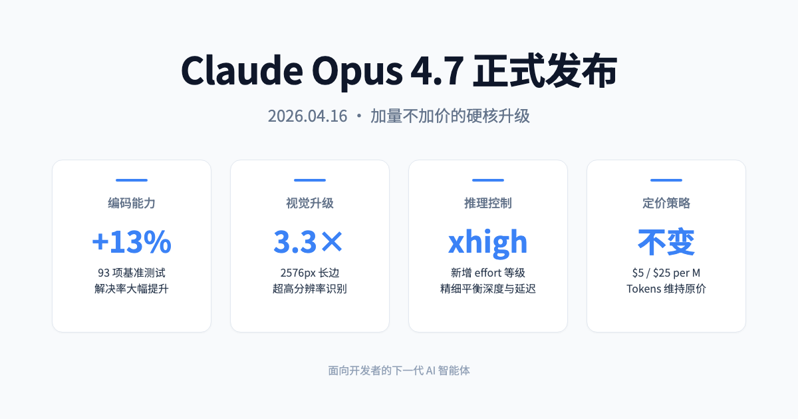
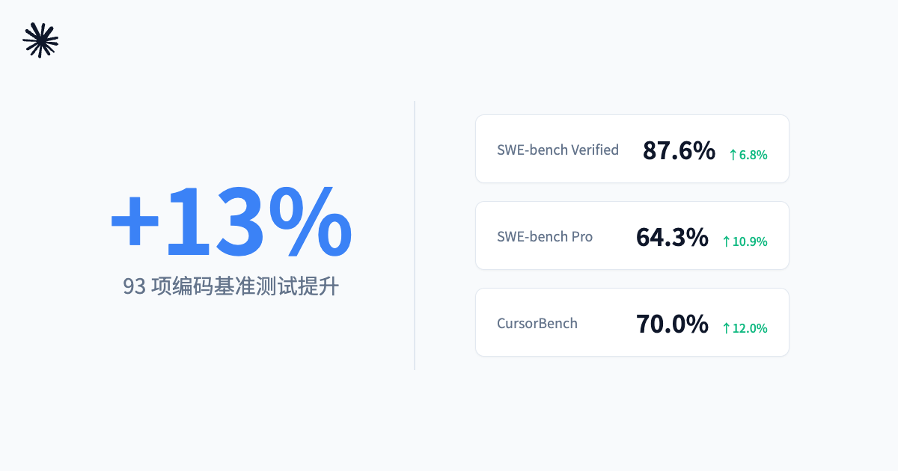
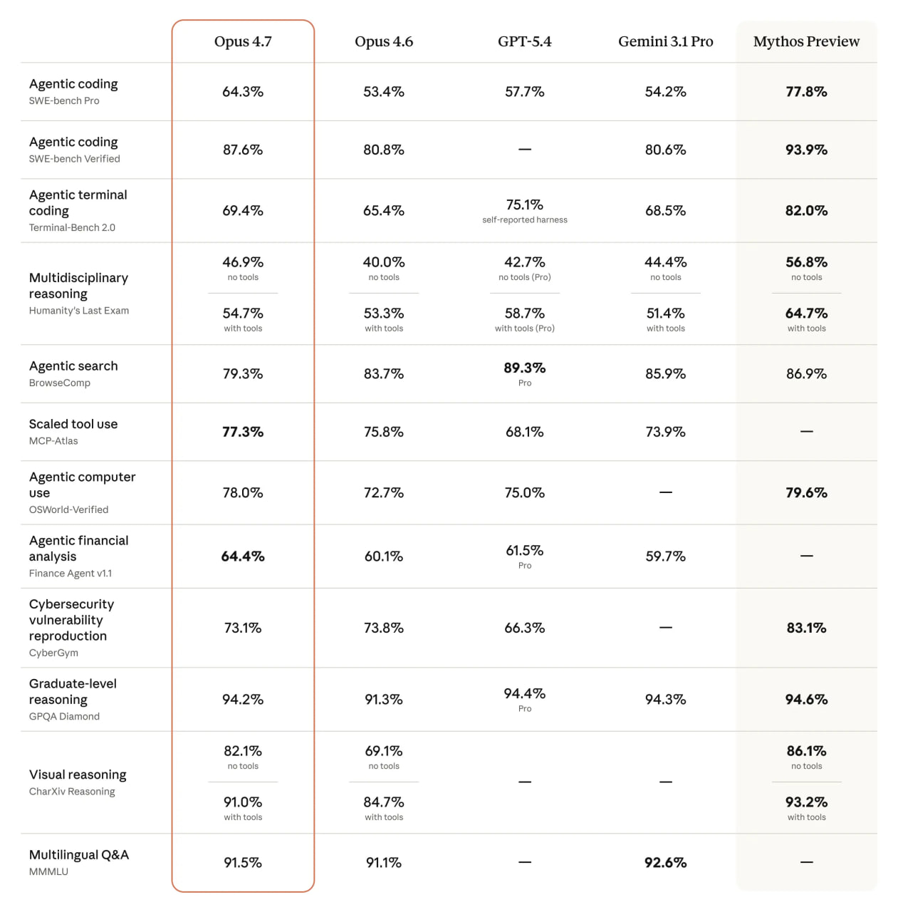
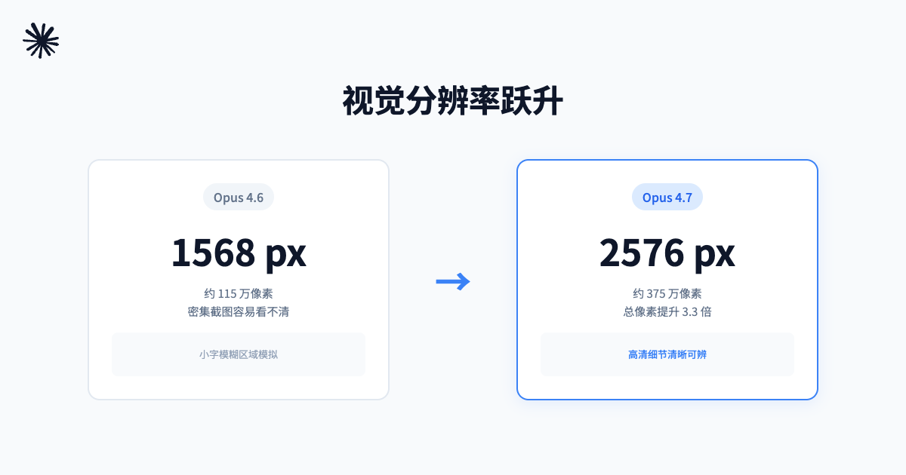
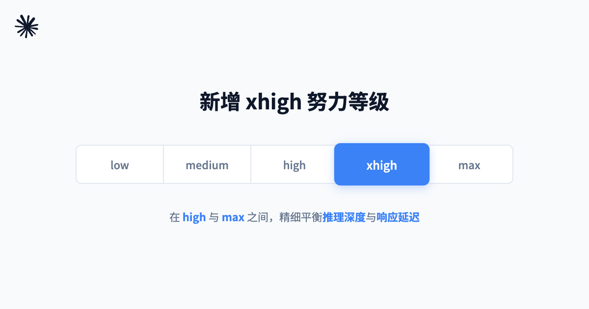
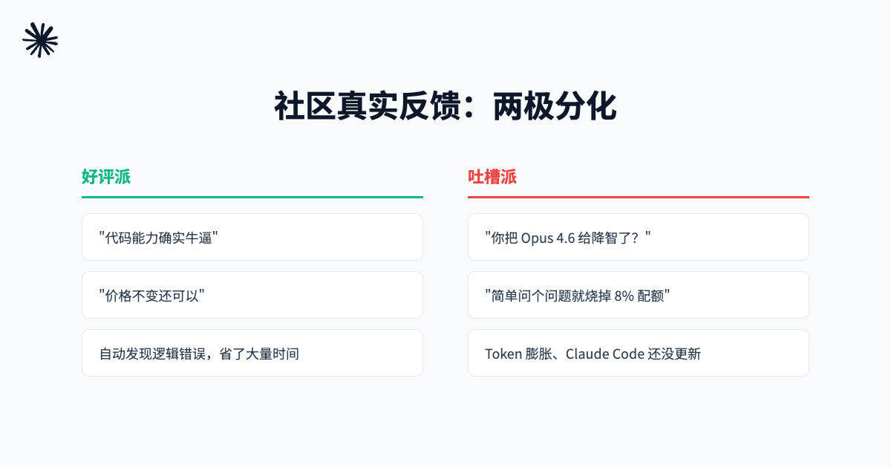
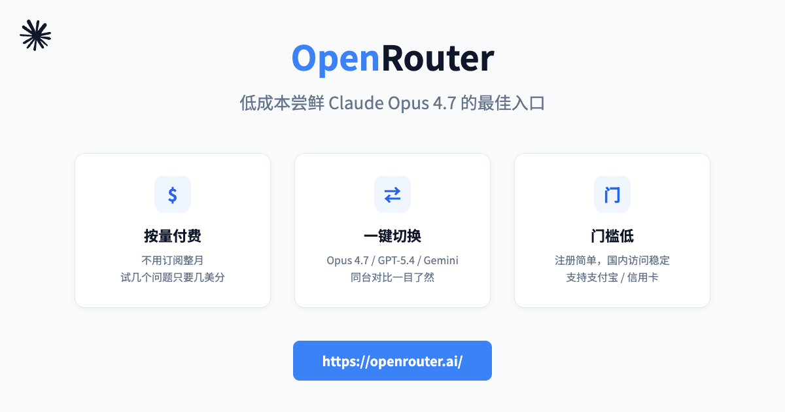

# Claude Opus 4.7 深夜发布：代码能力暴涨 13%，价格却一分没涨

> 凌晨两点，你盯着一张密密麻麻的报错截图，想让 AI 帮你定位问题。结果它说："图片太模糊，我看不清。"——如果你也经历过这种绝望，Claude Opus 4.7 可能是来救你的。

---

## 一句话总结

**Anthropic 在 2026 年 4 月 16 日推出的 Claude Opus 4.7，是一场"加量不加价"的硬核升级。** 代码能力大幅提升、视觉分辨率翻三倍、还新增了更细粒度的推理控制。对于重度开发者和长周期任务用户来说，这是一次值得认真考虑的换代。

---

## 01 编码能力：这次真的是"码农狂喜"

如果说前代 Opus 4.6 是个"能写代码的好学生"，那 4.7 已经有点像"能独立带项目的老司机"了。

在 Anthropic 内部的 **93 项编码基准测试** 中，Opus 4.7 的解决率比 4.6 直接提升了 **13%**。更具体的数字来看：

- **SWE-bench Verified**：从 80.8% → **87.6%**
- **SWE-bench Pro**：从 53.4% → **64.3%**（+10.9%）
- **CursorBench**：从 58.0% → **70.0%**（+12.0%）

CursorBench 这个数字尤其值得关注。Cursor 是目前开发者使用最频繁的 AI 编程环境之一，70% 意味着很多"之前死活搞不定"的复杂重构、跨文件调用、多轮 debug，现在它真的能自己啃下来。

> 有企业用户反馈：Opus 4.7 甚至能**从零开始构建一个 Rust 引擎**，自主完成测试、验证、迭代——这在几个月前还是科幻片情节。

---

## 02 视觉升级：终于能看清你的截图了

 previous 1568px 长边 → 现在 **2576px** 长边，总像素从约 115 万飙升到约 **375 万**，足足 **3.3 倍**。

这意味着什么？

- 以前发一张密密麻麻的报错截图，AI 可能只能"看个大概"
- 现在复杂的工程图纸、电路图、UI 设计稿、甚至极小字体的法律文书，它都能精准识别

在 **XBOW 视觉评估**中，Opus 4.7 的成功率从前代的 54.5% 一跃到了 **98.5%**，几乎消灭了"视觉盲区"。对于做 Computer Use（让 AI 像人一样操作电脑）的场景来说，这直接决定了它能不能准确点击那个小得可怜的按钮。

---

## 03 xhigh：给难题多一个档位

Opus 4.7 引入了一个新的努力等级 **"xhigh"**，位于 high 和 max 之间。

它的定位很清晰：**需要深度推理，但又不想等 max 那么久**的生产环境。现在 Claude Code 的订阅计划也已经默认切换到 xhigh。

更实用的是，模型会根据任务复杂度**自适应调节思考深度**——简单问题秒回，硬核问题才认真"长考"。

---

## 04 安全不再是"事后补丁"

这次 Anthropic 同步推出了 **Project Glasswing**，核心就一件事：**把攻击性网络能力锁进笼子**。

Opus 4.7 内置了实时风险检测网关，遇到漏洞利用、恶意攻击等请求会自动拦截。同时启动了 **Cyber Verification Program**，合法的网络安全研究人员可以申请解除部分限制，用 AI 来做防御性研究。

> 对比内部受限模型 Mythos（CyberGym 83.1%），Opus 4.7 在网络安全基准上被刻意"削弱"到了 73.1%——不是为了变弱，而是为了**可控**。

---

## 05 但社区也有吐槽

当然，不是所有反馈都在"吹"。上线第一天，开发者社区就出现了明显的两极分化：

**几个真实的槽点：**

1. **Token "膨胀"了**：Opus 4.7 换了新分词器，同样文本映射出的 Token 数量增加了 1.0~1.35 倍。虽然单价没变，但很多人会感觉"隐形涨价"。
2. **更"字面主义"**：Opus 4.7 会严格按照提示词字面执行，不再像 4.6 那样"帮你脑补"。好处是可预测性变强了，坏处是老 prompt 可能需要微调。
3. **配额焦虑**：Pro/Max 用户反馈，因为思考过程拉长，每日额度几小时就烧完，日常编码党有点肉疼。

> 也有人说："试了试没感觉差别，可能是我的问题不够高端。"——这大概是最扎心的评价了。

---

## 总结：谁该升级？

**值得立刻升级的人：**
- 经常处理复杂代码重构、跨文件调动的开发者
- 需要 AI 读取高清截图、工程图纸、密集表格的用户
- 有长周期自主任务需求的企业团队

**可以再等等的人：**
- 日常只是简单问答、写写文档的普通用户
- 对配额极度敏感，且 prompt 库还没迁移的开发者

---

## 想尝鲜？先用 OpenRouter 低成本试试

Opus 4.7 固然强，但每月 $20 的 Claude Pro 或者 API 直调，对很多人来说都是一笔不小的开销。如果你只是想**快速上手、对比效果**，我强烈建议先去 **OpenRouter** 上跑一跑。

**为什么选 OpenRouter？**

- **按量付费**，不用订阅整月，试几个问题只要几美分
- **模型全**：Opus 4.7、GPT-5.4、Gemini 3.1 Pro 都能一键切换对比
- **门槛低**：注册简单，支持支付宝/信用卡充值，国内访问也比较稳定

> **🔗 推荐入口**：https://openrouter.ai/

你可以拿同一个复杂 bug 或一张高清截图，分别丢给 Opus 4.7 和其他模型，看看谁的输出更对你的胃口。试过之后，再决定要不要真金白银地切换主力模型。

---

*以上就是关于 Claude Opus 4.7 的全部解读。你觉得这次升级值回票价吗？欢迎在评论区聊聊。*
