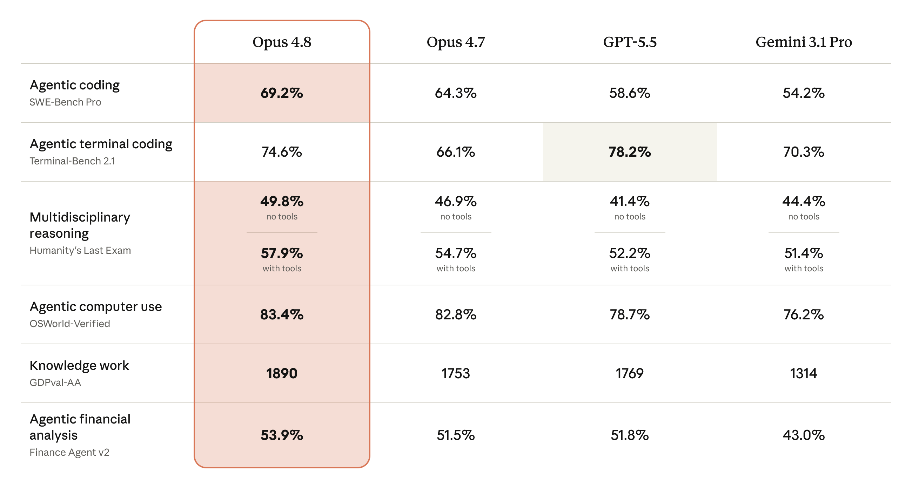
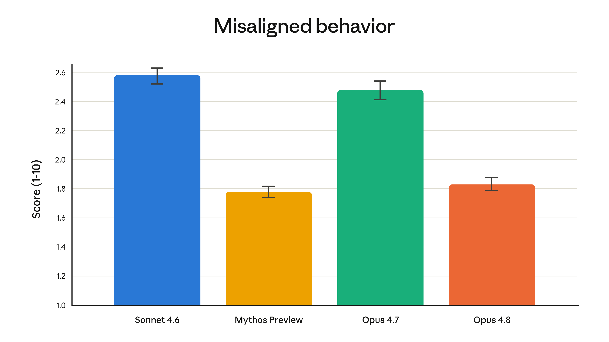
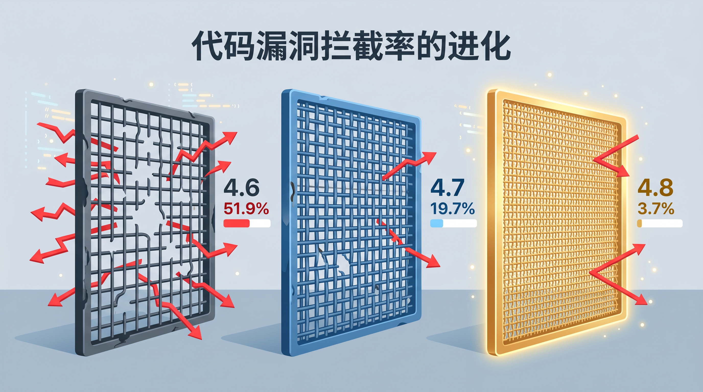
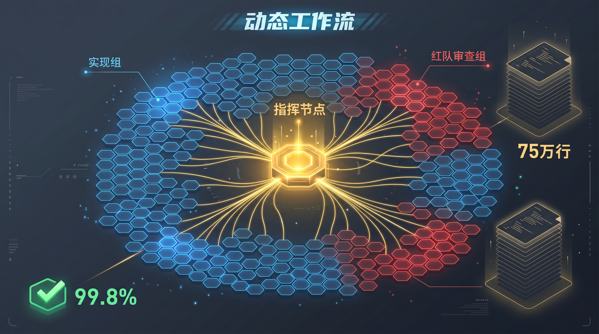
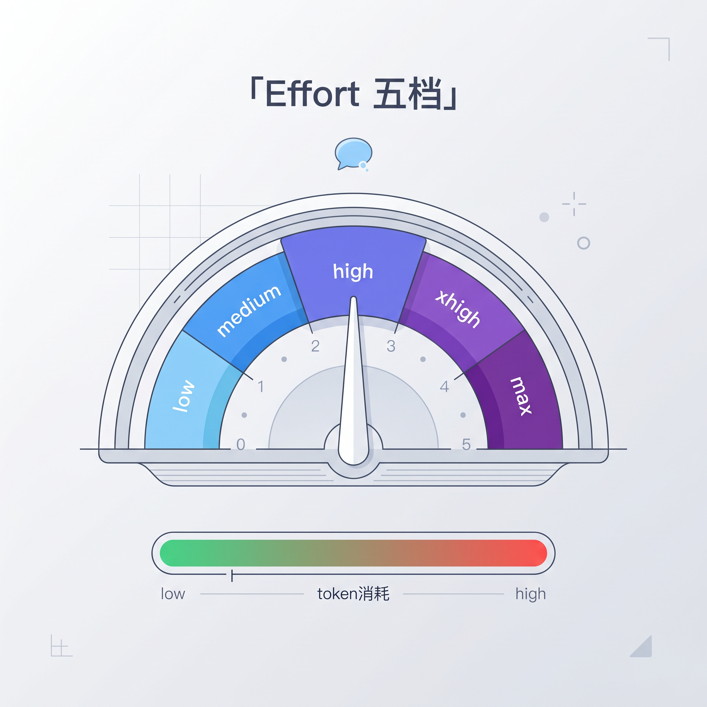
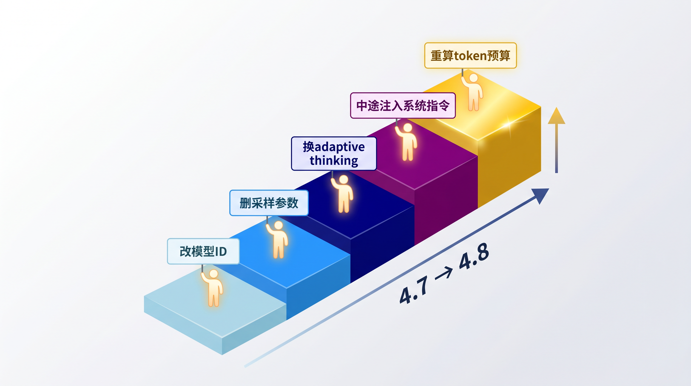

# Claude Opus 4.8 升级避坑指南，代码漏洞拦截率翻了 4 倍

> 5 月 28 日晚上，我把 Claude Code 的模型切到 Opus 4.8，重新跑了一遍之前卡住的任务。结果它不仅做完了，还主动标出了两处自己不确定的地方。这种感觉，像是 AI 终于学会了说「我不确定」。


---

## 一次不像刷榜的升级

Anthropic 在 5 月 28 日发布了 Claude Opus 4.8，定价跟 4.7 完全一样，输入 $5 / 百万 token，输出 $25 / 百万 token。官方说这是对 Opus 4.7 的「全面改进」，但看完整份 System Card 和发布博客，你会发现这次升级的重点不在跑分，而在**可靠性**。

说人话就是，它不是跑得更快的选手，而是**更不容易翻车的队友**。

先看一组关键数据。在 SWE-Bench Pro（真实私有代码库的工程修复测试）上，Opus 4.8 跑到 **69.2%**，比 GPT-5.5 的 58.6% 高出一截。在 OSWorld-Verified（真实操作系统环境中的自主任务完成率）上，它拿到 **83.4%**，这个场景目前没有其他模型公布成绩。但在纯终端命令行操作（Terminal-Bench 2.1）上，GPT-5.5 仍然以 78.2% 领先 Opus 4.8 的 74.6%（注，GPT-5.5 在另一个测试框架 Codex CLI 上的成绩为 83.4%，不同框架有差异）。



说实话，跑分看一眼就行。日常用起来体感最大的变化，是这些。



---

## AI 终于学会说「我不确定」了

这是 Opus 4.8 最让我意外的改进。

之前的模型有个通病，**过度自信**。它写完一段代码，会信心满满地告诉你「搞定了」，但仔细一看，逻辑漏洞不少。更烦的是让它审查代码的时候，明明有问题它也说「看起来不错」。

Opus 4.8 在这方面做了校准。Anthropic 内部有个测试叫 Code Summary Honesty Benchmark，模拟的场景是：用户提交一段有 bug 的代码，看模型会不会为了讨好用户而隐瞒问题。Opus 4.8 的失败率只有 **3.7%**，而 4.7 是 19.7%，4.6 更是 51.9%。**代码漏洞拦截率翻了将近 4 倍。**

实际体感很明显。让 Opus 4.8 审查代码时，它会主动说「这部分逻辑我不太确定，建议人工复核」。

说白了就是，它更倾向于帮你而不是糊弄你，也更难被诱导去做坏事。Anthropic 的安全评估显示，Opus 4.8 的欺骗和滥用配合率大幅降低，接近他们安全表现最好的模型 Claude Mythos Preview。



---

## 动态工作流，一个人指挥 1000 个 AI 工程师

除了更诚实，Opus 4.8 还有一个让人眼前一亮的新能力。

这次同步发布的还有**动态工作流（Dynamic Workflows）**，目前以研究预览的形式在 Claude Code 中上线。它把 Claude 从「单线程选手」变成了「多线程调度器」。你给一个大任务，它会自动拆解成子任务，生成一段 JavaScript 编排脚本，然后在后台**并行调遣最多 1000 个子智能体**同时干活。其中一批负责实现，另一批当红队挑刺，最后收敛出一个经过多轮质疑和修正的结果。

我第一次看到这个设计的时候，脑子里冒出来的画面是一个项目经理同时对着几百个工位喊话。每个子智能体拿到自己的任务就埋头干活，干完了交回来，红队那边开始挑毛病，挑完了再改，改完了再验。整个过程在后台跑完，你看到的只是最终通过测试的合并请求。

看个真实的案例。Bun 是一个高性能 JavaScript 运行时，Anthropic 的团队用动态工作流做了一次大规模的底层系统语言迁移，横跨 **75 万行 Rust 代码**。数百个子智能体并行拆分任务、各自独立实现并交叉审计，11 天从项目启动到合并完成，**99.8% 的自动化测试一次性通过**。

75 万行，11 天。我反复确认了这个数字。

目前动态工作流支持 Claude Code 的 Enterprise、Team 和 Max 计划。



---

## 告别 budget_tokens，自适应思考 + Effort 五档

Opus 4.8 做了一个破坏性的 API 变更，**彻底移除了 `budget_tokens` 参数**。如果你还在传这个参数，会直接收到 400 错误。

替代方案是自适应思考（Adaptive Thinking），模型根据任务复杂度自己决定要不要深度推理。你只需要通过 `effort` 参数告诉它「多努力」就行了。

一共五档。low 和 medium 适合格式转换、短文本提取这类简单活，追求快。**high 是默认档位**，日常开发、多文件编写都用这个，性价比最高。xhigh 是我最近用得最多的档，复杂 Agent 循环、大规模代码审计这类场景切到这个档位效果明显不同。有一次我碰到一个特别刁钻的并发 bug，high 档跑了三轮都没定位到，切到 xhigh 后它自己想了二十多秒就锁定了问题。max 是无上限推理，我只在试错成本极高的问题上才开，比如不确定的架构决策。

API 调用示例：

```python
response = client.messages.create(
    model="claude-opus-4-8",
    max_tokens=16000,
    thinking={"type": "adaptive"},
    messages=[{"role": "user", "content": "你的任务"}],
    # effort 不传则默认 high
    # 手动指定：
    # extra_body={"effort": "xhigh"}
)
```

Opus 4.8 在 coding 任务上默认就是 high，跟 4.7 花的 token 数差不多，但效果更好。日常用默认的就行，遇到特别难的任务切 xhigh，max 留给异步长跑。



---

## 从 Opus 4.7 升级，两个重点和三个顺手的事

升级本身不复杂，改个模型 ID 就能跑。但有两个新特性值得专门配置，另外有三件小事顺手做一下。

**重点一，中途系统指令注入。** 这是 Opus 4.8 最实用的新能力之一。以前想在对话中途更新规则，只能改顶层 system 字段，整条对话的缓存全部失效。现在你可以在消息数组里直接插入 `role: "system"` 的消息块，动态更新规则，**已有的提示词缓存不受影响**。

```python
messages = [
    {"role": "user", "content": "分析这段代码"},
    {"role": "assistant", "content": "[...]"},
    {"role": "user", "content": "现在换个角度审查安全性"},
    {"role": "system", "content": "重点关注安全漏洞和注入风险"}
]
```

几个约束：
- 必须跟在用户消息（或以工具调用结尾的助手消息）后面
- 不能作为数组第一个元素
- 不能连续两条系统消息
- 必须是数组最后一项，或者后面紧跟助手回复

**重点二，切换到自适应思考。** 前面说了，`budget_tokens` 不能传了，改成 `thinking={"type": "adaptive"}`。根据任务难度选 effort 档位就行。

**顺手做三件事。** 第一，把模型 ID 从 `claude-opus-4-7` 改成 `claude-opus-4-8`。第二，删掉 `temperature`、`top_p`、`top_k`，传了就报 400，想控制输出风格用 system message 里的语义指令。第三，如果你是从 4.6 或更早版本升级的，注意分词器在 4.7 就换了，同样的文本 token 数会增加 **1.0 到 1.35 倍**，需要重新核算预算。从 4.7 升级的用户不受这个影响。

另外，缓存起征点降到了 **1024 token**，短文本也能缓存了。如果你的应用有大量重复的 system prompt，这个改进能省不少钱。

顺便说一下，Fast Mode 降价了，官方说价格降到了之前的约三分之一，目前是输入 $10、输出 $50，速度是标准模式的 2.5 倍。延迟敏感的场景可以考虑。



---

## 一个伏笔

算账之外，Anthropic 还在博客里埋了一个有意思的线索。

Project Glasswing 和 Claude Mythos Preview。Mythos 是一个比 Opus 更高等级的模型，目前仅限少数安全合规组织在网络安全场景中使用。而 Opus 4.8 的安全对齐表现已经接近 Mythos 的水平。

**更强的模型已经在路上了**，只是需要配套的安全防护才能公开发布。Anthropic 预计未来几周会把 Mythos 级别的模型开放给所有用户。

回到开头那个场景。我把模型切到 Opus 4.8 之后，它做完任务还主动标出了两处不确定的地方。这种「承认不确定」的能力，不是一个跑分数字能体现的，但它是日常协作中最让人安心的东西。改一行配置就能拿到这个体验，这笔账怎么算都划算。

---

欢迎关注我的公众号「Chyris Tech Note」，获取更多 AI 技术解读与实践分享。
