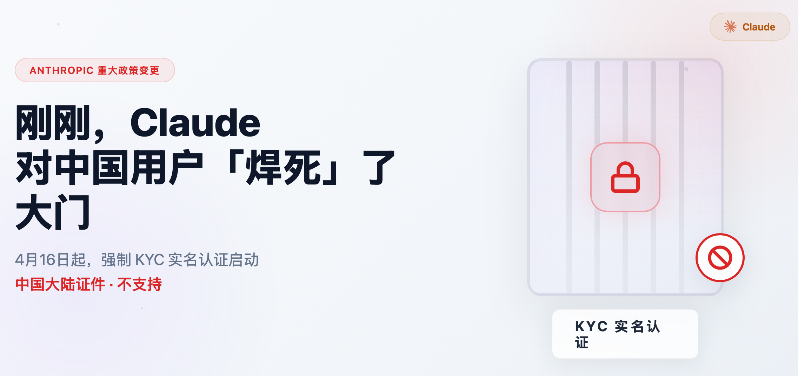
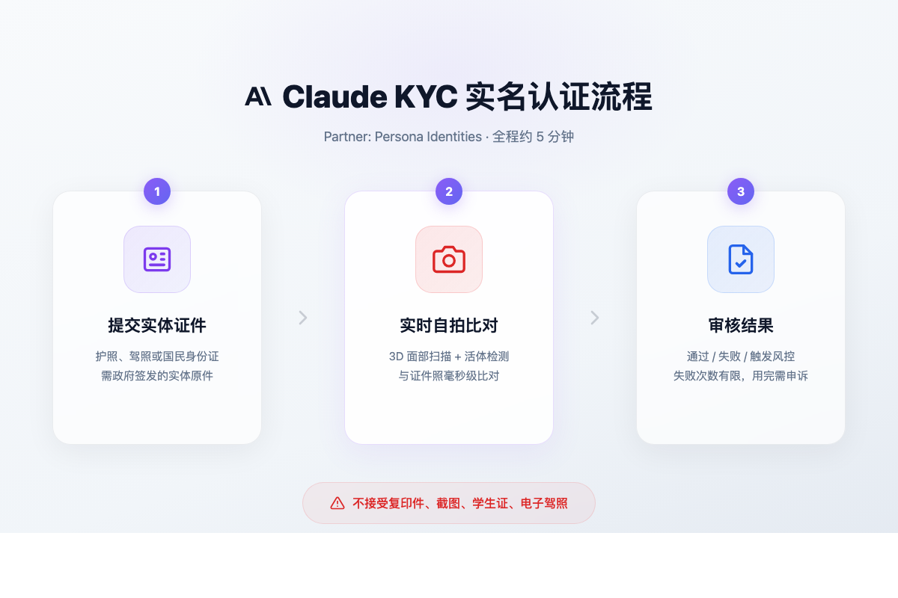
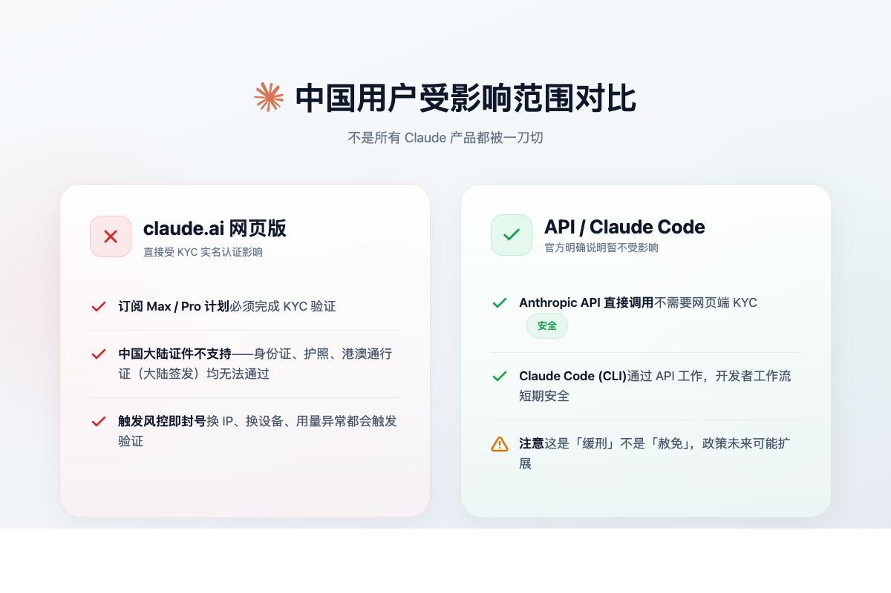
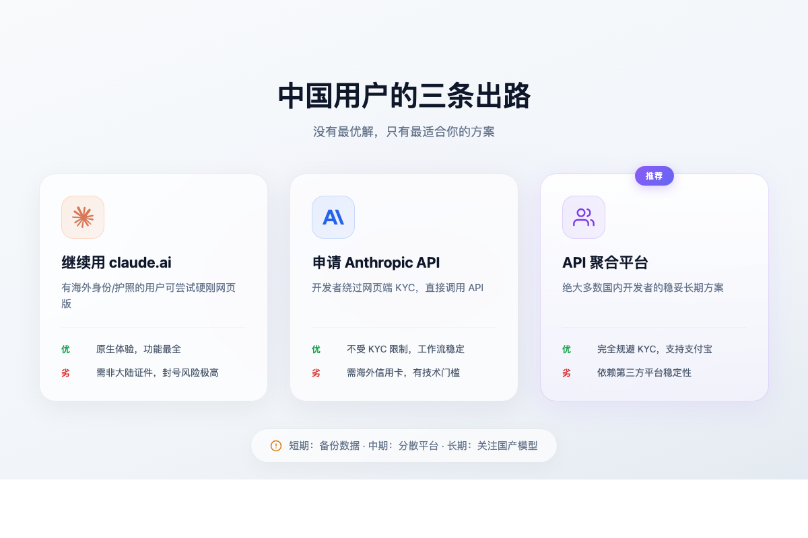

# 刚刚，Claude 对中国用户「焊死」了大门

> Anthropic 强制 KYC，4 月 16 日起执行。没有海外身份证，别想用 Claude Max。

---

4 月 14 日，Anthropic 突然扔下一颗炸弹：

**Claude 平台正式引入强实名制验证（KYC）。**

从 4 月 16 日开始，如果你想订阅最高级别的 Max 计划，或者触发平台的风控机制，甚至只是「例行平台完整性检查」，系统都会要求你掏出政府签发的实体证件原件，再加上一张实时自拍，做人脸比对。

合作伙伴是专业身份验证商 **Persona Identities**。

这意味着什么？

**匿名使用 Claude 的时代，正式结束了。**

而对中国用户来说，更残酷的现实是：**这扇门不是变窄了，是直接被焊死了。**

---

## 一、这不是「人脸识别升级」，这是金融级的 KYC

很多人误以为这只是技术上的人脸识别功能更新。

错了。

Anthropic 做的是完整的 **Know Your Customer（了解你的客户）** 实名认证体系。你需要提供：

- 护照、驾照或国民身份证的**实体原件**
- 带摄像头的设备进行**实时自拍**
- 系统通过 3D 面部扫描+活体检测，与证件照进行毫秒级比对

**不接受复印件、不接受截图、不接受电子驾照、不接受学生证和银行卡。**

整个过程约 5 分钟，但通不通过，不由你说了算。

更值得关注的是，Anthropic 的验证代码里已经预留了与美国 FinCEN（金融犯罪执法局）、加拿大 FINTRAC 等监管机构直接对接的接口。这暗示着一个更深层的变化：**AI 账户正在具备银行账户的法律属性。**

换句话说，Claude 不再只是一个聊天工具，它正在变成受金融监管的「数字基础设施」。

---

## 二、Anthropic 为什么要这么做？

这不是心血来潮，而是被两件事逼的。

### 1. 2025 年 8 月那场「AI 网络犯罪」

 Anthropic 内部有个叫「Glasswing」的安全项目，专门扫描模型在真实世界中的漏洞。

而在 2025 年 8 月，漏洞被真实地炸开了。

一名犯罪分子利用 Claude Code 的自主性，对分布在政府、医疗、国防领域的 17 个国际组织实施了自动化渗透和数据勒索。更可怕的是，这名犯罪分子并非手动操作——他把攻击战术写进了 Claude Code 的配置文件（CLAUDE.md）里，让 AI 自主决定渗透路径：

- 自动扫描数千个 VPN 端点
- 访问活动目录，进行跨域权限提升
- 根据杀毒软件反馈实时修改恶意代码
- 分析窃取数据，自动计算最优勒索金额，生成 HTML 勒索信

**传统 API 密钥和令牌验证，在能自主思考和进化的 AI 攻击者面前，形同虚设。**

所以 Anthropic 押上了最后一道物理防线：生物识别。只有「那个被验证过的正确的人」，才能解锁 AI 的破坏力。

### 2. 合规压力：AI 正在成为「受监管金融工具」

随着 Claude 开始参与自动化采购、财务审批、资产管理，监管机构盯上了 LLM 提供商。

反洗钱、恐怖融资筛查、审计追溯——这些原本属于银行和支付公司的合规义务，正在向 AI 公司转移。KYC 是这一切的基础设施。

---

## 三、对中国用户的致命影响

如果说前面是行业背景，那接下来是中国用户最关心的：**我还能不能用 Claude？**

答案是：**网页版（claude.ai）基本没戏了。**

### Persona 不支持中国大陆签发的证件

根据实测和资料确认：

- 中国大陆身份证：**不支持**
- 中国大陆护照：**不支持**
- 港澳通行证（大陆签发）：**不支持**
- 香港身份证：**可以**

也就是说，哪怕你是一个愿意配合实名认证的中国用户，系统中根本没有「中国大陆」这个选项。**这不是技术问题，是政策选择下的系统性排除。**

而且，即使你手持海外证件，还有一个更隐蔽的雷区：**位置矛盾。**

当你的登录 IP、支付卡归属地和证件签发地出现严重冲突时，系统极易触发自动化封号流程。而中国用户普遍使用 VPN 访问，网络环境本就不稳定——Persona 的 3D 活体检测对数据传输连续性要求极高，延迟和波动常被标记为「可疑欺诈行为」。

**验证失败，封号。验证成功但位置可疑，也可能封号。**

用户的评论很真实：

> "Anthropic 开始不当人了。"
> 
> "开 Max 危了。"
> 
> "源源不断向对家输送客户。"

### 对 Claude Code 和 API 的影响

好消息是：**目前 Anthropic 官方明确说明，API 直接调用暂不受 KYC 影响。**

Claude Code（命令行工具）也是通过 API 工作，因此理论上暂时安全。这意味着开发者的核心工作流短期内不会直接被切断。

但这是「缓刑」，不是「赦免」。

### 第三方生态的崩塌

真正遭受毁灭性打击的是中转站、sub2api、共享池、反代服务这些灰色生态。

这些玩法的底层逻辑是「用一个账号服务多人」，而 KYC 的本质正是「一个身份绑定一个账号」。当平台开始大规模人脸实名，共享账号的商业模型几乎瞬间瓦解。

**对第三方服务商来说，这是生态链的集体崩塌。**

---

## 四、中国用户的三条出路

| 方案 | 优点 | 缺点 | 适合谁 |
|------|------|------|--------|
| **继续硬刚 claude.ai** | 原生体验最全 | 需要非大陆证件，封号风险极高 | 有海外身份的用户 |
| **申请 Anthropic API Key** | 不受网页端 KYC 限制 | 需要海外信用卡，有技术门槛 | 有支付手段的开发者 |
| **使用 API 聚合平台** | 完全规避 KYC，支持支付宝 | 依赖第三方稳定性 | **绝大多数国内用户** |

**短期建议（立刻做）：**

1. **备份数据**：导出所有对话记录、提示词、项目上下文。
2. **降低依赖**：不要把核心工作流绑在单一 Claude 账号上。
3. **停止高危操作**：别用个人订阅跑逆向代理，别碰共享池。

**中期建议（未来 1-3 个月）：**

- 考虑 **ChatGPT** 或 **GPT-5.4 Pro** 作为替代，商业逻辑更清晰。
- 分散风险：多平台使用，不把鸡蛋放一个篮子。

**长期建议：**

- 企业用户转向官方 API 或私有化部署。
- 密切关注国产大模型（Qwen、Kimi、DeepSeek），它们在快速追赶。

---

## 五、写在最后：AI 正在从「开放」走向「管制」

Anthropic 这波操作，标志着 AI 行业一个深层趋势的到来：**思维主权的身份化管理。**

当 AI 能写代码、能管理财务、能操作文件系统时，它就不再是一个简单的软件，而是一种「数字基础设施」。正如银行业需要实名登记一样，AI 的准入控制正在向国家安全基建看齐。

而在 AI 能完美伪造声音、视频、文本的时代，传统的密码和令牌已经失效。平台开始相信：**唯有实时捕获的生物特征，才是验证「人类存在」的最后孤岛。**

问题是，这种「身份即权限」的新秩序，正在制造一道鲜明的数字鸿沟：

**受支持地区的人获得完整「强智能」加持；非支持地区的人被迫降级使用旧模型或本地开源方案。**

对中国用户来说，匿名使用全球顶尖闭源模型的窗口期，正在迅速关闭。

这不是危言耸听，这是 2026 年 4 月 16 日，已经发生的现实。

---

**你现在的 Claude 账号状态怎么样？** 欢迎在评论区聊聊你的应对方案。
